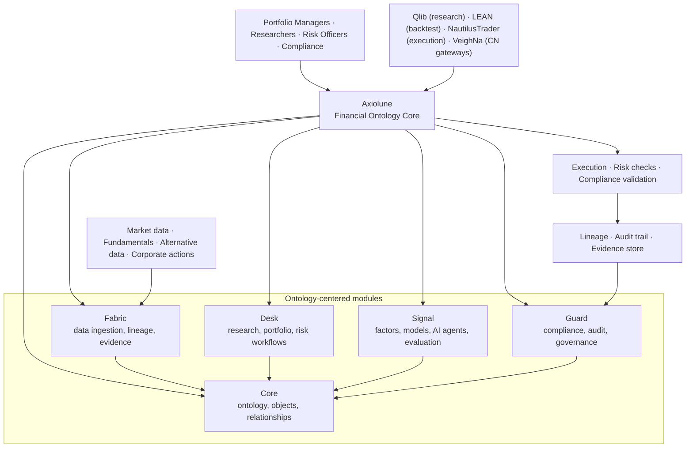

<div align="center">
  
</div>

<div align="center">
  <p><sub>AN ONTOLOGY-CENTERED PLATFORM BY <a href="https://moonweave-ai.github.io/">MOONWEAVE AI</a></sub></p>

  <h1>Axiolune | 同枢</h1>

  <p>
    <strong>Shared semantics. Trusted action.</strong><br>
    <sub>同一语义，可信行动。</sub>
  </p>

  <p>
    An ontology-centered financial research and operations platform that unifies market,<br>
    fundamental, portfolio, and risk data; supports collaborative research, backtesting,<br>
    governed AI agents, and controlled execution; and keeps every decision traceable<br>
    to one financial model.
  </p>

  <p>
    
    
    
    <a href="https://github.com/Moonweave-AI/moonweave-ai-agent-schema">
      
    </a>
    
  </p>

  <p>
    <a href="#vision">Vision</a> ·
    <a href="#why-axiolune">Why Axiolune</a> ·
    <a href="#system-model">System model</a> ·
    <a href="#module-family">Modules</a> ·
    <a href="#landscape-and-positioning">Landscape</a> ·
    <a href="#roadmap">Roadmap</a>
  </p>
</div>

> [!IMPORTANT]
> **Project status: pre-alpha.** Axiolune is entering repository bootstrap and ontology design. The module names and architectural boundaries are deliberate, but executable behavior, public APIs, schemas, installation commands, compatibility promises, and release artifacts are not stable yet. This README describes the target architecture and engineering commitments; it does not claim that every described capability is already implemented.

## Vision

Axiolune is a financial ontology platform where data, business users, models, and actions operate on a shared semantic reality.

<p align="center">
  <code>Data → Ontology → Research → Decision → Execution → Evidence → Governance</code>
</p>

Its central distinction is simple:

> **Axiolune defines financial reality once. Every participant—human, system, and AI—operates on that shared model.**

The project is designed around a single architectural principle: financial objects, their relationships, their lifecycle rules, and their action boundaries should be defined in one governed ontology, not duplicated across disconnected data systems, research notebooks, trading engines, and risk dashboards.

Axiolune is inspired by Palantir Foundry's ontology-centered approach and grounded in the [Moonweave Agent Ontology](https://github.com/Moonweave-AI/moonweave-ai-agent-schema), where financial domain objects, data lineage, governance rules, and action authorization are first-class semantic concepts rather than application-layer implementations.

## Why Axiolune

The current quantitative finance ecosystem contains excellent specialized tools: AI-driven factor research (Qlib), full-lifecycle backtesting engines (LEAN), high-performance execution systems (NautilusTrader), Chinese market gateways (VeighNa), reinforcement learning frameworks (FinRL), and portfolio analytics libraries (QuantStats). Those systems optimize for productive development within their specific domains.

Axiolune is intentionally different. It optimizes for a question the existing ecosystem cannot answer:

> **Can data, research, decisions, and execution remain semantically aligned and governed across the entire financial lifecycle, even when the models, systems, protocols, and participants change?**

This matters because financial organizations face systematic disconnects:

- **Data silos** — Market data, fundamental data, alternative data, portfolio data, and risk data live in incompatible formats with no semantic alignment.
- **Research-execution gaps** — Factor models developed in research notebooks cannot be traced to production strategies or execution orders.
- **Ungoverned AI** — AI agents read raw data lakes without understanding financial object semantics, business rules, or action boundaries.
- **Compliance opacity** — Regulatory requirements demand traceable decisions, but systems track execution logs, not decision lineage from data to action.
- **Fragmented ownership** — Who owns an instrument definition? A factor? A strategy? A risk limit? Ownership is implicit or document-based, not system-enforced.

### Architectural advantages

These are target architectural properties, not empirical claims of superiority.

| Pressure in financial systems | Axiolune response |
|---|---|
| Data definitions proliferate across systems and teams | Define financial objects once in the ontology; all systems reference that canonical model |
| Research findings cannot be traced to production strategies or orders | Link factor definitions, model runs, strategy decisions, and execution orders through semantic references |
| AI agents operate on raw data without understanding business rules or constraints | Ground AI agent capabilities in ontology-defined financial objects, relationships, and governed actions |
| Compliance teams reverse-engineer decisions from execution logs | Record decision lineage from data inputs → factor evaluation → model inference → portfolio action → execution order |
| Risk models drift from portfolio reality | Portfolio positions, risk exposures, and limit breaches reference the same ontology-defined instruments and accounts |
| Teams duplicate data pipelines, factors, and analytics | Factor definitions, data transformations, and analytics are ontology objects with lineage, not scattered code |
| Production systems become irreversible all-or-nothing dependencies | Compose best-of-breed tools (Qlib, LEAN, NautilusTrader) behind ontology adapters; replace components without rewriting domain logic |

## Goals

1. **Ontology-centered semantics** — model financial instruments, entities, factors, strategies, portfolios, accounts, orders, risks, and their relationships as versioned ontology objects, not disconnected data schemas.
2. **Data-to-action lineage** — trace every portfolio decision and execution order back to the data inputs, factor evaluations, model inferences, and business rules that produced it.
3. **Governed AI participation** — AI agents operate through ontology-defined capabilities with explicit permission boundaries, not unrestricted data lake access.
4. **Collaborative research** — research runs, experiments, factor definitions, model versions, and backtest results are ontology objects with ownership, lineage, and reproducibility evidence.
5. **Controlled execution** — execution orders reference ontology-defined strategies, accounts, instruments, and risk limits; unauthorized actions are rejected at the semantic layer.
6. **Unified portfolio view** — positions, P&L, risk exposures, and compliance status are calculated from ontology-grounded facts, not reconciled from disconnected systems.
7. **Composable adoption** — integrate best-of-breed open-source tools (Qlib for research, LEAN for backtesting, NautilusTrader for execution) behind ontology adapters while preserving semantic alignment.
8. **Governed change** — evolve ontology objects, relationships, and business rules through the Moonweave governance process with versioned contracts and migration evidence.

## Non-goals

Axiolune is **not** intended to be:

- a replacement for specialized quant research platforms (Qlib), backtesting engines (LEAN), or execution systems (NautilusTrader);
- a generic data warehouse, feature store, or time-series database;
- a low-code/no-code trading bot or retail investment app;
- a standalone AI/LLM platform or prompt framework;
- a market data vendor or alternative data provider;
- a broker, custodian, clearing system, or regulatory filing platform.

Those systems may sit above, below, or beside Axiolune through explicit ontology adapters and governed integration contracts.

## System model

At the architectural center is a governed financial ontology:

```text
(canonical financial objects, relationships, rules, lineage, permissions)
                          ↓
         data systems, research, AI, execution, risk
                          ↓
(observable actions, outcomes, evidence, governance events)
```

Every participant—data ingestion pipeline, research notebook, AI agent, backtesting engine, execution gateway, risk dashboard—operates through the same ontology layer. Changes to financial reality propagate through governed ontology updates, not scattered schema migrations.



### Core ontology objects

Axiolune defines these financial domain objects as first-class ontology entities, not database schemas:

| Ontology object | Semantic responsibility |
|---|---|
| `Instrument` | Canonical security, derivative, or asset definition with identifiers (ISIN, ticker, FIGI), corporate actions, and lifecycle events |
| `Issuer` | Entity that issues instruments, with fundamental data, corporate structure, and relationship graph |
| `Market` | Trading venue with rules, hours, calendar, and market microstructure metadata |
| `Account` | Portfolio account with ownership, custody, permissions, and balance history |
| `Position` | Quantity held in an account for an instrument, with cost basis, P&L attribution, and lifecycle |
| `Portfolio` | Named grouping of positions with strategy, benchmark, performance, and risk attribution |
| `Factor` | Named feature or signal with definition, data lineage, coverage, and research provenance |
| `Model` | Inference system (statistical, ML, RL) with version, training data, evaluation evidence, and deployment status |
| `Strategy` | Decision logic linking factor evaluation → portfolio action, with backtest evidence and risk constraints |
| `Order` | Execution instruction referencing strategy, account, instrument, and risk approval |
| `Fill` | Execution outcome with timestamp, venue, price, quantity, and reconciliation status |
| `RiskEvent` | Limit breach, margin call, concentration alert, or other risk state change |
| `ResearchRun` | Experiment with hypothesis, code version, data snapshot, results, and reproducibility evidence |
| `Dataset` | Versioned data collection with schema, lineage, quality metrics, and access control |

## Module family

Axiolune uses **one Git repository and five independently composable modules**. The reference implementation is planned as Python-first under the shared `moonweave.axiolune.*` namespace; ontology schemas and integration contracts should remain language-neutral where practical.

| Module | Planned distribution | Responsibility |
|---|---|---|
| **Axiolune Core** | `moonweave-axiolune-core` | Financial ontology definitions, object models, relationship graph, rule engine, versioning, change governance, and cross-module invariants |
| **Axiolune Fabric** | `moonweave-axiolune-fabric` | Data ingestion, transformation, quality checks, lineage tracking, evidence store, time-series materialization, and adapter framework |
| **Axiolune Desk** | `moonweave-axiolune-desk` | Research workflows, portfolio management, risk dashboards, collaboration, human-in-the-loop approval, and business workstation |
| **Axiolune Signal** | `moonweave-axiolune-signal` | Factor registry, model training, backtesting, AI agent capabilities, evaluation framework, and governed deployment |
| **Axiolune Guard** | `moonweave-axiolune-guard` | Compliance rules, audit trails, access control, risk limits, change approval workflows, and regulatory reporting |

### Dependency rules

```text
fabric, desk, signal, guard  ───────►  axiolune-core
integration adapters         ───────►  axiolune-core + upstream SDK
modules                      ──X───►  each other (communicate through core only)
public APIs                  ──X───►  integration-specific internal types
```

The intended invariants are:

- every module depends on the ontology core for financial object definitions and relationship semantics;
- modules communicate through ontology references and governed events, not direct cross-module imports;
- dependency cycles are rejected in CI;
- third-party tool types (Qlib, LEAN, NautilusTrader) remain inside integration adapters;
- generated schemas and projections are build outputs, not parallel editable sources.

## Integration model

Axiolune is designed to integrate best-of-breed open-source quantitative finance tools behind a governed ontology layer. Each integration is realized through an explicit adapter that maps the tool's native concepts to Axiolune ontology objects.

### Recommended integration strategy

Based on ecosystem analysis, the following integration architecture provides comprehensive lifecycle coverage while preserving ontology governance:

```text
┌─────────────────────────────────────────────────────────────────────┐
│                      Axiolune Ontology Core                         │
│   (Instrument · Issuer · Market · Account · Portfolio · Factor ·   │
│    Model · Strategy · Order · Fill · RiskEvent · ResearchRun)      │
└─────────────────────────────────────────────────────────────────────┘
                                  ▲
                                  │ governed adapters
        ┌─────────────────────────┼─────────────────────────┐
        │                         │                         │
        ▼                         ▼                         ▼
┌───────────────┐         ┌──────────────┐         ┌──────────────┐
│  Qlib + RD-   │         │  LEAN or     │         │  QuantStats  │
│  Agent        │         │  Nautilus    │         │              │
│  (Research)   │         │  (Execution) │         │  (Analytics) │
└───────────────┘         └──────────────┘         └──────────────┘
   Factor mining,           Backtest, paper          Risk metrics,
   model training,          trade, live trade,       performance
   ML workflows             multi-broker              attribution

┌───────────────┐         ┌──────────────┐         ┌──────────────┐
│  VeighNa      │         │  vectorbt    │         │  FinRL-X     │
│  (CN Markets) │         │  (Fast test) │         │  (RL research)│
└───────────────┘         └──────────────┘         └──────────────┘
   CTP, domestic           Parameter scan,          Experimental
   gateways, futures       batch backtest           RL strategies
```

**Integration recommendations:**

| Capability | Primary tool | Axiolune role |
|---|---|---|
| Factor research & ML | **Qlib** + RD-Agent | Provide ontology-defined Factor, Dataset, and Model objects; maintain lineage from raw data → factor → model → strategy |
| Research-to-live lifecycle | **LEAN** or **NautilusTrader** | Map LEAN Algorithm or Nautilus Strategy to Axiolune Strategy; link backtest results to ResearchRun; enforce risk limits at order submission |
| Chinese market execution | **VeighNa** | Adapt CTP/domestic gateways behind Axiolune Order and Fill objects; maintain unified position and portfolio view |
| High-speed backtesting | **vectorbt** | Execute parameter sweeps; persist results as ResearchRun objects with reproducibility evidence |
| Portfolio analytics | **QuantStats** | Calculate metrics from ontology-grounded Portfolio and Position objects; link reports to governance evidence |
| RL research sandbox | **FinRL-X** | Experimental RL agents operate through Signal module with governed evaluation before production promotion |

**Why not build from scratch?**

Each of these tools represents years of domain-specific optimization:
- Qlib's high-performance DataServer and Alpha 158 factor library
- LEAN's 20+ brokerage integrations and production-tested order routing
- NautilusTrader's deterministic event-driven execution for HFT
- VeighNa's comprehensive Chinese market gateway coverage

Axiolune provides what none of them offer: **a governed semantic layer** that maintains cross-tool consistency, data lineage, decision traceability, and compliance evidence.

## Landscape and positioning

Axiolune is not attempting to replace specialized quantitative finance tools. It provides the ontology, governance, and integration layer that the existing ecosystem lacks.

> The table below compares each project's documented center of gravity against enterprise financial platform requirements. Axiolune is pre-alpha. Ecosystem descriptions are based on research conducted in July 2026.

| Project | Documented center of gravity | Ontology & governance | Axiolune relationship |
|---|---|---|---|
| [Microsoft Qlib](https://github.com/microsoft/qlib) | AI-oriented quantitative investment platform with data infrastructure, ML modeling, factor mining, and end-to-end quant workflow | ❌ No ontology, no governance, research-oriented | Qlib provides the factor research and ML core; Axiolune provides Factor, Model, and ResearchRun ontology with lineage and governance |
| [QuantConnect LEAN](https://github.com/QuantConnect/Lean) | Production-grade algorithmic trading engine with research → backtest → paper → live lifecycle, 20+ brokerages, multi-asset support | ❌ No ontology, no governance, execution-oriented | LEAN provides battle-tested execution infrastructure; Axiolune provides Strategy, Order, Fill ontology with risk limits and audit trails |
| [NautilusTrader](https://github.com/nautechsystems/nautilus_trader) | High-performance Rust-native event-driven trading engine with deterministic backtest and production execution | ❌ No ontology, no governance, HFT-oriented | Nautilus provides high-frequency execution core; Axiolune provides ontology-grounded order flow with compliance checks |
| [VeighNa / vn.py](https://github.com/vnpy/vnpy) | Python quantitative trading platform with Chinese market gateways, multiple strategy engines, v4.0 adds Qlib-inspired ML | ❌ No ontology, no governance, Chinese market-oriented | VeighNa provides domestic market connectivity; Axiolune provides unified Instrument, Market, Account ontology across domestic and international markets |
| [RQAlpha](https://github.com/ricequant/rqalpha) | Extendable Python backtesting and trading framework with modular architecture and Chinese market focus | ❌ No ontology, no governance, backtesting-oriented | Potential backtest adapter; limited differentiation vs. LEAN/Nautilus |
| [FinRL](https://github.com/AI4Finance-Foundation/FinRL) | Financial reinforcement learning framework with deep RL agents, pre-built environments, research focus | ❌ No ontology, no governance, academic RL research | FinRL-X provides experimental RL capabilities; Axiolune provides governed Model evaluation and production deployment gates |
| [vectorbt](https://github.com/polakowo/vectorbt) | Ultra-fast vectorized backtesting for parameter optimization and exploratory research | ❌ No ontology, no governance, analytics-oriented | vectorbt provides rapid parameter sweeps; Axiolune captures results as ResearchRun objects with reproducibility |
| [QuantStats](https://github.com/ranaroussi/quantstats) | Comprehensive portfolio analytics and risk metrics library | ❌ No ontology, no governance, metrics-only | QuantStats calculates metrics; Axiolune provides ontology-grounded Portfolio, Position, and performance attribution |
| [Microsoft RD-Agent](https://github.com/microsoft/RD-Agent) | LLM-based autonomous R&D agents for automated factor mining and model optimization | ❌ No ontology, no governance, automation-oriented | RD-Agent provides AI-driven research automation; Axiolune provides governed Factor and Model lifecycle with human-in-the-loop approval |
| [Freqtrade](https://github.com/freqtrade/freqtrade) | Crypto trading bot with backtesting, optimization, and live trading | ❌ No ontology, crypto-only, retail-oriented | Limited integration value; Axiolune supports broader asset classes with institutional governance |
| **Palantir Foundry (commercial)** | **Enterprise ontology platform for data integration, semantic modeling, governed workflows, and collaborative decision-making** | **✅ Ontology-centered with governance** | **Axiolune brings Foundry's ontology-centered architecture to open-source finance, integrating best-of-breed quant tools** |

### The ontology gap

**Every open-source quantitative finance tool treats data, factors, strategies, and execution as disconnected silos.** None provide:

- A canonical semantic model for financial instruments, entities, accounts, portfolios, and their relationships
- Data lineage from raw market data → factor evaluation → model inference → strategy decision → execution order
- Governed AI agent capabilities with permission boundaries and audit trails
- Cross-lifecycle semantic alignment (research Factor objects become production strategy inputs)
- Compliance-ready decision traceability and evidence preservation
- Change governance for ontology evolution and business rule updates

**Axiolune fills this gap** by providing the ontology, governance, and integration layer the ecosystem needs, while integrating proven specialized tools for research, backtesting, execution, and analytics.

## Engineering commitments

Axiolune is intended to be governed by evidence rather than feature claims.

### Ontology and compatibility

- Pin the [Moonweave Agent Ontology](https://github.com/Moonweave-AI/moonweave-ai-agent-schema) version used by each release.
- Maintain a machine-readable ontology-to-implementation realization map for financial domain objects.
- Prefer additive ontology evolution; deprecate objects and relationships before removal.
- Publish migration notes for ontology schema, relationship, and rule changes.
- Maintain tested integration contracts for supported tools (Qlib, LEAN, NautilusTrader, etc.).

### Verification

- Unit-test ontology object lifecycle, relationship constraints, and business rules.
- Property-test ontology invariants: unique instrument identifiers, account ownership, position reconciliation, order-fill matching.
- Contract-test integration adapters against upstream tool versions.
- Replay production decision flows as semantic regression tests.
- Keep model evaluations and AI agent assessments separate from deterministic ontology tests.
- Maintain governance approval workflows in test coverage.

### Boundary discipline

- Treat market data, execution outcomes, AI model inferences, and risk calculations as external evidence that updates ontology state.
- Emit observable decisions and governance events; preserve audit trails and lineage.
- Do not let upstream tool types (Qlib DataHandler, LEAN Algorithm, Nautilus Strategy) leak into public ontology contracts.
- Do not create a generic `common`, `core`, or `utils` package as an unowned dependency sink.

### Data lineage and governance

- Track data transformations from raw ingestion → ontology object creation → factor evaluation → model training → strategy decision.
- Record ownership and approval for ontology object creation, modification, and deletion.
- Enforce access control at the ontology layer: who can read/modify which instruments, portfolios, strategies, models.
- Preserve evidence for compliance: backtest results, risk limit approvals, execution audit trails.
- Make all AI agent actions traceable to ontology-defined capabilities and permissions.

## Roadmap

The roadmap is evidence-gated rather than date-gated.

| Milestone | Primary outcome | Exit evidence |
|---|---|---|
| **M0 — Repository bootstrap** *(current)* | Monorepo structure, five module manifests, dependency rules, ontology lock, realization map, ADR/RFC baseline, CI, ownership, and documentation | Reproducible workspace build; module boundary checks; ontology drift detection; reviewed architecture decisions |
| **M1 — Core ontology foundation** | Canonical financial object definitions (Instrument, Issuer, Market, Account, Portfolio, Factor, Model, Strategy, Order, Fill), relationship graph, and versioning | Schema validation; relationship constraint tests; object lifecycle tests; migration contracts |
| **M2 — Fabric data integration** | Data ingestion adapters, lineage tracking, evidence store, and basic time-series materialization | Lineage graph tests; data quality metrics; adapter contract tests; ingestion replay |
| **M3 — Signal research integration** | Qlib adapter mapping Factor and Model ontology, RD-Agent integration, ResearchRun evidence preservation | Factor lineage from data → definition → model; research reproducibility tests; ontology-grounded backtest |
| **M4 — Desk workflow layer** | Portfolio management UI, research collaboration, risk dashboard, and human-in-the-loop approval gates | Portfolio P&L reconciliation; risk metric validation; approval workflow tests; UI integration tests |
| **M5 — Execution and Guard** | LEAN or Nautilus adapter, Order/Fill ontology mapping, risk limit enforcement, audit trail, and compliance evidence | Order routing tests; risk rejection scenarios; fill reconciliation; audit trail replay; compliance report generation |
| **M6 — First alpha release** | Tested integration profile (Qlib + LEAN/Nautilus + QuantStats), package publication, compatibility matrix, reference docs, and examples | Independent module installation; integration conformance; migration policy; signed release; published limitations and roadmap |

A milestone is complete only when its behavior, boundaries, tests, documentation, governance evidence, and migration implications are reviewable.

## Documentation and sources of truth

- [Moonweave AI website](https://moonweave-ai.github.io/) — project vision, architecture, research notes, and public roadmap.
- [Moonweave Agent Ontology](https://github.com/Moonweave-AI/moonweave-ai-agent-schema) — canonical semantic source for agent-system and domain concepts.
- [Ontology Explorer](https://moonweave-ai.github.io/moonweave-ai-agent-schema/) — generated visual projection of the canonical ontology source.
- [Moonweave AI Governance](https://github.com/Moonweave-AI/governance) — organizational rules, RFC process, engineering workflow, quality standards, and knowledge-management practices.

Within Axiolune, ontology definitions and their realization map will be authoritative for implementation behavior. Generated artifacts must always be reproducible from their editable source.

## Contributing

Axiolune is being developed under the [Moonweave AI Governance](https://github.com/Moonweave-AI/governance) model.

Contributions should identify their scope explicitly:

- **ontology change** — financial object definition, relationship, rule, or lifecycle modification requiring governance review;
- **implementation change** — internal behavior that preserves ontology contracts;
- **integration adapter** — new or updated adapter for external tools (Qlib, LEAN, NautilusTrader, VeighNa, etc.);
- **governance workflow** — approval process, compliance rule, audit trail, or access control enhancement;
- **research contribution** — experiment, evaluation, reproducibility asset, or integration comparison.

Changes to ontology definitions, cross-module contracts, integration schemas, governance rules, or compliance workflows should go through the appropriate RFC or architecture-decision process. Small implementation changes should remain lightweight and use ordinary pull requests.

Repository-specific contribution commands and review paths will be added during M0.

## Security

Do not disclose suspected vulnerabilities, unauthorized data access, secret exposure, AI agent permission bypasses, compliance control failures, or supply-chain issues in a public issue. Follow the private reporting path defined by the repository's future `SECURITY.md` and the [Moonweave governance security policy](https://github.com/Moonweave-AI/governance/blob/main/SECURITY.md).

Financial systems have heightened security and compliance requirements:

- **Data access control** — ontology-enforced permissions for who can read/modify instruments, portfolios, strategies, models, and orders.
- **Execution authorization** — orders must reference ontology-approved strategies, accounts, and risk limits; unauthorized execution is blocked.
- **AI agent boundaries** — AI agents operate through ontology-defined capabilities with explicit permission scopes; unrestricted data lake access is prohibited.
- **Audit trail integrity** — decision lineage, governance approvals, and execution evidence must be tamper-evident and preserved.
- **Regulatory compliance** — maintain evidence for trade surveillance, best execution, risk limit adherence, and other regulatory obligations.

## Name and visual identity

**Axiolune** is an original coined name: *axi-* evokes shared coordinate systems, reference frames, and actionable semantic standards; *-lune* continues the Moonweave lunar research lineage. The name emphasizes the platform's true role: becoming the shared semantic axis around which data, business users, models, and actions coordinate.

**同枢** (Tóngshū) is the Chinese product name, meaning "shared axis" or "common pivot." It captures the core concept: different departments, data systems, and AI do not each orbit their own raw data; they collaborate around one governed set of financial objects, relationships, rules, and action boundaries.

The naming avoids narrowing labels like "Quant," "Alpha," "Graph," or "Foundry" that either reduce the platform to a single tool category or crowd against existing product vocabulary. Initial trademark searches show no direct software or financial product conflicts, but formal domain and trademark clearance should precede public launch.

**Module naming follows the lunar research theme:**

- **Core** establishes the ontology foundation and semantic gravity.
- **Fabric** weaves data sources into the ontology with lineage and evidence.
- **Desk** provides the human work surface for research, portfolio, and risk.
- **Signal** captures factors, models, and AI-driven insights governed by the ontology.
- **Guard** enforces compliance, audit, and governance across the lifecycle.

The naming and visual system are original. Repository artwork must be original, commissioned, or used under a clearly compatible license.

## License

Axiolune is intended for an open-source release. The applicable license will be declared in the repository's `LICENSE` file before the first public code release. Until that file is added, no license is granted to copy, modify, or redistribute repository content.

---

<div align="center">
  <p>
    <strong>让数据、业务与 AI 在同一金融现实中协作。</strong><br>
    <strong>A shared financial reality for people, systems, and AI to work together.</strong>
  </p>
  <p>
    
  </p>
  <p><sub>Moonweave AI · Kaguya Moonweave Project</sub></p>
</div>
