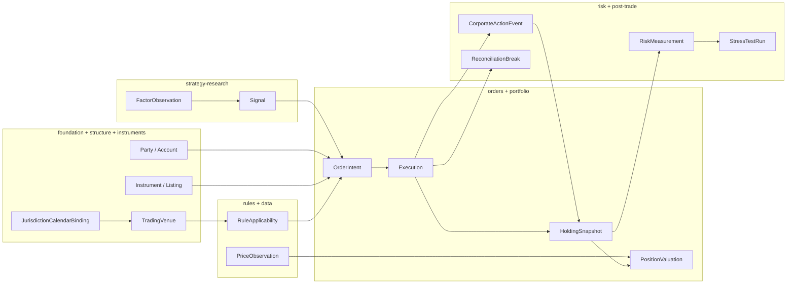

# M2 Trading Lifecycle Story

**Status**: Active narrative (integration test for semantic approval)  
**Date**: 2026-08-03  
**Release**: v1.0.0 (Round-12)

## Story arc

A single listed equity trade from research through post-trade reconciliation, told across 10 modules without boundary breaks.

## Scene-by-scene

### 1. Foundation — who and what identifiers

**Party** and **Account** exist with governed identifiers (LEI, internal account id). **Instrument** is identified by ISIN + listing context, not a floating ticker string.  
*Break if*: identifier schemes lack version or identity is only a display name.

### 2. Market structure + instruments — where it trades

**TradingVenue** (MIC) and **InstrumentListing** link instrument to venue segment. **JurisdictionCalendarBinding** (CQ-MS4) links jurisdiction to **TradingCalendar** at valid time. OTC path uses explicit OTC context, not silent default.  
*Break if*: listed execution lacks listing version or venue role.

### 3. Market rules — what constraints apply

**RuleApplicability** binds session/settlement/price-limit rules to venue + instrument class at valid time.  
*Break if*: rules applied without temporal scope or venue.

### 4. Market data — what price was knowable when

**PriceObservation** carries instrument, price kind, quotation, and three-axis timestamps. Valuation must not use prices unavailable at as-of.  
*Break if*: "current price" attribute without observation fact.

### 5. Strategy research — why trade now

**FactorObservation** revision chain and **Signal** link research output to **OrderIntent** lineage without future knowledge.  
*Break if*: signal lacks knowledge/availability bounds.

### 6. Orders execution — intent to fill

**OrderIntent** (client intent) → **ExternalOrder** (broker) → **OrderLifecycleEvent** → **Execution** with principal/contra parties, listing or OTC context, fees, status mapping.  
*Integrity example*: execution parties must align with account mandate; counterparty role required for bilateral fill.  
*Break if*: execution missing price or both listing and OTC context.

### 7. Portfolio positions — what we hold and value

**HoldingSnapshot** from execution (Slice B chain); **PositionValuation** references holding + price observation with traceability (CQ-S4).  
*Break if*: valuation uses price whose `availableFrom` is after valuation as-of.

### 8. Risk — exposure and limits

**RiskMeasurement** aggregates holdings + instrument risk inputs; **LimitBreach** links measurement, limit, and evaluation. **CQ-R4** traces breach to **Execution** via **HoldingSnapshot** (`risk-order-trace-v03` fixture: fill → holding → measurement → breach). **CQ-R5** stress scenarios use **ScenarioDefinition** and **StressTestRun** (`risk-stress-scenario-v03` fixture).  
*Break if*: breach without limit/measurement chain or orphan breach with no execution/holding path.

### 9. Post-trade — corporate actions and reconciliation

**CorporateActionEvent** affects holdings on entitlement date with availability gate. Exotic kinds (tender, spin-off, exchange) covered per ADR-018 (CQ-PTO6–PTO8). **ReconciliationBreak** compares settlement instruction vs external statement with both-side evidence.  
*Break if*: break confirmed without contra evidence.

## Approval criterion

Round-12 approves v1.0.0 when a reviewer can walk this story module-by-module citing IRIs, CQs, and at least one negative example per critical integrity point. See [slice-b-traceability.md](../../ontology/traceability/slice-b-traceability.md) for Execution→HoldingSnapshot chain evidence.
