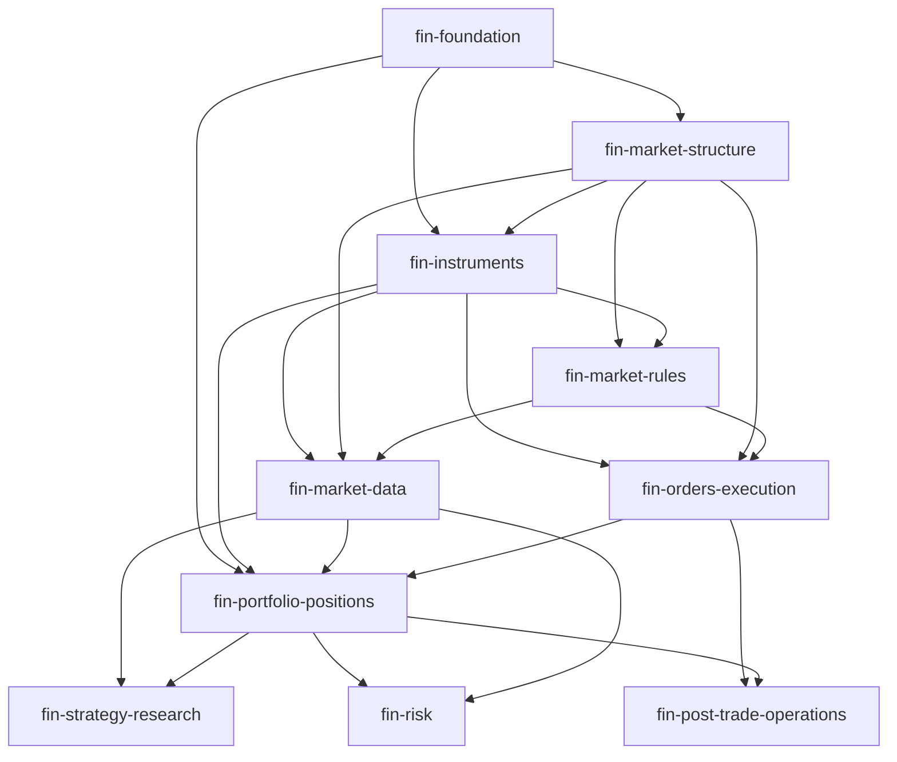

# Axiolune M2 领域本体实施计划

**状态**：Accepted — M2 v1.0.0 实施基线（Round-12 签收）  
**日期**：2026-07-30  
**上游基线**：已接受的 M3 v0.5.1（以发布清单、模块摘要和提交 `1fefc18` 为准）  
**适用范围**：金融投研、组合与交易语义层（M2）；不包含生产 M1 数据接入、运行时编排或真实外部下单

---

## 0. 决策摘要

M2 不是把金融术语按目录写成 YAML，也不是把 FIBO 或任一交易引擎的类名搬进 Axiolune。它是 **M3 元类型在金融领域的、版本锁定的实例集合**；每个已发布模块必须同时是：

1. 可追溯的术语与约束产品；
2. 可确定性编译为 OWL、SHACL 和文档的语义产品；
3. 可由 competency question（CQ）、正反 M1 fixture、映射和三轴 PIT 验证证明的工程产品。

本计划作出以下实施决策。

| 决策 | 结论 | 原因 |
|---|---|---|
| M3 边界 | M3 语义元模型冻结；M2 不得以自创字段、`kind:` 方言或未声明根结构绕过它 | 保持 M3→M2 编译、验证和版本锁的唯一解释 |
| M2 启动方式 | 先完成 `M2-0` 作者/编译契约，再写第一个正式领域模块 | “先写首域、后决定格式”会使首域成为不可验证的隐式方言 |
| 首个可发布目标 | `foundation → market-structure → instruments → market-rules → market-data → portfolio/positions` 的只读纵切片 | 先证明语义、映射、PIT 和查询闭环；不把真实下单混入首个验收 |
| 市场差异 | 不按中国、美国等地域复制平行本体；市场规则建成带范围、版本、有效期和来源的关联事实 | T+1、涨跌停、结算周期等会因场所、板块、证券类别、时间与监管版本而变化 |
| FIBO 使用方式 | FIBO 是金融语义锚点和对齐来源，不是自动全量 import，也不是本地概念的替代品 | FIBO 本身模块化且持续演进；全量引入会扩大闭包和逻辑/升级风险 |
| M1 映射 | 首先以合成、可复现 M1 切片证明映射；真实表列映射在具备数据字典与快照契约后单独放行 | 避免静态本体工作被未验证物理数据阻塞，也避免以猜测字段完成映射 |
| 外部写操作 | M2 仅定义订单、执行和动作所需的业务语义；真实经纪商/交易所动作继续受独立运行时安全门约束 | 领域建模正确不等于外部命令安全 |

### 0.1 M2 完成的严格定义

一个 M2 模块只有在满足以下全部条件后才可从 `review` 进入 `approved`：

- 其模块、导入、IRI、元素和模式绑定均是 M3 的合法实例，且没有悬空或前向引用；
- 每个对外导出的概念都有经过审查的定义、术语证据卡、责任人和版本化来源定位；
- 生成的 OWL/SHACL 与源文件字节级可追溯，OWL 一致性和 SHACL 执行验证均通过；
- 每个核心 CQ 都有可执行 probe、至少一个成功 fixture 和一个会被拒绝或返回空结果的反例；
- 需要物化的 `TemporalFact` 类型具备身份、三轴映射、`MaterializationRun` 和 `PITValidationRequest` 的端到端证据；
- 模块发布包包含生成物、锁文件、测试报告、变更记录和兼容性结论。

“YAML 能解析”“FIBO 有类似概念”或“仅有正例通过”均不构成完成。

### 0.2 明确非目标

- 不预先承诺类型、字段或模块数量；它们由 CQ、证据和验证结果决定。
- 不把 M2 变成物理表模型、ETL 调度模型、权限系统或 UI 模型。
- 不在 M2 首发中覆盖全部资产类别、完整会计、清算、税务、监管报告或实时订单路由。
- 不用某个开源项目的内部枚举、数据库列名或 API 对象作为规范金融语义。
- 不在没有版本化表定义、主键、更新语义、时区、延迟与可用性证据时写真实数据映射。

---

## 1. M3 → M2 不可违反的契约

M3 是 M2 的语法和运行时约束边界。M2 只能实例化、组合和绑定下表能力；发现表达能力缺口时必须停止新增方言，转入 ADR/RFC，而不是在领域 YAML 中临时发明字段。

| M3 能力 | M2 的使用规则 | 禁止事项 | 自动化证据 |
|---|---|---|---|
| `OntologyModuleDefinition` | 每个 M2 模块声明 `moduleIri`、`baseIri`、`preferredPrefix`、语义版本、标签、定义、状态与内容寻址导入 | 使用未声明的 `OntologyDefinition` 元类型；无摘要/版本的 import | 模块头、import digest、导出符号和 DAG 校验 |
| `ObjectTypeDefinition` | 用于有稳定业务身份、可独立被引用的实体，如 Instrument、Portfolio、LegalEntity、TradingVenue | 用 ObjectType 伪装需要时间、来源、数值或多方角色的事实 | IRI、继承、属性、模式与定义校验 |
| `AssociationTypeDefinition` | 用于价格观察、持仓快照、订单事件、成交、规则适用等带上下文或 n 元语义的事实 | 把上下文化事实压扁为某实体的“当前属性” | participant role、模式注入、SHACL fixture |
| `RelationTypeDefinition` / `RelationUse` | 用于稳定的二元语义关系，例如 `isIssuedBy`、`hasListing` | 用 relation 保存价格、数量、状态变化或需要溯源的关系事实 | domain/range、反向关系、基数和投影校验 |
| `AttributeTypeDefinition` / `AttributeUse` | 全局定义语义，局部声明基数；货币必须使用 `MoneyTypeDefinition`，数量必须使用 `QuantityTypeDefinition` | 用裸 `decimal` 表示金额；在不同类型中偷偷改变同一属性语义 | 类型/基数/数据值 SHACL 校验 |
| `IdentifierTypeDefinition` / `CodeListTypeDefinition` | 标识符、受控码表与其版本、维护方、有效性保持独立 | 把 MIC、ISIN、LEI、状态码散落为不可版本化字符串枚举 | 正则/校验器、版本锁、码表 fixture |
| Layer 2 `PatternBinding` | 按适用性显式绑定 `TemporalFact`、`ProvenancedFact`、Evidence、Lifecycle 等模式 | 为事实补一两个时间字段却绕过完整模式；同时绑定冲突模式 | 模式适用性、依赖/冲突、注入属性和 Shape 覆盖校验 |
| Layer 3 Query/Function/Action/Policy | M2 定义其目标对象、状态、事件和约束词汇；L3 承载调用、授权、幂等、补偿和审计契约 | 用 M2 直接实现外部写操作，或用 Action 代替业务事件语义 | callable 引用、参数/状态机 fixture；外写另行验收 |
| Layer 4 `SemanticMappingDefinition` | 它是物理数据→本体的唯一语义映射真源；静态映射与运行时 `MaterializationRun` 分离 | 在 `FieldDefinition`、计划或 R2RML 中维护第二套人工语义映射 | mapping coverage、snapshot、digest、PIT 和投影漂移校验 |
| `PITValidationRequest` | 所有可用于历史研究、回测或时点查询的物化类型，显式提供 valid/knowledge/availability 三轴与 target graph | 隐式 `now()`、缺失 `availableFrom` 后放行、以文件更新时间代替可用时间 | 动态 PIT validator 的正反例和历史重放 |

### 1.1 M2 与 M1、运行时的分界

| 层 | 真源 | 允许内容 | 不允许内容 |
|---|---|---|---|
| M2 | 模块 YAML 与相邻的证据/测试目录 | 概念、关系、约束、对齐、CQ、映射规范、合成 fixture | 真实业务事实、调度状态、密钥、经纪商命令 |
| 编译产物 | 由 M2 确定性生成 | OWL、SHACL、文档、可选 R2RML 投影、查询模板 | 手工修改后再视为语义真源 |
| M1 | 不可变输入快照与 materialization record | 具体实例、命名图、验证报告、结果摘要 | 未验证数据直接成为可查询语义事实 |
| 运行时 | 专用编排/执行系统 | 任务调度、缓存、审计、外部命令、权限执行 | 重写 M2 定义或绕过验证直接读写原始数据 |

---

## 2. 设计原则与建模纪律

### 2.1 从问题和证据出发，而非从类名出发

每个概念必须先回答：谁需要在什么时间、依据什么可用数据作出什么判断？CQ 是范围与可验证性的共同契约；它们应能被转化为查询或判定 probe。该做法与 Grüninger–Fox 的 competency-question 方法一致：本体需要包含解决这些问题所需且充分的公理与词汇。[Grüninger & Fox, 1995](https://link.springer.com/chapter/10.1007/978-0-387-34847-6_3)

### 2.2 语义、数据与行为三者分离

- **语义**说明某物是什么、与何物相关、何时成立；
- **映射**说明某个受控物理来源如何给语义槽位赋值；
- **行为**说明谁在何种条件下可以发起何种变更。

任何字段若同时承担三种职责，必须拆分。尤其不得把供应商列名、接口状态码或某个回测框架的对象名当作领域定义。

### 2.3 Object、Relation、Association 的判定表

| 问题 | 采用 | 典型金融例子 |
|---|---|---|
| 是否有跨时间稳定的业务身份，可独立被其他事实引用？ | `ObjectTypeDefinition` | Instrument、TradingVenue、Account、Portfolio、LegalEntity |
| 是否只是稳定、无自身上下文的二元含义？ | `RelationTypeDefinition` | Instrument `isIssuedBy` LegalEntity；Portfolio `isManagedBy` Party |
| 是否需要金额、数量、状态、来源、时间、证据、角色或多方参与者？ | `AssociationTypeDefinition` | PriceObservation、HoldingSnapshot、OrderLifecycleEvent、Execution、RuleApplicability |
| 是否只是一个可版本化受控取值集合？ | `CodeListTypeDefinition` | PriceKind、OrderLifecycleState、Side、TimeInForce、MarketStatus |
| 是否是号码/编码及其校验与签发规则？ | `IdentifierTypeDefinition` | ISIN、LEI、MIC、CFI、内部 Instrument ID |

W3C 的 n-ary relation 模式正是为“关系自身有时间、置信度、严重度、角色或其他属性”的情况设计；M2 对价格、持仓、成交和规则适用应优先采用该模式，而非丢失上下文的二元边。[W3C N-ary Relations](https://www.w3.org/TR/swbp-n-aryRelations/)

### 2.4 身份、版本与“当前值”纪律

1. 每个 Object/Association 在物化前定义 canonical IRI、逻辑业务键、源键、可选版本键和 IRI 模板。
2. `currentPrice`、`currentPosition`、`latestStatus` 只能是由事实图生成的查询视图，不能成为独立的真源属性。
3. 修订形成新事实版本，并以 knowledge-time 关闭旧版本；不得覆盖历史事实。
4. 由多个来源给出的同一概念先保留来源、优先级和冲突结论；不得静默覆盖。
5. 空白节点不得作为跨运行稳定身份。若输出图含空白节点，图摘要以 RDF canonicalization 后的规范数据集序列化计算，而非仅哈希 Turtle 文本。[RDF Canonicalization](https://www.w3.org/TR/rdf-canon/)

### 2.5 三轴时间与 PIT 的硬性语义

| 轴 | 含义 | 典型来源 | PIT 条件 |
|---|---|---|---|
| valid time | 事实在业务/现实世界中成立的区间 | 交易日、合约生效日、规则生效日 | `validFrom ≤ asOfValid < validTo` |
| knowledge time | 平台认定、修订或撤回该事实版本的区间 | assertion time、修订登记时间 | `knowledgeFrom ≤ asOfKnowledge < knowledgeTo` |
| availability time | 合法消费者可使用该数据的区间 | 供应商接收、市场公布、权限释放或可审计落库时间 | `availableFrom ≤ asOfAvailable < availableTo` |

所有区间采用半开 `[from, to)`；`to` 缺失表示无穷。`availableFrom` 缺失必须 fail-closed。`referenceTime` 属于不可变 `MaterializationRun`，不是隐式系统时钟，也不等同于任一 as-of 参数。

传统 valid/transaction time 为前两轴提供术语基础；Axiolune 的 availability time 是为数据许可、供应商延迟与防前视偏差增加的显式平台时钟，不能把它偷换为普通文件快照时间。[Temporal Database Glossary](https://sigmodrecord.org/publications/sigmodRecord/9209/pdfs/140979.140996.pdf)

### 2.6 对齐不是等价性的快捷方式

- 对 FIBO 的 OWL **类**，优先使用经证明的 `rdfs:subClassOf`；只有必要且充分条件完全等价时才允许 `owl:equivalentClass`。
- 对 FIBO 的 OWL **属性**，相应使用 `rdfs:subPropertyOf` 或经过证明的 `owl:equivalentProperty`。
- `skos:exactMatch`、`skos:closeMatch`、`skos:broadMatch`、`skos:narrowMatch` 仅用于实际作为 `skos:Concept` 的概念方案、码表或专门建立的对齐概念；不得把它们作为任意 OWL class/property 之间的含糊替代。SKOS 的 mapping properties 面向不同 concept scheme 间的概念映射。[SKOS Reference](https://www.w3.org/TR/skos-reference/)
- 每一条 `Alignment` 必须锁定外部词表 release/commit、artifact digest、目标 IRI、关系、定位、理由和审核状态。FIBO 是由多个域和模块构成且成熟度不同的本体集合，引用时默认选 Release 成熟度模块；使用 Provisional/Informative 内容必须有例外记录。[FIBO Viewer](https://spec.edmcouncil.org/fibo/ontology/MetadataFIBO/FIBOSpecification)
- FIBO 同时提供 OWL 和 SKOS vocabulary 产物：对 OWL 产品采用 RDFS/OWL 关系；只有目标已验证为 SKOS Concept 时才使用 SKOS mapping。
- PROV-O 可作为溯源互操作参考；M3 的 provenance/evidence 仍是 Axiolune 的运行时语义真源。不要将 URI 字符串伪装为对象关系；需要互操作时再显式建立对象级对齐。[W3C PROV-O](https://www.w3.org/TR/prov-o/)

---

## 3. 来源、术语与证据治理

### 3.1 来源的优先级

| 层级 | 可作为什么证据 | 例子 | 不可作为什么 |
|---|---|---|---|
| 1. 法规、交易所规则、ISO/FIX 等规范 | 受监管定义、代码、报送/交易生命周期语义 | ISO 6166 ISIN、ISO 10383 MIC、ISO 10962 CFI、GLEIF LEI、FIX | 未公开或过期版本的推测性字段定义 |
| 2. FIBO 与其版本化发布包 | 金融术语、模块边界、可复用类/属性和逻辑对齐 | FND、BE、SEC、MD、FBC、DER | 直接替代本地 M2 设计；不加闭包评估的全量 import |
| 3. 数据供应商/场所的正式资料 | 数据含义、发布、修订、延迟与许可时间 | 交易所规格、供应商 schema、公告规则 | 一般金融概念的唯一权威 |
| 4. 可复现开源实现 | 事件顺序、状态机、回测与 PIT 边界的行为证据 | NautilusTrader、LEAN、Qlib、rqalpha、vn.py | 直接成为规范本体或状态枚举真源 |
| 5. 内部约定 | Axiolune 独特的产品与治理选择 | 命名、模块 API、平台 policy | 伪装成外部行业标准 |

ISIN、MIC、LEI 和 FIX 应分别作为标识、交易场所、主体身份与通信/生命周期参考：ISO 6166 定义金融及参考工具的统一识别结构；ISO 10383 定义交易所、交易平台和市场的通用标识；LEI 是唯一的 20 位法律实体标识；FIX 为交易信息交换提供跨交易生命周期的开放标准。[ISO 6166](https://www.iso.org/standard/78502.html) [ISO 10383](https://www.iso.org/obp/ui/en/) [GLEIF LEI](https://www.gleif.org/en/about-lei/introducing-the-legal-entity-identifier-lei) [FIX Protocol](https://fixtrading.org/standards/fix-protocol/)

### 3.2 必备证据工件

M3 语义字段不承载所有研究笔记。以下 sidecar 工件是 M2 发布包的一部分，均以 M2 元素的 canonical IRI 为主键；它们不向 M2 YAML 注入未定义字段。

| 工件 | 每条记录必须包含 | 用途 |
|---|---|---|
| `references.bibliography.yaml` | authority、release/commit、license、localPath、locator | 外部对齐与双轨 gap 参考书目（无 digest 锁） |
| 术语卡 | term、IRI、ISO 704 定义、反例/排除项、来源定位、候选 M3 类型、状态 | 防止同名异义和先有代码后补定义 |
| `alignments.yaml` | local IRI、target IRI、关系、source release/digest、rationale、review | 使互操作主张可审计 |
| CQ 卡 | CQ ID、业务问题、范围、查询/probe、期望结果、依赖元素、风险等级 | 将需求直接连接至验证 |
| 决策记录 | 问题、选项、结论、影响、回滚/迁移 | 防止后续把关键语义当成偶然实现 |
| traceability matrix | `source → term → M2 element → constraint → CQ → fixture → test run` | 发布前证明没有无来源核心概念或无验证核心需求 |

### 3.3 术语卡的最低模板

```yaml
term: "Instrument Listing"
canonicalIri: "https://axiolune.ai/ontology/finance/instruments/InstrumentListing"
definition: "tradable admission of a financial instrument to a specified trading venue or market segment under stated identifiers and trading conditions"
genus: "tradable admission"
differentia:
  - "identifies an instrument"
  - "is scoped to a venue or market segment"
  - "may have venue-specific trading identifiers and effective intervals"
excludes:
  - "the financial instrument itself"
  - "a market price observation"
sources:
  - reference: "fibo-2026Q1"
    locator: "..."
status: review
```

### 3.4 外部依赖适配与版本锁

M3 `ModuleImportDefinition.version` 使用语义版本，而 FIBO 等外部工件可能采用季度 release（例如 `2026Q1`）或非 SemVer 的版本 IRI。不得把外部版本字符串伪装成 M3 SemVer。若需要正式导入外部逻辑闭包，先建立本地 adapter/interface module（例如 `ext-fibo-release-2026q1`），该模块自身使用 SemVer，并在其治理和依赖清单中锁定外部 release、version IRI、digest、license 与选中的模块。

```yaml
id: ext-fibo-release-2026q1
representation: owl              # owl | skos | reference-data
releaseOrCommit: "2026Q1"
artifactUrl: "..."
sha256: "sha256:..."
maturity: Release
importPolicy: linked-data-alignment # formal-import | linked-data-alignment | terminology-only
selectedModules: []
```

`Alignment` 不等于 `owl:imports`。只有模块确实需要复用外部公理且已通过 import-closure 一致性检查时，才使用 `formal-import`；其余情况使用对齐或术语证据，避免把整个 FIBO 闭包带入每个领域模块。

---

## 4. M2-0：作者与编译契约（首个领域模块前的 G0）

### 4.1 为什么 G0 是阻断门

当前 M3 定义的是 `OntologyModuleDefinition`、Object/Attribute/Relation/Association 等元类型，并没有可由手写文本默认推断出的 `OntologyDefinition` 元类型或 M2 文件根方言。因此，G0 的目标不是修改 M3 的语义，而是将已有 M3 类型落成一个被编译器、schema 和测试共同接受的 **M2 Authoring Profile**。

在 G0 未通过前，不允许把任何领域文件宣称为正式 M2 模块。

### 4.2 G0 必须冻结的内容

| 项目 | 必须决定 | 验收方式 |
|---|---|---|
| 源包根结构 | 一个模块 manifest 如何承载 `OntologyModuleDefinition`；元素容器如何标识 `ObjectTypeDefinition`、`AssociationTypeDefinition` 等 M3 实例 | schema 负例拒绝未知根/未知元素容器 |
| IRI 与 CURIE | canonical 绝对 IRI、`baseIri + localName`、模块 prefix、CURIE 展开注册表和禁止歧义规则 | 同一 IRI/本地名冲突、未注册 CURIE 均失败 |
| 导入与导出 | 仅导入 `approved` 模块的显式导出符号；版本与 artifact digest 必须锁定 | 版本漂移、未导出引用、循环 import、前向引用均失败 |
| 元素合法性 | 只允许 M3 已定义字段与枚举；侧车证据单独校验 | strict schema 与结构负例 |
| Pattern 编译 | `patternBindings` 必须展开至实际 M2 class/association 的 OWL/SHACL target，而非只保留抽象 pattern Shape | 一个真实 `fin:PriceObservation` fixture 的 Shape target、注入属性和约束均可见 |
| 投影合同 | M2 YAML → 解析 IR → OWL/SHACL/文档/可选投影均确定性生成；生成物不得手改 | 两次构建 hash 一致、`git diff --exit-code` 为零 |
| 最小验证器 | 实现 `validate-m2-core`，只验证通用 M2 合法性；领域特有规则按模块扩展 | 对应正/反 fixture 在 CI 中可复跑 |

### 4.3 G0 最小编译 fixture

以一个极小但真实的模块（例如 `fin-foundation` 中的 `Instrument`、`hasPrimaryIdentifier` 与一个 `ISIN` 使用）证明：

1. M2 manifest 可被严格解析；
2. 一个 M3 `ObjectTypeDefinition` 实例可投影为实际 OWL class；
3. 一个属性使用与基数可投影为实际 SHACL shape；
4. 模块 import、外部对齐和证据卡可被锁定和交叉引用；
5. 正例通过，缺失必填标识符的反例被拒绝；
6. 生成物、日志和摘要进入同一发布包。

G0 只建立写作/编译能力，不预先推测复杂领域规则。它替代原计划中“首域完成后再决定 YAML 格式”的做法。

### 4.4 建议目录契约

目录是发布和验证组织，而非第二套语义语言；M2 语义源始终由 G0 冻结的 authoring profile 解释。

```text
ontology/domain/finance/
  registry/
    prefixes.yaml
    module-registry.yaml
  foundation/
    module.yaml
    vocabulary.yaml
    constraints.yaml
  market-structure/
  market-rules/
  instruments/
  market-data/
  portfolio-positions/
  orders-execution/
  strategy-research/
  risk/
  post-trade-operations/

docs/ontology/
  references.bibliography.yaml
  terminology/
  competency-questions/
  alignments/
  decisions/
  traceability/

mappings/finance/
  synthetic/
  source-contracts/

tests/m2/
  fixtures/positive/
  fixtures/negative/
  competency-queries/
  projection/
  pit/
  mapping/

generated/ontology/finance/
  owl/
  shacl/
  docs/
  reports/
```

---

## 5. 领域边界、依赖图与推进顺序

### 5.1 模块图



模块依赖是可机器检查的 DAG。任何模块只能引用已 `approved` 的依赖模块所导出的符号；不允许“先声明、以后再补”的前向引用或空壳概念。若两个模块确实共享抽象，先将抽象下沉至较低层共享模块，再升级 version-locked import。

### 5.2 模块职责与首发边界

| 模块 | 责任边界 | 首批核心概念 | 不应在本模块做的事 |
|---|---|---|---|
| `fin-foundation` | 金融通用身份、标识、分类、司法辖区与日历接口，不重造 M3 基础类型 | Party、LegalEntity、FinancialIdentifierAssignment、Currency/CodeList 使用策略、Jurisdiction、BusinessCalendar | 把 M3 `Money`/`Quantity` 再定义一遍；保存物理来源字段或承载组合/持仓语义 |
| `fin-market-structure` | 交易场所、市场段、交易日历和交易时段的稳定结构 | TradingVenue、MarketSegment、TradingCalendar、TradingSession | 用某个场所的一时规则或 ticker 代替稳定场所/上市语义 |
| `fin-market-rules` | 交易、结算与准入规则及其适用范围、版本和证据 | MarketRuleSet、MarketRule、RuleApplicability、SettlementConvention | 把 T+1、涨跌停、结算周期平铺为静态 Venue 属性 |
| `fin-instruments` | 金融工具、发行人、分类与上市/可交易范围 | FinancialInstrument、Security、EquitySecurity、InstrumentListing、Issuer relationship | 把 listing、ticker 或一时的交易状态等同于 Instrument 身份 |
| `fin-market-data` | 观察、报价、成交、Bar 与数据来源/发布语义 | PriceObservation、QuoteObservation、TradeObservation、Bar、PriceKind | 一个带大量 nullable 字段的万能 `MarketDataRecord` |
| `fin-portfolio-positions` | 账户/组合持仓与估值的事实模型 | HoldingSnapshot、PositionLot、PositionValuation、PnLObservation | 不区分外部快照与由成交重建的派生持仓 |
| `fin-orders-execution` | 订单意图、生命周期事件、成交和外部状态适配 | OrderIntent、OrderLifecycleEvent、Execution、ExternalOrderStatusMapping | 将某经纪商状态枚举直接定义为规范本体；直接接入实盘 |
| `fin-strategy-research` | 因子、信号、模型、策略、实验与回测语义 | FactorDefinition、Signal、StrategyDefinition、BacktestRun、PerformanceObservation | 将 Qlib 的内部实现对象视为标准本体 |
| `fin-risk` | 度量定义、限额、敞口、情景、违例和结论 | RiskMeasureDefinition、RiskLimit、ExposureObservation、LimitBreach | 混淆风险定义、计算函数和一次风险结果 |
| `fin-post-trade-operations` | 公司行动、结算、对账和运营异常 | CorporateActionEvent、SettlementInstruction、ReconciliationBreak | 以交易前端状态代替后处理事实 |

### 5.3 市场规则不是地域子本体

“A 股”和“美股”可以共享 `EquitySecurity`、`InstrumentListing`、`TradingVenue` 与 `PriceObservation` 等概念；差异由实例化的市场结构和规则表达。应采用：

```text
MarketRule
  └─ RuleApplicability (AssociationType)
       ├─ appliesToVenue / MarketSegment / InstrumentClass / InvestorCategory
       ├─ rule parameter value and unit
       ├─ valid / knowledge / availability intervals
       ├─ source, revision, evidence
       └─ lifecycle status
```

因此，T+1/T+0、涨跌停、结算周期、交易时段和最小变动单位都能随规则版本、板块或证券类别变化而不产生 `ChinaEquity`、`USPosition` 等平行概念树。

---

## 6. 首个可执行纵切片

### 6.1 Slice A：只读的“工具—行情—持仓—估值”闭环

首个纵切片必须在不依赖真实外部写操作的前提下，证明 M3→M2→M1 的完整链条。

| 范围 | 必须交付的 M2 语义 | 合成 M1 证据 |
|---|---|---|
| 基础身份 | LegalEntity、Issuer、Instrument identifier assignment、Account、Portfolio | 发行人、一个账户、一个组合、ISIN 与内部 ID |
| 市场结构、规则与工具 | TradingVenue、MarketSegment、EquitySecurity、InstrumentListing、一个生效的 MarketRule/RuleApplicability | 一个 venue、一个 listing、MIC、规则来源、适用范围及有效期 |
| 行情 | `PriceObservation` Association：observed listing/venue、price、price kind、currency、source；绑定 `TemporalFact + ProvenancedFact + Evidence` | 正常价、修订价、迟到价、不可用价、区间倒置价 |
| 持仓 | `HoldingSnapshot` 区分报告持仓；`PositionValuation` 显式引用所用 price observation，不把推导值伪装为源事实 | 一份净头寸、成本、价格、估值与可核算期望值 |
| 查询 | `GetPriceAt` 和组合估值 probe 必须显式传入三轴 as-of | 每个 CQ 的期望结果及未来数据不可泄漏反例 |
| 映射 | 一个受控关系型/表格型合成源经 `SemanticMappingDefinition` 进入 staging named graph | source contract、input snapshot digest、run record、输出 graph digest |

`PriceObservation` 应是 Association，而非 `Instrument.currentPrice`：它至少需要被观察对象、场所/市场段、价格种类、数值与币种、观察/有效/知识/可用时间、来源、修订和证据。对于 bid/ask、trade、OHLCV Bar，先定义清晰的观察子类/关联边界，而不是以一个万能对象和大量可空字段混合。

### 6.2 Slice A 的必须通过的 CQ

| ID | 问题 | 必需结果 | 关键反例 |
|---|---|---|---|
| CQ-S1 | 某个 ISIN 与内部标识是否指向同一 Instrument，并由谁发行？ | 返回唯一 Instrument/Issuer 或明确冲突 | 重复/校验失败标识符被拒绝或隔离 |
| CQ-S2 | 给定 listing、场所和三轴 as-of，可使用的指定类型价格是什么？ | 返回唯一/有序候选及来源、修订和时间解释 | 数据在 `availableFrom` 之后才到达，历史 as-of 不得返回 |
| CQ-S3 | 在指定三轴 as-of 下，组合持有哪些工具、数量是多少？ | 返回可追溯 HoldingSnapshot | knowledge/availability 过期或区间倒置的 snapshot 被拒绝 |
| CQ-S4 | 组合估值使用了哪一个价格事实、哪个币种和哪个估值规则？ | 返回 valuation 到 price/holding/source 的可追溯链 | 使用未来修订价的估值失败 |
| CQ-S5 | 同一来源修订后，固定历史请求是否仍可重放？ | 固定 release/mapping/snapshot/as-of 得到 RDF 同构结果 | 追加未来数据改变历史答案时失败 |

### 6.3 Slice B：订单与执行的语义闭环（后续门）

Slice A 通过后再进入订单模块。其范围是规范语义和合成事件回放，不是发出真实订单。

| 概念 | 语义要求 |
|---|---|
| `OrderIntent` | 投资者/策略希望达成的交易意图，含目标、边、数量、限制和有效性；不等同于外部已接受订单 |
| `OrderLifecycleEvent` | 规范生命周期的不可变状态转移事实，记录前后状态、原因、时间、来源和关联订单 |
| `Execution` | 成交/执行事实，包含工具或 listing、数量、价格、费用、场所、双方/账户角色与时间 |
| `ExternalOrderStatusMapping` | 券商/场所状态→规范状态的可版本化映射；不能污染规范码表 |
| `Position` 派生 | 由 Execution 重建的状态与外部 `HoldingSnapshot` 并存，差异要可对账而非静默覆盖 |

NautilusTrader 的事件驱动、研究到实盘一致的架构可作为状态转换和确定性回放的行为证据，但其事件类型并非 M2 的规范词汇。[NautilusTrader](https://github.com/nautechsystems/nautilus_trader) Qlib 的 PIT 数据库可作为修订财报防泄漏的实现参考，但不能替代行情、订单和三轴可用性的通用语义。[Qlib PIT](https://qlib.readthedocs.io/en/latest/advanced/PIT.html)

### 6.4 不将 SubmitOrder 纳入首个放行

首发只可模拟 `SubmitOrder` 的语义前置条件和生成 `ExecutionRecord` 的审计结构。真实外部调用至少还需要：命令持久化先于发送、唯一幂等键、回执/未知结果处理、对账、补偿边界、权限/限额校验、超时和重复消息测试。这属于 L3/M1 运行时安全验收，不能因 M2 通过而自动解锁。

---

## 7. 分阶段实施与放行门

本计划不预设日历工期；只有上一个门的证据完整，才可启动下一门。领域扩展按同一模板迭代。

| 阶段 | 工作重点 | 必须交付 | 放行条件 |
|---|---|---|---|
| **M2-0 / G0** | 作者、编译与验证基座 | Authoring Profile、ADR-013、prefix/module registry、最小 fixture、`validate-m2-core`、锁定依赖 | 一个真实 M2 类型实际生成 OWL/SHACL，pattern Shape 目标到实际类型，正反例可执行 |
| **M2-1 / G1** | Foundation、Market Structure、Market Rules、Instruments | 术语卡、模块源、FIBO/ISO 对齐、规则适用模型、CQ、正反例 | 语义/导入 DAG 无环、OWL 一致、外部对齐审查通过 |
| **M2-2 / G2** | Market Data 与 Slice A 的行情部分 | Price/Quote/Trade/Bar 边界、source contract、合成 mapping、PIT fixture | staging graph→SHACL/PIT→查询链闭合；未来数据、迟到数据、缺可用时间均失败 |
| **M2-3 / G3** | Portfolio/Positions 与 Slice A 完整闭环 | HoldingSnapshot、PositionValuation、价格到估值 CQ、独立期望账 | `价格→持仓→估值` 合成回放可重现且可对账 |
| **M2-4 / G4** | Orders/Execution | 状态/事件/执行模型、外部状态适配、乱序/重复/缺回执反例 | 仅模拟条件下的合法/非法状态转换和执行→持仓重建通过 |
| **M2-5 / G5** | Strategy/Research、Risk、Post-trade Operations | 各模块的 CQ、对齐、映射策略和 fixtures | 每一模块独立达到“模块完成定义”；不以总量替代质量 |
| **M2 Release** | 发布与兼容性治理 | release manifest、所有生成物、测试报告、差异/迁移说明 | 所有模块固定版本，依赖锁、生成物和运行报告来自同一 CI 工件 |
| **M1 Production Gate** | 真实数据与生产运行 | 真实 data contract、权限、快照、性能、监控、回放与审计 | 独立审查通过；真实外部动作仍另设安全门 |

---

## 8. 每个模块的交付流水线

### G1：范围与证据

- 写出利益相关者、使用场景、非目标和风险；
- 收集并锁定来源，产出术语卡和候选 CQ；
- 确定需要的是 Object、Relation、Association、Attribute、CodeList 还是 Identifier；
- 若出现 M3 无法表达的需求，写 ADR/RFC 并停止该需求的实施。

### G2：语义设计审查

- 写 ISO 704 风格定义、继承、关系、属性、基数、码表和模式绑定；
- 先处理 identity、时间、来源、证据和修订，再处理便利查询或 UI 显示字段；
- 明确 `TemporalFact` 是否适用；适用时，所有依赖的 M1 mapping 必须拥有完整三轴；
- 对每个外部对齐给出关系类型、版本、理由和审查状态；
- 形成 `CQ → 元素 → 来源` 的首版追溯矩阵。

### G3：编译与本体一致性

- 严格 YAML/schema、模块 metadata、IRI/prefix、import digest、导出符号、引用闭包和依赖环检查；
- 检查模式适用性、依赖/冲突、注入属性、role range 和本地/全局基数；
- 确定性生成 OWL 与 SHACL；解析 import closure，并以选定 OWL 2 DL 工具进行一致性检查；
- 生成物零漂移，构建可重复。

FIBO 的工程实践同样把模块 metadata、命名、定义、引用卫生和自动质量测试作为发布要求；M2 应借鉴其“发布产品而非仅源文件”思路。[FIBO Ontology Guide](https://github.com/edmcouncil/fibo/blob/master/ONTOLOGY_GUIDE.md)

### G4：CQ、约束与正反例

- 每个核心 CQ 转化为 SPARQL、函数或声明性 query probe，并锁定预期结果；
- 每个必填属性/role、码表约束、关系范围和跨字段约束至少有一个拒收 fixture；
- SHACL 验证真实 data graph against 真实 shape graph，而不是只解析 TTL；
- 对 derived view 明确其输入事实和失效条件，禁止它成为独立真源。

### G5：映射与 PIT（仅对需要物化的模块）

- `SemanticMappingDefinition` 覆盖 identity、slot、转换、来源和时间；
- 若 target 绑定 `TemporalFact`，M2 特有校验器必须强制 `TemporalMappingSpec` 三轴完整，而不能因 L4 的 `temporal` 字段可选而省略；
- 固定输入 snapshot、mapping/ontology/compiler/validator digest，生成 staging named graph；
- 执行静态 SHACL、动态 PIT validator 和 CQ；失败时拒绝/隔离，成功后原子提升；
- 测试修订、迟到、区间边界、缺失可用时间、时区/交易时段、来源冲突和历史重放。

### G6：发布、兼容性与回滚

- 标记 `draft → review → approved → deprecated`，由治理记录承载审核与变更理由；
- 加性与破坏性变更都产生 semver 和 compatibility assessment；
- 发布包包括 artifact digest、测试报告、变更日志、迁移/弃用说明；
- 回滚的是模块 release 和读取路由，不允许抹除已审计的 M1 运行记录。

---

## 9. 验收矩阵与 CI 门禁

| 门禁 | 输入 | 成功证据 | 必须失败的例子 |
|---|---|---|---|
| `source` | M2 YAML、sidecar evidence | 无重复键、无未知字段、所有必填元数据存在 | 未知 M3 字段、未注册 CURIE、缺模块 version |
| `module/import` | module registry、lock manifest | 所有 import 为 approved、version/digest 锁定、导出可解析 | 悬空符号、前向引用、循环 import、摘要漂移 |
| `semantic hygiene` | 解析 IR | 无重复 IRI/本地名冲突、继承无环、definition/类型/基数合法 | Object/Association role 缺 range、无效 code list、模式冲突 |
| `alignment` | alignment sidecar、锁定 FIBO/标准工件 | target IRI、release、关系、理由、审查均存在 | 未锁版本、错误 relation、无证明的 `owl:equivalent*` |
| `OWL` | 生成 OWL + import closure | 语法与 OWL 2 DL 一致性检查通过 | 不可满足类、非法 property 组合、导入闭包失败 |
| `SHACL` | M2 shapes + 正反 M1 graph | 正例 conforms，反例含预期 violation | 只解析 shapes、不运行验证；模式只 target 抽象类 |
| `CQ` | probe + fixture + expected result | 每个核心 CQ 结果稳定、可解释、可追溯 | 反例返回正常业务答案；查询绕过已验证图 |
| `mapping` | source contract、mapping、snapshot | slot/identity/temporal coverage 完整，staging→promotion 可重放 | 物理列内联语义、缺业务键、未声明 transformation |
| `PIT` | `MaterializationRun`、`PITValidationRequest` | 三轴边界、未来知识、可用性、修订、重放均符合 | `availableFrom` 缺失、未来数据、过期数据、倒置区间被放行 |
| `determinism` | 全部源与生成物 | 两次构建/同一 run 输入得到同构 RDF 与同结论 | 手改生成物、依赖漂移、未来追加改变历史答案 |
| `release` | CI archive | release manifest 与所有测试报告来自同一次构建 | 本地报告与发布工件版本不一致 |

M3 现有 Node 解析/投影测试应继续保留，但不能把“TTL 能解析”视为 SHACL-SPARQL 已执行。SHACL 的 purpose 是描述并验证 RDF 图的结构；对自定义 SPARQL 约束需要真实执行引擎。[W3C SHACL](https://www.w3.org/TR/shacl/) [SHACL-SPARQL](https://www.w3.org/TR/shacl12-sparql/)

---

## 10. 数据映射、物化和查询合同

### 10.1 单一映射真源

`SemanticMappingDefinition` 是所有人工维护的语义映射真源。每条 mapping 必须明确：

- `SourceBinding`：数据集、join/filter/grouping 的行集语义；
- `IdentitySpec`：logical key、可选 version key 与稳定 IRI 模板；
- `SlotMapping`：attribute、participant role、relation 或 pattern field 的目标；
- `ValueBinding`：直接字段、版本化 transformation、literal 或运行时上下文；
- temporal/provenance binding、冲突优先级和失败动作。

关系型来源可由 canonical mapping **生成** R2RML 作为互操作投影或测试辅助；R2RML 不得反向成为人工维护的第二套映射真源。R2RML 是 W3C 的关系数据库到 RDF 自定义映射语言，适合用作派生产物而非替代 Axiolune 的 L4 合同。[W3C R2RML](https://www.w3.org/TR/r2rml/)

### 10.2 物化顺序

```text
immutable input snapshot
  → MaterializationRun（referenceTime / assertionTime / input digest）
  → canonical SemanticMappingDefinition
  → isolated staging named graph
  → static SHACL + dynamic PIT validation + CQ probes
  → validation report + output graph digest
  → atomic promotion to queryable graph
```

任何失败都必须停在 staging/隔离状态；下游查询只能访问已提升、带 release 和 run identity 的命名图。原始湖仓/源表、映射、生成图、验证报告和 query response 必须能建立双向 lineage。

### 10.3 每次物化最少记录

除 M3 `MaterializationRun` 的必填字段外，运行 ledger 或侧车证明至少固定：

```text
ontologyRelease + compilerDigest + validatorDigest + mappingDigest
+ sourceDatasetId + immutableSnapshotId + sourceSchemaDigest
+ asOfValid + asOfKnowledge + asOfAvailable + referenceTime
+ inputSnapshotDigest + outputGraphDigest + validationReportDigest
```

表快照证明可重放，不自动证明历史时刻的合法可用性。availability time 必须来自可审计的供应商接收、市场发布、权限释放或明确落库事件。

### 10.4 真实数据的单独准入门

在下列资料缺失时，真实数据映射不得开始：版本化数据字典、主/外键、更新/修订语义、时区、交易日历、延迟/接收时间、快照机制、来源许可、owner 和质量断言。当前未提供的表列清单不影响 M2 的合成纵切片，但会阻断真实 mapping 的验收。

---

## 11. 技术选择记录

技术选择遵循 **Adopt / Trial / Assess / Hold**。M2 不预先把图数据库或量化引擎绑定为语义真源。

| 能力 | 决策 | 用途与边界 | 退出策略 |
|---|---|---|---|
| 现有 Node M3 parser/generator | **Adopt** | 继续负责 YAML、引用闭包、确定性投影、漂移检查 | 生成 IR 与产物格式须文档化，便于替换实现 |
| M2 `validate-m2-core` | **Adopt（G0 新增）** | 模块/IRI/import/模式/对齐/投影闭包的通用校验；不内置领域规则 | 测试 fixture 与诊断格式独立于实现语言 |
| 真实 SHACL-SPARQL runner | **Trial → Adopt** | G0 以标准+项目 corpus 比较 Apache Jena SHACL 与 pySHACL，指定一个 pinned CI reference validator；Node 解析器只作快速测试 | Shape 与 fixture 保持标准 SHACL，可迁移至任意合规引擎；pySHACL 以 RDFLib 为基础并遵循 SHACL Recommendation [pySHACL](https://github.com/RDFLib/pyshacl) |
| OWL 一致性检查 | **Assess** | CI 先以一个 pinned OWLAPI/ROBOT + DL reasoner 作为主检查；release candidate 或 import-closure 变更以第二独立 reasoner 交叉检查；不进入线上交易路径 | 在容器中锁版本；若 reasoner 不再维护，更换实现但保留 OWL corpus。OWL 2 profiles 是为不同可扩展性/表达力权衡而设，不能默认把所有逻辑放到在线查询 [OWL 2 Profiles](https://www.w3.org/TR/owl2-profiles/) |
| R2RML | **Trial（派生产物）** | 对简单关系源生成互操作映射或验证映射一致性 | 删除生成器不改变 canonical `SemanticMappingDefinition` |
| 图存储/三元组库 | **Hold** | G0–Slice A 只需可重放 named-graph 测试环境；不以数据库选择阻塞本体完成 | 以 RDF/SHACL/SPARQL 工件作为可移植边界 |
| Iceberg/数据湖快照 | **Assess** | 真实 M1 生产阶段评估不可变 snapshot、schema evolution 和 time travel；不作为 M2 先决依赖 | source-contract 接口不绑定具体表格式 |
| Qlib/NautilusTrader/LEAN/rqalpha/vn.py | **Reference only** | 提取 PIT、事件顺序、订单/持仓行为和适配需求 | 不让内部类名/状态枚举进入 canonical M2 |
| OpenMetadata/OpenLineage | **Assess** | 借鉴 data contract、质量、权限和列级 lineage；可在生产 M1 扩展 | 初期用轻量 source-contract/ledger，不要求部署完整平台 |

---

## 12. ADR、治理与停止条件

### 12.1 计划 ADR

ADR 编号以正式 register 为准；在未确认空号前不得擅自占用。建议的主题和触发时机如下。

| 主题 | 触发门 | 必须裁决的问题 |
|---|---|---|
| M2 Authoring Profile、module topology、IRI/prefix 策略 | **M2-0 前** | source envelope、导入锁、生成合同、公共 prefix 与兼容策略 |
| Financial identity、identifier assignment、instrument vs listing | M2-1 | 业务键、IRI、ISIN/LEI/MIC/CFI、reassignment 和有效期 |
| Market rule applicability | M2-1 | 规则、场所、板块、证券类别、投资者/地域条件与时间的建模 |
| Price/observation taxonomy 与三轴映射 | M2-2 | price/quote/trade/bar 的边界、修订、来源冲突和可用时间 |
| Position、lot、snapshot、valuation 与 PnL | M2-3 | 外部快照与 execution-derived 状态的关系、会计/税基边界 |
| Order lifecycle 与 external status mapping | M2-4 | 规范状态、事件、回执、重复/乱序、L3 Action 边界 |
| Code list release/update 策略 | 首个外部码表接入前 | ISO/FIBO/场所码表的锁定、弃用和迁移 |

### 12.2 Stop-ship 条件

出现任一条件时，停止模块发布并回到相应设计门：

- 需要未在 M3 定义的语义字段或元类型；
- 导入、对齐或来源无法锁定到具体 artifact/release；
- CQ 无法被明确判定，或不同专家对定义/反例无法达成记录化结论；
- `TemporalFact` 的 mapping 缺任一时间轴、身份或可用性来源；
- 生成物与源文件漂移、构建不确定，或 SHACL 只解析未执行；
- 真实数据缺少 snapshot/版本/许可/时区/修订语义；
- 试图以 M2 通过为由接入生产订单、外部资金或不可逆变更。

---

## 13. 实施任务分解

| Epic | 关键任务 | 产出 | 依赖 |
|---|---|---|---|
| E0：M2 编译基座 | Authoring Profile、schema/IR、prefix registry、`validate-m2-core`、最小 fixture | G0 证据包 | M3 v0.5.1 release manifest |
| E1：语义证据工作台 | reference lock、术语卡、alignment/CQ/traceability 模板与校验 | 可审查的研究输入 | E0 的 canonical IRI 规则 |
| E2：Foundation/Market/Instrument | 场所/规则、身份/上市模型、FIBO/ISO 对齐、OWL/SHACL | G1 发布候选 | E0/E1 |
| E3：Market-data/PIT | 观察模型、合成 source contract、mapping、staging runner、PIT negatives | Slice A 行情部分 | E2、真实 SHACL runner |
| E4：Portfolio/Position/Valuation | snapshot/derived 状态模型、估值 CQ、账务期望 fixture | Slice A 完整证据 | E3 |
| E5：Order/Execution | 状态机语义、事件/成交/适配、模拟回放 | G4 证据包 | E2/E4 |
| E6：后续域 | Research、Risk、Post-trade 模块逐一按 G1–G6 推进 | 扩展 release | 前置模块发布 |
| E7：发布治理 | semver、compatibility report、release archive、弃用/迁移机制 | 可复现 M2 release | 所有候选模块 |

---

## 14. 参考资料与使用方式

以下资料为本计划的设计依据；实施时在 `references.bibliography.yaml` 中记录实际使用的 release 与 localPath，不能只保留网页链接。不要求 artifact digest 字节锁（ADR-015）。

| 类别 | 资料 | 在本计划中的用途 |
|---|---|---|
| 金融语义 | [FIBO Specification / Viewer](https://spec.edmcouncil.org/fibo/ontology/MetadataFIBO/FIBOSpecification)、[FIBO repository](https://github.com/edmcouncil/fibo)、[FIBO Ontology Guide](https://github.com/edmcouncil/fibo/blob/master/ONTOLOGY_GUIDE.md) | 域模块、定义卫生、成熟度、发布/测试纪律和对齐 |
| RDF/OWL/SHACL | [OWL 2 Overview](https://www.w3.org/TR/owl2-overview/)、[OWL 2 Profiles](https://www.w3.org/TR/owl2-profiles/)、[SHACL](https://www.w3.org/TR/shacl/)、[SHACL-SPARQL](https://www.w3.org/TR/shacl12-sparql/) | 逻辑表达、离线一致性、数据约束和参数化验证 |
| 关系/映射/溯源 | [N-ary Relations](https://www.w3.org/TR/swbp-n-aryRelations/)、[R2RML](https://www.w3.org/TR/r2rml/)、[PROV-O](https://www.w3.org/TR/prov-o/)、[SKOS](https://www.w3.org/TR/skos-reference/) | 事实关联、派生映射、provenance 互操作、受控概念对齐 |
| 金融标识/通信 | [ISO 6166](https://www.iso.org/standard/78502.html)、[ISO 10383](https://www.iso.org/obp/ui/en/)、[GLEIF LEI](https://www.gleif.org/en/about-lei/introducing-the-legal-entity-identifier-lei)、[FIX Protocol](https://fixtrading.org/standards/fix-protocol/) | 标识符、场所与生命周期语义的证据源 |
| 本体方法 | [Competency Questions](https://link.springer.com/chapter/10.1007/978-0-387-34847-6_3) | CQ 驱动的范围和验证设计 |
| 量化工程参考 | [Qlib](https://github.com/microsoft/qlib)、[Qlib PIT](https://qlib.readthedocs.io/en/latest/advanced/PIT.html)、[NautilusTrader](https://github.com/nautechsystems/nautilus_trader) | PIT、可回放研究、事件顺序和适配边界；不是规范词汇真源 |
| 平台产品启发 | [Palantir Ontology Overview](https://www.palantir.com/docs/foundry/ontology/overview/) | 将对象、关系、数据映射、函数和动作组织为共同业务语义层的产品原则 |

---

## 15. 启动清单

在开始任何 `fin-*` 正式模块前，按顺序完成：

1. 确认 M3 release manifest、四个上游模块摘要及生成器版本；
2. 接受 M2 Authoring Profile 的 ADR，并完成 G0 最小 fixture；
3. 建立 `references.bibliography.yaml`、术语卡、CQ、alignment 和 traceability 模板；
4. 锁定真实 SHACL-SPARQL runner 与 OWL 一致性检查的 CI 策略；
5. 开始 `fin-foundation`、`fin-market-structure`、`fin-market-rules`、`fin-instruments` 的证据和 CQ，不写任何前向引用；
6. 以 Slice A 的合成数据完成第一个 M2→M1 可验证闭环；
7. 仅在真实数据契约到位后启动生产 mapping，且将外部订单动作留在独立安全门之后。

**本计划的首个签收目标不是“写完若干领域 YAML”，而是一个可复现的、三轴 PIT 安全的 `Instrument → PriceObservation → HoldingSnapshot → PositionValuation` 语义纵切片。**
