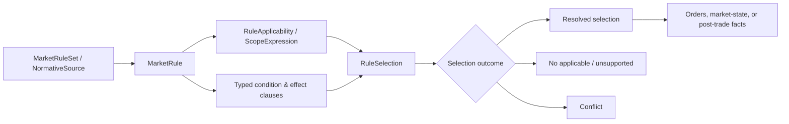

# RFC-002: `fin-market-rules` Architecture — Revise-in-Place vs. Profile Split

**Status**: Proposed (open for SME discussion)
**Date**: 2026-08-04
**Scope**: `ontology/domain/finance/market-rules` module structure and v1.0.0 → next-version evolution
**Related**: [M2-REVIEW-ROUND-13](../decisions/M2-REVIEW-ROUND-13.md), [ADR-023](../decisions/ADR-023-market-rules-architecture.md) (Proposed), [RFC-001](RFC-001-m2-conformance-profile-and-domain-contract.md), [M2-PLAN §5.2/§5.3](M2-PLAN.md)

## Purpose

Decide the **structural** response to the Round-13 architecture review of `fin-market-rules` v1.0.0. The review confirmed six P0 gaps and six P1 corrections (verified against `module.yaml` and `M2-PLAN`); it did **not** modify any file or run any validator. This RFC is the decision input for [ADR-023](../decisions/ADR-023-market-rules-architecture.md). Per the Moonweave baseline, no `module.yaml` edit proceeds until ADR-023 is Accepted, and the split option requires SME joint review.

This RFC is **not** a re-litigation of Round-12 v1.0.0 acceptance. Round-12 stands for the [RFC-001](RFC-001-m2-conformance-profile-and-domain-contract.md) acceptance contract. This RFC addresses the stronger claim of a *general, executable* Market Rules ontology.

## Background

### Confirmed P0 gaps (verified)

1. **Price limits uncomputable.** `PriceLimitClause` has percentage/amount only; the "reference-price method" is named in a definition but not modeled.
2. **Circuit breaker is values only.** No monitor, direction, window, tiering, resume, or cross-venue propagation.
3. **Static applicability decoupled from dynamic selection.** Only the no-winner (`RuleConflict`) path is modeled; no `ResolvedSelection` / `NoApplicableRule`.
4. **Precedence and clause ownership under-granular.** `RulePrecedence` binds rules, not applicability; `ruleHasClause` does not constrain a clause to exactly one owner.
5. **Generalized Quantity/Range breaks typing.** `RuleClause` forces sequence + endpoint-inclusivity on all subtypes; tick/lot/duration/business-day/percentage all use generic `QuantityValue`.
6. **Calendar/session/cutoff replaced by hash.** Corporate-action stores three contract digests while `TradingCalendar`/`TradingSessionTemplate`/`TradingSessionOccurrence` already exist and are importable from `market-structure`.

### Design-intent drift (confirmed)

[M2-PLAN §5.3](M2-PLAN.md) lists `InstrumentClass` and `InvestorCategory` as `RuleApplicability` scopes; the module's `RuleApplicabilityRequiresExplicitScope` constraint *explicitly rejects* both. The module has instead expanded corporate-action schedule semantics. Plan vs. module diverge.

### What must be retained (non-negotiable)

- `RuleApplicability` non-empty-scope, no-implicit-global.
- `RulePrecedence` / `RuleConflict` separation, no silent winner.
- `SettlementCycleClause` / `ResaleRestrictionClause` separation.
- Three-axis PIT, versioning, provenance.
- Corporate-action ordinary-record vs. due-bill distinction.

## Option A — Revise in place (v1.1.0)

Add the missing semantics to the single `market-rules` module as an additive revision.

### What changes

- Add `RuleSelectionOutcome` hierarchy (`ResolvedSelection`, `NoApplicableRule`, `Conflict`, `Unsupported`, `Indeterminate`) and wire `RuleEvaluationRequest` → outcome.
- Refactor `RuleClause` into `RangeClause` / `TriggerClause` / `DateClause` / `EntitlementClause` / effect-clause families; localize gap policy to segmented rules.
- Add `ReferencePriceSpecification` and restructure `PriceLimitClause` around source/window/missing-policy/side/bounds/rounding.
- Rebuild `CircuitBreakerClause` with monitor/reference/direction/window/tiering/resume/propagation.
- Add logical identity + unique-owner relations for RuleSet/Rule/Clause/Parameter/Method.
- Introduce dimension-constrained value objects (`PriceIncrement`, `OrderQuantityIncrement`, `Percentage`, `Duration`, `BusinessDayOffset`).
- Add `ScopeExpression`/`ScopeTerm` with conjunction/disjunction/exception; add `scopeTradingSession`/`scopeTradingPhase`/`scopeInstrumentClassification`/`scopeInvestorCategory`/`scopeOrderType`/`scopeOrderSide`/`scopeMarketModel`.
- Replace corporate-action hash-only calendar/cutoff with references to existing `TradingCalendar`/`TradingSessionTemplate`/`TradingSessionOccurrence`; keep digests as audit evidence.
- Add `RulePublication`/`NormativeSource`, `precedenceBasis` code list; keep digests as frozen audit evidence alongside structured `RuleExpression`.
- Broaden `RuleType` (or honestly narrow the module label).
- Fix `rightsIssue` naming or add `rightsTransferabilityProfile`.
- Tighten or remove generic `RuleParameter`.

### Compatibility

- **Version**: 1.1.0 (additive within major; a reviewer may argue 2.0.0 because `RuleClause` reshape and `RuleParameter` removal are source-incompatible for fixtures — this is a sub-decision for ADR-023).
- Existing IRIs retained where possible; deprecated markers on replaced shapes.
- Downstream `orders-execution` / `post-trade-operations` references reviewed for IRI stability.

### Pros

- Single module; simpler import DAG; no new registry entries.
- Lowest migration cost; reuses existing CQs, fixtures, alignments, traceability.
- Directly satisfies the M2-PLAN "rules are not regional sub-ontologies" principle ([M2-PLAN §5.3](M2-PLAN.md)).

### Cons

- Corporate-action semantics continue to occupy a large share of one module; the "drowning the core" risk remains.
- `RuleClause` reshape may force fixture/probe rewrites → potential 2.0.0.
- Single module must host both microstructure rule families and CA schedule semantics; cognitive load.

## Option B — Split into profiles (v2.0.0)

Split `market-rules` into a profile family under a shared core.

### Proposed profiles

```
market-rules-core            RuleSet, NormativeSource, Rule, Applicability, Precedence, Selection
venue-trading-rules          tick, lot, price band, volatility control, session/auction, order restriction
post-trade-rules             settlement cycle, resale restriction
corporate-action-schedule-rules  dates, entitlement, due-bill, assessment method
market-rule-evaluation       request, candidate, outcome, conflict
```

Target boundary (from the review):



Non-goal: move `Execution`, `CorporateActionEvent`, `SettlementInstruction`, or market-state facts into this family. They remain downstream-owned.

### Compatibility

- **Version**: 2.0.0 (major) — new module IRIs, registry entries, import-DAG update for `orders-execution`/`post-trade-operations`.
- A migration/deprecation map from v1.0.0 IRIs to profile IRIs is required.
- CQs, fixtures, alignments, traceability matrices split per profile.

### Pros

- Clean separation of microstructure rules from CA schedule semantics.
- Each profile can version independently; clearer ownership and SME review surface.
- Aligns with the review's recommended boundary and the "layer venue-trading vs. corporate-action profiles" P1 correction.

### Cons

- Highest migration cost: new registry entries, import-DAG revision, fixture/probe/alignment rework.
- Risk of premature split — the review recommends P0 revision *before* deciding split.
- Coordination overhead across five profiles for cross-cutting changes (e.g., `RuleSelectionOutcome` touches core + evaluation).

## Option C — Revise in place now, defer split decision (recommended path)

Execute Option A's P0 revisions as v1.1.0 (or 2.0.0 if `RuleClause` reshape is breaking) **without** splitting the module. After P0 is closed and regression passes, re-evaluate the split with SME input and decide via a follow-up ADR.

### Rationale

- The review's own convergence order ends with "only then decide on module split — via ADR/RFC with SME joint review." Splitting before P0 closure would distribute the rebuild across profiles and raise coordination risk.
- P0 gaps (outcome hierarchy, clause refactor, identity/ownership, reference-price/circuit-breaker rebuild, calendar link) are prerequisite regardless of single-vs-split structure; doing them once in place is cheaper than doing them across five nascent profiles.
- SME joint review (market-microstructure + corporate-action/settlement) is required for the split decision and for confirming the external regulatory citations; it is not required to begin P0 additive revision.

### Trade-off

- Accepts temporary single-module cognitive load and the "core vs. CA" tension for one revision cycle.
- Defers the structural purity of Option B to a measured follow-up.

## Open questions for SME review

1. **Reference price specification.** What are the minimum modeled fields for `ReferencePriceSpecification` to cover SSE-style "previous close × (1 ± ratio) + tick rounding" and first-listing-day exemptions? *(SME: market microstructure)*
2. **Circuit breaker shape.** Does the module model ESMA Article 48 collars + halts uniformly, or separate them? How many tiers for NYSE-style 7/13/20% MWCB, and what resume-auction semantics? *(SME: market microstructure)*
3. **Scope dimensions.** Should `scopeTradingSession`/`scopeTradingPhase` reference `market-structure` `TradingSessionTemplate`/`TradingSessionOccurrence` directly, and where does session *status* live (hypothesis: `orders-execution`, not here)? *(SME: market microstructure + orders)*
4. **Transferable rights.** Confirm whether `rightsIssue` must support transferable rights subscription (FINRA Rule 11140) or remain non-transferable direct subscription with an explicit profile boundary. *(SME: corporate action)*
5. **Due-bill boundary.** Confirm the ordinary-record vs. due-bill split and `dueBillSettlementQualification` evidence modes against FINRA Rule 11630. *(SME: corporate action + settlement)*
6. **Settlement-cycle applicability.** Confirm that SEC T+1 scope, exemptions, and party-agreed extensions require more than a single T+N offset. *(SME: settlement)*
7. **Tick regime inputs.** Confirm whether EU RTS 11 (price band + liquidity band) and SEC Rule 612 (evaluation-period spread) require modeled inputs beyond an "anonymous Quantity range." *(SME: market microstructure)*

External citations referenced by the review (to be confirmed by SME, **not** asserted as provenance): SSE Trading Rules, ESMA Article 48, NYSE MWCB FAQ, FINRA Rule 11630, FINRA Rule 11140, SEC Regulation SHO Rule 201, SEC T+1 FAQ, ISO 15022 date fields, EU RTS 11, SEC Rule 612.

## Versioning sub-decision (for ADR-023)

- Is the `RuleClause` reshape (sequence + endpoint-inclusivity no longer universal) **source-compatible** with existing fixtures/probes? If no → **2.0.0**. If yes (additive subtypes, old `RuleClause` retained as deprecated) → **1.1.0**.
- `RuleParameter` removal vs. tightening: removal is breaking → contributes to 2.0.0; tightening (add `ParameterRole`, constraints) is additive → 1.1.0.
- Any new object IRI is additive; broadening `RuleApplicability` scope set is additive; broadening `quotationContract`-style ranges is additive (precedent: ADR-022 D2).

## Recommendation

**Option C** — revise in place now (v1.1.0 or 2.0.0 per the versioning sub-decision), defer the split to a follow-up ADR after P0 closure and SME joint review. This matches the review's own convergence order and the Moonweave baseline (major changes via ADR/RFC, decisions written back to authoritative sources, no implementation before ADR acceptance).

## References

- [M2-REVIEW-ROUND-13](../decisions/M2-REVIEW-ROUND-13.md)
- [ADR-023](../decisions/ADR-023-market-rules-architecture.md) (Proposed)
- [RFC-001](RFC-001-m2-conformance-profile-and-domain-contract.md)
- [M2-PLAN §5.2/§5.3](M2-PLAN.md)
- [market-rules-semantic-gap.md](../decisions/gap/market-rules-semantic-gap.md)
