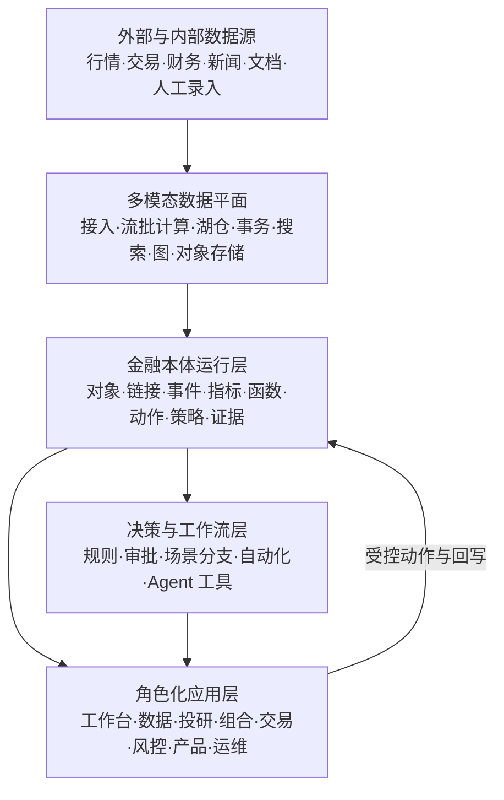

# 执行摘要

## 最终判断

附件所列内容不是一组天然独立的“网页”，而是同一金融组织运行模型在不同岗位上的投影：实时资讯、行情、因子、组合、订单、算法执行、风险、主动投研、产品报表和 AI 分析，实际上共享证券、账户、组合、策略、事件、证据、指标、动作和权限。若仍按菜单逐页开发，会继续产生重复数据字典、重复指标、跨系统口径冲突、弱权限继承和不可追踪的操作链。

本方案把平台重构为一个由本体驱动的金融运营系统：

1. **数据层**负责接入、校验、版本化和计算结构化、时序、逐笔、文档与多媒体数据。
2. **本体层**把数据映射为对象、链接、事件和统一指标，并同时定义可执行动作、业务函数、权限和证据。
3. **工作流层**把研究、复核、审批、下单、风控处置、发布和复盘变成可追踪的状态机。
4. **应用层**不再拥有孤立数据模型，而是通过类型安全的对象 API 和动作 API 组合出工作台、投研、交易、风控与产品应用。
5. **AI 层**只通过受限的检索、函数和动作工具访问本体；默认生成带证据的建议或变更提案，高风险动作必须由人审批。

Palantir 官方将决策拆成 data、logic、actions，并把 security 贯穿其中；其 Ontology 由 Language、Engine、Toolchain 共同组成，而不是单纯语义标签或知识图谱。这一思想是本方案的主要方法来源，但具体技术采用可自主部署的开放组件。[Palantir 平台概览](https://www.palantir.com/docs/foundry/platform-overview/overview)；[Foundry 平台摘要](https://www.palantir.com/docs/foundry/getting-started/foundry-platform-summary-llm)

## 推荐目标架构

平台部署上采用“**关键交易路径隔离 + 其余平台共享能力**”：

- OMS/RMS、行情网关和交易网关使用独立资源池、网络域、发布窗口和灾备策略。
- 数据湖仓、研究计算、报表与 AI 使用弹性计算资源，不能反向拖慢交易关键路径。
- 本体服务提供一致的语义和动作契约，但不把所有负载强行塞入同一种数据库。
- 第一阶段采用“模块化核心服务 + 少量必要的独立高负载服务”，避免一开始把每个菜单拆成微服务。

## 技术选型结论

| 层面 | 推荐主方案 | 关键理由 |
| --- | --- | --- |
| Web 前端 | TypeScript、React、Vite、TanStack Query/Router、Ant Design 定制设计系统 | 适合高密度企业应用；现有 Umi/Ant Design 痕迹可渐进迁移 |
| 表格与可视化 | AG Grid 或 TanStack Table、Apache ECharts、Lightweight Charts/合规授权 K 线组件、Cytoscape.js、React Flow、MapLibre | 覆盖海量表格、行情、图谱、工作流与地图；按授权和性能选择 |
| 核心后端 | Java LTS + Spring Boot；Python 服务用于研究/AI；Rust 或 C++ 仅用于确有必要的低时延网关 | 兼顾一致性、生态、研究效率和关键路径性能，限制语言扩散 |
| 接口与通信 | 外部 REST/OpenAPI；对象聚合 GraphQL；内部 gRPC/Protobuf；Kafka 事件；WebSocket/SSE 推送 | 命令、查询、流式更新和异步事件各用合适协议 |
| 工作流 | Temporal 处理长事务/审批；Airflow + dbt 处理数据资产；Flink 处理事件时间流 | 不让单一调度器同时承担业务流程、批处理和实时流 |
| 事务存储 | PostgreSQL 高可用集群、Outbox/Inbox、必要时按域分库 | 强一致、成熟、可审计；避免早期分布式事务数据库复杂度 |
| 湖仓 | S3 兼容对象存储 + Apache Iceberg + Trino；Spark/Flink 计算 | 支持批流统一、时间旅行、开放格式和多引擎 |
| 实时分析 | ClickHouse | 适合逐笔、K 线、执行质量、因子和监控的高吞吐分析 |
| 搜索与向量 | OpenSearch 做全文/混合检索；pgvector 作为中小规模向量起点；规模触发后再引入 Milvus | 减少早期存储种类，保留大规模扩展路径 |
| 图能力 | 本体元数据存 PostgreSQL；关系查询按规模选择 Neo4j Enterprise、NebulaGraph 或关系投影 | 明确“本体运行层”和“图数据库产品”的边界 |
| 缓存 | Valkey | 开放、成熟；只缓存可重建状态，不作为订单真源 |
| 身份与策略 | 对接企业 IdP；OpenFGA/SpiceDB 表达关系权限；OPA 表达上下文策略；服务与数据层双重执行 | 支持 RBAC、ABAC、ReBAC 与对象/属性级控制 |
| 可观测性 | OpenTelemetry、Prometheus/VictoriaMetrics、Grafana、Loki/Tempo 或等价后端 | 统一指标、日志、链路和业务审计关联 |
| DevSecOps | Kubernetes、Argo CD、GitLab CI/GitHub Actions、Helm、OpenTofu、Vault/KMS、Sigstore、Trivy、SBOM | 支持私有化、可复现发布、供应链与密钥治理 |

完整比较、替代方案和淘汰条件见[技术选型摘要](../02-technology/00-selection-summary.md)及其分册。

## 模块重构结论

附件中的页面被归并为八个稳定能力域，而不是照抄原菜单：

1. **统一工作台与协同：** 任务、告警、分享方案、黑灰名单、策略监控、市场总览、保存视图。
2. **数据与资讯：** 实时新闻、互动问答、投资日历、行情/Level-2、期指基差、数据目录、主数据。
3. **量化研究：** 因子注册、点时正确的单因子测试、相关性、组合研究、逐笔复盘、可复现研究环境。
4. **主动研究：** 分析师覆盖、行业与一致预期、财报披露、估值、重点股票、项目、主题、股票池与模拟盘。
5. **组合与交易执行：** 产品、账户、资产单元、策略、目标、OMS/IMS、母子单、成交、算法监控和交易后分析。
6. **风险与合规：** 股票/期货规则、实时监控、风险标的、快速风控、事后风险、例外审批和审计。
7. **产品与经营分析：** 市场观察、规模、渠道、竞品与经营报表。
8. **本体、自动化与平台运维：** Ontology Studio、Object Explorer、动作/函数、流水线、质量、血缘、模型、Agent、权限和系统健康。

“数据集市”和“数据字典”合并为同一数据目录的不同视图；“行业周期研究（已停用）”作为退役资产保留血缘和历史结果，不直接迁移为新模块。

## 本体与算法结论

金融本体分为 12 个逻辑域：组织与权限、参与方、金融工具与市场、产品与账户、组合与持仓、研究与因子、订单与执行、风险与合规、公司与事件、资讯与证据、产品经营、平台治理。跨域依赖只通过明确的对象标识、链接、事件、函数和动作发生。

每个核心对象同时具备：

- 全局稳定标识与外部标识映射；
- 业务有效时间和系统记录时间；
- 来源、证据、质量和置信信息；
- 版本、状态和生命周期；
- 对象级、属性级与动作级权限；
- 可追踪的派生逻辑和影响范围。

算法不是散落在页面中的 SQL 或脚本，而是注册为带输入/输出类型、数据时间口径、版本、质量门、权限、运行证据和负责人信息的 `FunctionType` 或 `ModelType`。订单、风控处置、研究发布和报表发布则注册为带前置条件、审批、幂等、补偿与审计要求的 `ActionType`。

## 首要风险与立即行动

1. **先轮换附件中暴露的凭据。** 同时扫描代码仓库、配置历史、日志和备份，禁止继续用明文 TOML/CSV 管理秘密。
2. **冻结新的页面级数据库和重复指标。** 新需求必须先登记对象、指标、动作和数据契约。
3. **建立 Canonical ID 与 point-in-time 数据规范。** 没有这两项，因子回测、风险复盘和跨系统归因都不可信。
4. **把实盘交易路径与研究/报表计算隔离。** 平台统一不等于资源混部。
5. **从一个纵向切片验证架构。** 推荐先做“风险标的发现 → 证据查看 → 审批 → 限制动作 → OMS/RMS 生效 → 审计复盘”，它能同时验证数据、本体、动作、权限、工作流和 UI。

## 建议交付节奏

- 0–6 周：安全止血、需求与口径基线、平台骨架、Ontology v0、交易关键路径边界。
- 7–16 周：数据底座、主数据、数据目录、对象查询、统一工作台和纵向样板。
- 17–30 周：量化研究、OMS/IMS/RMS 集成、动作工作流、审计与灾备。
- 31–44 周：主动投研、产品报表、图谱/混合检索、Agent 提案与评测。
- 45 周以后：容量优化、场景分支、应用组装、更多资产类别和外部生态。

每一阶段以可验证的业务闭环为单位，不以“完成若干中台组件”为完成标准。
