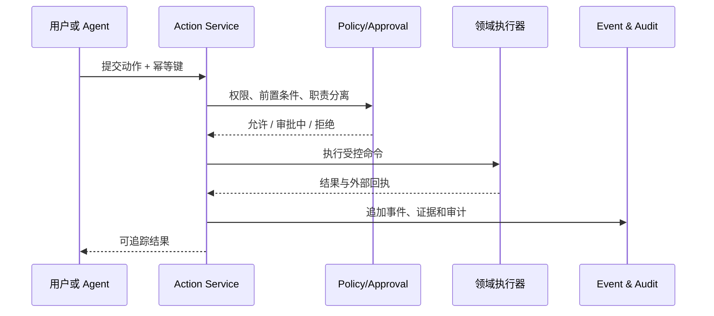

# 核心设计原则与关键决策

## 1. 用决策闭环组织平台

每个业务能力都必须能回答：

1. 基于什么事实与证据？
2. 使用什么规则、模型或人工判断？
3. 做出什么动作或提案？
4. 谁被允许执行？
5. 执行后如何观察结果并反馈？

这与 Palantir 官方描述的 data—logic—actions 结构一致；本方案进一步把 security、evidence、time 和 outcome 作为每个闭环的强制维度。

## 2. 本体是运行时契约，不是名词表

仅有对象类和关系并不能形成平台。本体必须同时包含：

- 语义：对象、属性、链接、接口和值类型；
- 运动性：动作、函数、规则、自动化和状态迁移；
- 可信性：来源、证据、血缘、质量和双时间；
- 安全性：角色、关系、属性、环境与动作策略；
- 工程性：API 名、版本、所有者、状态、兼容性和生成 SDK；
- 体验性：默认对象视图、可用动作、指标、相关对象与深链。

## 3. 一个事实可以有多个来源，但不能有多个隐式真相

来源冲突必须显式表示。对证券名称、持仓、净值、评级、行业分类、新闻事实等分别定义：

- 权威来源和候选来源；
- 业务有效时间；
- 记录时间；
- 冲突规则与人工裁决；
- 原始值和规范化值；
- 质量状态与影响范围。

应用读取的是有来源声明的“已解析视图”，而不是任意表中最后写入的值。

## 4. 高风险动作必须经过统一动作层

禁止页面直接写数据库或绕过风控调用网关。所有改变业务状态的操作都经 `Action Service`：

动作定义必须包含参数、前置条件、权限、审批、同步/异步语义、幂等、超时、重试、补偿、外部副作用和审计字段。

## 5. 查询与命令分离，事务与分析分离

- 查询可使用物化视图、搜索索引、ClickHouse 或图投影；
- 命令只进入拥有业务不变量的领域服务；
- 交易事务与风控状态不依赖分析库可用；
- 分析结果通过版本化指标或模型输出回到本体；
- 页面不得依据多个后端响应自行重建关键业务口径。

## 6. 模块化优先，按证据拆服务

初期把低耦合能力组织为模块化核心服务，只有满足下列条件之一才独立部署：

- 延迟、吞吐或资源模型显著不同；
- 安全域或合规边界不同；
- 发布频率与故障隔离要求不同；
- 有清晰数据所有权和稳定契约；
- 需要独立水平扩展。

因此交易网关、行情接入、流处理、搜索、模型推理和媒体处理可较早独立；每张报表或每个菜单不独立成服务。

## 7. Point-in-time correctness 是金融分析底线

因子、回测、风险和复盘必须按“当时可知信息”计算。数据资产要记录发布时间、首次可用时间、修订时间和业务有效期；所有 as-of join、行业成分、复权因子、停牌/退市、财报修订和样本空间都按点时规则处理。

## 8. 关键路径确定性，AI 负责增强

以下能力必须以确定性逻辑为主：

- 订单状态机；
- 资金、持仓和卖空可用量检查；
- 涨跌停、交易时段、账户限额和合规硬规则；
- 净值、成交、费用与对账；
- 权限和审批门禁。

AI 适合用于文档抽取、实体对齐建议、研究摘要、异常解释、检索、代码辅助和动作提案。AI 输出需保留模型、提示、上下文、来源、评测版本和人工反馈。

## 9. 分支用于安全开发和场景，不用于隐藏生产差异

参考 Palantir Global Branching 和 Scenario 思路，平台支持两类隔离：

- **工程分支：** 同时修改数据管线、本体、函数、应用和策略，进行影响分析、评审和合并。
- **业务场景：** 在主线快照上模拟目标持仓、风险规则、价格冲击或动作，结果不直接写回生产。

两者必须有清楚的基线、差异、过期时间和合并/发布规则。

## 10. 证据、血缘和权限随对象传播

任何派生指标都能追踪到算法版本和输入快照；任何搜索、图遍历和 Agent 检索都必须先做权限裁剪；任何导出都继承最严格的数据标记、用途限制和水印策略。

## 11. 开放契约降低锁定

- 对外接口使用 OpenAPI、AsyncAPI、Protobuf、SQL 和开放表格式；
- 本体定义可导出为 YAML/JSON Schema，并映射 OWL/SHACL 进行交换或验证；
- 业务标识不使用某个数据库的内部 ID；
- 通过适配器封装行情、柜台、对象存储、图、向量和模型供应商；
- 商业组件必须有数据导出、替代路径和退出计划。

## 12. 安全默认与运维可证明

- 所有秘密进入 Vault/KMS 或等价密钥系统；
- 默认拒绝、最小权限、短期凭证和工作负载身份；
- 生产变更、策略修改和高风险动作可审计；
- 构建产物有 SBOM、签名和可追溯来源；
- SLO、容量、恢复演练和数据对账有可查询证据。

