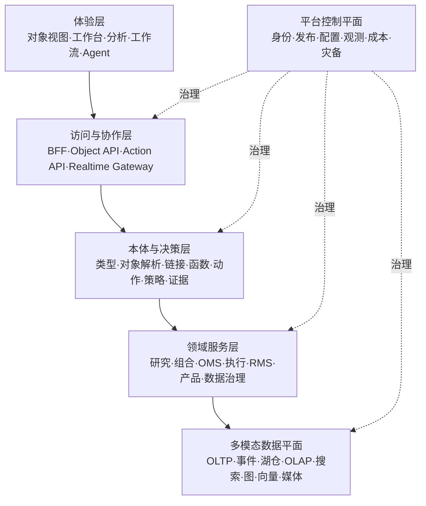
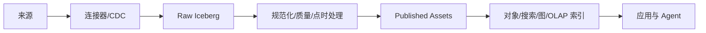

# 目标总体架构

## 1. 架构总览

平台采用六层架构，并把交易关键路径作为独立故障域：

### 1.1 体验层

提供统一应用外壳、对象浏览、角色工作台、查询分析、研究笔记、审批任务、告警、场景模拟和 AI 助手。所有页面复用对象视图、指标、过滤器、动作表单和权限反馈。

### 1.2 访问与协作层

- API Gateway：认证、流量控制、WAF、租户/组织上下文和协议治理；
- Web BFF：聚合对象视图、保存视图、布局与用户偏好；
- Object API：统一对象、链接、聚合、时间序列、搜索和批量解析；
- Action API：提交、验证、审批、执行、撤销/补偿和查询动作；
- Realtime Gateway：WebSocket/SSE 推送行情、订单、告警和任务状态；
- Export Service：带权限、标记、水印和审计的导出。

### 1.3 本体与决策层

- Type Registry：对象、接口、属性、值类型、链接、事件、指标、函数、动作和策略；
- Identity Resolution：外部标识映射、实体合并、拆分和冲突处理；
- Object Resolver：把分布式数据源解析为受权限控制的对象视图；
- Relationship Engine：链接解析、关系投影和路径查询；
- Function/Metric Registry：带版本、点时口径和血缘的确定性逻辑及模型；
- Action Service：高风险变更的唯一入口；
- Policy Decision：RBAC/ABAC/ReBAC、用途、属性与动态上下文；
- Evidence & Provenance：来源、引用、质量、运行证据和影响分析；
- Branch/Scenario：工程分支与业务模拟沙箱。

### 1.4 领域服务层

领域服务拥有业务不变量和写模型，包括证券主数据、行情、资讯、研究、因子、组合、订单、执行、风险、借券、产品、渠道、报告和平台治理。它们不以页面为边界。

### 1.5 多模态数据平面

按负载选择存储：

- PostgreSQL：强一致事务、元数据、配置、审批、动作与本体定义；
- Kafka：不可变领域事件、变更数据捕获和流式解耦；
- S3/Iceberg：原始、规范化和特征/结果数据的开放湖仓；
- ClickHouse：逐笔、K 线、执行、风险和报表的实时分析；
- OpenSearch：全文、过滤、聚合和权限感知混合检索；
- 图投影：复杂关系遍历、影响传播和 GraphRAG；
- 向量索引：语义检索；首期尽量复用 pgvector/OpenSearch；
- 对象存储：图片、视频、音频、PDF、报告原件和模型制品；
- Valkey：短期缓存、分布式限流和可重建会话状态。

### 1.6 平台控制平面

统一身份、密钥、配置、服务目录、部署、策略即代码、可观测性、质量、血缘、成本、容量、备份、灾备、支持与审计。

## 2. 数据面与控制面

### 2.1 数据面

负责处理实际业务负载：

- 行情、新闻、财务、交易、持仓、文档和多媒体接入；
- 流批转换、质量检查和数据资产发布；
- 对象查询、指标计算、检索和模型推理；
- 订单、风控和外部系统回写。

### 2.2 控制面

负责定义“数据面可以做什么”：

- 连接器、Schema、数据契约和质量门；
- 本体类型、函数、动作、策略和版本；
- 用户、服务身份、组织、权限与用途；
- 环境、发布、分支、审批和回滚；
- SLO、成本配额、审计和保留策略。

控制面故障不能破坏已运行交易路径；数据面不能绕过控制面已下发的策略。

## 3. 主读写路径

### 3.1 数据发布路径

每一跳记录数据契约、版本、作业、质量结果、来源时间和责任人。失败数据进入隔离区，不静默进入生产对象。

### 3.2 业务动作路径

1. 用户或 Agent 从对象视图发起类型化动作。
2. Action Service 校验参数、对象版本、业务前置条件和幂等键。
3. Policy Service 做主体—对象—动作—环境授权。
4. 需要时创建审批任务，执行职责分离和双人复核。
5. 领域执行器提交事务；外部副作用通过可靠消息/适配器完成。
6. 记录业务事件、外部回执、变更前后值和审计证据。
7. 物化视图和对象索引异步更新，前端展示可解释的处理中状态。

### 3.3 研究发布路径

研究代码、输入快照、环境、参数、结果和评审形成 `ResearchRun`。只有通过点时正确性、数据质量、复现、稳定性和权限检查的结果才能被提升为 `PublishedFactor`、`ModelRelease` 或 `ResearchSignal`。

### 3.4 AI 提案路径

Agent 检索先执行 ACL 裁剪，再调用只读函数或生成 `ActionProposal`。提案包含证据引用、假设、不确定性和影响预览。生产动作仍进入同一 Action Service，不存在“Agent 专用后门”。

## 4. 一致性模型

| 数据/操作 | 一致性要求 | 设计 |
| --- | --- | --- |
| 订单、成交回执、风控硬限制 | 强一致或明确单写状态机 | 领域事务 + 版本号 + 幂等 + 追加事件 |
| 资金、持仓可用量 | 交易路径内单调、可核对 | 权威快照 + 增量事件 + 周期全量核对 |
| 本体类型与策略发布 | 强一致、版本化 | 审批发布；消费者按版本绑定 |
| 对象搜索、图与分析视图 | 有界最终一致 | 事件驱动物化；展示数据时间与索引时间 |
| 新闻、报告、媒体抽取 | 最终一致、证据优先 | 原件不可变；抽取结果版本化 |
| 因子、回测和报表 | 快照一致、可复现 | Iceberg 快照 + 运行清单 + 点时查询 |
| UI 偏好和保存视图 | 最终一致 | BFF/用户配置服务 |

## 5. 关键隔离边界

- 生产、仿真、回测和场景分支使用不同凭证、Topic、Schema、数据库或明确命名空间；
- 交易关键集群不运行临时 Notebook、模型训练和大查询；
- 新闻/文档解析属于非可信输入区，经过恶意文件检测和内容隔离；
- 外部算法商和柜台适配器运行在受限网络区；
- 导出、下载和外发使用单独审计与 DLP 策略；
- 管理平面凭证与业务运行凭证分离。

## 6. 与 Palantir 思路的对应关系

| 本方案 | Palantir 参考概念 | 自主实现边界 |
| --- | --- | --- |
| 多模态数据平面 | Data Connection、Datasets、Pipeline Builder、MMDP | Kafka/Iceberg/Trino/Flink/Airflow 等开放组件 |
| 金融本体运行层 | Ontology Language/Engine/Toolchain | 自研 Type Registry、Object Resolver、SDK 生成 |
| 对象视图与浏览 | Object Views、Object Explorer、Quiver | React 对象组件与分析工作台 |
| 动作与函数 | Action Types、Functions、Ontology Edits | Action Service、函数注册与领域执行器 |
| 自动化 | Automate、AIP Logic | Temporal、事件触发、规则和受控 AI 工具 |
| 分支与场景 | Global Branching、Scenario | GitOps + 元数据分支 + 数据快照/覆盖层 |
| 权限 | Ontology roles、object/property policies | IdP + OpenFGA/SpiceDB + OPA + 数据层执行 |
| OSDK | Ontology SDK | 基于本体生成 TS/Java/Python/OpenAPI 客户端 |

对应关系用于确保结构完整，不意味着功能或实现细节与 Palantir 等价。
