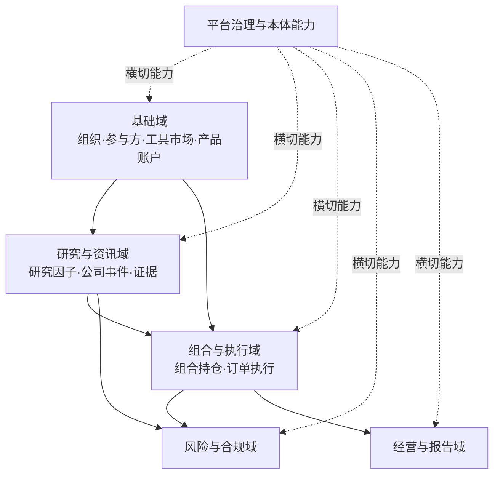

# 领域边界与依赖

## 1. 领域划分规则

领域边界按业务不变量、真源、动作责任和故障隔离划分，而不是按现有菜单或团队名称划分。每个领域：

- 拥有自己的写模型和状态机；
- 通过版本化 API 或事件发布事实；
- 不直接修改其他领域数据库；
- 通过本体链接形成跨域对象视图；
- 明确负责人、数据 Steward 和 SLO。

## 2. 十二个业务逻辑域

| 领域 | 核心职责 | 典型对象 | 拥有的关键动作 |
| --- | --- | --- | --- |
| 组织与访问 | 人员、组织、岗位、环境、用途和授权关系 | Person、Team、Role、Purpose、Environment | GrantAccess、RevokeAccess、ApproveAccess |
| 参与方 | 公司、发行人、券商、托管、算法商、分析师 | LegalEntity、Issuer、Broker、Vendor、Analyst | MergeParty、VerifyParty |
| 工具与市场 | 证券、合约、交易所、日历、分类、公司行动 | Instrument、Contract、Venue、TradingSession、CorporateAction | CorrectInstrument、ApplyCorporateAction |
| 产品与账户 | 产品、资金账户、资产单元、柜台和网关配置 | FundProduct、CashAccount、AssetUnit、Gateway | OpenAccountMapping、DisableGateway |
| 组合与持仓 | 组合、基准、目标、持仓、现金、敞口与净值 | Portfolio、Benchmark、TargetPosition、Position、NAV | SetTarget、RebalanceProposal、ReconcilePosition |
| 研究与因子 | 研究项目、样本、因子、模型、回测和信号 | ResearchProject、Universe、Factor、BacktestRun、Signal | RunBacktest、PublishFactor、RetireFactor |
| 订单与执行 | 指令、母单、子单、委托、成交、算法与 TCA | Instruction、ParentOrder、ChildOrder、Execution、AlgoConfig | SubmitOrder、CancelOrder、ResumeUnit |
| 风险与合规 | 规则、限额、风险标的、告警、例外和处置 | RiskRule、Limit、WatchlistEntry、Alert、Exception | BlockInstrument、ApproveOverride、ResolveAlert |
| 公司与事件 | 财报、公告、经营、宏观、行业与日历事件 | FinancialReport、Disclosure、MarketEvent、CalendarEvent | VerifyEvent、LinkEvidence |
| 资讯与证据 | 新闻、问答、文档、媒体、来源、声明和引用 | NewsItem、Document、MediaItem、Claim、Evidence | IngestDocument、ApproveExtraction |
| 产品经营 | 渠道、规模、竞品、报表与发布 | DistributionChannel、ProductMetric、Competitor、Report | PublishReport、CorrectMetric |
| 平台治理 | 数据资产、本体资源、函数、模型、质量、运行和变更 | DataAsset、OntologyResource、FunctionVersion、QualityCheck、Run | PromoteRelease、DeprecateAsset、Rollback |

## 3. 平台能力域

平台能力不是业务真源，但向所有领域提供一致机制：

- Identity & Access；
- Connector Registry 与 Schema Registry；
- Data Catalog、Lineage 与 Quality；
- Ontology Runtime 与 SDK Generation；
- Action、Policy、Approval 与 Automation；
- Search、Graph、Vector 与 Media；
- Model/Prompt Registry 与 Evaluation；
- Notification、Task、Comment 与 Collaboration；
- Observability、Audit、Configuration 与 Release。

## 4. 依赖方向

风险域可以阻止或限制执行域动作，但不直接改写订单数据；它返回判定、限制和证据。研究信号不能直接生成实盘订单，必须经组合目标、合规和执行动作链。

## 5. 聚合与事务边界

### 5.1 Order 聚合

`ParentOrder` 是母单状态机根，控制数量守恒、状态迁移和算法参数；`ChildOrder` 与外部委托回执通过事件关联。单一数据库事务只覆盖内部状态和 Outbox，不把外部柜台调用包进分布式事务。

### 5.2 Portfolio 聚合

组合目标、约束和再平衡提案形成独立版本。持仓是来源事件与核对结果形成的已解析视图，不允许手工静默覆盖；手工调整必须形成 Adjustment Action 和证据。

### 5.3 Risk 聚合

规则版本、适用范围、阈值、严重度和处置动作不可拆分发布。风险判定引用输入快照和规则版本。例外必须有有效期、审批人与用途。

### 5.4 Research 聚合

`ResearchRun` 固化代码版本、环境、输入快照、参数、种子、结果和评测。`FactorDefinition` 与 `FactorVersion` 分离，以便版本不可变、定义可演化。

## 6. 跨域集成模式

- 同步查询：只用于用户交互所需的当前信息；
- 同步命令：只调用目标领域的公开命令，不跨库写；
- 领域事件：发布已发生事实，消费者自行物化；
- 数据资产：大规模历史与分析数据通过 Iceberg 版本发布；
- 本体链接：提供统一导航和跨域解析，不替代领域事务；
- Saga/工作流：跨域长事务由 Temporal 管理补偿和人工任务；
- CDC：仅用于遗留系统接入，不作为新系统的主要业务 API。

## 7. 防腐层

所有外部或遗留系统经适配器进入：

- 柜台/OMS/算法商：统一 Order/Execution 规范；
- 行情供应商：统一 Instrument、Quote、Trade、OrderBook 事件；
- Wind/财务/资讯供应商：统一 CompanyEvent、MetricObservation、Document；
- 云对象存储：统一 S3 语义；
- 图与向量产品：只暴露平台的 GraphQuery/Retrieval 接口；
- LLM 供应商：统一模型能力、数据边界、审计和成本接口。

防腐层保留原始消息、供应商序号、时间戳和错误码，便于核对和替换。

