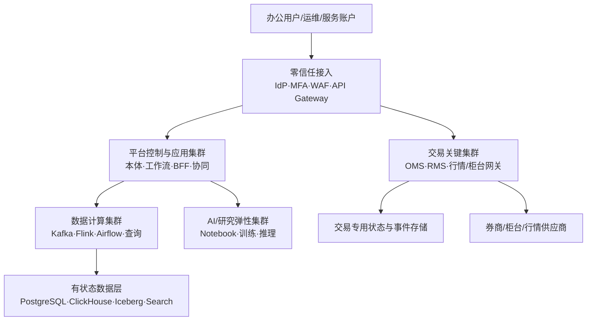

# 部署拓扑、环境与灾备

## 1. 推荐拓扑

至少跨两个故障域部署；生产规模允许时使用三可用区。交易关键集群与研究/AI 集群使用不同节点池、网络策略、优先级和发布窗口。

## 2. 环境模型

| 环境 | 数据 | 外部连接 | 允许动作 |
| --- | --- | --- | --- |
| Local/Dev | 合成或小样本脱敏 | Mock | 开发动作 |
| Integration | 合成 + 受控样本 | 仿真适配器 | 自动集成测试 |
| UAT | 点时脱敏快照 | 仿真柜台 | 业务验收 |
| Replay | 生产历史重放 | 无实盘写入 | 容量、故障与算法复盘 |
| Simulation | 独立仿真账户 | 仿真/纸面交易 | 仿真订单 |
| Production | 正式数据 | 实盘连接 | 按权限与审批 |
| DR | 加密复制 | 切换后启用 | 灾备动作 |

环境标识是类型化上下文，进入对象、事件、动作和日志；不得只靠数据库名称或配置文件注释区分。

## 3. Kubernetes 与有状态组件

- 无状态应用使用 Kubernetes，按服务 SLO 配置 PDB、反亲和、HPA/VPA 和优先级；
- PostgreSQL、Kafka、ClickHouse、OpenSearch 等优先采用成熟 Operator 或受控托管服务；
- 交易关键进程若对抖动敏感，可运行在专用裸机/虚机，由相同发布与观测控制面管理；
- 不为追求“云原生”强行容器化供应商不支持的柜台程序；
- GPU 训练、推理和 CPU 数据计算使用独立队列与配额；
- 服务网格仅在 mTLS、身份和流量治理收益明确时启用，避免给低延迟路径增加不可测开销。

## 4. 网络分区

- 接入区：WAF、API Gateway、文件恶意检测；
- 应用区：BFF、本体、协同与工作流；
- 数据区：存储、查询、流批计算；
- 交易区：行情、OMS/RMS、网关；
- 研究区：Notebook、训练和沙箱；
- 管理区：CI/CD、监控、密钥、备份；
- 外联区：供应商、券商、监管或通知通道。

默认拒绝东西向流量；使用工作负载身份、mTLS 和明确 egress allowlist。生产数据库不允许从个人工作站直连。

## 5. 高可用与灾备分级

| 等级 | 能力 | 建议目标基线 |
| --- | --- | --- |
| Tier 0 | 风控、订单、动作审计、身份 | 99.99%；RPO≈0；RTO≤15 分钟 |
| Tier 1 | 行情、持仓、对象查询、审批 | 99.95%；RPO≤1 分钟；RTO≤30 分钟 |
| Tier 2 | 研究、搜索、报表、协同 | 99.9%；RPO≤15 分钟；RTO≤4 小时 |
| Tier 3 | 可重建索引、临时计算 | 99.5%；按源重建 |

以上为设计起点，不是未经容量与合规确认的合同承诺。

## 6. 备份与恢复

- PostgreSQL：持续 WAL + 定期全备 + 时间点恢复演练；
- Kafka：跨域复制关键 Topic，并以来源/湖仓保留支撑重放；
- Iceberg/对象存储：版本化、对象锁、跨域复制和清单校验；
- ClickHouse/OpenSearch/图/向量：快照 + 从事件/湖仓重建；
- Vault/KMS：密钥备份、分权恢复和轮换演练；
- 配置、本体、策略和基础设施：Git 真源 + 签名制品；
- 每季度执行服务恢复，每半年执行业务级 DR 切换；记录实际 RPO/RTO。

## 7. 降级策略

- 搜索不可用：退化为对象主键/精确查询；
- 图或向量不可用：保留结构化过滤与全文检索；
- AI 不可用：确定性业务流程不受影响；
- ClickHouse 不可用：交易继续，监控使用短期流状态和核心指标；
- 工作流不可用：新审批暂停，已授权交易路径按预设策略继续或安全停止；
- 行情主源异常：切换备用源并标记来源，禁止无提示混源；
- 外部柜台超时：保持未知状态、主动查询回执，禁止盲目重发。

## 8. 容量工程

正式设计需要以下输入：

- 每市场峰值消息数、平均/峰值报文尺寸和保留期；
- 订单、成交、账户和策略峰值；
- ClickHouse 查询并发和扫描量；
- 对象、链接、文档、向量数量及增长率；
- 在线用户、订阅标的和导出规模；
- 日批窗口、历史重算频率和模型资源。

用生产形态的 Replay 环境进行 1×、2×、5× 容量测试，记录背压、恢复时间和成本曲线。
