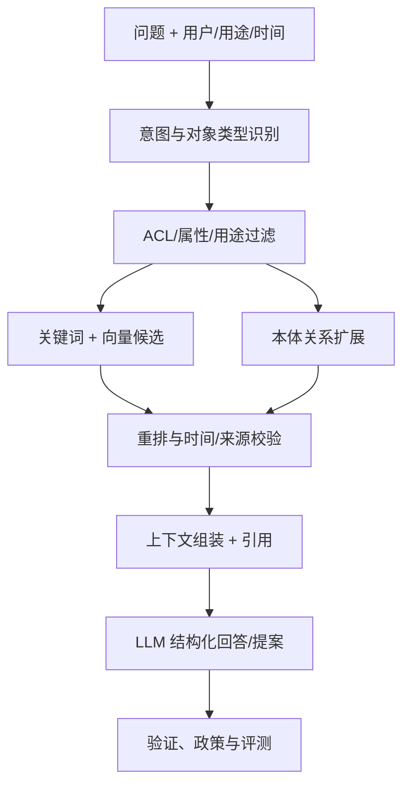

# AI、MLOps、GraphRAG 与 Agent 技术

## 1. AI 平台边界

AI 层提供统一的模型接入、检索、工具、评测、监控与成本治理。应用不能直接调用任意模型，也不能在提示中拼接未经权限裁剪的数据。

## 2. 组件

- Model Gateway：统一模型/供应商、路由、限额、脱敏、缓存和审计；
- Model Registry：模型、适配器、制品、数据、许可证和风险等级；
- Prompt/Logic Registry：提示、结构化输出、工具、评测集和版本；
- Retrieval Service：全文、向量、对象、图和时间过滤；
- Tool Registry：只读函数、查询、动作提案和受控动作；
- Evaluation：离线基准、对抗、权限、引用、稳定性和成本；
- Serving：KServe + vLLM/TGI 或受控商用 API；
- Feedback：用户反馈、修正、动作结果和漂移。

## 3. 模型生命周期

1. 登记用途、风险、负责人和数据边界；
2. 绑定训练/评测数据快照和许可证；
3. 训练或接入外部模型；
4. 完成准确性、鲁棒性、公平性、隐私、安全和容量评测；
5. 审批发布不可变版本；
6. 灰度、影子或 A/B；
7. 监控质量、漂移、延迟、成本和权限异常；
8. 回滚、替换或退役。

生产推理记录模型/适配器版本、输入摘要/敏感级别、输出 Schema、证据、延迟、Token/成本、工具调用和最终结果。对高敏原文按策略只保存哈希或受控审计副本。

## 4. 权限感知 GraphRAG

推荐检索流程：

关键规则：

- 先裁权，再检索或在存储端强制同等过滤；
- 候选绑定 canonical object、来源、有效时间和证据片段；
- 图扩展限定关系类型、深度、节点预算和时间；
- 冲突来源同时呈现，不由模型静默裁决；
- 回答包含可点击引用和“未找到/证据不足”；
- 动作建议与事实回答分开。

## 5. Agent 结构

一个 Agent 由以下版本化资源组成：

- 身份与调用主体映射；
- 允许的对象类型、函数和动作；
- 系统指令与业务规则；
- 检索策略和时间窗口；
- 结构化状态；
- 工具参数 Schema；
- 最大步数、预算、超时和停止条件；
- 高风险动作审批策略；
- 评测集和发布门；
- 监控、反馈和退役。

避免把通用多 Agent 编排框架变成业务真源。复杂工作由 Temporal/领域状态机持久化，Agent 作为一个可替换的决策或提案 Activity。

## 6. 适合的首批 AI 用例

- 新闻/公告/财报的实体、事件和声明候选抽取；
- 对象页上的证据型问答；
- 风险告警聚合、解释和处置提案；
- 因子结果的自动质量摘要；
- 会议/研究材料归档与对象链接建议；
- 报告草稿和引用检查；
- 数据管线、查询和本体变更辅助；
- 运维事件的日志/血缘辅助诊断。

不首批开放：

- 无人提交实盘订单；
- 自动解除风险限制；
- 自动修改生产权限；
- 仅凭 LLM 生成法定披露或合规结论；
- 无证据地创建金融事实。

## 7. 评测体系

### 7.1 检索

Recall@k、nDCG、来源覆盖、时间正确性、权限泄漏率、冲突保留率、引用定位准确率。

### 7.2 生成

事实支持率、引用完备率、结构化输出通过率、拒答正确性、数值一致性、跨轮稳定性。

### 7.3 工具与 Agent

任务成功率、非法工具调用率、参数正确率、步骤/成本、重复副作用、权限越界、人工接管率和动作结果。

### 7.4 生产

延迟、Token/成本、模型/提示漂移、用户修正、告警误报漏报和业务影响。

评测集按角色、市场、时间、权限和高风险边界分层；每次模型、Prompt、工具、本体或检索变更都触发相关回归。

## 8. 文档与多模态安全

- 文件沙箱、恶意代码与宏检测；
- OCR/解析器资源限制；
- 提示注入与越权指令检测；
- 外部链接、二维码和嵌入对象隔离；
- 模型输入执行分类分级与最小化；
- 图像、音频、视频输出带来源和时间片引用；
- 不因“模型看过”而提升事实可信度。

