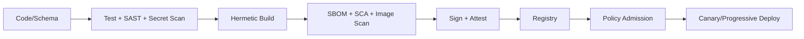

# 安全、DevSecOps 与可观测性技术

## 1. 身份与认证

- 优先对接现有企业 IdP，使用 OIDC/SAML；
- 强制 MFA、条件访问和短期会话；
- 服务使用工作负载身份和短期证书，不共享静态账号；
- 外部应用使用受限 OAuth client、细粒度 scope 和密钥轮换；
- Break-glass 账号离线保管、双人启用、全程告警和复核；
- 研究 Notebook 不继承个人长期生产凭证。

若组织没有成熟 IdP，可使用 Keycloak 自建，但密码、MFA、风控和生命周期仍需专职安全运维。

## 2. 授权架构

权限由三部分组合：

- OpenFGA/SpiceDB：用户—团队—角色—产品—账户—组合—对象的关系；
- OPA：时间、环境、用途、对象属性、风险等级和动作参数等动态条件；
- 数据执行：服务过滤、PostgreSQL RLS/列控制、OpenSearch ACL、图/向量过滤和导出策略。

决策输入是 `{subject, action, resource, environment, purpose, attributes}`。每次高风险判定返回策略版本和解释，并与动作审计关联。

## 3. 秘密和加密

- Vault 或云 Secret Manager 存储应用秘密；
- KMS/HSM 管理主密钥，Envelope Encryption 管理数据密钥；
- 数据库、对象、备份和消息传输加密；
- 关键列可令牌化/字段级加密；
- Secret 通过 CSI/短期注入，不写入镜像、Git、CSV、TOML 或日志；
- 使用 secret scanning 阻断提交，并定期扫描历史、制品和对象存储；
- 附件出现的凭据应立即轮换、吊销旧值并调查使用记录。

## 4. 软件供应链

推荐：

- GitLab/GitHub 受保护分支、CODEOWNERS 和签名提交；
- Harbor 或受控制品仓；
- Syft/CycloneDX 生成 SBOM；
- Trivy/Grype 和商业工具做依赖/镜像漏洞；
- Cosign/Sigstore 签名和 provenance；
- Kyverno/Gatekeeper 验证镜像、权限、网络和资源策略；
- Renovate/Dependabot 管理升级；
- 可复现构建与固定依赖。

## 5. GitOps 与发布

- 基础设施使用 OpenTofu/Terraform；
- Kubernetes 配置使用 Helm/Kustomize；
- Argo CD 从受保护 Git 环境仓发布；
- 数据契约、本体、规则、API 和事件与代码同样评审；
- 交易服务只在批准窗口发布，先影子/金丝雀；
- 数据库迁移采用 expand—migrate—contract；
- 破坏性 Schema 先兼容双读/双写或转换；
- 回滚包含代码、配置、本体、规则和数据迁移方案。

## 6. 可观测性

OpenTelemetry 统一：

- Trace：用户请求、对象查询、动作、外部调用、工作流；
- Metrics：RED/USE、Kafka/Flink、数据库、GPU 和业务指标；
- Logs：结构化、带 trace/correlation/object/action ID；
- Events：发布、策略、质量、故障和审计。

Prometheus/VictoriaMetrics 采集指标，Grafana 展示，Loki/Tempo 或等价后端保存日志/链路。高容量审计可写 ClickHouse 并将法定记录归档到 WORM。

## 7. 业务可观测性

技术健康之外必须监控：

- 行情各阶段延迟、丢包、乱序、备用源；
- 订单/成交状态停滞、外部未知和重复；
- 账户/持仓/净值对账差异；
- 风控判定延迟、告警和例外；
- 数据新鲜度、质量失败和血缘阻断；
- 因子/模型漂移和结果分布；
- 搜索/图/向量索引滞后；
- Agent 权限拒绝、引用缺失和工具失败；
- 导出、分享和异常访问。

## 8. 审计

审计记录包含：

- 主体及认证上下文；
- 组织、用途和环境；
- 读取/查询/导出的对象与范围；
- 动作参数摘要、策略与审批；
- 变更前后和外部回执；
- 本体、规则、模型和应用版本；
- trace、correlation、时间和来源；
- 完整性哈希和保留策略。

普通应用日志不能替代业务审计。审计访问本身也被审计。

## 9. 安全测试

- 威胁建模与数据流审查；
- SAST、DAST、SCA、IaC 和镜像扫描；
- API/GraphQL 授权负向测试；
- 对象/属性/动作权限组合测试；
- 文档、搜索、向量和 Agent 数据泄漏测试；
- Prompt injection、tool injection 和越权工具测试；
- 渗透测试、红队和外部连接审查；
- 灾备、密钥恢复和 Break-glass 演练。

## 10. 中国金融部署注意

需由法务和合规按最终主体、业务、客户、数据和部署位置核验。2026-07 调研形成的控制落点如下：

| 规范/要求 | 架构控制 |
| --- | --- |
| 2025 修订《网络安全法》、数据安全法、个人信息保护法 | 处理活动台账、最小必要、合法基础、个人权利、分类分级、事件与问责 |
| 《网络数据安全管理条例》 | 重要数据、委托处理、平台责任、风险管理、事件处置和跨境台账 |
| 2024 跨境规定与出境安全评估 | 境内存储优先；境外远程访问也进入出境判定、审批、记录和持续复核 |
| 2026《金融信息服务数据分类分级指南》 | 将业务、用户、企业数据映射为核心、重要、敏感一般、常规一般四级标签，并进入对象/属性/导出策略 |
| JR/T 0197—2020、JR/T 0171—2020 | 金融数据和个人金融信息的收集、传输、存储、使用、共享、删除控制 |
| 等保 2.0、关保与商用密码 | 按实际定级、CII 认定和密评要求落实网络、主机、应用、数据、运维和灾备控制 |
| 《网络数据安全风险评估办法》 | 2026-08-20 生效；重要数据处理者按年度及重大变化开展评估，平台保存可导出证据包 |
| 个人信息保护合规审计 | 形成处理活动、影响评估、委托/共享、权利响应和整改闭环 |
| 生成式 AI、算法推荐、生成合成内容标识 | 对外服务按适用性完成备案/评估/标识；内部 Agent 同样保留数据、模型、提示、工具、输出和人审记录 |
| 网络安全事件报告 | 事件分级、时钟同步、证据保全、报告时限、演练和责任人进入运行手册 |

上述来源链接见[参考资料登记册](../08-reference/03-source-register.md)。设计文档提供技术控制，不构成法律意见。正式上线前需生成“法规条款—数据/系统—控制—证据—责任人—复核周期”矩阵。
