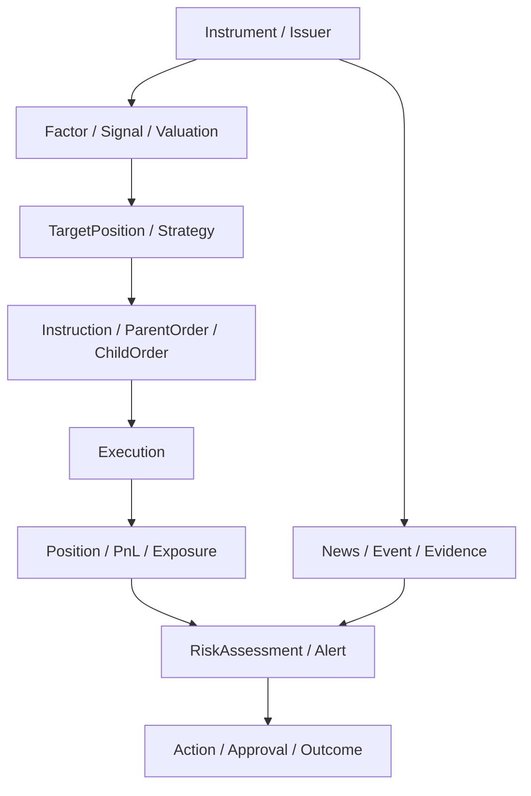

# 业务与平台模块全景

## 1. 从离散页面到能力系统

原始材料的页面被重构为八个业务能力域和一个平台控制域：

| 一级模块 | 目标 | 主要子模块 |
| --- | --- | --- |
| 统一工作台 | 让每个角色从对象、任务、告警和决策进入工作 | 首页、分享方案、黑灰名单、策略监控、市场总览、任务、收藏、保存视图 |
| 数据与资讯 | 提供可信、点时、可检索的数据和证据 | 新闻、互动问答、投资日历、行情、Level-2、期指基差、数据目录、主数据 |
| 量化研究 | 形成可复现、可发布、可治理的研究流水线 | 因子注册、单因子、汇总、相关性、样本空间、回测、逐笔复盘、融券研究 |
| 主动投研 | 将行业、公司、估值、项目和主题研究对象化 | 覆盖、财报披露、一致预期、行业、估值、重点股票、项目、股票池、主题 |
| 组合与执行 | 连接产品目标、账户、订单、算法和成交 | 产品/账户/资产单元、IMS、OMS、算法监控、母子单、TCA、延迟、网关 |
| 风险与合规 | 在交易前、中、后统一规则、告警、例外和审计 | 股票/期货配置、实时监控、风险标的、快速/事后风险、黑灰名单、对账 |
| 产品与经营 | 统一产品、渠道、规模、市场和竞品口径 | 市场观察、规模、渠道、竞品、经营指标、报告发布 |
| 本体与自动化 | 管理语义、逻辑、动作和 Human+AI 工作流 | Ontology Studio、Object Explorer、函数、动作、策略、自动化、Agent |
| 平台运维 | 管理连接、数据、模型、发布、安全、质量和健康 | 连接器、管线、血缘、质量、模型、权限、审计、SRE、成本、支持 |

## 2. 跨模块对象主线

页面和报告只是这条对象主线的不同读取或动作入口。

## 3. 共用能力

所有模块必须复用：

- Canonical ID、市场日历、币种和单位；
- 对象视图、搜索、保存视图和深链；
- Metric/Function Registry；
- Action/Policy/Approval；
- 数据时间、来源、质量和血缘；
- 评论、任务、通知和分享；
- 导出、审计、权限申请和数据标记；
- 场景分支和历史快照；
- Agent 引用与受控工具。

## 4. 模块成熟度

| 阶段 | 能力 |
| --- | --- |
| Observe | 只读、可信数据、对象导航、状态和告警 |
| Explain | 指标、证据、血缘、对比与原因 |
| Decide | 提案、场景、审批和协作 |
| Act | 受控动作、外部回写和补偿 |
| Learn | 结果反馈、评测、规则/模型改进 |

每个模块先完成 Observe/Explain，再开放 Act；不能先做漂亮操作按钮而缺少数据、权限和审计。

