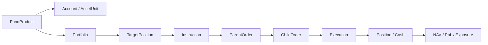

# 产品、组合、OMS/IMS 与算法执行

## 1. 主业务链

每一跳都有稳定标识、环境、状态、时间和来源。

## 2. 产品、账户与资产单元

- 产品法定/业务信息、基准、币种、策略和限制；
- 资金账户、信用/普通/期货账户及外部映射；
- 资产单元的层级、资金、持仓和交易能力；
- 券商、柜台、网关、市场和算法能力；
- 账户启停、风险配置、连接健康和凭证引用；
- 账户配置版本、审批和生效时间。

秘密只保存引用；UI 和导出永不返回真实 secret。

## 3. 策略/IMS 监控

附件中的大量策略指标按六组组织：

- Identity：代码、名称、模式、策略、算法、账户；
- Capital：总资产、市值、资金、仓位、资金占用；
- Performance：账户/昨仓/T0 盈亏、基准、Alpha；
- Trading：换手、买卖、净买卖、未买/未卖、目标偏差；
- Risk：拒单、撤单、对冲、重合、市值分位；
- Operations：状态、更新时间、数据新鲜度和来源。

表格支持角色列预设；指标点击显示公式和输入。下部成交表使用 `Execution` 标准对象，内部委托信息、操作员、开平、币种、汇率、EPID、融资融券和指令 ID 均为类型化属性。

## 4. OMS 监控

六个视图：

1. 概览：账户状态、资产、持仓、订单、成交和对账；
2. 持仓：当前、可用、冻结、成本、市值、盈亏和来源；
3. 委托：订单状态机、外部回执、拒绝和延迟；
4. 成交：成交、费用、交易日、对手/场所和归属；
5. 划拨：资金/证券划拨申请、审批和状态；
6. 配置：只读展示生效配置；修改通过版本化 Action。

不再允许直接编辑账户文件或盘中敲隐藏命令。恢复单元、增加账户等运维动作进入受控管理 API、审批和审计。

## 5. 算法交易

### 5.1 算法能力注册

`AlgoProvider`、`AlgoDefinition`、`AlgoCapability` 表达：

- TWAP、TWAP_PLUS、VWAP、VWAP_PLUS、POV、IS、指定价等；
- 支持市场、账户类型、集合竞价和涨跌停；
- 市占率、限价、主动/被动、最小/最大订单；
- 错单/拒单行为、恢复方式和供应商限制；
- 版本、认证、SLA、联系人和变更记录。

供应商对比不再维护为静态帮助表，而由能力对象生成；人工备注仍保留证据和有效期。

### 5.2 算法监控

按策略、算法类型、厂商、账户、市场和时间查看：

- 母单：记录数、运行/结束、成交/总金额、完成率；
- Benchmarks：启动价、TWAP、VWAP、到达价等绩效 bp；
- 错单、撤单及比例；
- 子单/委托数量、错单和撤单；
- 延迟、参与率、市场冲击和剩余时间风险；
- 数据和供应商健康。

指标定义使用 `ExecutionMetricDefinition`，明确分母、买卖方向符号和缺失处理。

### 5.3 算法母单

字段覆盖附件中的单号、账号、代码、名称、状态、买卖、目标/成交量、算法商、算法、开始/结束、撤单、金额、完成率、价格、绩效、市占率和交易日。行详情显示：

- 状态时间线；
- 参数和修改历史；
- 子单/委托/成交树；
- 风控判定和拒绝原因；
- 价格与市场成交叠加；
- 外部供应商原始回执；
- 暂停、恢复、撤销等可用动作。

### 5.4 算法绩效/TCA

- Arrival、Close、TWAP、VWAP、Decision Price；
- Implementation Shortfall；
- 显式成本、冲击、择时和机会成本；
- 完成率、参与率、速度、撤单和拒单；
- 按策略、交易员、账户、供应商、算法、市场、流动性分层；
- 置信、样本量、异常订单和数据质量。

### 5.5 算法延时

覆盖股票/期货账户、交易和沪深行情：

- source→gateway→risk→OMS→broker 各阶段时间；
- P50/P95/P99/max；
- 时钟同步和负值检测；
- 按账号、网关、供应商、市场和错误类型；
- 延迟告警与原始 trace。

## 6. 分仓与路由

分仓 UFT/路由模块管理：

- 产品—账户—资产单元可用范围；
- 资金、持仓、信用、借券和市场能力；
- 路由优先级、费率、延迟和稳定性；
- 目标分配与实际分配；
- 失败降级和人工覆盖；
- 公平性、最佳执行与审计。

## 7. 状态机

`ParentOrder` 典型状态：

`Draft → PendingApproval → Approved → Submitted → Running/Paused → PartiallyFilled → Filled/Cancelled/Expired/Rejected → Reconciled`

状态迁移由事件驱动，禁止 UI 自行推断。`UnknownExternalState` 是显式状态，需查询外部真相，不盲目重发。

## 8. 核心动作

- CreateInstruction；
- ApproveInstruction；
- SubmitParentOrder；
- Pause/Resume/CancelOrder；
- ChangeAlgoParameters（仅允许字段、影响预览）；
- ResumeExecutionUnit；
- AddAccountMapping；
- TransferCash/Security；
- ReconcileOrder/Position；
- SwitchGateway。

每个动作有环境、账户范围、交易时段、风险前置条件、职责分离和幂等规则。

## 9. 验收重点

- 母单、子单、委托、成交数量守恒；
- 断线重连和重复回执不产生重复订单；
- 外部未知状态被安全处理；
- 算法绩效可复算且买卖方向一致；
- 实时监控与 CSV 导出字段使用同一契约；
- 账户/网关配置不含明文秘密；
- 仿真、实盘和回放绝不跨环境串单。

