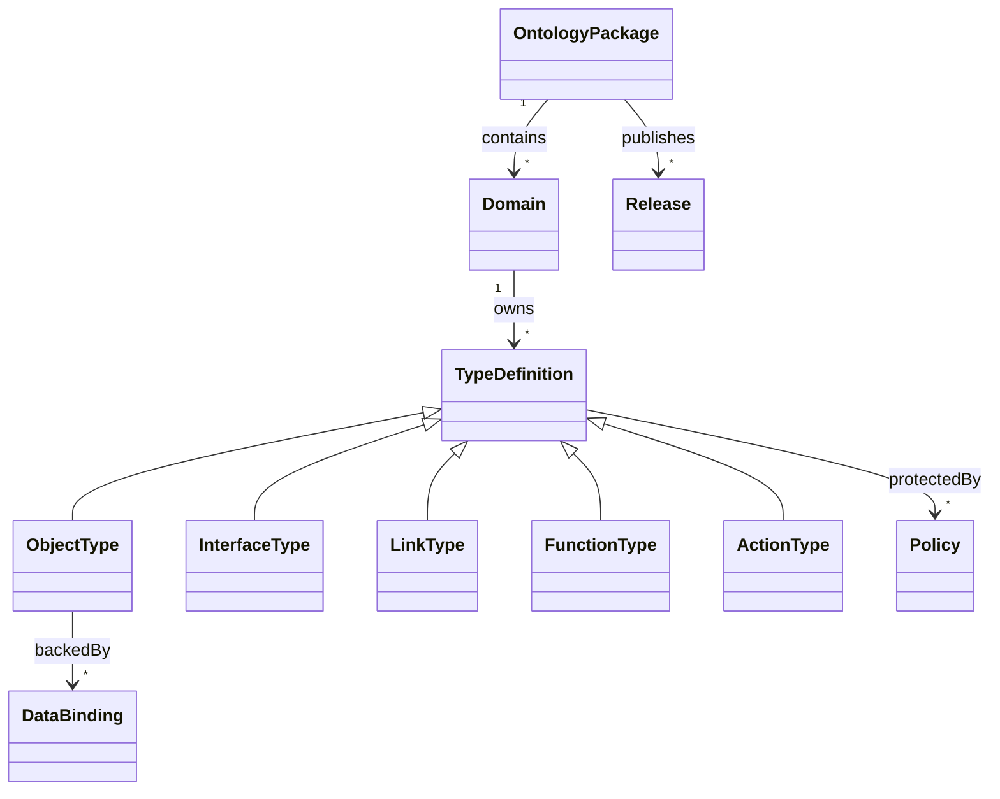

# 金融本体方法与元模型

## 1. 本体定位

本平台的 Ontology 是业务运行时的“类型化决策契约”，同时连接：

- 现实世界对象和事件；
- 物理数据、模型与文档；
- 确定性函数、统计指标和模型；
- 人与 Agent 可执行的动作；
- 权限、用途、审批与审计；
- 应用中的对象视图和工作流。

Palantir 官方把 Ontology 描述为组织的 operational layer，包含 objects/properties/links 等语义元素，也包含 actions/functions/dynamic security 等 kinetic elements；其平台摘要进一步区分 Language、Engine、Toolchain。本方案沿用这一完整结构，而不是把本体缩减为图数据库 Schema。[Ontology overview](https://www.palantir.com/docs/foundry/ontology/overview/)；[Foundry platform summary](https://www.palantir.com/docs/foundry/getting-started/foundry-platform-summary-llm)

## 2. 三部分结构

### 2.1 Language

定义组织能说什么、算什么、做什么：

- Domain、Namespace；
- ObjectType、Property、SharedProperty、ValueType；
- InterfaceType、LinkType、EventType；
- MetricType、FunctionType、ModelType；
- ActionType、Policy、WorkflowType、ViewType。

### 2.2 Engine

使上述定义成为可运行能力：

- 类型注册和发布；
- 标识解析与对象解析；
- 链接和对象集查询；
- 派生属性/指标和函数执行；
- 动作、审批、策略和外部回写；
- 双时间、证据、质量和历史；
- 对象/属性/动作权限；
- 搜索、图、向量和分析投影；
- 分支、场景和物化。

### 2.3 Toolchain

支持建设和消费：

- Ontology Studio；
- 分支、diff、评审、迁移与影响分析；
- TypeScript/Java/Python SDK；
- OpenAPI/AsyncAPI/Protobuf/JSON Schema；
- React 对象视图和动作表单；
- 测试数据、契约测试和文档生成；
- Data Catalog、Lineage、IDE 和 CI/CD 集成。

## 3. 元模型

## 4. 所有类型的公共元数据

| 字段 | 含义 |
| --- | --- |
| `id` | 不可变全局 ID |
| `api_name` | 稳定机器名，发布后不可直接改名 |
| `display_name` | 可本地化展示名 |
| `description` | 业务定义和边界 |
| `domain/namespace` | 所属领域 |
| `owner/steward` | 业务和数据责任人 |
| `status` | Example/Experimental/Active/Deprecated/Retired |
| `version` | 不可变发布版本 |
| `classification` | 分类分级 |
| `purpose_tags` | 允许用途 |
| `source_refs` | 定义证据和规范来源 |
| `policy_refs` | 访问与动作策略 |
| `quality_profile` | 必要质量要求 |
| `compatibility` | 兼容性声明 |
| `created/approved/released` | 生命周期记录 |
| `annotations` | 扩展元数据，不承载关键语义 |

状态设计参考 Palantir 对 Ontology 资源 active、experimental、deprecated、example 等状态的管理，但本方案增加 Retired 和明确的发布门。[Ontology resource statuses](https://www.palantir.com/docs/foundry/object-link-types/metadata-statuses/)

## 5. ObjectType

ObjectType 表示现实实体、业务事件、证据或治理资源，定义：

- 主键和稳定标识；
- Properties 与 ValueTypes；
- 实现的 Interfaces；
- 状态和生命周期；
- 时间语义；
- 来源、证据和质量；
- 对象和属性权限；
- DataBindings 与解析策略；
- 默认 ObjectView、搜索和索引；
- 可用 Links、Functions 和 Actions。

对象实例不是把多个来源字段简单拼接；它是按来源、有效期、解析和权限生成的有证据视图。

## 6. InterfaceType

Interface 提供跨对象多态能力，而不是继承树滥用。核心接口：

| Interface | 必需能力 |
| --- | --- |
| `Identified` | canonical_id、external identifiers |
| `Temporal` | valid_from/valid_to |
| `Bitemporal` | valid + system time |
| `Sourced` | source、source_record、ingest |
| `Evidenced` | claims/evidence/citations |
| `Classified` | security/data classification |
| `Governed` | owner、steward、status |
| `Stateful` | state、version、state events |
| `Tradable` | venue、currency、tick/lot、trading status |
| `AccountLike` | legal owner、capabilities、environment |
| `PortfolioLike` | holdings、benchmark、constraints |
| `DocumentLike` | media、text、license、fragments |
| `Actionable` | allowed ActionTypes |

Palantir 将 Interface 定义为描述对象形状与能力、支持对象类型多态的类型；本方案采用同样用途。[Ontology core concepts](https://www.palantir.com/docs/foundry/ontology/core-concepts/)

## 7. ValueType

ValueType 把单位和约束放入类型，而不依赖列名：

- Money(amount, currency)；
- Price(value, currency, price_type, precision)；
- Quantity(value, unit, lot_size)；
- Percentage；
- BasisPoint；
- ExchangeRate；
- Timestamp(timezone/precision)；
- TradingDate(calendar)；
- DateRange；
- ConfidenceScore；
- ClassificationLabel；
- ExternalIdentifier；
- URI；
- MediaReference；
- GeoPoint。

例如 CSV 中的“盈亏(万)”应映射为 Money + 展示单位，19 位订单号映射为 Identifier 字符串，毫秒时间戳映射为 Timestamp；不能让 UI 猜测。

## 8. LinkType

LinkType 定义：

- source/target ObjectType 或 Interface；
- 方向、反向名和业务含义；
- 基数与唯一约束；
- 是否有属性；
- 有效时间和系统时间；
- 来源/证据；
- 权限传播；
- 物化和索引策略。

复杂、有自身生命周期的关系建成关系对象，例如 `UniverseMembership`、`CoverageAssignment`、`ClassificationMembership`；简单关系可直接作为 Link。

## 9. EventType

事件表示已发生事实，包含 actor、object、event/record time、environment、causation、correlation、payload 和 evidence。事件用于：

- 状态机；
- 实时计算；
- 审计和回放；
- 对象/搜索/图物化；
- 自动化触发。

事件与 Action 不同：Action 是意图和受控执行，Event 是结果或观察。

## 10. Metric、Function 与 Model

- MetricType：名称、单位、粒度、时间、维度、公式和聚合；
- FunctionType：类型化输入/输出、纯度、执行模式、资源预算、版本和测试；
- ModelType：模型任务、适用范围、训练/评测、适配器、版本和风险。

Derived Property 是 Function/Metric 在对象上下文中的投影，不直接把任意计算塞入属性。对 beta/preview 能力保持版本隔离；Palantir 当前也将部分 derived property 能力标为 Beta。[Derived properties](https://www.palantir.com/docs/foundry/ontology/derived-properties/)

## 11. ActionType

ActionType 是组织动词，定义：

- 参数、对象上下文和类型；
- 前置/后置条件；
- 对象编辑与外部副作用；
- 权限、审批和职责分离；
- 幂等、并发版本、超时、重试、补偿；
- 同步/异步和状态；
- 通知、证据和审计；
- UI/SDK/Agent 暴露。

Palantir Action Type 同样被定义为一次可对对象、属性和链接做出的成组变更，并可包含副作用；其更新会反映到使用该本体的应用。[Action types overview](https://www.palantir.com/docs/foundry/action-types/overview/)

## 12. Policy

Policy 不是对象上的一个 `role` 字段，而是：

`subject × relationship × action × resource × attributes × environment × purpose → effect + reason`

Policy 发布生成 OPA bundle、OpenFGA/SpiceDB 关系和必要的数据层过滤；对象、属性、链接、函数、动作、搜索、导出与 Agent 工具均受同一策略语义约束。

## 13. Workflow、View 与 DataBinding

- WorkflowType：跨动作、人工任务、事件和补偿；
- ViewType：对象页、表、图、卡、地图、表单与角色预设；
- DataBinding：来源字段、主键、双时间、解析、质量和读取/回写模式；
- IndexBinding：ClickHouse/OpenSearch/Graph/Vector 投影；
- SDKBinding：应用获准使用的类型集合。

## 14. 真源与交换格式

本体声明 YAML 是工程真源，发布时生成：

- JSON Schema；
- SQL migration/view；
- Protobuf/AsyncAPI；
- OpenAPI/GraphQL read schema；
- TypeScript/Java/Python SDK；
- React form/object view schema；
- OPA/OpenFGA policies；
- SHACL validation；
- OWL 2/PROV/DCAT/FIBO 映射。

OWL/SHACL 适合语义交换和验证，但不会替代事务状态机、权限和动作执行器。

