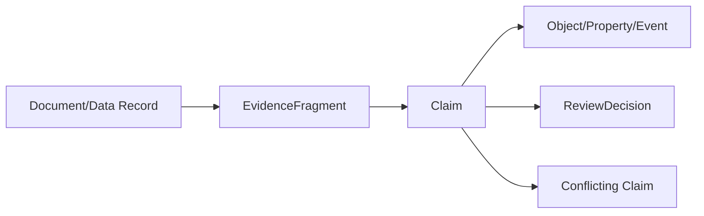

# 时间、来源、证据与质量

## 1. 为什么是核心而非附属字段

金融世界中的“真相”随披露、修订、交易日和来源变化。若只保存当前值：

- 回测会使用未来信息；
- 历史报告无法复算；
- 持仓/订单差异被覆盖；
- 研究结论无法审计；
- AI 会把修订后的事实错误地放入过去语境。

因此双时间、证据和质量是所有核心接口的强制能力。

## 2. 双时间模型

| 时间 | 含义 | 示例 |
| --- | --- | --- |
| valid_from/to | 现实世界何时有效 | 行业成分生效区间 |
| system_from/to | 平台何时记录该版本 | 7 月 28 日才收到修订 |
| event_time | 事件发生 | 成交时间 |
| source_time | 来源生成 | 券商回执时间 |
| ingest_time | 平台接收 | 网关到达时间 |
| publish_time | 目标用户可知 | 财报公开时间 |
| revision_time | 来源修订 | 更正公告 |
| trading_date | 市场日历归属 | 夜盘交易日 |

核心查询必须提供 `as_of_valid`、`as_of_system` 或明确默认值。UI 显示业务时间和数据更新时间。

## 3. 不可变事实与更正

- 原始来源记录只追加；
- 规范记录以新版本更正；
- 账本用冲销和补充；
- 订单用新事件纠正；
- 文档用新版本并保留旧 hash；
- Claim 的 Confirmed/Rejected/Obsolete 是状态历史；
- 手工调整包含原因、证据和审批。

不允许直接 UPDATE 抹掉对审计有意义的历史。

## 4. 来源模型

`Source`：

- provider、system、dataset/API；
- authority tier；
- license/usage；
- geography；
- update schedule/SLA；
- schema/version；
- contact/owner；
- security classification。

`SourceRecordRef`：

- source ID、record/file/message ID；
- checksum；
- source/event/ingest times；
- raw location；
- parsing version。

字段级来源允许同一对象的名称、评级、财务、持仓来自不同权威源。

## 5. Claim 与 Evidence

EvidenceFragment 精确到：

- 数据集行/列/快照；
- 文档页、段、字符范围；
- 图片框；
- 音视频时间片；
- API 响应或消息序号。

Claim 记录提取方式、模型/规则版本、置信、支持/反对、复核人和有效时间。AI 生成的事实候选在复核前不得冒充对象黄金属性。

## 6. 来源冲突

按属性定义 `ResolutionPolicy`：

1. 法定/权威来源优先；
2. 时间有效性和发布时间；
3. 来源等级；
4. 多源一致；
5. 数据质量；
6. 人工裁决。

已解析值保留候选、理由和策略版本。应用可查看冲突；高风险动作可在冲突未解决时 fail-closed。

## 7. 质量模型

质量维度：

- completeness；
- validity；
- accuracy/reference agreement；
- consistency；
- uniqueness；
- timeliness/freshness；
- sequence integrity；
- point-in-time correctness；
- reconciliation；
- provenance coverage；
- permission coverage。

检查级别：

- Record；
- Partition/Snapshot；
- DataProduct；
- ObjectType/Property；
- Function/Metric；
- Action input；
- Report/Model。

## 8. 质量状态

`Unknown → Measuring → Passed | Warning | Failed | Waived`

Waiver 必须有范围、原因、补偿控制、审批和到期。对象或指标可携带 `quality_status` 和 `freshness`，但详细结果单独保存。

## 9. 缺失状态

核心值不能只用 null。使用：

- MissingAtSource；
- NotApplicable；
- NotYetAvailable；
- NotCalculated；
- CalculationFailed；
- WithheldByPolicy；
- UnknownConflict；
- Redacted。

这可解决附件 CSV 中目标持仓全空、创建时间为 0、页面空状态等语义混淆。

## 10. 点时研究门

ResearchRun 发布前自动验证：

- 输入快照在决策时可得；
- 财务/一致预期按 publish/revision time；
- 样本空间和分类按当时版本；
- 退市和停牌保留；
- 公司行动和复权没有后视；
- 价格执行点与信号时间有 lag；
- 超参数选择和样本外分离；
- 代码/环境/随机种子可复现。

失败形成可读证据，不允许勾选一个“忽略”后无记录通过。

## 11. 血缘

四类血缘共同构成：

- 数据血缘：Source → Asset → Transform → Snapshot；
- 语义血缘：Asset.Field → Object.Property/Link；
- 逻辑血缘：Property → Function/Metric/Model；
- 决策血缘：Evidence → Decision/Action → Outcome。

Report、Agent answer、RiskAssessment 和 OrderAction 必须能跨四层追踪。

