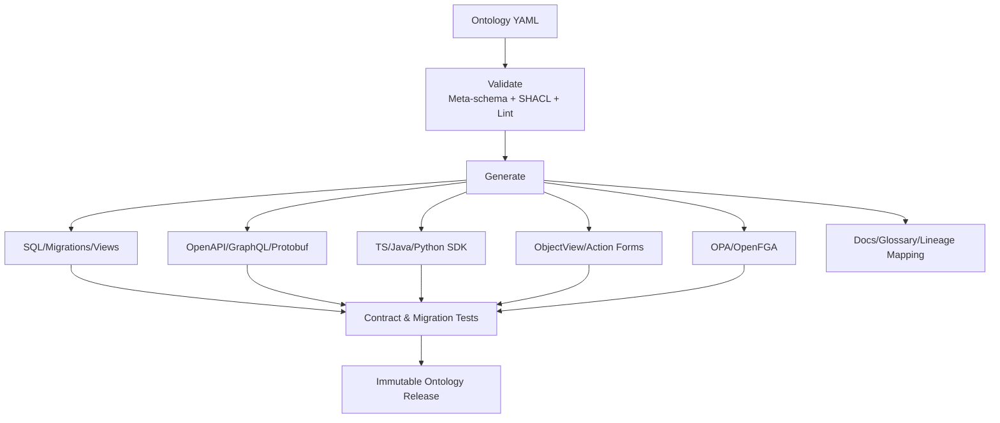

# 本体到数据、API、UI 与运行时的映射

## 1. 发布流水线

## 2. DataBinding

每个 ObjectType 可有多个绑定：

- PostgreSQL table/view；
- Iceberg table/snapshot；
- ClickHouse view；
- Kafka stream；
- External API；
- Composite resolver。

绑定定义：

- primary/canonical key；
- source identifiers；
- property mapping；
- valid/system/event time；
- source priority；
- resolution；
- quality；
- read mode、freshness；
- writeback target；
- permission mapping；
- materialization/index。

## 3. Object Resolver

查询过程：

1. 解析 API 名和版本；
2. 解析主体、用途、环境和场景；
3. 编译对象/属性权限；
4. 选择数据绑定和 as-of；
5. 批量读取和 identity resolution；
6. 应用来源/冲突/质量策略；
7. 计算获准的 derived properties；
8. 返回对象、数据时间、来源和质量摘要。

Resolver 不为一次请求同步扫描数据湖；在线对象必须有适当服务投影。

## 4. SDK

生成的 SDK 支持：

- `get/search/aggregate` objects；
- traverse links；
- calculate approved metrics/functions；
- create/validate/submit actions；
- observe action/workflow state；
- scenario/branch context；
- media upload/reference；
- citations/provenance；
- typed errors and policy denial。

应用只选择所需类型集合，减少权限和依赖。Palantir OSDK 同样按选定本体子集生成强类型 TypeScript/Python/Java 包，并可导出 OpenAPI；本方案将其作为工具链基线。[OSDK overview](https://www.palantir.com/docs/foundry/ontology-sdk/overview/)

## 5. UI 生成

默认 ObjectView 来自：

- title/icon/status；
- summary properties；
- metric groups；
- links/timeline/evidence/history；
- allowed actions；
- security/freshness/quality badges；
- table/chart/map/media render hints。

ValueType 决定金额、价格、百分比、BP、时间、媒体等组件。高级页面可组合/覆盖默认视图，但不得绕过类型和权限。

## 6. Action 实现

ActionType 生成：

- 输入 JSON Schema；
- API；
- UI 表单；
- policy input；
- Temporal workflow skeleton；
- audit/receipt schema；
- SDK method；
- Agent tool schema；
- contract tests。

领域开发者补充不变量和执行器。外部系统写回使用适配器，保存 request/response hash、外部 ID 和状态。

## 7. 索引与物化

Object/Link 事件驱动：

- OpenSearch document；
- ClickHouse serving tables；
- graph vertices/edges；
- vector chunks；
- cache；
- saved object sets。

每个投影保存 source sequence、object version、ontology release、index time。查询结果可以显示滞后；动作永远回源验证。

## 8. OWL/SHACL/PROV/DCAT/FIBO

- OWL 2：交换类、属性和关系语义；
- SHACL：对象/关系和发布包结构验证；
- PROV-O：来源、活动、实体和责任；
- DCAT：数据产品/数据集目录交换；
- FIBO：选择性对齐法人、工具、合同、市场等概念。

采用 mapping，不把外部 ontology 的全部复杂度直接变成运行时对象。每个映射记录 exact/broad/narrow/related、版本和差异。

## 9. 迁移现有系统

### 9.1 Strangler 顺序

1. 对现有 API/CSV/数据库建立只读 DataBinding；
2. 创建 canonical IDs 和对象投影；
3. 新 UI 通过 Object SDK 读取；
4. 建立动作适配器，旧系统仍执行；
5. 双运行和对账；
6. 逐对象/账户切换写真源；
7. 退役旧页面和直接 SQL。

### 9.2 CSV 映射重点

- 19 位订单号 → string Identifier；
- 毫秒 epoch → Timestamp + timezone；
- 状态/方向/开平 → 版本化枚举；
- `元/万/%` → ValueType + presentation；
- 0 时间 → MissingState；
- 目标字段全空 → NotCalculated/NotApplicable；
- 备注拒单 → code/source/message；
- 订单/持仓快照 → 明确 snapshot/event。

## 10. 性能边界

- SDK 默认字段投影，不全对象加载；
- link traversal 有深度/成本；
- derived property 有预算和物化选项；
- 大对象集异步导出；
- 批量 action 有逐项结果和上限；
- 媒体使用引用/签名 URL；
- 搜索/图/向量不能作为权限或交易状态真源。

