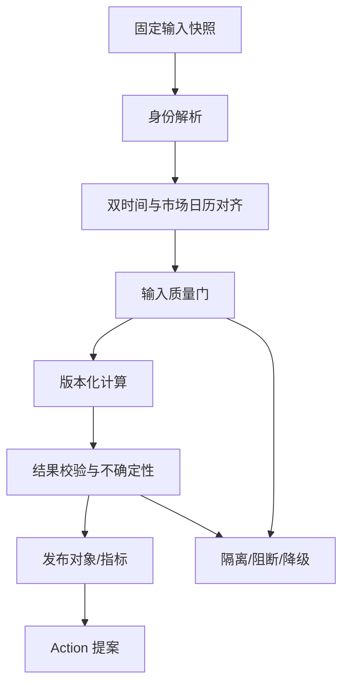

# 算法工程总规范

## 1. 目的与边界

本章定义行情、研究、交易、组合风险和图/AI 算法共同遵循的运行契约。算法不是散落在页面、SQL 或 Notebook 中的计算片段，而是本体中的版本化 `FunctionVersion` 或 `ModelVersion`；有副作用的结果只能由 `ActionType` 承载。

所有金融模型、因子、预测和交易算法都必须经过独立验证、历史回放、样本外检验、容量与极端场景测试，并持续监控。文档中的公式是工程口径与验证基线，不构成收益承诺、投资建议或可直接上线实盘的充分条件。

## 2. 统一算法对象

| 资源 | 职责 | 不可缺字段 |
| --- | --- | --- |
| `FunctionVersion` | 确定性或统计计算的稳定接口与实现版本 | API 名、输入/输出类型、时点语义、代码提交、镜像、参数 Schema、owner |
| `ModelVersion` | 拟合、预测、LLM 或其他模型制品 | 训练/评测快照、制品哈希、许可证、风险等级、限制、回退 |
| `MetricType` | 业务可复用指标口径 | 粒度、维度、单位、币种、精度、公式、允许聚合、空值语义 |
| `ResearchRun` | 研究或校准过程 | 输入快照、代码/环境、随机种子、参数、日志、质量结果 |
| `DatasetSnapshot` | 不可变的点时输入 | 资产/分区、快照 ID、Schema、校验和、有效/系统时间、权限标签 |
| `QualityCheckRun` | 数据与结果的机器质量证据 | 规则版本、范围、阈值、实际值、状态、豁免与到期 |
| `ActionRun` | 发布、审批、下单或处置等副作用 | actor、用途、环境、策略判定、幂等键、前后版本、外部回执 |

稳定身份与运行实例必须分离。例如 `FactorDefinition` 是长期业务身份，`FactorVersion` 是可发布定义，`FactorObservation` 是某时点结果，`ResearchRun` 是一次具体运行。

## 3. 标准运行契约

每个算法在注册中心必须声明以下内容。

### 3.1 输入契约

- 对象类型、属性、关系和基数；
- 数据粒度、单位、币种、价格精度和时区；
- `event_time`、`source_time`、`publish_time`、`ingest_time`、`valid_time`、`system_time` 的使用规则；
- `as_of_valid` 与 `as_of_system`，或经审批的明确默认；
- 最低新鲜度、完整率、来源等级和点时可得性；
- `MissingAtSource`、`NotApplicable`、`NotYetAvailable`、`NotCalculated`、`CalculationFailed`、`WithheldByPolicy`、`UnknownConflict`、`Redacted` 的处理；
- 权限、用途、地域、许可证和保留限制；
- 规模上限、分区、排序键与幂等键。

### 3.2 计算契约

- `batch`、`stream`、`sync` 或 `async`；
- 确定性、随机性、随机种子与数值精度；
- 窗口边界、市场日历、迟到容忍、水位线和重算规则；
- 参数范围、默认值的来源和校准方式；
- CPU/GPU、内存、扫描字节、时延和成本预算；
- 超时、重试、缓存、降级和取消语义；
- 是否纯函数；任何外部副作用必须剥离为 Action。

### 3.3 输出契约

- 输出对象、属性、指标及其单位、精度和正负号口径；
- 置信区间、不确定性、适用范围和限制；
- 输入快照、函数/模型版本、参数、运行 ID 与质量状态；
- 可见性、敏感级别、来源和下游使用限制；
- 空结果、部分结果、失败结果和被策略隐藏结果的区分；
- 可触发的 Action 仅为建议还是允许执行。

### 3.4 发布契约

`Draft → Reproducible → Reviewed → Approved → Published → Deprecated → Retired`

只有 `Approved` 或 `Published` 版本可用于生产决策。实盘交易、风险限制、权限修改等高风险动作必须再经过 Action Policy；算法输出本身不等于审批。

## 4. 标准执行流水线



伪代码：

```text
run(spec, request):
  authorize(request.subject, request.purpose, spec.input_scope)
  snapshots = freeze_inputs(spec.assets, request.as_of_valid, request.as_of_system)
  resolved = resolve_identities(snapshots, spec.identity_policy)
  aligned = temporal_join(resolved, spec.clock, spec.calendar, spec.lag_policy)
  input_quality = evaluate_quality(aligned, spec.input_quality_rules)
  if input_quality.blocking_failure:
      return FailedRun(reason, snapshots, input_quality)

  result = execute(
      implementation=spec.immutable_artifact,
      data=aligned,
      parameters=validate(request.parameters, spec.parameter_schema),
      seed=request.seed
  )
  output_quality = validate_result(result, spec.output_rules, spec.reference_set)
  publish_run_and_lineage(result, snapshots, spec.version, input_quality, output_quality)

  if output_quality.passed:
      publish_typed_objects(result)
      return result_or_action_proposal(result)
  return QuarantinedResult(result, output_quality)
```

## 5. 身份解析

### 5.1 业务目标

把来源代码、历史代码、别名和自由文本稳定映射到 canonical `Instrument`、`Party`、`FundProduct`、`TradingAccount` 或其他对象，同时保留候选、证据、冲突和有效期，避免因误合并污染持仓、风险和研究结果。

### 5.2 输入与时点

- `ExternalIdentifier`、`InstrumentIdentifier`、`PartyAlias`、来源记录；
- 市场、证券类型、币种、法人辖区、交易所、有效期；
- 名称、简称、历史名称、地址等标准化特征；
- 已确认的 `SAME_AS`、`MERGED_INTO`、`SPLIT_FROM` 关系；
- 查询的 `as_of_valid` 和 `as_of_system`。

历史代码必须按有效期匹配，禁止用今天的代码映射覆盖历史事实。

### 5.3 分层算法

1. **规范化**：Unicode、大小写、全半角、空白、法人后缀、市场代码和校验位；原值不可覆盖。
2. **确定性键**：受信来源 ID、ISIN/LEI/交易所代码组合、内部主键；匹配冲突时立即阻断。
3. **候选阻塞**：按市场、对象类型、名称 token、发行人、地域等生成有限候选。
4. **特征评分**：标识符一致、名称相似、属性一致、时间重叠、关系邻域和来源等级。
5. **约束求解**：应用唯一性、互斥市场、法人/证券类型和有效期约束。
6. **决策**：高阈值自动链接；灰区建立 `LinkEntityCandidate`；低阈值保持未匹配。
7. **人工复核**：复核结果形成新的、可追踪的主数据 Action；不直接改来源记录。

示例评分仅作可校准基线：

\[
s(x,y)=\sum_k w_k f_k(x,y)-\sum_j \lambda_j c_j(x,y)
\]

其中 \(f_k\in[0,1]\) 是匹配特征，\(c_j\in\{0,1\}\) 是约束冲突。权重、阈值和来源优先级必须按对象类型独立校准，不得跨域复用一个“万能阈值”。

### 5.4 输出与动作

- `LinkEntityCandidate`：候选对象、分数、特征解释、来源和模型版本；
- `ExternalIdentifier` 到 canonical object 的双时间映射；
- `QualityAssessment`：未匹配率、冲突率、误合并抽检结果；
- `MergeEntity`、`CorrectInstrument` Action 提案。

合并必须先输出下游影响清单；已发生的误合并用新版本拆分，不能抹除历史。

### 5.5 质量与验收

- 受信确定性 ID 冲突为阻断级；
- 高价值对象按分层样本计算 precision/recall，并对自动合并优先约束 precision；
- 验证历史改名、退市后代码复用、跨市场同代码、公司合并/拆分；
- 重跑同一快照和版本得到相同映射；
- 每个自动链接均能解释关键特征并定位来源证据；
- 权限不可通过候选生成或图邻域泄露隐藏对象。

## 6. 点时对齐与可得性

### 6.1 统一判断

一条记录可被某次决策使用，当且仅当：

\[
valid\_from \le t_v < valid\_to
\]

\[
system\_from \le t_s < system\_to
\]

且 `publish_time ≤ decision_time - required_lag`，并满足来源许可和质量规则。未声明发布时间的数据默认不可用于严格点时研究。

### 6.2 连接规则

```text
point_in_time_join(left, right, decision_time):
  candidates = right where
      right.key = left.key
      and right.valid_interval contains left.business_time
      and right.system_from <= run.system_as_of
      and right.publish_time <= decision_time - configured_lag
  return resolve_by_source_policy(candidates)
```

- 行情以交易所事件时间和序号排序，接收时间用于延迟诊断；
- 财务、公告和一致预期以公开可知时间及修订时间为准；
- 行业、指数成分、交易状态和费率使用当时有效版本；
- 夜盘归属由 `TradingCalendar`/`TradingSession` 决定；
- 信号时间、下单时间和成交可用价格必须有显式 lag；
- 流数据迟到超过水位线进入更正流，不静默改写已发布快照。

### 6.3 边界

- 来源只有日期没有时刻：使用已登记的保守可得时刻并标记精度；
- 时钟漂移：超过阈值隔离来源，保留 source/ingest 时间；
- DST、跨市场节假日、半日市、临时休市：只读日历对象，不硬编码；
- 修订数据：新版本追加，历史研究默认仍使用当时系统可见版本；
- 同时到达冲突：按属性级 `ResolutionPolicy`，高风险计算可 fail-closed。

## 7. 数据质量门

### 7.1 质量维度

完整性、合法性、唯一性、一致性、新鲜度、序列完整性、点时正确性、来源覆盖、对账、异常值和权限覆盖分别评分，不用一个总分掩盖阻断问题。

可用于展示的加权分数：

\[
Q=\frac{\sum_i w_i q_i}{\sum_i w_i}
\]

但任何 blocking rule 失败都不能被高总分抵消。

### 7.2 三级门

| 级别 | 处理 | 示例 |
| --- | --- | --- |
| Block | 不执行或不发布，创建事件 | 代码冲突、序号缺口未修复、未来数据、金额不守恒 |
| Degrade | 使用经批准的替代源/简化算法并醒目标注 | 次要行情源延迟、向量服务不可用 |
| Warn | 运行并附质量警告 | 小比例非关键字段缺失、低流动性样本不足 |

质量豁免必须包含对象范围、规则版本、原因、补偿控制、审批人和到期时间。永久“忽略”不合法。

### 7.3 通用检查

- Schema 与单位兼容；
- 主键和事件幂等键唯一；
- 价格、数量、金额、费率和汇率范围；
- `filled + remaining + cancelled` 与订单状态一致；
- 行情序号、时间单调性和交易日覆盖；
- 结果中的 NaN、Inf、溢出和数值精度；
- 结果规模、分布、漂移和历史基线；
- 来源与血缘覆盖率 100%（核心输出）；
- 受限输入的敏感标签向输出传播。

## 8. 版本与血缘

每次运行生成不可变 `RunManifest`：

```yaml
run_id: stable-uuid
function_or_model_version: immutable-id
code_commit: git-sha
container_digest: sha256
parameters_hash: sha256
random_seed: 20260727
input_snapshots:
  - asset_id: canonical-id
    snapshot_id: immutable-id
    schema_version: semver
    checksum: sha256
clocks:
  as_of_valid: timestamp
  as_of_system: timestamp
  calendar_version: immutable-id
outputs:
  - object_type: typed-name
    snapshot_id: immutable-id
quality_runs: [immutable-id]
policy_decisions: [immutable-id]
```

血缘至少贯通：

`SourceRecord → DatasetSnapshot → Object/Property → Function/Model → Metric/Decision → Action/Report`

代码、镜像、依赖锁文件、参数、种子和硬件相关数值库均进入复现记录。使用非确定性 GPU 内核时必须声明容差，不伪称逐位一致。

## 9. 运行模式与性能

| 模式 | 引擎 | 典型目标 | 核心控制 |
| --- | --- | --- | --- |
| 同步判定 | 领域服务/编译规则 | 按交易关键路径专项预算 | 无远程大扫描；预热；fail-closed |
| 事件流 | Flink | 亚秒至秒级状态更新 | event time、水位线、checkpoint、状态 TTL |
| 交互分析 | ClickHouse/Trino/服务 | 常用查询秒级 | 分区裁剪、物化、配额、取消 |
| 批量研究 | Airflow/dbt/Spark | 按数据量制定窗口 | 快照、分区、断点续跑、成本记录 |
| 长流程 | Temporal | 秒至多日 | 幂等 Activity、timeout、补偿、人工事件 |
| 模型推理 | KServe/vLLM/受控 API | 用例分层 SLO | 批处理、缓存、配额、回退 |

每个 FunctionVersion 的容量验收需给出数据量、并发、硬件、P50/P95/P99、吞吐、峰值内存、成本和降级点。只报告平均时延不合格。

## 10. 失败语义与安全降级

- `FailedInputQuality`：输入不满足门，未计算；
- `CalculationFailed`：实现错误、资源失败或数值异常；
- `PartialResult`：明确列出未覆盖范围，不可冒充完整；
- `StaleResult`：超新鲜度；交易/风险默认阻断，研究可警告；
- `UnknownConflict`：来源冲突未裁决；
- `WithheldByPolicy`：有结果但调用者不可见；
- `Cancelled`：用户或调度取消，保留已完成分区清单。

自动重试仅适用于确定幂等的阶段。若外部状态未知、输入快照已变化或随机运行未固定种子，不得盲目重试。降级来源、旧模型或缓存结果必须显示其版本和年龄。

## 11. 测试与验收基线

### 11.1 测试层次

- 单元：公式、类型、单位、符号、窗口和边界；
- 属性测试：守恒、单调性、状态不变量、换算可逆性；
- 黄金样本：经业务/量化/风控共同确认的小数据集；
- 回放：正常日、极端日、停牌、熔断、缺口、迟到和修订；
- 差分：新旧版本在固定快照上的逐对象差异；
- 样本外：时间滚动、市场/行业分层和压力区间；
- 权限负向：隐藏对象、属性、证据和聚合反推；
- 容量与韧性：峰值、依赖超时、节点失败、重放和恢复。

### 11.2 发布门

一个算法版本只有在以下条件全部满足时才可 `Approved`：

1. 输入、时间、公式、单位、缺失和失败语义完整；
2. 固定快照可复现；
3. 无点时泄漏，或已明确不适用于历史决策；
4. 参考实现/黄金集差异在审批容差内；
5. 风险、偏差、限制、适用范围和回退已评审；
6. SLO/容量/成本通过目标负载；
7. 权限和许可证传播测试通过；
8. 监控、告警、运行手册、回滚和 owner 已就绪。

## 12. 职责分离

| 角色 | 负责 | 不得单独完成 |
| --- | --- | --- |
| Domain Owner | 业务口径、对象、适用范围 | 独立批准自己实现的高风险模型 |
| Quant/Engineer | 实现、测试、复现和性能 | 绕过数据/模型发布门 |
| Data Owner/Steward | 数据契约、来源、质量和许可 | 修改算法结论 |
| Independent Validator | 方法、假设、样本外和限制验证 | 作为模型唯一开发者 |
| Risk/Compliance | 风险等级、政策和使用条件 | 替代技术正确性测试 |
| Platform/SRE | 运行、容量、故障和恢复 | 更改业务口径 |

生产反馈、漂移、重大数据修订、市场结构变化或监管变化应触发重新验证；历史通过不能视为永久有效。
