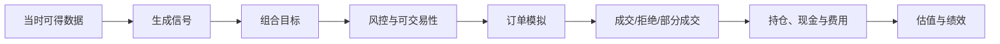

# 行情、因子与回测算法规范

## 1. 范围与业务目的

本章覆盖从逐笔/Level-2 行情到 K 线与微观结构特征、期货基差、因子清洗与中性化、IC/分组检验、相关性/衰减/容量和事件驱动回测。目标是形成可复现、点时正确、可审计的研究证据，输出 `FactorObservation`、`Signal`、`ResearchRun` 和 `BacktestRun`，而不是把一段历史拟合直接当成可交易结论。

所有结果必须经过独立验证和样本外评估；历史表现不代表未来收益，也不得以任何算法指标承诺收益。

## 2. 输入对象与时点

| 输入对象 | 关键字段 | 时点规则 |
| --- | --- | --- |
| `Instrument` / `FutureContract` | 市场、币种、合约乘数、价格精度、上市/到期 | 使用当时有效版本 |
| `TradingCalendar` / `TradingSession` | 时区、阶段、夜盘归属、临时休市 | 固定 calendar version |
| `MarketEvent` | trade/quote/order、价格、数量、方向、序号 | 交易所 `event_time` 主序，接收时间仅诊断 |
| `OrderBookSnapshot/Delta` | 档位、价量、序号、快照标志 | 按 venue/channel/session 重建 |
| `CorporateAction` | 除权、分红、拆并、停复牌 | 以公开/生效时间点时处理 |
| `UniverseMembership` | 样本、权重、纳入/剔除原因 | 双时间，禁止使用今日成分回填历史 |
| `ClassificationMembership` | 行业、风格、地区 | 双时间 |
| `FinancialMetric` / `ConsensusEstimate` | 值、币种、报告期、发布时间、修订 | `publish_time` 与 `revision_time` |
| `BorrowAvailability` | 可借、费率、期限 | 当时可得快照 |
| `FeeSchedule` / `MarginProfile` | 佣金、税、交易所费、保证金 | 当时有效版本 |

研究请求还必须固定：

- `as_of_system`、研究起止、信号时间与可成交时间；
- Universe、benchmark、频率、持有期、调仓日历；
- 价格复权、汇率、退市、停牌、涨跌停和不可成交规则；
- 成本/滑点/冲击模型、容量约束；
- `FactorVersion`、代码提交、镜像、依赖、参数和随机种子。

## 3. 行情接入与序列完整性

### 3.1 规范事件

来源事件先追加到原始层，再规范为：

```text
MarketEvent {
  venue, channel, instrument_id, event_type,
  exchange_sequence, source_time, event_time, ingest_time,
  price, quantity, side, order_id?,
  trading_date, session_id,
  source_record_ref, quality_flags
}
```

同一来源的去重键优先使用 `venue + channel + session + exchange_sequence`；无可靠序号时才使用来源事件 ID 或内容哈希，并标记较低质量。

### 3.2 序号与迟到

```text
on_event(e):
  if duplicate(e.key): discard_but_count()
  if e.sequence == expected:
      apply(e); drain_buffer()
  elif e.sequence > expected:
      buffer(e); request_gap_fill(expected, e.sequence - 1)
  else:
      route_to_late_or_correction(e)
```

- 未修复的序号缺口不得生成“完整盘口”；
- 水位线只决定实时计算何时闭窗，不改变原始事件；
- 超水位线事件进入 correction stream，派生 Bar 生成新版本；
- 来源切换保留 source ID、偏差测量和切换 Action；
- 交易日结束保存序号范围、缺口、重复、乱序和时钟偏差报告。

## 4. K 线与 Level-2 特征

### 4.1 OHLCV

对窗口 \(W=[t_0,t_1)\) 内符合交易状态和质量条件的成交：

\[
O=p_{\min event\_time},\quad
H=\max p_i,\quad
L=\min p_i,\quad
C=p_{\max event\_time}
\]

\[
V=\sum_i q_i,\qquad
A=\sum_i p_i q_i,\qquad
VWAP=\frac{A}{V}\quad(V>0)
\]

需同时记录成交笔数、买卖方向量（若来源可靠）、撤销/更正、窗口完整性和来源。无成交窗口不能伪造 OHLC；根据指标契约输出 `NotCalculated`，或显式生成 carry-forward quote bar，二者类型必须不同。

### 4.2 复权

原始成交价保持不变。研究视图使用时点可得的公司行动生成独立复权因子：

\[
P^{adj}_{t}=P^{raw}_{t}\times AF_{t}^{(version)}
\]

前复权、后复权和总回报口径分别登记。用于历史决策的复权因子不得包含当时尚未公开的公司行动。

### 4.3 盘口重建

每个 `venue + instrument + channel + session` 维持独立状态：

1. 载入带序号的全量快照；
2. 校验快照与增量衔接；
3. 按序应用新增、修改、删除；
4. 检查买价递减、卖价递增、数量非负、最优买价小于最优卖价；
5. 交叉盘、负量、孤立删除或缺口时标记 invalid 并等待重同步；
6. checkpoint 包含来源序号和校验和。

### 4.4 微观结构指标

最优买卖 \(b_1,a_1\)，对应量 \(q_b,q_a\)：

\[
mid=\frac{a_1+b_1}{2},\qquad
spread=a_1-b_1,\qquad
spread_{bps}=10^4\frac{a_1-b_1}{mid}
\]

\[
imbalance_L=
\frac{\sum_{l=1}^{L} q^b_l-\sum_{l=1}^{L}q^a_l}
{\sum_{l=1}^{L} q^b_l+\sum_{l=1}^{L}q^a_l}
\]

\[
microprice=\frac{a_1q_b+b_1q_a}{q_b+q_a}
\]

分母为零、锁盘/交叉盘、无一侧报价或盘口失效时输出明确缺失状态。订单流不平衡、撤单强度、实现波动率和价差分位数必须声明事件定义、窗口、采样频率和方向判定算法。

### 4.5 输出

- `MarketBarObservation`、`OrderBookSnapshot`；
- `MarketQualityObservation`、`LatencyObservation`；
- `ExecutionMetricObservation` 或研究特征资产；
- 序号缺口触发 `SwitchSource`/`QuarantineAsset` 提案，而不是算法直接切换生产源。

## 5. 期货基差

### 5.1 定义

对可比时点的期货价格 \(F_t\) 与现货/指数价格 \(S_t\)：

\[
basis_t=F_t-S_t,\qquad
basis\_rate_t=\frac{F_t-S_t}{S_t}
\]

若采用年化单利口径：

\[
annualized\_basis_t=basis\_rate_t\times\frac{Y}{D_t}
\]

其中 \(D_t\) 是按已登记日历口径计算的剩余天数，\(Y\) 为 365、360 或交易日年化常数。必须在 `MetricType` 中固定基差方向、合约乘数、除息/资金成本处理和日历口径。

滚动 Z-score：

\[
z_t=\frac{x_t-\mu_{t,w}}{\sigma_{t,w}}
\]

窗口只含 \(t\) 当时可得数据；\(\sigma\) 过小或有效样本不足时输出 `NotCalculated`。

### 5.2 连续合约

- 原始合约、主力映射和连续序列是不同对象；
- 换月规则、成交量/持仓量阈值、切换时刻和回溯偏移版本化；
- 回测执行必须落到当时可交易的具体合约；
- 换月成本、价差跳变和保证金变化进入成本与风险；
- 不允许用全样本事后确定“最优换月日”。

### 5.3 质量门

- 期现价格时间差不超过用例阈值；
- 现货指数成分和计算版本点时正确；
- 到期日、合约乘数、币种和交易状态有效；
- 临近到期、涨跌停、无报价或交割异常单独标记；
- 与独立参考计算在价格精度容差内。

## 6. 因子定义与样本构造

`FactorVersion` 至少声明：

- 经济/行为假设和预期方向；
- 输入资产、字段、频率、窗口和最小历史长度；
- 公布滞后、信号可用时刻和交易 lag；
- Universe 与剔除规则；
- 缺失、异常、winsorize、标准化、中性化；
- 方向、单位、频率和更新策略；
- 适用市场、资产类型和已知限制；
- 代码/表达式、测试和 owner。

样本表的最小键为：

`instrument_id + observation_time + factor_version + universe_version + input_snapshot`

任何研究过滤（上市天数、停牌、特殊处理、流动性等）都必须是点时规则，并输出剔除原因。

## 7. 因子清洗

### 7.1 缺失

缺失先按语义分类。默认不进行跨期向未来填充。可选处理必须登记：

- 丢弃对象；
- 行业/截面中位数填充；
- 仅使用过去值的有限前向填充；
- 建立 missing indicator；
- 对不适用对象保留 `NotApplicable`。

填充值和原值使用不同质量标记；敏感性测试比较不同方案。

### 7.2 去极值

稳健 MAD 示例：

\[
m=\operatorname{median}(x),\quad
MAD=\operatorname{median}(|x-m|)
\]

\[
x'_i=\operatorname{clip}(x_i,m-k\cdot1.4826MAD,m+k\cdot1.4826MAD)
\]

若 MAD 为零，按已登记回退（分位数、IQR 或不处理）。也可使用截面分位数截断，但 \(k\)/分位点必须校准并记录。所有处理只使用当期截面或过去窗口。

### 7.3 标准化

\[
z_i=\frac{x'_i-\mu}{\sigma}
\]

均值/标准差口径、权重和截面范围必须明确；\(\sigma\) 太小则该截面失败。稳健 z-score 可使用中位数/MAD，但不能混用名称。

### 7.4 中性化

加权最小二乘：

\[
x=X\beta+\epsilon,\qquad
\hat{\beta}=(X^\top W X)^{-1}X^\top W x
\]

残差 \(\epsilon\) 作为中性化因子。\(X\) 可包含行业哑变量、对数市值、国家/市场和其他获批暴露；\(W\) 的定义进入版本。

工程控制：

- 行业分类和市值必须 point-in-time；
- 共线、空行业和小样本使用 QR/SVD 或正则化，并报告条件数；
- 缺失行、权重上限和异常杠杆点可追踪；
- 输出残差均值、暴露残余和回归诊断；
- 不以中性化结果证明因果关系。

## 8. IC、分组收益与稳健性

### 8.1 IC

横截面 Pearson IC：

\[
IC_t=\operatorname{corr}(f_{i,t},r_{i,t\rightarrow t+h})
\]

Rank IC 是 Spearman 秩相关。收益窗口必须从信号可交易时刻之后开始，并与持有期、复权和不可成交规则一致。

\[
ICIR=\frac{\overline{IC}}{\sigma(IC)}\sqrt{A}
\]

其中 \(A\) 是与观测频率一致的年化因子。必须同时报告样本数、均值、中位数、标准差、t 统计的假设、正负比例、自相关和置信区间；不可只展示 ICIR。

### 8.2 分组收益

每个调仓截面按有效样本排序分成 \(G\) 组，记录 ties、组内权重和空组。组合收益：

\[
R_{g,t}=\sum_{i\in g}w_{i,t}R_{i,t}
\]

多空收益 \(R_{G,t}-R_{1,t}\) 的方向随因子定义固定。报告单调性、换手、覆盖、行业/市值暴露、成本前后收益、退市和不可成交贡献。

### 8.3 换手、衰减、相关和容量

\[
turnover_t=\frac{1}{2}\sum_i |w_{i,t}-w^{pre}_{i,t}|
\]

- 对多个 horizon 计算 IC/收益衰减，避免重叠窗口误用普通独立 t 检验；
- 因子相关按相同点时 Universe、频率和缺失规则；
- VIF/聚类只作为冗余诊断，不自动删因子；
- 容量测试逐级增加目标规模，应用 ADV/盘口参与率、借券、涨跌停和冲击模型；
- 显示参数/样本选择敏感性以及多重检验控制（如 FDR），避免 p-hacking。

## 9. 事件驱动回测

### 9.1 事件顺序



### 9.2 核心伪代码

```text
for event in replay_stream ordered by (event_time, source_sequence):
  clock.advance(event.time)
  market_state.apply(event)
  make_public_only_if(event.publish_time <= clock.time)

  if rebalance_due(clock, calendar_version):
      features = factor_function(snapshot_as_known(clock))
      signal = signal_function(features)
      targets = portfolio_function(signal, positions, constraints)
      proposals = order_simulator.create(targets, tradability_as_known(clock))

  for proposal in proposals:
      risk_decision = replay_risk_rules(proposal, state_as_known(clock))
      if risk_decision.allow:
          simulated_venue.accept(proposal)

  fills = simulated_venue.process(event, queue_and_impact_model_version)
  ledger.apply(fills, fees, corporate_actions)
  valuation.mark(clock, approved_price_policy)
```

### 9.3 成交与成本

至少包含：

- 佣金、印花税、交易所/结算费；
- 买卖价差；
- 延迟和下一个可成交价格；
- 参与率/盘口深度约束；
- 部分成交、撤单、拒单、停牌、涨跌停；
- 最小数量、整手/碎股和价格最小变动；
- 借券可得性、费率和召回；
- 期货保证金、换月和强平边界。

冲击模型参数由历史订单或保守基线校准，并提供不同冲击假设的敏感性区间。不得用成交后的全日 VWAP 来决定当时的成交量分配。

## 10. 防前视与数据泄漏

发布前自动执行：

1. 输入记录 `publish_time` 不晚于决策时刻减 lag；
2. 财务、预测和评级使用当时修订版本；
3. Universe、行业、指数成分和退市样本 point-in-time；
4. 标准化、中性化、填充和训练只使用当期或过去数据；
5. 训练/验证/测试按时间切分，滚动调参不观察未来；
6. 信号价与成交价错开，处理交易日和时区；
7. 标签构造没有通过特征窗口泄漏；
8. 缓存键包含 snapshot/as-of/version，防止复用今日结果；
9. 多资产相互影响的特征只使用当时已发布横截面；
10. 手工筛选和排除也纳入运行清单。

可实现的“时间旅行”负向测试：

```text
for every input record used by decision d:
  assert record.publish_time <= d.time - required_lag
  assert record.system_from <= run.as_of_system
```

任何违反均为 blocking failure，而非提示后继续。

## 11. 输出对象与 Action

| 结果 | 对象 | 可触发 Action |
| --- | --- | --- |
| 行情特征 | `MarketBarObservation`、`MetricObservation` | `QuarantineAsset` / `SwitchSource` 提案 |
| 基差 | `MetricObservation`、`Signal`（若批准） | 无直接交易副作用 |
| 因子截面 | `FactorObservation` | `PublishFactor` 提案 |
| 单因子检验 | `ResearchRun`、`BacktestRun` | `ApproveResearchRun` |
| 组合仿真 | `SimulationPortfolio`、`BacktestRun` | `CreateRebalanceProposal`，仅场景 |
| 报告 | `ReportRun`、`ReportArtifact` | `PublishReport`，需复核 |

`RunBacktest` 是可重放 Function/Workflow；`PublishFactor` 是带审批的 Action。回测不能直接生成生产订单。

## 12. 质量门与失败边界

### 12.1 输入门

- 行情序号、交易日、价格范围和快照完整性；
- 主数据、合约乘数、币种、日历和公司行动有效；
- Universe/分类双时间完整；
- 研究输入来源和许可可用于该用途；
- 关键字段的缺失率、延迟和冲突低于版本阈值。

### 12.2 结果门

- NaN/Inf、样本过小、截面方差为零或回归病态被显式处理；
- 持仓、现金和成交金额守恒；
- 无成本与有成本结果同时存在；
- 与独立参考实现/黄金样本在容差内；
- 样本内、样本外、不同市场阶段和敏感性结果完整；
- 极端收益由具体数据/事件解释，不允许静默 winsorize 绩效；
- 每个图表数字可追溯至运行、快照和版本。

### 12.3 典型失败

- Tick/快照缺口：隔离受影响区间，不插值伪造 Level-2；
- 价格源延迟：研究可标记降级，实时风险按政策阻断；
- 行业样本过少：合并到预定义上级或跳过，不动态窥视未来；
- 新股历史不足：`NotYetAvailable`；
- 合约临近到期：按规则换月或退出，不能外推不存在的报价；
- 退市无最终价格：使用获批估值/清算规则并单独披露；
- 回测资源中断：按分区恢复，输出未完成，不能发布部分绩效。

## 13. 版本、血缘与性能

运行清单除通用字段外，还需记录：

- 原始行情 topic/文件序号范围；
- 市场日历、主数据、公司行动、复权和连续合约版本；
- Universe/行业版本；
- 因子表达式 AST/代码、清洗/中性化参数；
- 撮合、队列、成本、冲击、借券和风险规则版本；
- 所有调参候选与选择规则，不只记录胜出参数。

性能设计：

- Tick/Level-2 以 instrument/session 分区，防止跨市场热分区；
- Flink 状态有 TTL、checkpoint、savepoint 和重同步指标；
- 因子截面按日期/市场分区，Spark/Polars 根据规模选择；
- 常用 IC/分组结果物化到 ClickHouse；
- 回测支持确定性分区并行，但同一账户/组合事件严格有序；
- 容量测试覆盖峰值行情速率、开盘突发、全市场调仓和多年回放。

## 14. 验收清单

1. 黄金 Tick 能重建相同盘口和 OHLCV，序号缺口被检测；
2. 迟到/更正事件生成可追踪新版本，不覆盖旧 Bar；
3. 基差方向、年化、到期和连续合约通过手算样例；
4. MAD、标准化和 WLS 对退化截面有确定失败语义；
5. IC、RankIC、ICIR、分组收益、换手和成本与独立实现一致；
6. 在故意注入未来财务、今日成分和同日收盘价时，泄漏门阻断；
7. 停牌、涨跌停、退市、分红、拆并、换月、借券不足和部分成交均有回放；
8. 固定快照/镜像/参数/种子重跑在声明容差内；
9. 结果页能下钻到对象、输入快照、公式、来源、质量和排除原因；
10. 发布流程完成研究复核、独立验证、风险/使用评审和审批；
11. 峰值负载的吞吐、延迟、内存、成本和恢复达到已批准 SLO；
12. 文案清楚披露限制，且无收益承诺。
