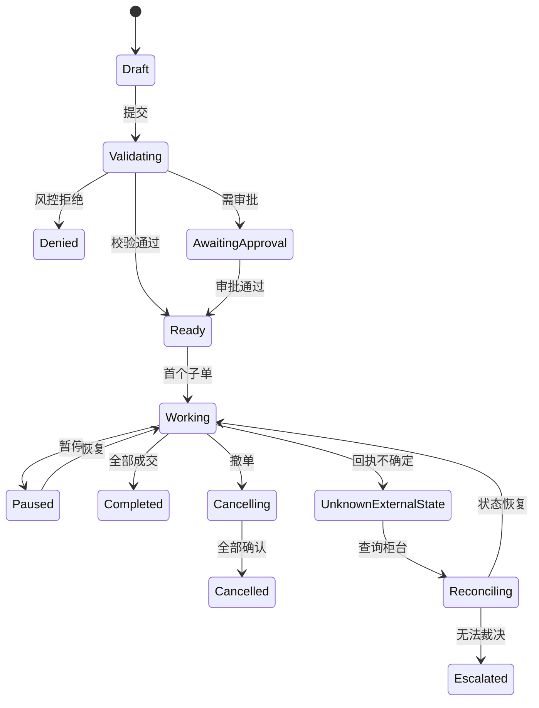

# 算法执行与交易成本分析规范

## 1. 目的、边界与风险声明

本章定义母单/子单执行、TWAP、VWAP、POV、Implementation Shortfall（IS）策略、订单状态机和交易成本分析（TCA）的可实施契约。执行算法负责在已批准的 `OrderIntent`、账户能力和风险约束内生成可审计的子单计划；它不决定投资方向，不绕过交易前风控，也不保证成交价格或收益。

任何实盘算法均需按市场、品种、账户、订单规模和行情状态独立验证，并经过模拟柜台、历史回放、影子运行、小额灰度和生产审批。本文公式是基线口径，不是收益或最优执行承诺。

## 2. 输入对象与冻结上下文

### 2.1 业务输入

| 对象 | 关键字段 |
| --- | --- |
| `OrderIntent` / `Instruction` | 目标数量/金额、方向、价格/时间约束、投资决策时间、用途 |
| `ParentOrder` | 字符串 ID、账户、标的、数量、剩余、窗口、状态、乐观版本 |
| `TradingAccount` / `AccountCapability` | 市场、业务、方向、额度、状态、环境 |
| `AlgoDefinition` / `AlgoConfig` | 策略类型、参数、适用范围、版本、审批状态 |
| `Instrument` / `Venue` | 交易单位、最小价位、价格精度、合约乘数、路由能力 |
| `TradingSession` | 集合竞价、连续竞价、休市、收盘、临时状态 |
| `Position` / `CashBalance` / `Reservation` | 可用数量、资金、冻结、时点和来源 |
| `RiskRuleSet` / `Limit` / `WatchlistEntry` | 规则、阈值、缺失策略、有效期 |
| `MarketEvent` / `OrderBookSnapshot` | 可用实时行情、质量、序号和延迟 |
| `FeeSchedule` / `BorrowAvailability` | 费用、税、可借量、费率和有效期 |

### 2.2 时间与一致性

每次算法决策 \(d_k\) 保存：

- `decision_time`：策略计算开始时刻；
- `market_as_of`：最新已完整处理的行情事件时间；
- `state_version`：持仓、现金、冻结和母单版本；
- `risk_snapshot`：同步交易前规则及输入版本；
- `calendar/session version`；
- `algo/config version`。

行情年龄、订单回执年龄或账户状态超过配置阈值时必须阻断或进入明确降级。异步仓位流可供监控，硬风控使用同步权威状态或经证明的预留机制。

## 3. 母单—子单模型

### 3.1 数量不变量

对母单目标数量 \(Q\)：

\[
Q = Q_{filled}+Q_{working}+Q_{cancelled}+Q_{remaining}
\]

其中各项均为非负，并以原始订单单位表达。由于替换、拒单、外部未知状态和重复回报可能暂时无法分类，系统可进入 `Reconciling`，但不得通过修改历史事件强行满足等式。

子单和成交分别保存原始外部状态与规范状态。19 位或更长的订单 ID 一律作为字符串，不经过 JavaScript Number。

### 3.2 母单状态机



终态还可包括 `Expired`、`Rejected`、`PartiallyCompleted`。状态转换由 `OrderEvent` 驱动；UI 不能直接 UPDATE 状态。

### 3.3 子单状态

`Planned → RiskChecking → Sending → PendingAck → Working → PartiallyFilled → Filled | Cancelling → Cancelled | Rejected | Expired | UnknownExternalState`

规则：

- 外部 `Accepted` 只表示柜台受理；
- `send_attempt_id`、客户订单 ID 和幂等键分别保存；
- `PendingAck` 超时先查询，不自动重发非幂等请求；
- 迟到成交可发生在撤单请求后，必须进入数量与资金；
- replace/cancel-replace 用新事件和版本，不覆盖原子单；
- 每个状态转换保留 source sequence、source time、ingest time 和原始回执。

## 4. 公共可交易性与约束

执行策略每个决策周期先计算 `OrderAvailability`：

\[
Q^{max}_t=\min(
Q_{remaining},
Q_{position/cash},
Q_{borrow},
Q_{risk},
Q_{participation},
Q_{venue}
)
\]

同时检查：

- 账户、网关、会话和席位健康；
- 市场阶段、停复牌、涨跌停、价格保护；
- 可用持仓、资金、保证金和冻结；
- 自成交、重复订单、频率和撤单率；
- 合规名单、集中度和策略/产品限制；
- 最小委托量、整手、价格档位和名义金额；
- 日内累计成交及其他执行单对同一资源的预留。

结果为版本化 `RiskAssessment`，包括 Allow/Deny/RequireApproval、命中规则、输入、延迟和解释。缺失策略按规则定义；关键状态缺失默认 fail-closed。

## 5. TWAP

### 5.1 业务目的

在可用时间窗内近似均匀分配数量，降低一次性冲击。适用于成交量曲线信息不足、订单相对流动性适中且市场状态稳定的场景。

### 5.2 计划

将可交易时间（排除休市和禁入阶段）分为 \(K\) 个 bucket，理想累计目标：

\[
Q_k^* = Q \cdot
\frac{\sum_{j=1}^{k}\Delta t_j}
{\sum_{j=1}^{K}\Delta t_j}
\]

第 \(k\) 期原始下单量：

\[
q_k^{raw}=\max(0,Q_k^*-Q^{filled}_{k-1}-Q^{working}_{k-1})
\]

再应用 `OrderAvailability`、最小量/整手、参与率和价格约束。舍入余量由受控 residual policy 分配，最后一段也不能突破风险/流动性限制。

### 5.3 自适应规则

- 落后计划：只在参与率、冲击和价格保护允许时追赶；
- 提前成交：减少后续量，不形成反向子单；
- 暂停/恢复：剩余数量按剩余可交易时间重算；
- 休市/临时停牌：冻结时钟或按配置失效；
- 趋近收盘仍未完成：执行、展期或放弃由父单策略决定，不能隐式变为市价单；
- 随机化间隔/数量若启用，记录种子并限制范围。

## 6. VWAP

### 6.1 业务目的

按预估市场成交量分布分配订单，目标是降低相对指定 VWAP 口径的偏离。预测曲线不等同于当日真实未来成交量。

### 6.2 预测曲线

对 bucket 的点时预测 \(\hat v_k \ge 0\)：

\[
\alpha_k=\frac{\hat v_k}{\sum_{j=1}^K \hat v_j},\qquad
Q_k^*=Q\sum_{j=1}^k\alpha_j
\]

\(\hat v_k\) 可由历史同星期/月份/事件特征和当日已观测量估计。模型训练只能使用历史数据；生产每次更新保存 `ModelVersion`、特征 as-of 和预测曲线。

### 6.3 控制

- 预测曲线缺失/异常可按审批配置降级 TWAP；
- 当日实际量与预测偏差超过阈值时再预测，但不得读取未来真实量；
- 开/收盘竞价是否参与是显式配置；
- 大宗成交、异常打印和跨市场量是否计入 benchmark 需与 TCA 一致；
- 当前累计目标减已成交/工作量后才生成新子单；
- 参与率、价差、波动和盘口深度形成动态上限。

## 7. POV

### 7.1 业务目的

把本单成交量控制在已观测市场成交量的一定比例 \(\rho_t\) 内，随市场活跃度伸缩。

以只包含已完整处理市场成交的累计量 \(V_t^{mkt}\)：

\[
Q_t^*=\min(Q,\rho_t V_t^{mkt})
\]

\[
q_t^{raw}=\max(0,Q_t^*-Q_t^{filled}-Q_t^{working})
\]

### 7.2 关键边界

- 市场量必须排除本单成交或避免双计；
- 成交量事件迟到/缺口时暂停或用批准的保守估算；
- 极低成交量时允许最小启动量与否必须显式；
- \(\rho_t\) 有下/上限，并可由价差、波动、剩余时间和风险收紧；
- 市场突然放量时仍受单次量、消息频率和盘口深度控制；
- 多算法账户需共享参与率预算，防止各自都满足局部上限而总体超限。

## 8. Implementation Shortfall 策略

### 8.1 目标

在机会成本、显性/隐性交易成本和价格风险之间权衡。该策略依赖预测与校准，比 TWAP/VWAP 风险更高，须更严格的模型验证。

概念目标：

\[
\min_{\{q_k\}}
\mathbb{E}[C(\{q_k\})]
+\lambda\operatorname{Var}[C(\{q_k\})]
+\phi\,\mathbb{E}[OpportunityCost]
\]

约束：

\[
\sum_k q_k \le Q,\quad
0\le q_k\le Q^{max}_k
\]

并满足会话、方向、价格、参与率、现金/持仓、借券和风险规则。

可将临时冲击、永久冲击、价差、费用、波动率和剩余期限纳入模型；具体函数形式、参数估计和市场适用性属于 `ModelVersion`，不能在多市场无验证复用。

### 8.2 滚动求解

```text
on_decision_cycle(state):
  assert market_data_fresh_and_complete()
  remaining = parent.quantity - filled - cancelled
  constraints = availability_and_policy(state)
  forecasts = load_versioned(volatility, volume, spread, impact)
  schedule = solve_expected_cost_risk(remaining, forecasts, constraints)
  child = discretize_and_round(schedule.next_slice, venue_rules)
  if child > 0:
      submit_action_proposal(child, state.version, risk_assessment)
```

每次重算保留旧计划、触发原因和预测变化。求解失败按批准策略降级 TWAP、暂停或人工接管；不能使用未校验默认参数继续。

## 9. 子单定价与路由

定价策略可包括：

- best bid/ask、mid、限价偏移；
- 被动/主动切换；
- tick rounding；
- 价格保护相对 arrival/mid/limit；
- 撤换等待和最小驻留时间；
- 盘口深度与预估排队位置。

路由评分示例：

\[
score_v =
w_1 P(fill|v)
-w_2 E[cost|v]
-w_3 latency_v
-w_4 rejectRisk_v
\]

所有特征均为决策时可得；路由能力、费率、市场规则和连接健康有版本与有效期。模型评分仍受静态允许市场/券商列表约束。

## 10. Action 执行与幂等

### 10.1 Action

- `SubmitParentOrder`：验证已批准母单；
- `SubmitChildOrder`：带母单版本、决策和风险快照；
- `PauseOrder` / `ResumeOrder`；
- `CancelOrder`；
- `ChangeAlgoConfig`：通常只对未执行余量生效；
- `EscalateUnknownOrderState`。

每个 Action 记录 actor（人或服务）、purpose、environment、expected version、idempotency key、policy decisions 和 external receipts。Agent 只能创建提案，不能作为最终批准者。

### 10.2 幂等与未知状态

```text
submit(child, key):
  if action_store.has_terminal(key): return stored_receipt
  reserve(parent, account, quantity, expected_version)
  write_outbox(child, key)
  send_to_gateway()
  if timeout_before_ack:
      mark UnknownExternalState
      query_by_client_order_id()
      do_not_resend_until_resolved()
```

数据库提交与事件发布使用 transactional outbox/inbox。外部回执去重后追加，不依赖 exactly-once 网络幻觉。

## 11. TCA 口径

### 11.1 符号

令买入 \(s=+1\)，卖出 \(s=-1\)，数量 \(q_j>0\)，成交价 \(p_j\)，指定 benchmark \(P_b\)。以“正数表示更差”为统一口径：

\[
cost_{bps}(P_b)=10^4
\frac{s\left(\frac{\sum_j q_jp_j}{\sum_jq_j}-P_b\right)}{P_b}
\]

费用 bps：

\[
fee_{bps}=10^4
\frac{\sum_j fee_j}{P_b\sum_jq_j}
\]

总成本需明确是否含税费、汇率和借券费。

### 11.2 Benchmark

| Benchmark | 定义要求 | 用途 |
| --- | --- | --- |
| Decision Price | 投资决策时可交易价格或中价 | 决策到执行全链路 |
| Arrival Price | 母单到达执行引擎时的有效 mid/quote | 执行团队可控区间 |
| Interval VWAP | 指定市场、事件过滤和时间窗的成交量加权价 | VWAP 跟踪 |
| TWAP | 指定采样与空窗口规则 | 时间均匀基准 |
| Close/Open | 官方竞价或获批价格源 | 收/开盘任务 |
| Limit Price | 母单价格约束 | 约束偏离，不等同机会成本 |

Benchmark 缺失、行情交叉、时点过旧或市场关闭时输出 `NotCalculated`，不能使用最近价格而不披露。

### 11.3 Implementation Shortfall 归因

对目标量 \(Q\)、已执行 \(Q_e\)、未执行 \(Q_u=Q-Q_e\)，决策价 \(P_0\)，期末估值 \(P_T\)：

\[
IS_{currency}
=s\left(
\sum_j q_jp_j
+Q_uP_T
-QP_0
\right)+Fees
\]

其中未执行机会成本的期末价政策必须登记。归因可拆为：

- decision-to-arrival delay；
- arrival-to-fill execution；
- explicit fees/taxes；
- unfilled opportunity；
- FX、borrow 和 carry（若适用）。

分解之和应在舍入容差内等于总 IS；不能重复计费。

### 11.4 其他指标

- fill rate、completion time、cancel/reject rate；
- participation rate；
- spread capture/pay；
- markout：成交后 \(1s/10s/1m/5m\) 的有方向价格变化；
- adverse selection；
- child size、message rate、venue mix；
- 实际量曲线与计划量曲线偏差；
- 成本按订单规模/ADV、波动、价差、市场阶段和算法版本分层。

样本比较要控制订单难度；未经匹配或因果设计，不把算法间平均成本差解释为算法优劣因果结论。

## 12. 延迟测量

每个事件至少记录：

- client decision；
- algo receive/decision；
- risk start/end；
- gateway enqueue/send；
- broker/venue ack；
- market/execution source；
- platform ingest；
- UI publish/render。

分解：

\[
L_{e2e}=L_{client}+L_{algo}+L_{risk}+L_{queue}
+L_{network}+L_{broker/venue}+L_{return}+L_{publish}
\]

时钟需 PTP/NTP 监控；跨主机无法证明同步时不做虚假细分。报告 P50/P95/P99/max、丢样率和时钟质量，不只报告均值。

## 13. 输出对象

| 输出 | 内容 |
| --- | --- |
| `ChildOrder` | 计划/实际量价、来源母单、算法决策、路由、版本 |
| `OrderEvent` | 状态转换、原始/规范状态、序号与时间 |
| `Execution` | 成交量价、费用、venue、回执 |
| `ExecutionMetricObservation` | benchmark、方向成本、延迟、markout、参与率 |
| `RiskAssessment` | 规则、输入、决定、解释和时延 |
| `ResearchRun` | 仿真、回放或参数校准证据 |
| `AlgoPerformanceReport` | 分层统计、置信区间、限制和异常样本 |

指标的母单、子单、成交粒度不能混用；附件中类似 `VMAP` 的名称必须经业务确认是 `VWAP` 拼写还是独立指标后再入 `MetricType`。

## 14. 质量门与故障处理

### 14.1 交易前阻断

- 父单版本陈旧或数量不守恒；
- 账户/网关/市场状态未知；
- 行情超新鲜度、序号缺口或交叉盘；
- 资金、持仓、借券或保证金不足；
- 风控规则失败、超时或缺失策略要求拒绝；
- 算法配置未批准、超适用范围或参数越界；
- ID、币种、单位或合约乘数无法解析。

### 14.2 运行故障

- 行情断流：停止新子单，按策略保留或撤销工作单；
- 网关超时：进入 `UnknownExternalState` 并主动查询；
- 风控服务不可用：高风险 fail-closed；
- 算法进程重启：从事件、checkpoint 和外部查询恢复，禁止重复发单；
- 市场临时停牌/休市：冻结计划并重新计算剩余可用时间；
- 成交回报迟到：追加并触发对账/重算，不修改历史；
- 预测漂移：收紧上限、降级或暂停，保留告警和决策。

### 14.3 TCA 质量

- benchmark 覆盖率、行情质量和订单/成交对账通过；
- 费用、汇率、合约乘数和买卖符号正确；
- 未成交和撤销纳入分母的口径明确；
- 极端值可下钻，不静默删除；
- 样本选择、排除和分层可重现；
- 报告生成时点后到达的回执生成新版本。

## 15. 版本、血缘、性能与验收

### 15.1 版本与血缘

每个子单可追溯至：

`Instruction → ParentOrder → AlgoDefinition/Config → Market/State/Risk Snapshot → Decision → SubmitChildOrder Action → Gateway Receipt → Execution → TCA Metric`

保存：

- 代码/镜像、参数、预测模型、费率/冲击/日历版本；
- 行情序号范围与质量；
- 风控规则和策略判定；
- 每次重算的旧/新计划和原因；
- 网关协议/适配器版本；
- TCA benchmark 和归因版本。

### 15.2 性能

- 交易关键路径单独压测并从柜台/网络总预算倒推服务预算；
- 预交易同步路径不依赖大规模 OLAP/图/LLM；
- 以账户/父单键保持事件有序，跨单可并行；
- 使用背压、限流、优先级队列和隔离舱；
- 开盘/收盘突发、行情倍速、回执乱序和网关雪崩均需容量测试；
- UI 更新目标与真实交易路径解耦，监控延迟不影响执行。

### 15.3 验收

1. 母/子单状态机的合法与非法转换通过模型测试；
2. 重复提交、超时、迟到成交、撤单后成交和重启不产生重复订单；
3. TWAP 在不同会话/暂停/舍入条件下满足累计计划与约束；
4. VWAP 只使用当时预测和已观测量，故意注入未来全日量时被测试捕获；
5. POV 在多算法共享账户下不突破总参与率；
6. IS 求解失败按批准策略降级，并留下原因；
7. 所有策略都不能突破账户、风险、价格、市场和流动性硬约束；
8. TCA 符号、费用、IS 分解和 benchmark 通过手算黄金集；
9. 订单难度分层、异常样本和置信区间出现在绩效报告；
10. 峰值 P99、吞吐、恢复点和未知外部状态处置达到已批准 SLO；
11. 全链路血缘、策略判定、原始回执和人工接管可审计；
12. 上线完成仿真、回放、影子、小额灰度、独立验证和审批，且文案无收益承诺。
