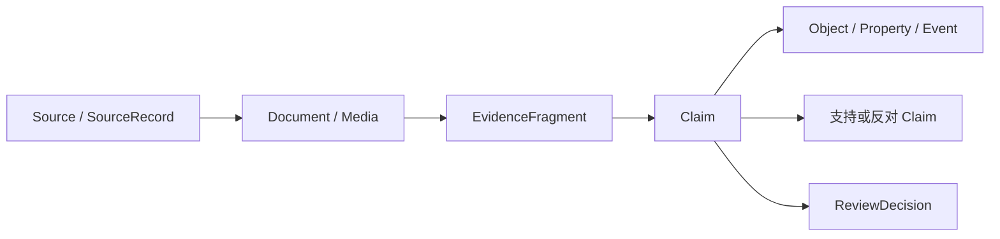
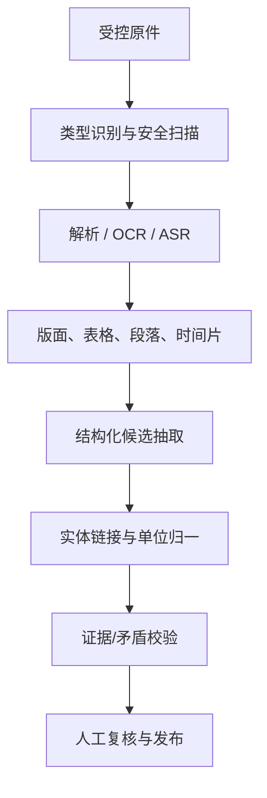
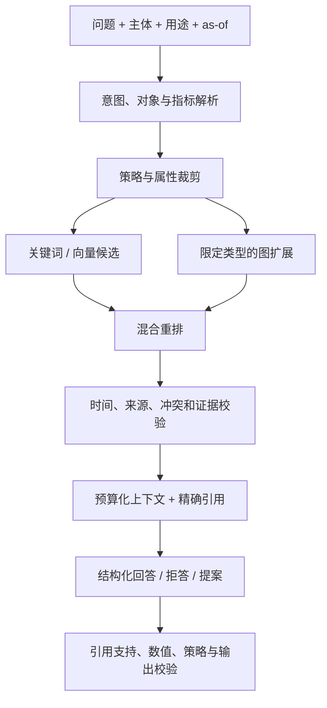

# 图算法、证据图、GraphRAG 与文档智能规范

## 1. 目的与系统边界

本章定义图投影、实体链接、风险路径、事件影响、证据图、文档/多媒体抽取、权限感知 GraphRAG 和 LLM/Agent 评测。目标是让每个候选事实、关系、回答和动作建议都能定位到本体对象、有效时间、来源和精确证据。

图数据库、搜索索引和向量库都是本体权威事实的可重建投影，不是独立真源。LLM 负责抽取候选、检索辅助、解释和 Action 提案；未经验证不得成为金融事实黄金属性，不得无人提交实盘订单、解除风险限制、修改权限或发布法定/合规结论。

所有预测、评分、图传播和 LLM 输出均需按用例验证，不构成投资建议或收益承诺。

## 2. 输入对象与投影契约

### 2.1 对象

| 域 | 主要对象 |
| --- | --- |
| 主数据 | `Party`、`Issuer`、`Instrument`、`FundProduct`、`TradingAccount` |
| 交易与风险 | `ParentOrder`、`Execution`、`Position`、`RiskAlert`、`WatchlistEntry` |
| 公司与事件 | `CompanyProfile`、`Disclosure`、`CorporateEvent`、`Theme` |
| 证据 | `Source`、`Document`、`MediaItem`、`EvidenceFragment`、`Claim`、`Citation` |
| 研究 | `ResearchReport`、`Thesis`、`FactorVersion`、`Signal` |
| 平台 | `DatasetSnapshot`、`FunctionVersion`、`ModelVersion`、`PromptVersion`、`AgentRun` |

### 2.2 时间

每次图/检索请求必须携带：

- `as_of_valid`：关系/事实在业务世界的有效时点；
- `as_of_system`：平台在何时已知该版本；
- `query_time`：执行查询的实际时间；
- `purpose`、`environment`、调用主体与委托链。

边和节点保留 `valid_from/to`、`system_from/to`、source、evidence、quality 和 classification。默认“当前”必须在 API/界面明确显示，不允许用今天的关系回答历史问题。

### 2.3 图投影

投影键使用 canonical object ID，不使用供应商内部 ID 作为公开契约。投影事件：

```text
ObjectVersionPublished
LinkVersionPublished
ObjectVersionRetracted
PermissionLabelChanged
EvidenceLinked
```

每个投影快照记录 ontology release、数据 snapshot、策略标签版本、构建代码和校验和。图、全文和向量索引必须能从权威快照完全重建。

## 3. 权限感知查询

### 3.1 强制规则

查看一条边需同时满足：

1. 可查看 link type；
2. 可查看起点；
3. 可查看终点；
4. 可查看返回属性/证据；
5. purpose、environment、有效期和地域策略匹配。

不能先取全图再仅在 LLM 上下文中删除隐藏节点，因为候选数量、路径长度、聚合值和耗时都可能泄露信息。优先在存储查询/候选生成阶段执行同等策略过滤。

### 3.2 聚合防推断

- 小群体计数设置最小阈值或返回范围；
- 禁止通过两次相近过滤做差分反推；
- centrality、community 和风险传播只在调用者可见子图上展示，或发布经审批的预计算脱敏指标；
- 缓存键包含主体授权摘要、purpose、as-of、ontology release 和策略版本；
- 权限变化使相关缓存和索引文档失效；
- `WithheldByPolicy` 与“无数据”在审计层分开，用户界面按策略呈现。

## 4. 图增强实体解析

通用规范见《算法工程总规范》。图增强阶段用于主键/文本特征不足时利用邻域一致性，但不能让错误边自我强化。

### 4.1 候选与特征

候选阻塞可使用：

- 同市场/对象类型/地域；
- 规范名称 token、代码前缀、法人后缀；
- 共同发行人、董事、地址、账户、持仓或文档上下文；
- 历史 `ExternalIdentifier` 和有效期。

特征：

\[
features(x,y)=
[id,\ name,\ address,\ attributes,\ temporal,\ neighbor,\ source]
\]

评分：

\[
s(x,y)=\sigma(w^\top features(x,y))
\]

若使用学习模型，训练标签快照、负样本生成、类别不平衡、阈值和校准曲线进入 `ModelVersion`。

### 4.2 约束

- 同一权威标识在相同有效区间不能映射多个对象；
- 证券类型、交易所、法人辖区和有效期冲突形成 penalty 或硬拒绝；
- connected component 不自动等于一个实体；
- 一对多/多对一的公司合并、基金份额、证券换码必须用业务关系表达；
- 图邻域只使用已确认或满足高质量等级的边；
- 人工复核后保留原候选与判定证据。

### 4.3 伪代码

```text
resolve(record, as_of):
  exact = deterministic_identifier_match(record, as_of)
  if exact.conflict: return BlockedConflict(exact.evidence)
  if exact.unique: return exact

  candidates = permission_safe_blocking(record, as_of)
  for c in candidates:
      base = text_and_attribute_features(record, c)
      graph = confirmed_neighbor_features(record, c, max_hops=1)
      score[c] = calibrated_model(base, graph)
      score[c] = apply_business_constraints(score[c], record, c)

  if top_score >= auto_threshold and margin >= min_margin:
      return ProposedLink(top, explanation, evidence)
  if top_score >= review_threshold:
      return ReviewQueue(ranked_candidates)
  return Unmatched
```

### 4.4 质量与验收

- 按对象类型/来源/语言/市场分层的 precision、recall、校准误差；
- 自动合并优先满足经批准的高 precision 门；
- 代码复用、公司改名、并购拆分、同名实体、跨市场同代码黄金集；
- 消融测试验证图特征没有由泄漏标签产生虚高；
- 合并对订单、持仓、风险和报告的影响分析；
- 权限受限节点不会出现在候选、特征解释或计数中。

## 5. 图算法目录

### 5.1 邻域与路径

基础操作：

- \(k\)-hop 邻域；
- 有类型、方向和时间限制的最短/低成本路径；
- 共同邻居、Jaccard/Adamic-Adar 等候选关系；
- 基于规则的风险路径；
- 时间切片连通性。

路径成本可定义：

\[
cost(path)=
\sum_{e\in path}
\left(
w_t typeCost_e+
w_q qualityPenalty_e+
w_a agePenalty_e
\right)
\]

只返回白名单关系、最大深度、节点预算和质量阈值内的路径。最短路径不等于最可信或因果路径，结果必须显示每条边的语义和证据。

### 5.2 中心性

可选：

- degree/weighted degree：直接关联规模；
- betweenness：最短路径桥接；
- PageRank：迭代影响；
- eigenvector：与高重要节点连接；
- temporal centrality：时间窗内的动态重要性。

PageRank 基线：

\[
PR(v)=\frac{1-d}{N}
+d\sum_{u\rightarrow v}
\frac{w_{uv}}{\sum_z w_{uz}}PR(u)
\]

边权必须有业务含义且归一化。悬挂节点、孤立节点、多关系权重和收敛容差进入版本。中心性是网络结构指标，不等于信用、风险、重要性或违法概率。

### 5.3 社区与聚类

Louvain/Leiden 等可用于发现关系密集群组；运行必须固定：

- 图快照、关系白名单和边权；
- resolution、随机种子和实现版本；
- 最小社区、稳定性和多次运行一致性；
- 已知行业/集团标签只用于评估，不在无声明时作为训练泄漏。

社区结果为 `GraphFinding` 候选，需要业务解释与证据，不自动创建 Party 集团或风险名单。

### 5.4 风险路径与传播

规则型传播优先：

```text
propagate(seed_event):
  frontier = [(seed_object, 1.0, [])]
  while frontier and budget_not_exceeded:
    node, score, path = pop(frontier)
    for edge in allowed_edges(node, as_of, permission):
      next_score = score * edge.confidence * type_attenuation(edge.type)
      if next_score >= threshold and not violates_cycle_policy(path, edge):
        emit_candidate(edge.target, next_score, path + edge)
```

传播参数：

- 关系类型、方向、最大 hop；
- 时间衰减与有效期；
- 边质量/证据置信；
- 所有权比例、持仓权重或供应依赖等业务权重；
- 环路、重复路径和上限；
- 事件类型与影响类型映射。

多路径合并可采用上限和去相关规则；简单相加会重复计算同一证据。输出是 `RiskAlert`/`ImpactCandidate` 提案，不是确定因果判断。

## 6. 证据图

### 6.1 模型



`Claim`：

`subject + predicate + object/value + valid time + source + evidence + confidence + review state`

`EvidenceFragment` 精确到：

- 数据集 snapshot/row/column；
- PDF/文档页、段、字符范围；
- 图像 bounding box；
- 音视频 start/end time；
- API/message ID 与来源序号。

### 6.2 声明状态

`Candidate → NeedsReview → Confirmed | Rejected | Conflicting | Unsupported → Obsolete`

- `Confirmed` 仅表示在指定口径和时点经复核；
- 更正/撤回生成新状态与关系，不删除旧证据；
- `supports`、`refutes`、`qualifies`、`supersedes` 分开；
- 同一 EvidenceFragment 可支持多个 Claim，但每个绑定具体定位；
- 模型生成摘要不是原始证据。

### 6.3 证据排序

候选排序可组合：

\[
score=
w_a authority+
w_r relevance+
w_t temporalFit+
w_q quality+
w_c citationPrecision
\]

来源权威等级、时效与相关性分开呈现。多个相互转载的来源不能当作独立佐证；通过 `derivedFrom`/内容指纹识别来源依赖。

置信合并不得假设来源独立。高风险事实优先使用规则：权威源、时间有效、多源一致、人工裁决；统计分数只是排队辅助。

### 6.4 冲突

冲突检测比较：

- 同 subject/predicate/time 的互斥值；
- 同文档后续更正；
- 数值单位/币种/报告期不一致；
- 来源发布时间与有效时间；
- Claim 的否定或限定关系。

输出 `ConflictingClaimSet`、候选值、来源、差异和 `ResolutionPolicy`；模型不能静默选择更“像答案”的值。

## 7. 文档与多媒体抽取

### 7.1 接入

`Document`/`MediaItem` 保存：

- 原件的受控 `MediaReference`，不把二进制放入对象 JSON；
- MIME、大小、hash、版本、语言、来源和许可证；
- source/publish/ingest/revision time；
- 安全分类、保留和用途；
- 解析器/OCR/ASR 可用性。

接入先进行病毒、宏、压缩炸弹、MIME 欺骗、恶意 PDF、外部链接和资源限制检查。不可信文档在沙箱中处理。

### 7.2 解析流水线



步骤：

1. **解析**：原生文本优先；扫描件 OCR；音视频 ASR 并保留时间片；
2. **版面**：标题、段落、脚注、表格单元、页码、阅读顺序和图片框；
3. **切片**：按语义/版面边界，保留父文档和重叠范围，不仅按 token 等长切；
4. **抽取**：用 Schema 约束实体、事件、指标和 Claim candidate；
5. **归一**：日期、币种、单位、负号、百分比、报告期和范围；
6. **链接**：产生 entity candidates，不自动合并；
7. **验证**：证据跨度、数值复算、跨页表头、否定词、冲突和引用；
8. **复核**：按风险/置信分级队列；
9. **发布**：只发布通过门的对象/Claim，保留模型失败和原件引用。

### 7.3 表格与数值

- 表头层级、单位、币种和脚注绑定到单元格；
- 括号负数、千/万/亿、百分比和小数点本地化；
- 合并单元格、跨页表、重复页眉和空白含义；
- 公式值与显示值分开；
- 原文值、规范值和转换公式共同保存；
- 关键财务数值用规则/第二解析器交叉验证；
- 总计与分项守恒、同比/环比可复算时执行检查。

### 7.4 图像、音频与视频

- OCR fragment 保存页/帧、bounding box 和文字置信；
- ASR fragment 保存开始/结束、说话人候选和置信；
- 视频关键帧与对应音频时间轴对齐；
- 人脸/声纹属于高敏能力，不作为默认实体链接方法；
- 无法证明人物身份时只建立候选；
- 画面内图表数值抽取需图表专用评测和人工复核；
- 所有派生缩略图/转码继承原件权限、许可和保留策略。

### 7.5 提示注入

文档内容永远视为数据，不是系统指令：

- 删除/标记隐藏文本、脚本和外部调用提示；
- 模型系统指令明确忽略文档内工具/权限请求；
- 工具调用只通过 allowlist、参数 Schema 和 Policy；
- 检索片段不能改变主体、purpose 或 as-of；
- 用含恶意指令、编码混淆、二维码和跨文档注入的语料回归。

## 8. 权限感知 GraphRAG

### 8.1 查询流程



### 8.2 意图与查询计划

计划至少包含：

- 目标 ObjectType/MetricType；
- valid/system time；
- 关键词、结构化过滤、向量字段；
- 允许扩展的 LinkType、方向、hop 和节点预算；
- 来源等级、语言、许可和新鲜度；
- 预期输出 Schema；
- 是否允许 Action proposal。

涉及“当前”“最新”时要解析为明确时点并显示数据更新时间。若问题时点不明确且会改变答案，要求用户确认或返回分时点结果。

### 8.3 混合候选

候选来自：

- 结构化对象/指标查询；
- BM25/全文；
- 向量语义；
- 图邻域；
- 精确代码/标识符；
- 权威来源优先队列。

可用 reciprocal rank fusion：

\[
RRF(d)=\sum_m\frac{w_m}{k+rank_m(d)}
\]

随后用 cross-encoder/规则重排，但加入：

- 时间匹配；
- 来源权威与许可；
- 证据定位可用；
- 多样性与去重；
- 冲突保留；
- 权限标签。

任何学习排序模型需评测对新来源、语言和长尾对象的偏差。

### 8.4 图扩展

- 从已授权 canonical objects 出发；
- LinkType 白名单和方向固定；
- 默认 1–2 hop，超出需用例批准；
- 节点/边/时间/Token 多重预算；
- 环路和重复路径去重；
- 每条路径保存关系语义、有效期和证据；
- 不能将“共同出现”当作所有权、因果或关联交易。

### 8.5 上下文组装

上下文单元：

```text
ContextItem {
  object_ids, claim_ids, fragment_id,
  source_id, source_time, publish_time,
  valid_interval, system_interval,
  content, classification, license,
  retrieval_scores, quality_flags
}
```

按 Claim/证据而非孤立文本拼接；长表提供查询结果和来源行，不把整张表塞入 Prompt。冲突证据并列，缺少高权威来源时明确说明。

### 8.6 生成与验证

输出必须符合 JSON/对象 Schema，包括：

- `answer`；
- `claims[]` 与 `citations[]`；
- `as_of`；
- `assumptions`；
- `uncertainties/conflicts`；
- `not_found`；
- `action_proposal?`。

验证器：

- 每个可验证声明至少有 citation；
- citation fragment 确实包含支持内容；
- 对数值重新查询/计算并检查单位；
- 不出现不可见对象 ID、属性或计数；
- 不把候选 Claim 表述为已确认；
- 无证据/冲突无法裁决时拒答或限定；
- Action 参数通过 Schema/Policy，且高风险只创建提案。

## 9. LLM 与 Agent 使用边界

### 9.1 允许

- 公告、财报、新闻、研报的实体/事件/Claim 候选；
- 证据型对象问答；
- 风险告警聚合与处置提案；
- 研究/因子质量摘要；
- 报告草稿和引用检查；
- 数据、本体和运维诊断辅助；
- 只读函数调用和受控场景计算。

### 9.2 禁止默认开放

- 自主提交实盘订单或改变目标持仓；
- 解除/绕过风险和合规限制；
- 直接修改生产身份、权限、本体或数据真源；
- 无复核发布法定披露、净值或合规结论；
- 无证据创建金融事实；
- 把用户提示或文档内容提升为系统权限。

### 9.3 Agent 运行

```text
agent_run(request):
  bind(subject, purpose, environment, as_of)
  plan = constrained_planner(request, allowed_tools)
  for step in range(max_steps):
      if budget_exceeded: return EscalateOrPartial
      call = validate_tool_call(plan.next, schema, policy)
      receipt = execute_read_or_scenario(call)
      append_immutable_tool_call(receipt)
      if call.proposes_side_effect:
          return ActionProposal(receipt, required_approvals)
  return validate_and_cite(final_answer)
```

复杂长流程由 Temporal/领域状态机持久化；Agent 是可替换的决策/提案 Activity，不能作为业务工作流真源。

## 10. 评测体系

### 10.1 数据集

评测集按以下维度分层：

- 角色、权限、purpose 和环境；
- 市场、资产、行业、语言和文档类型；
- 历史时点、修订、冲突和撤回；
- 常见、长尾和零样本对象；
- 图深度、关系类型和来源等级；
- 正常、恶意注入、越权、空证据和工具失败；
- 高风险数值、动作和合规边界。

每个样例固定数据/本体/索引快照、预期证据、允许答案范围和拒答条件。生产反馈不能未经去敏、授权和标签复核直接进入训练集。

### 10.2 实体解析

- pair precision/recall/F1；
- cluster precision/recall；
- 自动链接 precision；
- 未匹配率、人工复核率；
- Expected Calibration Error；
- 各来源/市场/语言差异；
- 错误合并下游影响。

### 10.3 文档抽取

- OCR character/word error rate；
- 版面/表格结构准确率；
- 实体、关系、事件 precision/recall/F1；
- 数值、单位、币种、日期准确率；
- evidence span IoU/精确匹配；
- Claim polarity、否定和修订识别；
- 跨页表、脚注、扫描件和音视频时间片覆盖。

关键金融数值以字段级 precision 门为主，不能用总体 token 分数掩盖。

### 10.4 检索与图

- Recall@k、MRR、nDCG；
- 权威来源覆盖率；
- 时间正确率；
- 冲突保留率；
- 路径有效/可解释率；
- 引用定位准确率；
- 权限泄漏率（目标为零）；
- P50/P95/P99 与候选规模/图预算。

### 10.5 生成

- factual support rate；
- citation completeness/precision；
- 数值/单位一致率；
- structured output pass rate；
- 正确拒答率与过度拒答率；
- 冲突/不确定性披露；
- 跨轮/改写稳定性；
- 人工修正率。

“答案看起来合理”不是验收指标。事实支持由证据和独立校验判断，不用同一生成模型自评作为唯一裁判。

### 10.6 工具与 Agent

- 任务成功率；
- 工具选择和参数正确率；
- 未授权工具调用率；
- 重复副作用率（目标为零）；
- 每任务步骤、Token、延迟和成本；
- 人工接管率及接管时点；
- Action proposal 的接受/拒绝/修改率；
- 策略、超时、依赖失败和补偿正确性。

### 10.7 在线监控

- 输入/输出分布、来源和语言漂移；
- 检索零结果、低证据和冲突率；
- 模型/Prompt/工具/本体版本分层质量；
- 引用点击、用户纠正和撤回；
- 权限拒绝、可疑查询和注入；
- 时延、Token、GPU/CPU、成本和限额；
- 模型供应商/端点失败与回退；
- 高风险提案和人工审批结果。

## 11. 质量门、失败与降级

### 11.1 发布门

| 能力 | 阻断条件 |
| --- | --- |
| 图投影 | 与权威对象/边数量、版本或权限标签不一致 |
| 实体链接 | 自动阈值 precision 未达标或确定性 ID 冲突 |
| 文档抽取 | 原件 hash/定位缺失，关键字段准确率未达标 |
| GraphRAG | 权限泄漏非零、时间错误、引用支持率低于阈值 |
| Action proposal | 参数/策略/证据/审批链不完整 |
| 模型升级 | 关键分层回归、成本或时延超预算且无批准 |

### 11.2 失败语义

- 图/搜索/向量投影落后：显示 snapshot age；高风险查询切回权威查询或阻断；
- 向量服务不可用：降级全文/结构化搜索并标记；
- 图服务不可用：关闭关系扩展，不伪造路径；
- OCR/解析失败：保留原件和失败原因，进入人工队列；
- citation verifier 失败：删除未支持声明或拒答；
- LLM 超时/限额：返回已验证的结构化事实或可重试任务；
- 模型供应商切换：只有兼容、评测通过的版本可自动回退；
- 权限服务不可用：受限数据 fail-closed；
- 外部网页/来源变化：固定抓取版本、hash 和时间，不静默替换证据；
- 工具外部状态未知：升级，不重放副作用。

### 11.3 边界

- 同名实体且证据不足：保持候选；
- 间接关系：明确 hop 与路径，不写成直接关系；
- 相关不等于因果；
- 来源转载：去重来源家族；
- 文档修订：新 Claim 状态，不覆盖旧回答审计；
- 权限裁剪后证据不足：拒答而非猜测；
- 模型知道但检索未提供的事实：不作为有证据答案；
- 数值有多个单位/口径：要求确认或并列；
- 图算法在小图/断裂图不稳定：显示覆盖和置信；
- 语言/扫描质量超评测范围：降级人工。

## 12. 输出对象与 Action

| 能力 | 输出对象 | Action |
| --- | --- | --- |
| 实体解析 | `LinkEntityCandidate`、`PartyAlias` / `ExternalIdentifier` proposal | `MergeEntity` / `CorrectInstrument`，需 steward |
| 图发现 | `GraphFinding`、`ImpactCandidate` | `CreateRiskCase` / `AddWatchlistEntry` 提案 |
| 文档抽取 | `ExtractionRun`、`EvidenceFragment`、`Claim` candidate | `ConfirmClaim` / `RejectClaim` |
| GraphRAG | `AgentRun`、`Citation`、结构化 answer artifact | 无副作用或 `CreateActionProposal` |
| 风险解释 | `RiskExplanation`、证据包 | `ProposeMitigation` |
| 报告草稿 | `ReportArtifact` draft | `PublishReport`，需作者/合规复核 |

工具调用记录 `AgentRun → ToolCall → Function/Action`，包含参数摘要、版本、策略判定、结果和成本。

## 13. 版本与端到端血缘

每次结果保存：

- ontology release、对象/边 snapshot、权限策略版本；
- 文档原件 hash、解析/OCR/ASR 版本；
- embedding 模型、chunker、索引和向量归一版本；
- 搜索分析器、同义词、ranking/RRF/cross-encoder 版本；
- 图投影、算法、参数、种子和图快照；
- LLM、adapter、量化、Prompt、输出 Schema；
- 工具注册表与每个 Function/Action 版本；
- 评测集、守卫和 citation verifier 版本；
- 主体、purpose、as-of、检索候选 ID 和权限裁剪摘要；
- 输出、证据、人工复核、反馈和后续 Action。

血缘：

`Original Media/Data → Parser/OCR → Fragment → Claim Candidate → Entity Link → Ontology Object/Link → Retrieval/Graph Path → LLM Claim/Citation → Human Decision/Action`

## 14. 性能与容量

- 图查询强制 max hops、max nodes/edges、timeout 和 cost estimate；
- 高复用关系按 ontology snapshot 预物化，实时变化使用增量投影；
- 搜索按 tenant/classification/time 分区或过滤，避免应用层全量裁权；
- embedding 异步批处理，内容 hash 去重；模型升级双索引迁移；
- 文档解析按页/媒体分片，带 CPU/内存/时长限制和隔离队列；
- GraphRAG 分配检索、图、重排、LLM 与验证各阶段时延预算；
- 上下文按证据价值和 Token 预算裁剪，不能以截断丢失引用；
- 模型调用有并发、Token、费用和地域配额；
- 缓存包含主体授权、purpose、as-of 和完整版本向量；
- 压测覆盖高连接节点、长文档、跨页表、多语言、批量问答、权限变化和索引重建。

服务目标按用例分层：对象/混合检索通常秒级；大图分析、长文档抽取和批量评测为异步作业。不得让在线交易硬风控同步依赖 LLM、向量或大图遍历。

## 15. 验收清单

1. 图、搜索和向量投影可由指定权威快照重建，并通过对象/边/权限一致性校验；
2. 历史 as-of 查询不会看到未来关系、修订或当前权限外对象；
3. 实体解析在同名、改名、代码复用、并购拆分和多语言集上达到分层阈值；
4. centrality/community/path 结果固定快照可复现，并显示关系、时间、权重和限制；
5. 风险传播在环路、多路径和低质量边下不重复放大；
6. Claim 能精确定位数据行/文档字符/图片框/音视频时间片；
7. 表格的单位、币种、负号、脚注和跨页结构通过黄金样本；
8. 恶意文档指令、隐藏文本、越权工具和提示注入被阻断；
9. GraphRAG 的 Recall@k、时间正确、冲突保留、引用支持和拒答达到阈值；
10. 权限负向集中的对象、属性、边、证据、计数与缓存泄漏率为零；
11. 数值回答由独立查询/计算验证，候选 Claim 不冒充确认事实；
12. 模型/Prompt/embedding/本体/工具任一变更触发对应回归；
13. Agent 达到最大步数、费用或超时时可安全停止，且不重复副作用；
14. 所有高风险输出仅形成 Action proposal，审批和审计链完整；
15. 峰值 P95/P99、吞吐、成本、索引延迟、降级和恢复达到批准 SLO；
16. 独立验证、局限、漂移监控、回退和复审周期已就绪；
17. 用户界面明确区分来源事实、模型候选、人工确认和生成摘要；
18. 任何金融推断均披露适用范围，不提供收益保证。
