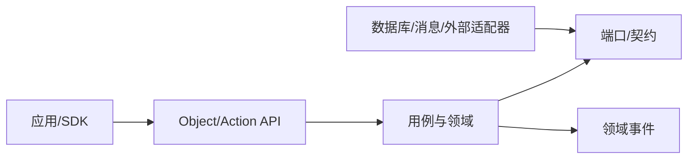

# 工程实现总纲

## 1. 目标

本章把[目标总体架构](../01-architecture/00-target-architecture.md)、[技术选型](../02-technology/00-selection-summary.md)和[金融本体](../04-ontology/00-method-meta-model.md)落实为可构建、可验证、可运营的工程体系。工程目标不是“把现有页面重新开发一次”，而是建立一条从业务语义到运行证据的连续链路：

`需求/法规 → 本体类型 → 数据契约 → 函数/策略 → 动作/工作流 → API/事件 → 应用 → 测试 → 发布 → 观测/审计`

每个生产能力必须有稳定所有者、版本、服务等级、风险等级、测试证据、运行手册、恢复方案和退役路径。

## 2. 工程原则

1. **本体先于页面**：对象、链接、动作和指标是跨应用契约；页面是其受权限控制的投影。
2. **状态写入有唯一责任方**：每个业务聚合只有一个权威写模型，其他系统通过 API、事件或物化视图协作。
3. **动作承载副作用**：有外部或业务副作用的操作必须经过 Action Service；函数保持只读、确定或明确声明非确定性。
4. **异步不等于不确定**：事件、长任务和跨域流程必须有幂等、顺序、超时、补偿、核对和人工介入语义。
5. **权限随语义传播**：对象、属性、链接、函数、动作、搜索、向量、导出和 Agent 工具使用统一授权上下文。
6. **证据是交付物**：代码、数据、本体、策略、模型和配置的发布都产生可追溯证据。
7. **交易关键路径独立治理**：OMS、RMS、行情与柜台适配器使用独立容量、故障域、发布窗口和恢复目标。
8. **开放格式与可退出**：公共契约使用 OpenAPI、Protobuf、AsyncAPI、Parquet/Iceberg 等开放格式；供应商能力通过适配器隔离。

## 3. 工程制品模型

| 制品 | 真源 | 发布产物 | 关键门禁 |
| --- | --- | --- | --- |
| Object/Link/Action/Function 定义 | 版本库中的本体声明 | Registry 版本、SDK、迁移计划 | 兼容性、主键、权限、影响分析 |
| REST/GraphQL/gRPC 契约 | OpenAPI/GraphQL SDL/Proto | 网关路由、客户端、Mock | 破坏性变化、授权负向测试 |
| 领域事件 | AsyncAPI + Schema Registry | Topic、生产/消费 SDK | Schema 兼容、幂等、PII |
| 数据产品 | 数据契约与管线代码 | Iceberg 表、流、物化视图 | 新鲜度、质量、点时和血缘 |
| 函数/指标 | 类型化定义与实现 | 可执行版本、缓存策略 | 黄金数据、精度、性能、复现 |
| 模型/提示 | 模型与评测注册 | 签名制品、服务版本 | 风险评审、评测、回退 |
| 策略 | Rego/关系模型/声明配置 | 策略包与决策版本 | 正负权限矩阵、职责分离 |
| 应用 | TypeScript/Java/Python 等代码 | 签名镜像/静态制品 | 单元、集成、E2E、可访问性 |
| 基础设施 | OpenTofu/Terraform、Helm/Kustomize | 环境计划与签名配置 | 策略即代码、漂移、恢复 |
| 运行证据 | CI/CD、观测与审计系统 | ReleaseEvidence/RunEvidence | 完整性、保留、可检索 |

发布记录将上述制品绑定为一个不可变 `ReleaseManifest`，至少包含 Git 提交、依赖锁、SBOM、镜像摘要、本体版本、API/事件版本、数据库迁移、策略包、模型版本、配置摘要、批准人和回滚引用。

## 4. 代码与仓库组织

建议采用少量有清晰边界的仓库，而不是按页面创建仓库：

```text
platform-contracts/       本体、值类型、API、事件、数据契约、生成器
platform-core/            Type Registry、Object/Action/Policy、工作流
financial-domains/        主数据、研究、组合、订单、风险、产品等模块
market-execution/         行情、OMS/RMS、柜台和低时延适配器
data-platform/            连接器、流批管线、质量、湖仓、索引
web-apps/                 应用壳、对象组件和领域应用
ml-ai/                    特征、模型、评测、检索和 Agent
platform-infra/           IaC、GitOps、策略、观测和灾备
```

是否拆为多仓由团队规模和发布独立性决定；领域边界不应随仓库拆分而改变。单仓也必须用模块规则、CODEOWNERS 和架构测试阻止越界依赖。

## 5. 模块边界与依赖规则

- 领域代码依赖共享值类型和端口，不直接依赖其他领域数据库表；
- 应用层通过 Object/Action API 使用本体，不重写核心业务规则；
- 适配器依赖领域端口，领域逻辑不依赖具体券商、数据库或消息客户端；
- 分析投影可以跨域联接，但不能成为交易写入真源；
- 研究 Notebook 只能发布经过评审的函数、特征或模型制品，不能直接作为生产服务；
- 策略判定服务不拥有业务状态；领域服务把必要上下文显式传入并执行判定结果；
- 公共库只承载稳定的横切原语，不成为隐形“万能业务层”。

依赖方向为：



## 6. 开发工作流

### 6.1 普通变更

1. 在需求中引用领域对象、动作或指标；缺失语义先进入本体分支。
2. 修改契约并生成影响清单、SDK 和 Mock。
3. 实现领域规则与适配器，补充单元、契约和权限负向测试。
4. 在 Integration/UAT 运行；高风险逻辑还需 Replay/Scenario。
5. 生成变更证据并按 CODEOWNERS 审查。
6. 采用金丝雀或按账户/策略灰度，观察 SLO 与业务不变量。
7. 完成观察窗后关闭旧路径；失败则按已验证方案回滚或前滚修复。

### 6.2 紧急变更

紧急变更不绕过审计，只缩短审批链：

- 由 Incident Commander 声明范围、风险和时限；
- 至少一名独立复核者批准；
- 只允许最小补丁或预先批准的运行手册动作；
- 保留命令、前后状态、操作者和结果；
- 下一工作日内完成追认、根因分析和长期修复；
- 紧急权限自动到期。

## 7. 分支、环境与配置

- 代码、本体、策略、数据契约和基础设施在同一变更单下关联；
- `Dev → Integration → UAT/Replay → Production` 逐级提升同一签名制品，不在环境中重新构建；
- 环境差异只来自受控配置；秘密通过引用注入，不进入配置仓库；
- Feature Flag 有所有者、范围、默认值、到期日和清理任务；
- Production、Simulation 和 Replay 的凭据、Topic、Schema 与对象命名空间物理或强逻辑隔离；
- 数据库迁移采用 `expand → migrate/backfill → verify → contract`，回填有速率、断点和核对。

## 8. CI/CD 门禁

### 8.1 提交级

- 格式、lint、类型检查和单元测试；
- Secret、许可证、SAST、依赖和 IaC 扫描；
- 架构依赖规则；
- OpenAPI/Proto/事件/本体兼容性；
- SQL 迁移静态检查；
- 变更范围与 CODEOWNERS 校验。

### 8.2 合并级

- 集成与 Testcontainers；
- 消费者驱动契约；
- 权限正/负矩阵；
- 数据质量与点时泄漏；
- 关键算法黄金数据；
- UI 可访问性和视觉回归；
- SBOM、签名和 provenance。

### 8.3 发布级

- 环境预检、容量余量、变更冻结和回滚可用；
- 数据、本体、策略、模型、应用版本一致；
- Replay/性能/故障测试满足风险等级要求；
- Maker-checker 审批完整；
- 金丝雀健康与业务指标稳定；
- 运行手册、告警、仪表板和支持排班有效。

## 9. 运行责任

每个服务、数据产品、动作、模型和策略都要有：

- 业务 Owner 与技术 Owner；
- 数据分类和风险等级；
- SLO、容量预算和成本标签；
- 上下游依赖；
- 告警、运行手册和升级路径；
- 备份/重建方式、RTO/RPO；
- 版本、兼容范围和退役日期；
- 合规、许可与保留要求。

责任信息进入服务目录和本体中的 `SystemComponent`、`DataAsset`、`ActionType`、`ModelVersion` 等对象，可从一次故障、对象或动作反向定位负责人和证据。

## 10. 完成定义

一项能力只有同时满足以下条件才算“完成”：

- 业务语义、边界和异常由 Domain Owner 确认；
- 契约可生成或机器校验，兼容策略明确；
- 权限、审批、审计和数据分类已实现；
- 正常、异常、并发、重放和恢复测试通过；
- 性能与容量在目标负载下验证；
- 仪表板、SLO、告警与运行手册可用；
- 迁移、回退、备份和退役路径明确；
- 用户文档与操作反馈完整；
- 发布证据可从 `ReleaseManifest` 一键追溯。

