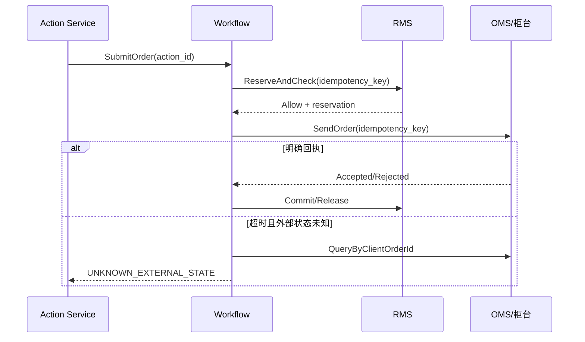

# API、事件与分布式一致性契约

## 1. 契约分层

| 契约 | 用途 | 真源 | 兼容单位 |
| --- | --- | --- | --- |
| Object/Action SDK | 业务对象读取和动作提交 | 本体发布版本 | Ontology major/minor |
| REST | 外部集成、命令、任务、文件 | OpenAPI 3.x | API major |
| GraphQL | 应用 BFF 的对象图和聚合 | Schema Registry | 字段/类型 |
| gRPC | 内部强类型、低时延调用 | Protobuf | package/service |
| Event | 已发生事实、异步命令、CDC | AsyncAPI + Schema | event type/version |
| Data | 表、流、文件和特征 | Data Contract | dataset/field |
| Realtime | WebSocket/SSE 订阅 | AsyncAPI/JSON Schema | channel/message |

所有契约使用稳定 `api_name`，中文名称和展示标签可以本地化但不得作为程序标识。公共 ID、日期时间、币种、单位和枚举复用本体值类型。

## 2. 标识、数值与时间

- 业务标识一律作为不透明字符串；附件中 19 位订单号不得转成 JavaScript `number`；
- 内部主键可用 UUIDv7/ULID，但不把数据库自增键暴露为跨域契约；
- 价格、金额、数量、比率使用 decimal 字符串或 Protobuf 定点消息，同时携带 scale/unit/currency；
- 时间戳使用 RFC 3339/ISO 8601 且含时区，精度按来源声明；
- `trading_date`、`business_date`、`event_time`、`recorded_at`、`valid_from/to` 分开；
- `null`、零、未知、不适用、尚未计算必须可区分；
- 枚举传输稳定 code，未知 code 由客户端容错显示，不崩溃或静默映射。

## 3. REST 命令契约

高风险写操作应满足：

```http
POST /api/v1/orders/{orderId}:submit
Idempotency-Key: 019ab...
If-Match: "order-version-41"
X-Purpose: TRADE_EXECUTION
X-Environment: PRODUCTION
```

```json
{
  "reason": "approved rebalance",
  "requested_by": "current-subject",
  "parameters": {
    "execution_policy_id": "policy-2026-07"
  }
}
```

受理响应返回 `202 Accepted` 和可轮询/订阅的 Action：

```json
{
  "action_id": "act_01...",
  "status": "AWAITING_APPROVAL",
  "object_ref": {"type": "ParentOrder", "id": "ord_..."},
  "submitted_at": "2026-07-27T10:00:00+08:00",
  "links": {
    "self": "/api/v1/actions/act_01...",
    "events": "/api/v1/actions/act_01.../events"
  }
}
```

### 3.1 幂等规则

- `Idempotency-Key` 的作用域为 `{subject/client, action_type, resource}`；
- 服务保存请求规范化摘要、状态和最终响应，保留期覆盖所有合理重试窗口；
- 同键同摘要返回原结果；同键不同摘要返回 `409 IDEMPOTENCY_CONFLICT`；
- 幂等不替代并发控制：陈旧 `If-Match/expected_version` 返回 `412 VERSION_MISMATCH`；
- 服务端不得为用户隐式生成会随重试变化的业务键；
- 对外部不可幂等副作用，在确认状态前不自动重发；进入 `UNKNOWN_EXTERNAL_STATE` 并主动查询/人工处理。

### 3.2 错误模型

```json
{
  "code": "RISK_LIMIT_EXCEEDED",
  "message": "订单未通过风险规则",
  "retryable": false,
  "trace_id": "01...",
  "policy_decision_id": "pd_...",
  "field_errors": [
    {"path": "quantity", "code": "ABOVE_AVAILABLE", "message": "超过可用量"}
  ],
  "details": {"rule_id": "single-name-limit", "rule_version": 7}
}
```

错误 `code` 是稳定契约；`message` 可本地化。不得在错误中泄露越权对象是否存在、SQL、令牌或原始供应商凭据。

## 4. 查询契约

### 4.1 REST/GraphQL

- 列表使用稳定排序和不透明游标；同一快照分页时保持一致；
- GraphQL 限制深度、复杂度、结果节点数和执行时间，生产只允许持久查询或受控探索；
- 字段授权在解析阶段执行；被隐藏字段和不存在字段的行为由威胁模型决定；
- 大聚合/导出创建异步 `QueryJob/ExportJob`，而不是保持长连接；
- 响应包含 `data_as_of`、`computed_at`、`source_status` 和必要的质量标记；
- 缓存键包含主体权限摘要、用途、环境、版本和查询参数，避免跨用户数据污染。

### 4.2 乐观并发

可变对象包含单调 `version`。命令声明 `expected_version`，成功后事件的 `aggregate_version` 加一。并发冲突由调用方重新读取、比较并显式重提，禁止服务器静默“最后写入者获胜”处理交易、限制、审批和本体变更。

## 5. API 版本策略

### 5.1 兼容变化

- 新增可选请求字段；
- 新增响应字段；
- 新增端点或 GraphQL 可选字段；
- 新增枚举值，但消费者必须实现 unknown 分支；
- 放宽不影响安全与业务不变量的验证。

### 5.2 破坏性变化

- 删除、重命名或改义字段；
- 改数值单位、精度、时区或空值语义；
- 改默认过滤、排序或聚合；
- 改权限范围、动作副作用、审批或幂等语义；
- 收紧请求而未提供迁移窗口；
- 将同步成功改为异步受理却不改变契约。

破坏性变化发布新 major；旧 major 有明确停止新增使用日、弃用日和下线日。网关记录消费者清单和实际使用，只有零流量且所有例外关闭后才下线。

## 6. 事件分类

| 类型 | 命名示例 | 语义 |
| --- | --- | --- |
| 领域事实 | `OrderAccepted`、`RiskLimitBreached` | 已经发生且不可撤回的事实 |
| 异步命令 | `RequestPositionReconciliation` | 请求单一责任方处理，可拒绝 |
| 集成事件 | `PublishedInstrumentChanged` | 面向跨域、稳定且最小化的事实 |
| CDC | `postgres.position.v1` | 物理变化，不等同领域语义 |
| 流数据 | `MarketTickReceived` | 高吞吐、按来源序号和事件时间处理 |
| 控制事件 | `OntologyReleasePublished` | 版本、策略、Schema 或运行控制变化 |

Topic 不作为权限边界的唯一实现；生产者与消费者均使用工作负载身份，敏感 Topic 设 ACL、加密和保留策略。

## 7. 标准事件信封

```json
{
  "spec_version": "1.0",
  "event_id": "019acb55-...",
  "event_type": "OrderAccepted",
  "event_version": 1,
  "source": "oms/order-command",
  "tenant_or_org": "org-id",
  "environment": "PRODUCTION",
  "aggregate": {
    "type": "Order",
    "id": "order-id-as-string",
    "version": 42
  },
  "occurred_at": "2026-07-27T09:31:05.123456+08:00",
  "recorded_at": "2026-07-27T09:31:05.125000+08:00",
  "partition_key": "account-or-order-key",
  "sequence": 42,
  "actor": {"type": "service", "id": "oms"},
  "purpose": "TRADE_EXECUTION",
  "correlation_id": "01...",
  "causation_id": "01...",
  "trace_id": "01...",
  "ontology_version": "1.4.0",
  "schema_ref": "registry://OrderAccepted/1",
  "classification": ["INTERNAL", "TRADING"],
  "data_subject_refs": [],
  "payload": {}
}
```

### 7.1 字段语义

- `event_id`：全局唯一，消费者去重主键；
- `occurred_at`：业务事实发生时间；`recorded_at`：平台持久化时间；
- `aggregate.version`：该聚合的状态顺序；不是 Kafka offset；
- `partition_key`：同一顺序域的固定键，Schema 评审时确定；
- `correlation_id`：同一业务链；`causation_id`：直接触发事件/命令；
- `ontology_version`：解析对象、值类型和策略语义所需版本；
- `classification`：驱动 Topic、字段、保留、下游与导出控制；
- `payload`：仅放消费者需要的最小数据；敏感大对象使用受控引用。

## 8. Schema 与事件版本

- Schema Registry 在生产默认 `BACKWARD_TRANSITIVE` 或更严格模式；
- 同一 `event_type + event_version` 只允许兼容新增；
- 改义、删字段、改单位或改变顺序键时创建新版本；
- 双版本发布时，生产者在明确窗口同时产生 v1/v2 或通过可信转换器提供；
- 消费者先升级，生产者后切换，旧版本最后退役；
- 事件不因错误而修改历史；修正使用 `...Corrected` 或补偿事实并引用原事件；
- PII/敏感字段删除需同时执行下游、湖仓、索引、备份和保留政策，不能仅改 Schema。

## 9. 顺序、重复与迟到

平台按“至少一次投递 + 幂等消费”设计：

- 只保证相同 `partition_key` 内的传输顺序；
- 消费者用 `event_id` 去重，用 `aggregate.version/sequence` 检测缺口和乱序；
- 重复事实不得重复扣款、下单、通知或生成审批；
- 迟到事件使用 event-time watermark；超过窗口进入更正/重算流程；
- 检测到序号缺口时暂停对该对象的不可逆动作、回补来源并核对；
- 重放携带 `replay_id` 和原事件 ID，隔离实时副作用；
- 消费者处理状态与业务写入在同一事务或可证明的原子边界内。

## 10. Transactional Outbox 与 Inbox

### 10.1 Outbox

领域事务同时提交：

1. 聚合状态；
2. 业务审计；
3. 待发布 Outbox 记录。

Relay 以可恢复游标发布事件，成功后标记。Relay 重试可能产生重复，因此消费者仍需 Inbox。禁止先写数据库再“尽力发消息”。

### 10.2 Inbox

消费者以 `{consumer, event_id}` 建唯一约束，在同一事务中：

1. 检查/插入 Inbox；
2. 执行业务变化；
3. 写本地 Outbox；
4. 提交 offset/检查点。

高吞吐流可用状态存储/紧凑 Topic 去重，但必须说明窗口、过期和重放边界。

## 11. Saga、补偿与外部状态

跨领域流程由 Temporal 等持久工作流编排；局部领域仍通过事件自治。Saga 步骤声明：

- 前置条件和责任服务；
- 命令幂等键；
- 成功回执和超时；
- 可否自动重试；
- 补偿动作及其业务限制；
- 无法补偿时的人工任务；
- 最终核对来源。

金融动作通常不能“删除历史来回滚”。例如订单已被市场接受后，补偿是发送撤单并等待回执，而不是把订单状态改回草稿；已成交部分只能进入后续业务处置。



## 12. 实时订阅

- 客户端先通过普通 API 获取授权快照，再用短期订阅令牌建立连接；
- 每个订阅声明对象集、字段、环境和目的；
- 服务发送 `subscription_id`、单调 `cursor`、事件时间和数据新鲜度；
- 断线用 cursor 恢复；超过保留窗口重新拉取快照；
- 慢消费者采用合并、采样、降频或断开，不能拖累行情/订单核心；
- 权限变化实时撤销订阅并清除前端缓存；
- 连接状态、备用来源和丢包/缺口在 UI 明示。

## 13. 安全与审计

- API Gateway 只做粗粒度准入，领域/对象层仍执行授权；
- 所有命令传递 subject、delegation、purpose、environment，服务不得信任客户端自报字段；
- Action 审计记录规范化请求摘要、策略版本、审批、前后状态和外部回执；
- Query/Export 记录对象范围、字段、数量、用途和结果分类；
- 事件敏感字段最小化，日志只记录引用或不可逆摘要；
- Agent 通过同一 SDK 和 Action API，只能创建授权提案，不能直连数据库或消息 Topic。

## 14. 契约测试与发布门

| 门禁 | 最低要求 |
| --- | --- |
| 静态兼容 | OpenAPI/Proto/Schema/本体差异分析无未批准破坏 |
| Producer | 示例、边界值、未知枚举、敏感字段检查 |
| Consumer | 消费者驱动契约和旧事件回放 |
| 幂等 | 同键同请求、同键异请求、超时后重试、并发重试 |
| 顺序 | 重复、乱序、缺口、迟到和重放 |
| Saga | 每一步失败、补偿失败、外部未知和人工恢复 |
| 权限 | 允许、拒绝、关系变化、用途变化、字段隐藏 |
| 性能 | 目标峰值、积压恢复、背压和大消息拒绝 |
| 可观测 | trace/correlation/action/event 可关联 |

