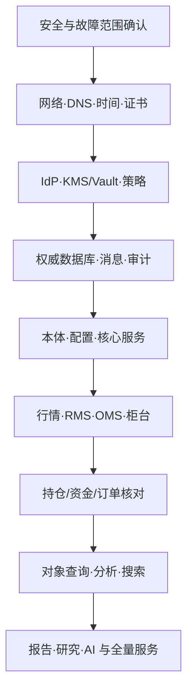

# 业务连续性、备份与灾难恢复

## 1. 设计目标

连续性设计的对象不是单个 Pod，而是端到端业务能力：

- 身份与策略能否做出可信授权；
- 行情、风险、订单和柜台状态能否保持或安全停止；
- 持仓、资金、成交和审计能否证明一致；
- 数据、本体、配置、密钥和模型能否恢复到互相兼容的版本；
- 用户、值班、业务、管理层和外部方能否获得可靠状态。

可用性、灾备和数据恢复均以业务影响分析（BIA）为依据。

## 2. BIA 与服务分级

| Tier | 业务能力 | 中断影响 | 初始 RTO | 初始 RPO |
| --- | --- | --- | --- | --- |
| Tier 0 | 身份核心、策略、硬风控、OMS 状态、动作/交易审计 | 错误交易、状态不可证明、合规重大影响 | ≤15 分钟 | ≈0 |
| Tier 1 | 行情、持仓/资金视图、审批、对象核心查询 | 交易/风控显著降级 | ≤30 分钟 | ≤1 分钟 |
| Tier 2 | 研究、搜索、图/向量、报告和协同 | 决策/交付延迟，有替代流程 | ≤4 小时 | ≤15 分钟 |
| Tier 3 | 可重建索引、临时计算、缓存 | 体验下降或重算成本 | 按重建计划 | 以权威源为准 |

这些是规划基线。正式 RTO/RPO 需逐业务旅程核定，记录：

- 最大可容忍中断与业务截止；
- 数据丢失/重复的最大可接受范围；
- 手工降级和人员容量；
- 上下游、供应商、网络、机房和监管依赖；
- 恢复优先级和最小可运行集。

Tier 0 的 RPO≈0 通过同步/准同步写、可靠 Outbox 和对账实现；不能仅依赖每日备份。

## 3. 故障模型

连续性方案至少覆盖：

- 进程、节点、存储、可用区或机房故障；
- 网络分区、DNS、时钟和证书；
- 数据库损坏、误删除、错误迁移和逻辑污染；
- Kafka/流处理积压、重复、乱序和状态丢失；
- IdP、KMS/Vault、对象存储或云控制面不可用；
- 行情、券商/柜台、短信/邮件等第三方中断；
- 供应链/勒索软件、密钥泄露和恶意管理员；
- 错误本体、策略、模型或数据发布；
- 人员、办公场所和大范围公共事件；
- 灾备站点本身不健康或切换后外部白名单缺失。

## 4. 高可用策略

- 无状态服务跨故障域部署，PDB、反亲和、优先级和受控自动扩缩；
- PostgreSQL、Kafka、ClickHouse、OpenSearch 使用成熟高可用方案并监控复制健康；
- 交易关键进程在专用节点/裸机时仍纳入统一身份、发布、观测和配置；
- 关键入口、IdP、DNS、证书、KMS 和网络路径避免单点；
- 写模型坚持单一权威，避免无冲突方案的双主；
- 研究、AI、大查询和回填不与交易关键路径争用资源；
- 降级模式和备用源预先定义，不能在事故中临时发明。

## 5. 备份与重建目录

| 资产 | 保护方式 | 恢复/校验 |
| --- | --- | --- |
| PostgreSQL | 持续 WAL、全量/增量、跨域加密复制 | PITR；表/聚合/审计一致性 |
| Kafka | 关键 Topic 跨域复制；湖仓长期事实 | offset/序号、去重和业务重放 |
| Iceberg/对象 | 版本、Object Lock、清单、跨域复制 | 快照/Manifest 校验和抽样读取 |
| ClickHouse | 副本、快照；权威流/湖仓可重建 | 行数/控制总数/查询黄金结果 |
| OpenSearch/图/向量 | 快照 + 索引声明 | 从对象/湖仓重建并比对权限 |
| 媒体原件 | 对象版本、校验和、跨域复制 | 内容哈希、元数据和 ACL |
| 本体/策略/配置/IaC | 受保护 Git、签名 ReleaseManifest | 签名、兼容性和环境重建 |
| 模型/特征/提示 | 模型注册、制品仓、数据快照 | 摘要、评测和可复现推理 |
| Vault/KMS | 厂商支持的分权备份/HSM 策略 | 多人恢复、解密和轮换 |
| 审计 | 追加写、高可用检索、WORM 归档 | 哈希链、时间和保留校验 |

### 5.1 3-2-1-1-0 基线

- 至少 3 份副本；
- 至少 2 类介质/故障域；
- 至少 1 份异地；
- 至少 1 份不可变或离线；
- 通过恢复测试达到 0 个未解决校验错误。

副本数需按数据规模、地域和法规调整。备份密钥与数据分开，删除/勒索权限不得同时覆盖所有副本。

## 6. 恢复顺序

恢复使用同一 `RecoveryPoint` 清单绑定：

- 数据库时间点；
- Kafka/来源序号；
- Iceberg 快照；
- 本体、策略、应用、模型和配置版本；
- 密钥版本；
- 外部柜台会话/序号。

禁止把互不兼容的最新组件随意组合。

## 7. 降级与安全停止

| 故障 | 允许降级 | 禁止行为 |
| --- | --- | --- |
| 搜索/图/向量 | 主键查询、结构化过滤、只读缓存 | 绕过 ACL 使用未过滤索引 |
| AI/模型 | 确定性流程和人工分析 | 模型失败时自动放宽风控 |
| ClickHouse | 核心流指标/权威状态；重查询暂停 | 把旧分析视图当实时状态 |
| 工作流 | 新审批暂停；已批准路径按策略 | 无审批直接执行高风险动作 |
| 主行情源 | 受控切备用，明确来源和质量 | 静默混源或使用滞后价格 |
| 柜台超时 | 标记外部未知、主动查询、限制新动作 | 盲目重发不可幂等订单 |
| 策略服务 | 缓存的短期、签名决策或 fail-closed | 默认允许高风险动作 |
| IdP | 已验证短期会话按预案；Break-glass | 共享账号全面绕过认证 |
| 审计不可写 | Tier 0 动作安全停止或写受控本地缓冲 | 无证据继续不可逆变更 |

每个降级状态在 UI、API、事件和审计中显式标识，并有最大持续时间。

## 8. DR 切换流程

### 8.1 决策

Incident Commander 汇总：

- 主站预计恢复时间与继续运行风险；
- 复制延迟和可用 RecoveryPoint；
- DR 健康、容量、人员和外部连接；
- 未完成动作和外部未知状态；
- 数据/安全事件是否会随复制扩散；
- 切换和切回成本。

Tier 0 切换由业务连续性负责人/授权 Checker 批准，安全事件增加 Security/Compliance。

### 8.2 执行

1. 冻结非必要变更并声明事件；
2. 确定写入围栏，防止主站和 DR 双写；
3. 记录最终可见序号、时间和未决对象集；
4. 启用 DR 身份、密钥、网络和外部白名单；
5. 按恢复顺序启动最小服务；
6. 先只读核对数据、策略、版本和审计；
7. 由受控 Action 打开指定账户/市场的写入；
8. 分阶段恢复，持续比较外部权威状态；
9. 沟通实际 RPO/RTO、降级和限制；
10. 保留切回条件与完整时间线。

### 8.3 切回

切回是新的高风险变更，不是反向 DNS：

- 决定主站权威数据并修复差异；
- 验证复制方向、版本和外部会话；
- 设置写入围栏；
- 先影子/只读再灰度写；
- 完成订单、成交、持仓、资金、审计和数据产品核对；
- 关闭临时权限和路由，更新恢复证据。

## 9. 网络安全事件与逻辑污染

若主数据/备份可能受污染：

- 隔离而非立即复制到 DR；
- 保全 WORM 日志、内存/磁盘和身份审计；
- 确定最后可信点，而非默认“最新备份”；
- 在隔离恢复区扫描、重放和业务核对；
- 轮换身份、密钥、证书和第三方凭据；
- 恢复签名制品与受保护配置；
- 由安全、业务和数据 Owner 共同批准重新上线。

不可变备份、最小权限和分权删除用于限制勒索/内部威胁影响。

## 10. 人员与办公连续性

- 关键角色有主备人员和异地联系方式；
- Incident Commander、交易、风控、SRE、安全、数据和沟通角色不依赖单人；
- 远程/备用办公接入定期验证 MFA、设备和网络；
- 券商、行情、机房、云和关键供应商维护升级联系人与合同 SLA；
- 手工降级有容量估算、表单、双人核对和事后录入；
- 纸面/离线联系信息受控保管并定期更新。

## 11. 演练计划

| 频率基线 | 演练 |
| --- | --- |
| 每日 | 备份/复制/证书/密钥健康自动校验 |
| 每月 | 随机资产隔离恢复；告警和运行手册走查 |
| 每季度 | PostgreSQL PITR、Kafka 重放、服务级恢复 |
| 每半年 | 业务级 DR 切换、密钥/Break-glass 恢复 |
| 每年 | 多站点、人员、供应商和安全事件联合演练 |
| 重大变更后 | 相关恢复路径重新验证 |

频率按风险和法规提高。演练不得预先“修好答案”；注入真实但有护栏的未知情况。

## 12. 恢复验收

一次恢复只有满足以下条件才能关闭：

- 实测 RPO/RTO 在目标内，或剩余偏差已由风险 Owner 接受；
- 身份、策略、密钥、本体、代码和数据版本一致；
- 订单、成交、持仓、资金、净值和审计控制总数一致；
- 外部未知状态全部确认或进入受控人工队列；
- 数据新鲜度、Schema、索引和 ACL 校验通过；
- 关键用户旅程和权限负向测试通过；
- 主/DR 写入围栏无双写；
- 临时权限、路由、容量和降级已回收；
- 时间线、证据、根因和改进项进入 `RecoveryExercise/Incident` 对象。

