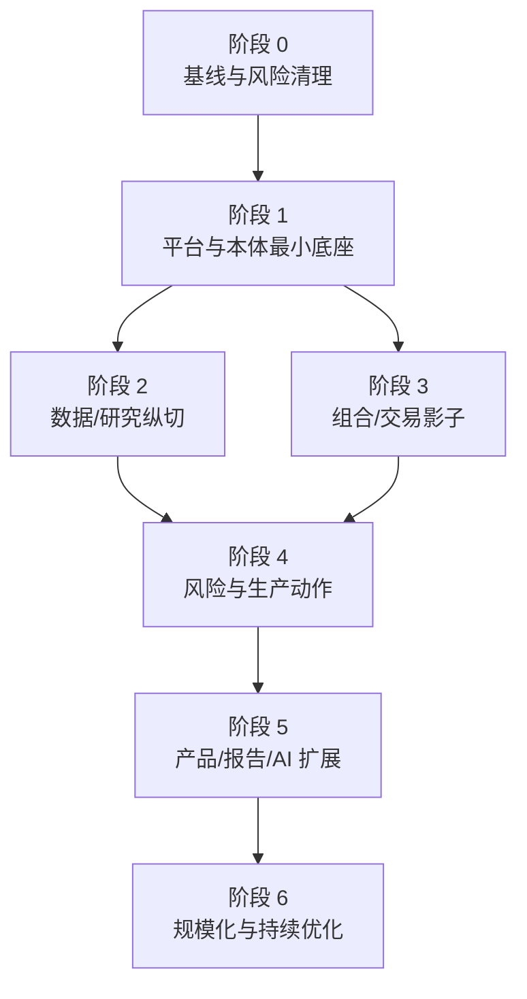

# 分期路线图与投资顺序

## 1. 路线图原则

路线图以“可验证的业务闭环”而非页面数量衡量进度：

- 先建立身份、数据、契约、本体、动作和证据底座；
- 先只读、影子和提案，再逐步开放生产副作用；
- 先选择一个端到端纵切验证平台，再横向扩域；
- 交易关键路径单独验证，不被普通 Web/分析节奏拖动；
- 遗留系统通过适配器和双跑迁移，避免一次性替换；
- 每阶段都有可量化准入/退出门和可回退状态。

以下时间是完整团队投入后的规划量级，不是承诺日期；最终计划取决于源系统接口、数据许可、交易柜台、法规、团队能力和采购周期。

## 2. 工作流与依赖

安全、SRE、数据治理、体验系统和迁移贯穿所有阶段，不是最后补做的横向项目。

## 3. 阶段 0：基线、决策与风险清理（约 4–6 周）

### 3.1 目标

把离散截图、脚本、CSV 和口头知识转化为可决策资产；消除立即风险。

### 3.2 工作

- 建立现状服务、数据源、账户、市场、柜台、作业和责任清单；
- 访谈附件审计中尚未确认的字段、枚举、`VMAP/VWAP`、零/空值和业务口径；
- 轮换附件/配置中出现的明文秘密，撤销旧值并核查使用记录；
- 确认部署地域、业务牌照、数据分类、跨境、保留和审计要求；
- 采集真实容量：行情峰值、订单/成交、对象/链接、文档、用户、批窗口；
- 定义 Tier、SLO、RTO/RPO 和业务截止；
- 完成关键 ADR：部署模式、IdP、消息/湖仓/分析库、授权引擎、工作流；
- 选定首个纵切：建议“证券—行情—研究信号—风险观察清单—对象工作台”，首期无实盘副作用；
- 建立需求—本体—模块—证据追踪。

### 3.3 退出门

- 100% Tier 0/1 系统和数据源有 Owner；
- 发现的明文生产凭据完成轮换/吊销；
- 关键标识、时间、金额/数量、币种/单位标准获批准；
- 首个纵切范围、验收和非目标明确；
- 目标环境、采购和外部接口可用性已验证；
- 最高风险项有责任人、截止和应急控制。

## 4. 阶段 1：平台与本体最小底座（约 8–12 周）

### 4.1 交付

- 企业 IdP、工作负载身份、Vault/KMS 和基础网络分区；
- Git、CI/CD、签名制品、SBOM、GitOps、服务目录和 OpenTelemetry；
- PostgreSQL、Kafka、Iceberg/Object Storage、ClickHouse 的最小生产同构环境；
- Type Registry：ValueType、ObjectType、LinkType、ActionType、FunctionType；
- Object API、Action API、Policy Decision、审计与基础 SDK 生成；
- OpenFGA/SpiceDB 关系模型 + OPA 动态策略；
- 本体分支、兼容检查、发布清单和影响分析；
- React 应用壳、设计 Token、对象卡/表/时间线、权限反馈和实时连接；
- 数据契约、质量门、OpenLineage 与目录最小能力；
- 备份恢复、SLO、告警和运行手册模板。

### 4.2 纵向样例

从一个权威源接入 `Instrument`、`MarketVenue`、`TradingCalendar`，发布到湖仓和对象层；用户按关系授权搜索并查看对象，所有读取、版本、来源和权限可解释。

### 4.3 退出门

- 从本体声明可生成 TS/Java/Python/OpenAPI 基本类型；
- 对象/属性/链接权限负向测试全部通过；
- 发布版本能回滚，恢复演练达到阶段 RTO/RPO；
- Schema、本体、API 和事件破坏性变更可在 CI 阻断；
- 任何对象可追溯来源、快照、质量、版本和 Owner；
- 平台 SLO、审计和 Secret Scan 持续运行。

## 5. 阶段 2：数据、资讯与研究纵切（约 10–14 周，可与阶段 3 部分并行）

### 5.1 交付

- 证券主数据、多源行情/K 线/Level2、财务、日历、新闻和报告接入；
- Raw/Curated/Published 分层、双时态、来源优先级、隔离和回填；
- 文档/图片/音视频原件、OCR/转写/抽取与证据引用；
- Object Explorer、数据字典/市场、新闻、问答和日历工作台；
- Factor/ResearchRun/BacktestRun、单因子、相关性、行业、预期和 tick replay；
- 点时股票池、公司行动、费用/滑点和可复现运行；
- OpenSearch 全文与权限过滤；首期 pgvector/OpenSearch 语义检索；
- 研究发布 Maker-checker、质量门和监控。

### 5.2 退出门

- 选定数据产品在业务截止内准时率达到批准目标；
- 点时泄漏测试、黄金数据和历史复现通过；
- 抽取结论可引用到原件页/时间，文档 ACL 不泄漏；
- 旧/新研究结果差异均可解释到数据、口径或算法；
- 研究员完成真实任务 UAT，关键旅程成功率达到目标；
- 历史回填不影响交易资源配额。

## 6. 阶段 3：组合、账户与交易影子（约 12–18 周）

### 6.1 交付

- InvestmentProduct、Portfolio、Account、Position、CashBalance、Order/Execution 本体；
- 遗留 OMS/IMS/UFT、柜台、账户配置和算法状态适配器；
- 订单状态机、事件信封、Outbox/Inbox、外部未知状态和核对；
- TWAP/VWAP/POV/IS 等算法的统一参数、状态、性能和延迟视图；
- RMS 规则评估、额度、观察/限制清单和例外工作流；
- Position/Cash/Order/Execution 日内与日终核对；
- 实时监控、断线恢复、来源/延迟/降级展示；
- Replay/Simulation 环境和历史重放；
- 运维命令封装为受控 Action，移除共享静态账户依赖。

### 6.2 运行模式

首期为：

- 旧系统保持权威写入；
- 新平台只读接收相同输入和回报；
- 新 RMS/算法输出与旧结果影子比对；
- 所有潜在动作只生成 proposal；
- 差异进入分类、责任和修复闭环。

### 6.3 退出门

- 目标历史窗口和峰值回放无订单/成交丢失、重复副作用；
- 订单状态与外部权威源逐笔核对达到 100% 或所有差异已解释；
- 19 位 ID、毫秒/微秒时间、未知枚举和零/空语义测试通过；
- 风控规则差异分类和批准完成；
- 1×/2×/5× 性能与积压恢复达到目标；
- 柜台超时/未知、主备行情、节点/网络故障演练通过；
- 切换/回退按账户或策略可执行。

## 7. 阶段 4：风险闭环与受控生产动作（约 10–16 周）

### 7.1 交付

- Action/Policy/Workflow Studio 的生产治理能力；
- Submit/Pause/Resume/Cancel Order、账户/网关启停等类型化动作；
- Maker-checker、额度/时窗、强认证、乐观并发和外部回执；
- 按账户/策略/市场的灰度路由和写入围栏；
- 组合目标、再平衡提案、风险评估、限制/例外、压力测试；
- Tier 0 SLO、错误预算、值班、业务核对和 DR；
- 安全、渗透、供应链、审计、备份/密钥恢复独立评审。

### 7.2 上线波次

1. 内部非生产动作；
2. 生产只读和运维低风险动作；
3. 小范围、低额度仿真；
4. 单账户/单策略/单市场的生产动作；
5. 扩大账户和动作类型；
6. 旧写入路径只读；
7. 完成观察窗后退役。

每一波有自动暂停阈值、人工 Checker、逐笔核对和回退演练。

### 7.3 退出门

- 权限、职责分离、审计和强认证的独立安全验收；
- 生产金丝雀连续满足约定观察期和错误预算；
- 未解释资金/持仓/订单差异为零；
- DR 完整切换达到实测目标；
- 外部券商/柜台、业务、风控、合规和运维共同签署；
- 旧路径退役条件和数据保留完成。

## 8. 阶段 5：产品、报告、知识与 AI（约 8–14 周）

### 8.1 交付

- 产品、渠道、客户关系、报告模板/快照/发布/撤回；
- 净值、规模、业绩、归因、风险和产品经营指标；
- 报告冻结快照、质量/业务/合规复核和分发证据；
- Evidence/Claim/Document/Entity 图投影和 GraphRAG；
- 权限感知问答、报告摘要、研究证据助理；
- Agent Studio、评测、预算、引用、拒答、人工接管；
- 高风险 AI 只生成 ActionProposal；
- 搜索、图、向量和模型的 SLO、成本与退役机制。

### 8.2 退出门

- 报告数字与冻结快照/权威账簿核对；
- 100% 对外结论有来源、版本和审批；
- AI 评测达到分任务阈值，严重越权/危险动作率为零；
- ACL 删除/撤权在全文、向量、图和缓存的传播达到目标；
- 人工接管、模型降级和供应商退出验证通过；
- 成本和延迟在已批准预算内。

## 9. 阶段 6：规模化与持续优化（持续）

- 扩展市场、资产类别、业务单位和外部合作方；
- 从模块化核心按证据拆分高增长服务；
- 图/向量在规模触发时独立化；
- 多活/多地域能力按真实 BIA 投资；
- 统一指标、策略、模型和应用市场；
- 自助本体/数据产品开发，但保留兼容和安全门；
- 退役重复页面、Cron、共享文件、临时 SQL 和旧 Topic；
- 用 SLO、事故、用户任务、质量和成本指标季度调整路线。

## 10. 跨阶段工作包

| 工作包 | 阶段 0–1 | 阶段 2–3 | 阶段 4–6 |
| --- | --- | --- | --- |
| 本体 | 元模型/主数据 | 研究/组合/交易扩展 | 产品/AI/跨域治理 |
| 数据治理 | 契约/目录/血缘 | 点时/多模态/质量 | 数据产品规模化 |
| 安全 | IAM/秘密/分类 | 对象/动作/搜索权限 | 红队/持续控制 |
| SRE | 服务目录/SLO/备份 | Replay/容量/故障 | DR/错误预算/优化 |
| 体验 | 应用壳/对象组件 | 专业工作台 | 个性化/Agent |
| 迁移 | 盘点/适配器 | 双读/影子/核对 | 灰度写/退役 |
| 组织 | Council/Owner | Domain Squad | 平台产品化/社区 |

## 11. 里程碑度量

避免只报“完成页面数/故事点”。每阶段汇报：

- 纳入本体且有 Owner 的关键业务概念比例；
- 契约覆盖和破坏性变化拦截率；
- 数据准时率、质量失败和可追溯率；
- 点时/核对差异数量与关闭时长；
- 对象/动作权限负向测试覆盖；
- 自动化测试、Replay 场景和恢复成功率；
- SLO、错误预算、事故 MTTA/MTTR；
- 旧手工脚本、共享秘密和遗留路径退役数量；
- 用户关键任务成功率、耗时和错误率；
- 每一生产动作的完整审计/回执覆盖率。

## 12. 建议的首 90 天

### 0–30 天

- 完成现状/BIA/数据/秘密盘点；
- 确认首个纵切与 10–15 个核心 ObjectType；
- 冻结值类型和标识/时间基本规范；
- 建立 ADR、风险登记、Owner 和验收框架；
- 打通最小 CI、制品签名和开发环境。

### 31–60 天

- 接通 IdP、工作负载身份和秘密管理；
- 建立 Kafka/PostgreSQL/Iceberg 的开发/集成基线；
- 实现 Type Registry、Object API 最小垂直路径；
- 接入一个证券主数据/行情来源；
- 建立对象组件、OpenTelemetry、服务目录和数据质量。

### 61–90 天

- 发布首个版本化本体和生成 SDK；
- 完成关系授权与属性权限负向测试；
- 交付一个只读对象工作台和来源/血缘视图；
- 演练 Schema 变化、备份恢复和数据源失败；
- 用证据复盘架构假设并批准下一阶段投资。

