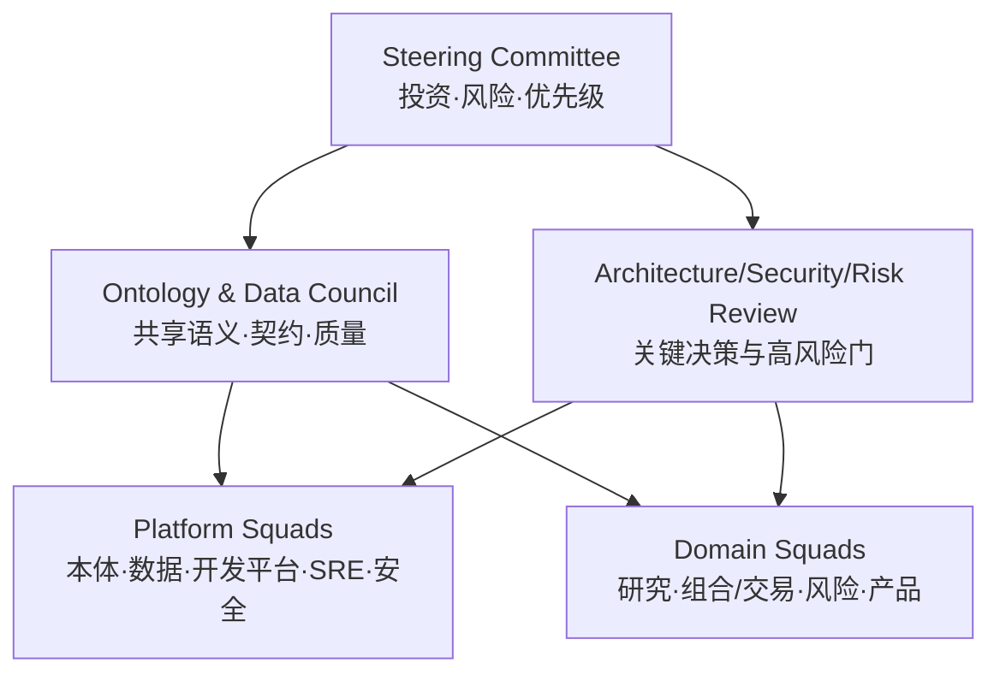

# 团队结构、职责与治理

## 1. 组织模型

采用“领域纵向团队 + 平台横向团队 + 轻量治理委员会”：

委员会定义边界、标准和例外，不替代团队日常设计；普通属性和局部实现不需要层层审批。

## 2. 领域团队

### 2.1 建议团队

- **市场与数据智能**：主数据、行情、Level2、新闻、日历、媒体；
- **量化与主动研究**：因子、回测、行业、预期、主题和 AI 研究；
- **组合与执行**：产品/组合、账户、持仓、OMS、算法和柜台；
- **风险与合规**：规则、限额、观察/限制、例外、核对和监管证据；
- **产品与报告**：净值、绩效、渠道、报告生成/发布；
- **本体与应用平台**：Registry、Object/Action API、SDK、应用壳和 Studio；
- **数据平台**：连接器、Kafka、湖仓、计算、质量、目录和索引；
- **平台工程/SRE/安全**：环境、CI/CD、IAM、密钥、观测、连续性。

团队规模较小时可合并，但 Owner 职责不能消失。

### 2.2 每个 Squad 的最小能力

- Product/Domain Owner；
- 领域架构/资深工程；
- 前后端或数据工程；
- QA/测试自动化；
- Data Steward 或数据责任接口；
- SRE/Security/UX 共享伙伴；
- 量化、风控、交易等专业团队还需对应 Subject Matter Expert。

## 3. 核心角色

| 角色 | 决策权与责任 |
| --- | --- |
| Executive Sponsor | 资金、跨部门障碍和风险接受 |
| Product/Domain Owner | 业务边界、价值、优先级、语义与验收 |
| Ontology Architect | 元模型、跨域共享类型、API 名、兼容和迁移 |
| Data Owner | 数据用途、分类、质量目标、访问与保留 |
| Data Steward | 字段映射、来源、质量、冲突和日常治理 |
| Action Owner | 业务不变量、副作用、审批、幂等和运行手册 |
| Function/Metric Owner | 口径、算法、点时、版本和质量 |
| Model Owner/Model Risk | 模型评测、限制、漂移、回退和退役 |
| Application Owner | 用户旅程、对象视图、可访问性和支持 |
| Security/Privacy | IAM、分类、威胁、策略和事件 |
| Compliance/Legal | 适用规则、证据、报送、许可和第三方 |
| SRE | SLO、容量、发布、事件、备份和 DR |
| Release Manager | 版本清单、窗口、门禁、沟通和回退 |
| QA/Validation Lead | 风险测试策略、独立证据和质量豁免 |

同一人可以兼任低风险角色，但职责分离规则仍必须满足。

## 4. 决策机构

### 4.1 Steering Committee

频率：月度或重大里程碑。

职责：

- 投资、范围、优先级和阶段门；
- 跨部门资源与外部供应商；
- 高剩余风险和重大延期；
- Tier 0 上线、DR 和遗留退役的最终业务批准。

### 4.2 Ontology & Data Council

频率：每周固定时段 + 异步评审。

只审：

- 新共享 Domain/Interface/ValueType；
- 主键、身份解析和跨域 Link；
- 指标/时间/单位的跨域口径；
- major/破坏性变化、权限语义和退役；
- 多团队数据主权和冲突。

普通域内 optional property 由 Domain Owner + Steward 批准并通过自动门。

### 4.3 Architecture Review Board

审查不可逆或高退出成本决定：

- 新数据库/消息/工作流/云服务；
- 跨域同步依赖和 Tier 0 拆分；
- 数据驻留、跨地域和供应商锁定；
- 性能/可用性目标与重大例外；
- 平台公共库和协议。

使用 ADR，记录背景、选项、决策、后果、复审触发和退出方案。

### 4.4 Security/Model/Risk Review

按风险触发：

- Restricted 数据、新外联、新身份/权限模型；
- L3/L4 Action、生产交易规则和风险例外；
- 模型用于投资/风险/客户或外部输出；
- Agent 工具、副作用、外部模型和敏感检索；
- Break-glass、密钥恢复、DR 和重大安全例外。

## 5. RACI 示例

| 制品/决策 | Domain Owner | Ontology | Data | Engineering | Security/Compliance | SRE/QA |
| --- | --- | --- | --- | --- | --- | --- |
| Object/Link 语义 | A | R | C | C | C | I |
| 数据映射/质量 | A/C | C | R | R | C | C |
| Action 不变量 | A | C | C | R | C/A（高风险） | C |
| API/Event 实现 | C | C | C | A/R | C | C |
| 权限策略 | A/C | C | C | R | A/R | C |
| 模型发布 | A/R | C | C | R | A/C | R/C |
| 生产发布 | A（业务） | I | I | R | C/A（高风险） | A/R |
| DR 切换 | A（业务连续性） | I | C | R | C | A/R |
| 退役与删除 | A | C | A/R | R | C/A | C |

`A` 必须唯一或明确联合批准边界；`R` 可以多个。每个实际制品在 Registry 记录具体人员/团队而非只写岗位。

## 6. 需求与设计治理

一项需求使用统一模板：

- 业务问题、用户和可量化结果；
- 涉及对象、链接、函数、指标、动作和策略；
- 数据来源、点时、质量和许可；
- 副作用、金额/影响范围和风险等级；
- 权限、用途、审批和审计；
- SLO、容量、RTO/RPO；
- 正常、异常、降级、核对和恢复；
- 验收证据、Owner 和非目标。

从需求自动/人工维护追踪：

`Requirement → OntologyChange → Contract → Code/Data/Policy → ValidationRun → ReleaseManifest → SLO/Incident`

## 7. 本体变更流程

1. 在 Global Branch/工程分支声明变更意图和 Owner；
2. 运行 API 名、主键、基数、值类型和语义检查；
3. 生成数据映射、SDK、应用、策略和下游影响；
4. 域内变更由 Domain Owner/Steward 评审；
5. 跨域/破坏性变更进入 Council；
6. 安全敏感变化进入 Security Review；
7. 在 Scenario/Replay 验证数据、动作和迁移；
8. Maker-checker 合并、灰度物化并观察；
9. 发布不可变版本和迁移指南；
10. Deprecated 资源跟踪消费者清零后退役。

委员会 SLA 要明确，避免治理成为交付瓶颈。

## 8. 数据产品治理

每个 `DataProduct/DataAsset` 有：

- Owner/Steward、消费者和业务用途；
- Schema、主键、时间、单位和枚举；
- 来源许可、地域、分类、保存和删除；
- 新鲜度、完整性、正确性和可用性 SLO；
- 点时语义、修订和回填规则；
- 血缘、下游和变更通知；
- 隔离、补救、回滚和退役。

数据质量失败由责任团队接单；平台团队提供机制但不替业务接受错误数据。

## 9. 动作与策略治理

- Action Owner 定义参数、前置/后置、状态机、副作用、幂等、未知状态和核对；
- Security/Compliance 定义主体、用途、环境、属性和职责分离；
- Domain Owner 定义金额/影响阈值与例外；
- SRE 定义超时、重试、告警、手工接管和恢复；
- QA 提供状态机、重放、并发、权限和补偿证据；
- L3/L4 发布需要独立 Checker；
- 所有临时例外有范围、理由、补偿控制、到期和复核。

## 10. 模型与 Agent 治理

按用途和影响分级：

| 等级 | 示例 | 治理 |
| --- | --- | --- |
| M0 | 内部文档辅助检索 | 基本质量、ACL、成本 |
| M1 | 研究摘要/候选提取 | 引用、人工复核、漂移 |
| M2 | 信号/风险建议、报告草稿 | 独立评测、Model Risk、影子 |
| M3 | 影响交易/客户/监管的决策 | 严格验证；通常只允许 proposal |

注册训练/评测数据快照、模型/提示/工具版本、限制、风险、Owner、批准、监控、回退和退役。外部基础模型版本变化按受控供应链变更处理。

## 11. 发布与变更委员会

普通低风险服务使用自动门和团队批准；以下进入 Change Advisory：

- Tier 0、交易时段或柜台协议；
- 本体/API/Event major；
- 数据库不可逆迁移或大规模回填；
- 权限、密钥、网络边界；
- DR 切换和遗留真源退役；
- 重大模型/风险规则发布。

会议不替代自动证据。变更单链接 ReleaseManifest、影响、测试、容量、观察、回滚、Owner、窗口和沟通。

## 12. 运营治理节奏

| 节奏 | 内容 |
| --- | --- |
| 每日 | 交易/数据就绪、事件、关键核对、发布观察 |
| 每周 | 本体/数据变更、风险登记、依赖和运维债务 |
| 双周/月 | 领域成果、用户指标、质量、成本和容量 |
| 月度 | SLO/错误预算、事故趋势、安全与权限 |
| 季度 | 路线、架构复审、权限证明、供应商和 DR |
| 年度 | BIA、法规矩阵、全场景连续性和平台退出策略 |

## 13. 文档与知识要求

- 架构、ADR、本体、契约、运行手册和用户说明与代码同版本；
- 关键定义放 Registry/声明文件，不只存在会议纪要；
- 变更说明面向消费者描述行为和迁移，而非只列提交；
- 事故复盘无责但有明确 Owner/截止和验证；
- 临时脚本、手工 SQL 和 Notebook 进入资产登记并有到期；
- 关键岗位知识至少两人掌握并通过演练验证。

## 14. 治理效果指标

- 破坏性变化在生产前发现比例；
- 共享类型重复/冲突和平均解决时长；
- 数据产品有 Owner/SLO/血缘比例；
- 生产动作有幂等、审批、核对和运行手册比例；
- 临时权限/例外按期关闭比例；
- 审批周期 P50/P95 与退回原因；
- 事故改进项按期关闭和复发率；
- 被弃用资源的消费者清零时长；
- 用户任务结果和可靠性提升，而非委员会/文档数量。

