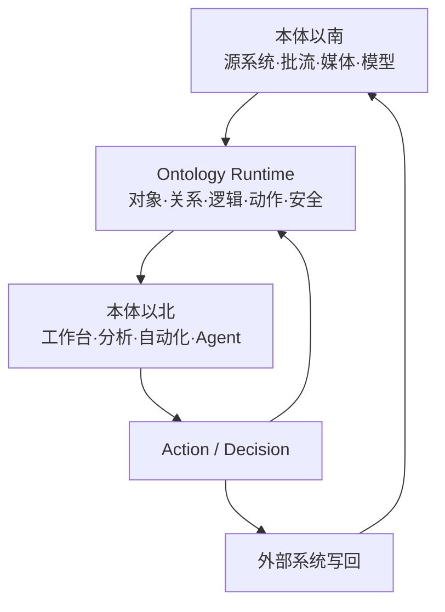

# Palantir 能力体系与本方案映射

## 1. 调研边界与完整性

本次以 2026-07-27 的 Palantir 官方公开文档为准，重建并登记 3,275 个去重条目：

| 产品域 | 条目数 | 覆盖口径 |
| --- | ---: | --- |
| Foundry & AIP | 3,022 | 11 个当前顶层能力页的渲染侧栏导航，交叉 sitemap 与主干链接 |
| Apollo | 242 | Documentation、Getting started 与 Reference |
| Gotham | 11 | 当前公开 Security 导航 |
| **合计** | **3,275** | URL、标题、产品、能力域、优先级、证据说明、访问日期与发现入口 |

机器可读逐条清单见 `evidence/palantir_url_inventory.csv`；研究方法、核心条目逐页分析和限制见 `04-palantir-document-system-audit.md`。

“完整”在这里表示当前公开导航的可审计快照，不等于：

- 历史版本、本地化镜像、环境内嵌帮助、受 enrollment/许可证控制页面的永久穷尽；
- Palantir 未公开的内部服务拓扑、产品 SLA、容量或许可承诺；
- 本项目已经购买、启用或可直接复用相应产品能力。

## 2. 核心架构映射

| Palantir 官方概念 | 本方案中的等价责任 | 采用方式 | 不机械照搬 |
| --- | --- | --- | --- |
| `Data + Logic + Action + Security` | 多模态数据平面、本体逻辑、Action Runtime、策略执行点 | 作为总体架构不变量 | 不把安全做成末端网关插件 |
| Ontology `Language + Engine + Toolchain` | YAML 元模型、对象/链接查询与动作引擎、生成 SDK/API/UI/策略 | 自建可替换运行层 | 不把本体缩减为 RDF 或图数据库 |
| Object / Property / Link | 金融对象、值类型、双时间关系 | 领域驱动建模 | 不按源表或部门复制对象 |
| Interface / Shared property / Value type | 可组合接口、共享元数据、强语义金融值类型 | 受版本控制 | 不假设所有运行时都完整支持多态 |
| Action / Function | 可授权业务动词、确定性实时逻辑 | Action API + Java/Python 函数 | 不把单字段修改拆成 Action 泛滥 |
| Automate | 业务事件/时间触发器 | Temporal + 规则/事件消费者 | 不用数据健康告警代替业务自动化 |
| Scenario | 隔离的 What-if 业务状态 | 场景覆盖层、TTL、审批后合并 | 不与开发分支或生产事件历史混用 |
| Global Branching / Proposal | 跨资源分支、差异、审查、合并 | Git + 本体分支 + ADR/审批 | 不允许生产本体直接手改 |
| OSDK | 从本体生成强类型对象、Action 与 Function 客户端 | TypeScript/Java/Python SDK | 应用不直接查询湖仓物理表 |
| Object/property security | 对象行、属性列与组合单元格策略 | OPA + OpenFGA/SpiceDB + PostgreSQL RLS | 仍需保护原始数据和导出路径 |
| Media set/reference | 原件存对象存储，本体保留引用与证据片段 | MediaObject + immutable hash + ACL | 默认 soft delete 不等于监管删除 |
| Multimodal Data Plane | Iceberg、Kafka、对象/媒体、搜索、模型与多引擎计算 | 开放格式、可下推、可重建投影 | 不把所有大文件塞入本体索引 |
| Marketplace / package / release channel | 版本包、依赖、环境晋级和租户发布 | GitOps + 制品签名 + 发布清单 | 不复制 Palantir 内部 300+ 服务规模 |
| AIP Logic / Chatbot / Evals | GraphRAG、Agent 工具调用、结构化输出和评测 | Model Gateway + eval + Human-in-the-loop | LLM 永不直接获得交易权限 |
| Observability / lineage | 数据、函数、动作、模型和服务的统一证据链 | OpenTelemetry + OpenLineage +审计账本 | 指标、日志和审计事件不能互相替代 |

## 3. Palantir 以南、本体与以北

本体以南负责事实接入、原始保真、批流处理、媒体和模型运行；本体负责统一业务语言、实时状态、确定性逻辑、授权动作与安全传播；本体以北只通过强类型对象、函数和动作构建应用。该边界可以在替换物理数据库或前端时保持业务契约稳定。

## 4. 官方事实、工程推导与待验证

| 类别 | 示例 | 文档中的处理 |
| --- | --- | --- |
| 官方事实 | Action 权限、object/property policy、OSDK 语言、webhook 时序、scenario 限制 | 附官方链接并保留产品限定 |
| 工程推导 | PostgreSQL/Kafka/ClickHouse、12 个金融域、订单状态机、ABAC/ReBAC | 明确标注为本项目选型，不冒充 Palantir 内部实现 |
| 待现场验证 | 许可证、enrollment、租户容量、SLA、接口支持矩阵 | 进入采购/PoC 问题清单与 ADR |

## 5. 关键产品限制

1. Object Storage v1 的计划弃用状态需向实际环境确认，不以历史页面措辞推断可用性。
2. Interface 在不同产品和 SDK 中支持不齐，必须做 compatibility test。
3. Derived properties 和 Custom Endpoints 存在 Beta/性能/可用性限制，不能成为不可替代主路径。
4. Streaming Pipeline Builder 并非所有环境默认启用。
5. Webhook 不是跨外部系统的分布式 ACID；side effect 可能 best effort 且无顺序保证。
6. Materialization 的历史权限传播有 build 时点语义。
7. Media 删除可能是软删除；legal hold、WORM、物理删除和 crypto-shredding 需另建策略。
8. Scenario 的 TTL/rebase/merge 语义不适合长期监管证据。

## 6. 采购 Palantir 与自建的共同验收

无论采购还是自建，都必须用同一组用例验证：

- Point-in-time 因子/回测可复现；
- 订单 Action 的幂等、权限、四眼审批、外部副作用对账；
- 对象、属性、原始资产、搜索、向量、导出的负例权限；
- 本体分支差异、兼容性、consumer impact 和回滚；
- 文档/音视频的证据定位、ACL 传播、保留/删除；
- Agent 只能调用授权工具，且高风险 Action 受确定性策略门控制；
- 真实数据量下的查询、订阅、批量动作和灾备目标。

## 7. 重点官方入口

- [Platform overview](https://www.palantir.com/docs/foundry/platform-overview/overview/)
- [Architecture Center](https://www.palantir.com/docs/foundry/architecture-center/overview/)
- [Ontology system](https://www.palantir.com/docs/foundry/architecture-center/ontology-system/)
- [Multimodal Data Plane](https://www.palantir.com/docs/foundry/architecture-center/multimodal-data-plane/)
- [Ontology overview](https://www.palantir.com/docs/foundry/ontology/overview/)
- [Ontology best practices](https://www.palantir.com/docs/foundry/ontology/ontology-best-practices/)
- [Action types](https://www.palantir.com/docs/foundry/action-types/overview/)
- [Object permissioning](https://www.palantir.com/docs/foundry/object-permissioning/overview/)
- [Ontology SDK](https://www.palantir.com/docs/foundry/ontology-sdk/overview/)
- [Global Branching](https://www.palantir.com/docs/foundry/global-branching/overview/)
- [Apollo introduction](https://www.palantir.com/docs/apollo/core/introduction/)
- [Gotham security](https://www.palantir.com/docs/gotham/security/overview/)

