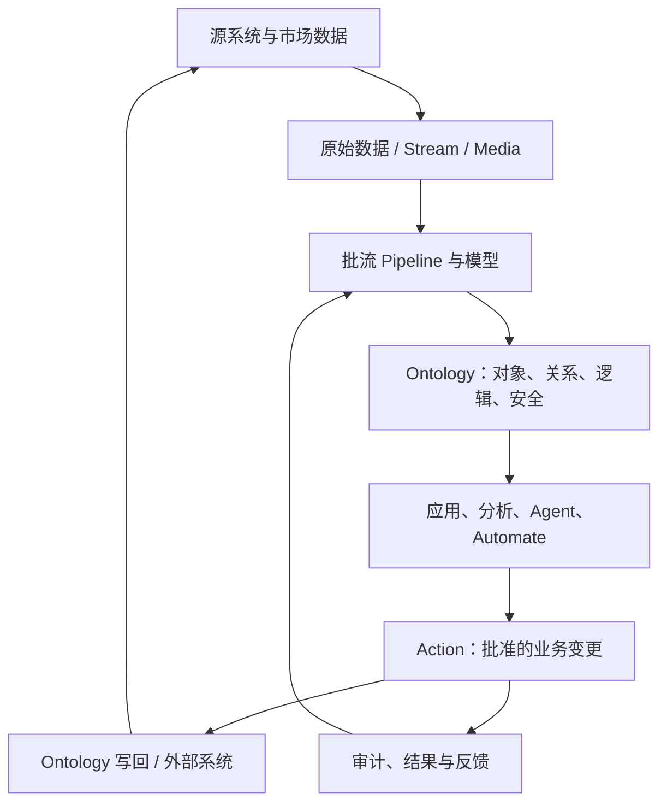

# Palantir 官方文档体系研究与金融平台本体工程映射

> 调研日期：2026-07-27  
> 资料边界：以 Palantir 官方 `palantir.com/docs` 当前英文文档为主；本文件把“官方明确陈述”与“面向本项目的工程推导”严格分开。  
> 配套清单：`palantir_url_inventory.csv`，含 3,275 个去重后的当前公开文档 URL（Foundry & AIP 3,022、Apollo 242、Gotham 11）、标题、产品、能力域、优先级、证据说明和访问日期。

## 0. 结论先行

1. **Palantir 的核心不是某个前端框架、数据库或图数据库，而是以 Ontology 为中心的决策系统架构。** 官方最新 Architecture Center 将其概括为四重集成：`Data + Logic + Action + Security`；又将 Ontology 系统分为 `Language + Engine + Toolchain`。因此，金融平台不能把“本体”缩减为 ER 图、知识图谱或术语字典。
2. **平台应明确区分 Ontology 以南与以北的职责。** 以南负责源系统连接、原始数据、批流转换、媒体与模型；Ontology 负责业务语义、实时读取、业务逻辑、可授权动作与审计；以北负责应用、分析、代理与自动化。这个分层比“前端/后端/数据库”三分法更能解释完整系统。
3. **本体设计必须围绕真实金融业务概念与决策，而不是围绕源表。** Palantir 官方最佳实践明确要求 “model reality, not systems”，并将按系统/部门复制实体、Kitchen Sink、God Object、Golden Hammer、Action Sprawl、Time Machine 等列为反模式。
4. **事实、推导、决策和副作用必须分层。** 批流 pipeline 处理可重复的数据转换；Function 处理实时复杂逻辑；Action 表达可授权的业务决定与事务性变更；Automate 表达事件或时间触发；Webhook/出口负责外部副作用。不要用一个工具承担全部职责。
5. **金融平台的主干本体至少应覆盖 Party、Account、Portfolio、Instrument、Order、Execution/Trade、Position、Cash/Ledger、Settlement、Exposure/Risk、Limit、Compliance Case、Document/Evidence、Model/Decision/Approval。** 这不是 Palantir 的预置金融模型，而是依据其建模原则对本项目的领域推导。
6. **安全是本体语义的一部分，不是 API 网关之后补一层 RBAC。** 官方架构把 Security 与 Data/Logic/Action 同列；对象与属性策略可形成行、列、单元格级控制，Action 还要通过资源可见性、提交条件与动作本身的权限检查。
7. **完整生产闭环应为：事实进入 → 语义化 → 推导/模型 → 提议 → 人/代理决策 → Action → 内外部写回 → 结果观察 → 反馈训练。** 只做数据展示或聊天问答，都没有达到 Palantir 所强调的 operational ontology。
8. **不能照搬 Palantir “300+ microservices” 的规模。** 这是 Palantir 自身产品平台的官方描述，不是本项目首期微服务数量目标。本项目应复刻其边界、契约、权限传播和生命周期思想，而不是机械复刻内部服务数。

## 1. 调研口径与完整性说明

### 1.1 目录重建方法

官方 `robots.txt` 声明了站点 sitemap 与 docs sitemap；但 `/docs/sitemap.xml` 单份结果存在 5,000 URL 上限，且多语言、历史路径和 API 页面混排，不能单独代表当前英文信息架构。因此采用两路交叉核验：

- **主清单：**解析 Foundry & AIP 的 11 个当前顶层能力页，以及 Apollo 的 Documentation、Getting Started、Reference 和 Gotham 当前公开 Security 页中渲染后的侧边导航。
- **补充核验：**官方 docs sitemap、页面内前后链接、Architecture Center 和 API Reference 入口。
- **去重规范：**保留 `https://www.palantir.com/docs/foundry/...`、`/docs/apollo/...`、`/docs/gotham/...`，移除查询参数与锚点，统一尾斜杠。
- **优先级：**
  - `P0`：架构主干、Ontology 核心、写回、安全、分支与生命周期；
  - `P1`：子系统实现、工具与 API 指南；
  - `P2`：Legacy、Sunset、Planned deprecation、FAQ、错误与限制类材料。

当前官方顶层能力域及在对应渲染导航中发现的唯一链接数如下。链接可能出现在多个能力页，故本列不可直接相加作为全局总数。

| 当前官方能力域 | 在该能力导航中发现的唯一 URL |
|---|---:|
| AI Platform (AIP) | 100 |
| Data connectivity & integration | 1,173 |
| Model connectivity & development | 113 |
| Ontology building | 403 |
| Developer toolchain | 193 |
| Use case development | 321 |
| Observability | 53 |
| Analytics | 534 |
| Product delivery | 38 |
| Security & governance | 115 |
| Management & enablement | 176 |
| **Foundry & AIP 全局去重** | **3,022** |

另收录 Apollo 242 条、Gotham 当前公开安全文档 11 条，三类产品总计 3,275 条。Apollo/Gotham 不使用 Foundry 的 11 能力域结构，因此没有混入上表逐能力导航计数。

### 1.2 “全面阅读”的可审计解释

本次结果包含：

- 当前 11 个能力域的完整导航条目级枚举；
- 3,275 条 URL 级目录清单，其中 Foundry & AIP 3,022 条；
- 对架构主干、Ontology 所有关键原语、数据/模型/应用/安全/运维/生命周期的 P0 文档逐页分析；
- 对 P1/P2 以目录、能力说明、限制状态和与本项目的相关性进行归类。

仍需避免不诚实的“静态穷尽”表述：

- 官方文档持续发布，清单是 **2026-07-27 快照**；
- 部分 API Reference、环境内嵌帮助、受 enrollment 功能开关影响的页面不一定全部出现在公开导航；
- 日/中/韩本地化路径与英文内容不是一一同步，未重复列入中文/日文镜像；
- Legacy/Sunset 页面保留是为了迁移风险，不代表应在新系统采用；
- 官方文档说明产品能力，但不公开全部内部实现、SLA、部署拓扑和许可证边界。

## 2. Palantir 当前完整能力框架

来源：[Platform overview](https://www.palantir.com/docs/foundry/platform-overview/overview/)、[Architecture Center](https://www.palantir.com/docs/foundry/architecture-center/overview/)。

| 能力域 | 官方文档中的主要板块 | 对金融平台的意义 |
|---|---|---|
| AI Platform (AIP) | AI FDE、Analyst、Assist、Chatbot Studio、Document Intelligence、Evals、Logic、Model Catalog、Realtime audio、Threads、BYOM | 受控生成式 AI、文档抽取、代理工具调用、评测与运营监控 |
| Data connectivity & integration | Data Connection、sources/syncs/exports/listeners/webhooks、datasets、streams、media sets、Iceberg、virtual tables、CDC、Pipeline Builder、Code Repositories、builds/schedules/health | 交易、行情、参考数据、账务、文档和音视频的批流一体接入与治理 |
| Model connectivity & development | 模型工件、Modeling Objectives、适配器、实验、评测、评审、发布、在线/批量部署 | 定价、风控、欺诈、AML、优化器与 LLM 的全生命周期 |
| Ontology building | object/property/link/action/function/interface/value type/shared property、权限、索引、编辑、materialization、场景 | 统一业务语言、实时状态、决策与写回的核心 |
| Developer toolchain | OSDK、Platform APIs/SDKs、Ontology MCP、Palantir MCP、Developer Console、Agents、Compute Modules、Custom Endpoints、workspaces、Global Branching | 自定义 Web/移动/服务端应用与外部系统集成 |
| Use case development | Workshop、Slate、Automate、Carbon、Solution Designer、Workflow Builder/Lineage | 业务运营工作台、审批、任务、协作与自动化 |
| Observability | Data Health、health checks、Workflow Lineage、分布式 trace、函数/Action/LLM 指标、telemetry export | 数据新鲜度、决策链路、模型和操作的统一可观测性 |
| Analytics | Contour、Quiver、Notepad、Fusion、Code Workspaces、外部 BI/SQL | 研究分析、风险归因、报表和临时调查 |
| Product delivery | DevOps、Marketplace、包、依赖、release channel、fleet installation/upgrade | 多环境、多租户、多业务线的可控交付 |
| Security & governance | 组织/空间/项目/角色/组、markings、classification、restricted views、OAuth、Approvals、Checkpoints、Cipher、scanner、lifetime、audit | 金融数据隔离、MNPI/PII、四眼审批、审计、留存与删除 |
| Management & enablement | Control Panel、身份、资源预算、队列、网络、容器治理、Upgrade Assistant、采用度 | 平台治理、成本、容量、身份与升级 |

## 3. 官方总体架构：不是“知识图谱”，而是决策操作系统

### 3.1 AIP、Foundry、Apollo

Palantir 官方把三者描述为共同工作的企业操作系统：

- **Foundry：**核心 Data Operations 平台；
- **AIP：**生成式 AI 平台；
- **Apollo：**持续交付平台；
- **Ontology：**上述能力组合的中心，将数据、逻辑、动作、安全转化为人和 AI 可共同操作的世界模型。

Architecture Center 称 AIP 与 Foundry 合计由 300+ 微服务与资产组成，运行在高可用、自动伸缩、零信任的 compute mesh 上。这是对 Palantir 产品内部规模的描述，不应被解读为本项目必须拆成数百服务。

[Apollo Introduction](https://www.palantir.com/docs/apollo/core/introduction/) 进一步明确其 Hub-and-Spoke、Kubernetes、connected/disconnected/air-gapped 环境、release channel 拉取式升级、产品与环境双重 constraint、change request/required approver、release recall、漏洞工作流和外部可观测集成。它补足的是跨环境软件交付控制面，不替代 Foundry 的数据/本体/业务应用能力。

### 3.2 四重集成与三层系统

来源：[The Ontology system](https://www.palantir.com/docs/foundry/architecture-center/ontology-system/)。

官方四重集成：

| 维度 | 含义 |
|---|---|
| Data | 对事实、实体、事件、媒体、时序与关系的可操作表达 |
| Logic | 规则、函数、模型、优化器、LLM 与多引擎编排 |
| Action | 从简单事务到跨外部/边缘系统多步变更的“动词” |
| Security | 对数据、逻辑、Action 及人/代理交互时的统一约束 |

官方三类系统组件：

| 层 | 含义 |
|---|---|
| Language | 对 object、property、link、action、automation、function 及其外部交互的语言 |
| Engine | 高规模查询、实时订阅、materialization、原子持久事务、批量 mutation、stream、CDC |
| Toolchain | 以 Ontology 为后端的 OSDK、应用开发与 DevOps 治理 |

因此，“本体 = RDF/OWL + 图数据库”是错误缩减。Palantir 官方甚至明确写道 Ontology **不是 thin semantic layer**；语义（nouns）必须与动力学（verbs）、逻辑和安全同时存在。

### 3.3 Multimodal Data Plane

来源：[The Multimodal Data Plane](https://www.palantir.com/docs/foundry/architecture-center/multimodal-data-plane/)。

官方 MMDP 原则是 “Any data, any compute, any model, anywhere”：

- 主表格式采用 Apache Iceberg，可连接外部 Iceberg catalog/virtual table，避免不必要的数据复制；
- 开放格式与标准接口包括 Iceberg、Parquet、REST、JDBC、S3-compatible；
- 统一覆盖结构化、文档、媒体、流、地理/时空等数据；
- 内置批流与交互 compute 包括 Spark、Flink、DataFusion、Polars、DuckDB；
- 底层为 Kubernetes-based compute mesh（Rubix）；
- Compute Modules 允许任意容器化逻辑与模型；
- 可把 compute 下推到 Snowflake、Databricks 等外部环境；
- 模型层既可使用 Model Catalog，也可注册外部、自托管或容器模型。

对本项目的直接启示不是必须使用所有上述产品，而是：

1. 业务语义不应绑死单一数据库；
2. 数据和 compute 应开放、可替换、可下推；
3. 结构化、流、时序、媒体、文档要进入同一治理与本体引用体系；
4. Ontology 是统一访问和决策面，不应成为所有原始大文件的物理存储。

### 3.4 控制面、数据面、体验面的工程映射

> **以下三个“面”是本研究对官方能力的工程归纳，不是 Palantir 页面中的固定产品分类。**

| 工程面 | 对应官方能力 | 应承担的职责 |
|---|---|---|
| 数据面 | Data Connection、datasets/streams/media、Pipeline Builder、Object Storage、model runtime | 接入、存储、批流转换、索引、查询、materialization、推理 |
| 控制面 | Control Panel、Security、Compass、lineage、branch/proposal、version/release、schedules/health | 身份、策略、元数据、血缘、契约、资源、审计、生命周期 |
| 体验面 | Workshop/Slate、Analytics、OSDK app、AIP Chatbot/Logic、Automate | 人员和代理的读取、分析、决策、写回、协作 |

端到端数据与决策流：

## 4. Ontology 原语的精确定义与金融映射

本节的“官方语义”来自 [Ontology core concepts](https://www.palantir.com/docs/foundry/ontology/core-concepts/)、[Ontology overview](https://www.palantir.com/docs/foundry/ontology/overview/) 和各原语页面；“金融映射”是项目推导。

| 原语 | 官方语义 | 金融平台映射 | 关键约束/误区 |
|---|---|---|---|
| Ontology | 数据集/虚拟表/模型之上的 operational layer 与 digital twin | 企业金融业务的统一决策语言 | 不只是 schema registry 或 KG |
| Object type | 实体或事件的 schema；由 datasource 映射实际对象 | Party、Instrument、Order、Trade、Position、Limit、Case | 设计真实概念，不要复制源表 |
| Object | Object type 的实际实例，有主键和属性值 | 一个客户、一个订单、一次成交 | 身份与观察应分开建模 |
| Object set | 可搜索、过滤、聚合的一组对象 | “所有高风险未结案件”“待复核交易” | 是动态集合，不应总是固化为表 |
| Property | 对象的特征 | status、currency、notional、tradeTime | 每个属性应有明确业务价值 |
| Struct | 具有语义关联的多字段值 | 金额+币种、AI 结论+置信度+证据、地址 | 不要把天然复合值平铺成大量无关字段 |
| Shared property | 跨 object type 复用的属性元数据 | createdAt、sourceSystem、jurisdiction | **共享的是元数据，不是底层数据** |
| Value type | 带语义、约束、格式与版本的基础值封装 | LEI、ISIN、BIC、IBAN、Currency、Rate、Quantity | 与 space 关联、受权限和版本控制 |
| Link type / link | Object type 之间的业务关系 schema/实例 | Account-holds-Position、Order-resultsIn-Trade | link 双向；跨 ontology link 不受支持，应采用 shared ontology |
| Interface | 无 datasource/实例的抽象能力与形状，可含属性/link/action 约束 | Identifiable、EffectiveDated、Approvable、Documented | 不是“宽而稀疏的父对象”；各产品支持程度不完全一致 |
| Type group | 对 object types 的搜索和分类 | “Trading domain”“Risk domain”导航分组 | **不是继承、模块边界或强语义包** |
| Action type | 单次事务中修改一个或多个 object/link；可有 side effects | PlaceOrder、ApproveTrade、FreezeAccount、ResolveCase | 应围绕业务操作，不要每个属性一个 Action |
| Function | 隔离运行的 TypeScript/Python 服务端逻辑，可读/遍历/编辑 Ontology | 预交易检查、实时估值、限额计算、推荐 | 复杂实时逻辑；可被应用与 Action 复用 |
| Automation | 持续或定时条件 + effect | 限额突破、结算失败、文档过期、定时报表 | 与 data health 不同，服务业务自动化 |
| Derived property | 查询时基于链接对象聚合/推导的只读属性 | portfolioExposure、openCaseCount | 运行时计算；高规模查询要评估延迟 |
| Scenario | 与主状态隔离的分支式业务沙箱 | 压力测试、再平衡草案、What-if | 临时 scenario 默认 TTL 与 merge 语义需确认 |
| Edit/writeback | Action 产生的对象/链接变更，实时进入索引并周期持久化 | 人工复核、状态迁移、补录、决策结果 | 不等同于修改原始源表 |
| Materialization | 把对象状态/编辑结果物化为 dataset/restricted view | 报表快照、监管输出、下游批处理 | 安全策略与历史 transaction 传播需额外验证 |
| Role / permission | Ontology/resource/object 层的访问控制 | viewer、editor、owner、approver | schema 权限与数据实例权限是两个层次 |

### 4.1 Object、Link、Interface 和 Type group

- [Object types](https://www.palantir.com/docs/foundry/object-link-types/object-types-overview/) 是实体/事件 schema，并由 backing datasource 提供实际数据。
- [Link types](https://www.palantir.com/docs/foundry/object-link-types/link-types-overview/) 描述真实关系，而不是暴露 foreign key 技术细节。一个 link type 对两端都是可导航的。
- [Interfaces](https://www.palantir.com/docs/foundry/interfaces/interface-overview/) 是抽象定义，无 backing datasource、无独立实例，可表达共享属性、link 约束、Action 约束和 metadata。
- 当前文档列出的 interface 支持仍不完全一致：Ontology Manager、Marketplace、TypeScript v2 Functions 支持较好；Actions、Object Set Service、TypeScript OSDK 为部分支持；Workshop、TypeScript v1/Python Functions 的支持需逐项验证。不能把 interface 当作所有运行时均完整支持的 Java-style 继承。
- [Object type groups](https://www.palantir.com/docs/foundry/object-link-types/type-groups/) 主要用于搜索与组织，不能用它代替 bounded context、namespace、接口或访问边界。

### 4.2 Shared property、Value type、Struct

- [Shared properties](https://www.palantir.com/docs/foundry/object-link-types/shared-property-overview/) 统一属性的名称、描述、显示等 metadata，底层值仍位于各对象。
- [Value types](https://www.palantir.com/docs/foundry/object-link-types/value-types-overview/) 应用于可复用的领域值与约束；适合把 `ISIN`、`LEI`、`CurrencyCode`、`BasisPoints` 从裸字符串/小数提升为有语义的类型。
- Struct 适合 `Money(amount,currency)`、`ModelOutput(value,confidence,source,citations)`、`ContactMethod(type,value,verifiedAt)` 等复合值。
- 金融精度不得由 UI 格式化替代：金额、价格、利率、数量要在 value type/struct 和后端契约中明确 decimal precision、scale、rounding、currency/unit、时区与 business date。

### 4.3 Derived property：便利性不等于免费

[Structural guidance](https://www.palantir.com/docs/foundry/ontology/ontology-structural-guidance/) 给出明确分工：

- 同一对象、稳定输入、随 pipeline 更新的值：优先在 pipeline 预计算；
- 依赖 linked object 或会被 Action/Automation 改变的值：使用 derived property；
- 文档给出的经验阈值是每次查询低到中等规模（约小于 10k 对象）可较自由使用；更大规模可能引入高开销，应基准测试并有选择地反规范化；
- 任何反规范化都应记录 source of truth、理由和同步策略。

[Derived properties](https://www.palantir.com/docs/foundry/object-link-types/derived-properties/) 当前文档还提示：只读、按用户安全上下文解析、最多三跳链接，聚合包括 count/sum/avg/min/max/cardinality/list/set 等，并带有 Beta/限制。不要把它当作所有大规模风险聚合的默认执行引擎。

### 4.4 Action：业务动词、授权边界与审计单元

来源：[Action types](https://www.palantir.com/docs/foundry/action-types/overview/)、[Action permissions](https://www.palantir.com/docs/foundry/action-types/permissions/)、[Action log](https://www.palantir.com/docs/foundry/action-types/action-log/)。

Action 应表达一个有业务含义的操作，例如：

- `SubmitOrder`：创建订单、冻结所需额度、记录请求方；
- `ApproveException`：审批异常并关联依据、审批人和到期时间；
- `AmendTrade`：创建 amendment、更新当前 trade 状态、保留前态；
- `CloseComplianceCase`：校验所有任务完成后关闭 case；
- `PublishNAV`：锁定估值版本、生成披露、触发外部发布。

权限不是单一 `canExecute`：

1. 用户必须可见相应 Action type；
2. 必须可见被编辑的对象、link 与相关 datasource；
3. 必须通过 submission criteria；
4. 读取、编辑定义、应用 Action 是不同能力；
5. 通知接收者若无权查看全部内容，不应收到敏感内容。

Action log 可记录 Action RID/type/version、时间、用户、被编辑对象主键、参数、摘要和上下文。金融平台应把它作为审计链的一部分，而不是唯一审计证据；外部系统 side effect、消息投递、审批证据和数据版本仍需关联。

### 4.5 Function、AIP Logic 与模型

- [Functions](https://www.palantir.com/docs/foundry/functions/overview/) 是隔离运行的 TypeScript/Python 服务端业务逻辑，可读、遍历和编辑 Ontology，并被 Workshop、Slate、Quiver、Action 和外部接口复用。
- [AIP Logic](https://www.palantir.com/docs/foundry/logic/overview/) 是构建、测试、评估、发布 LLM-powered function 的 no-code 环境，可返回对象/字符串或发起 Ontology edits；变更可自动应用，也可先 staged 供人审。
- [Model integration](https://www.palantir.com/docs/foundry/model-integration/overview/) 通过 model artifact、model adapter 和 Modeling Objective 组织开发、实验、评估、评审、发布和在线/批部署。
- [Function versioning](https://www.palantir.com/docs/foundry/functions/functions-versioning/) 采用不可变发布版本与兼容范围；function-backed Action 默认 pin 版本，可选择兼容自动升级。对于交易/风险/合规动作，建议生产版本 pin，并通过受保护 proposal 升级。

### 4.6 Edit、Object Storage v2 与 Materialization

来源：[How user edits are applied](https://www.palantir.com/docs/foundry/object-edits/how-edits-applied/)、[Schema migrations](https://www.palantir.com/docs/foundry/object-edits/schema-migrations/)、[Materializations](https://www.palantir.com/docs/foundry/object-edits/materializations/)。

- Action 的 modification instruction 被送入 Funnel-managed queue；offset 用于并发编辑跟踪；
- 写后读取有保证：修改送出后发生的 Ontology query 应看到用户 edit；
- edits 立即应用到 object index，并周期性刷入 Funnel 管理的持久 dataset；
- 单个历史 edit 不能直接“物理撤销”，通常要以新的 edit 修正或重建对象；
- OSv2 通过 schema migration 管理 backing datasource、主键、属性类型、已编辑属性删除、struct 改动等 breaking change；
- 迁移选项包括丢弃特定属性/struct/all edits、迁移 edits、类型转换；
- Materialization 把对象结果交给分析、报表或下游 pipeline，但不是所有实时查询都应物化。

金融推导：关键状态应使用**补偿动作、amendment/reversal 和有效期**，而不是删除审计轨迹。总账/成交等不可变事件还需要专门的 append-only 事件/账本存储，不能仅依赖可编辑 object 当前状态。

### 4.7 Webhook：必须显式建模事务边界

来源：[Action webhooks](https://www.palantir.com/docs/foundry/action-types/webhooks/)。

| Webhook 模式 | 执行时点 | 失败语义 | 本项目要求 |
|---|---|---|---|
| Writeback webhook | Ontology object changes 之前 | 失败可阻止 Foundry edits；每 Action 最多一个 | 外部成功而内部失败仍可能发生，必须 idempotency key、状态查询、reconciliation |
| Side effect webhook | Ontology changes 之后 | best effort；可多个、顺序不保证；终端用户可能先看到 Action 成功 | 用 outbox/event log、重试、dead letter、去重和人工补偿 |

“Action 是单个事务”不能被扩展解释为跨银行核心、交易所、支付网关和 Ontology 的分布式 ACID。跨系统必须采用 saga/outbox、幂等、可重放和对账。

### 4.8 Automate：业务事件自动化

[Automate](https://www.palantir.com/docs/foundry/automate/overview/) 可用时间、object set 或二者组合为 condition，并执行 Action、AIP Logic、Function、平台/邮件通知。适合：

- 限额突破自动创建告警与 case；
- 结算失败超过阈值后升级；
- KYC 文档到期前提醒与冻结；
- 风险报告定时生成；
- 产生建议 Action，但高风险动作进入人审。

官方明确区分 Automate 与 Data Health：前者是业务自动化，后者是连接和 pipeline 健康监控。

### 4.9 Scenario、Branch 和 Proposal

- [Ontology scenarios](https://www.palantir.com/docs/foundry/ontology/overview-ontology-scenario/) 是业务 What-if 沙箱；当前文档说明临时 scenario 有 30 天 TTL、约 10 分钟自动 rebase，并以 Action merge。
- [Global Branching](https://www.palantir.com/docs/foundry/global-branching/overview/) 是开发分支；可跨多个应用资源隔离开发、测试和合并。
- [Ontology branching](https://www.palantir.com/docs/foundry/ontologies/branching-ontology/) 把 ontology resource 变更纳入 branch/proposal/review；受保护 object/action/link/interface/shared property 必须通过 proposal。
- [Review ontology proposals](https://www.palantir.com/docs/foundry/ontologies/review-ontology-proposals/) 将 proposal 类比 Pull Request，可逐资源审查并执行 policy-based approval。
- Global Branching 主要处理开发环境内隔离；release management 处理跨环境发布，二者不可混为一谈。

金融推导：开发 branch、业务 scenario、生产账本分支是三种不同概念，必须使用不同 ID、权限、TTL、审计和 merge 规则。

## 5. 官方 Ontology 设计原则及其落地

来源：[Best practices](https://www.palantir.com/docs/foundry/ontology/ontology-best-practices/)、[Structural guidance](https://www.palantir.com/docs/foundry/ontology/ontology-structural-guidance/)、[Anti-patterns](https://www.palantir.com/docs/foundry/ontology/ontology-anti-patterns/)。

### 5.1 官方四项原则

按官方优先级：

1. **Domain-driven design：**建模现实世界，而不是源数据；
2. **Don't repeat yourself：**同样结构出现三次时重构；
3. **Open for extension, closed for modification：**保护核心模型，让团队扩展；
4. **Composition over deep hierarchies：**用 interface 组合，不用深继承。

官方实践清单还要求：

- 每个 object type 专注一个实体；
- 每个 property 都有明确业务/技术价值；
- 多部门共同设计，避免重复；
- Action 用于人/代理决策，pipeline 用于自动数据转换；
- interface 表达共享抽象；
- 在 Ontology Manager 中记录 object/property/link 的设计理由。

### 5.2 官方反模式与金融示例

| 官方反模式 | 金融平台中的表现 | 修复 |
|---|---|---|
| System Silos | `CRMCustomer`、`CoreBankCustomer`、`KYCClient` 三套客户对象 | 建统一 Party/Customer，pipeline 合并并记录 source precedence |
| Department Silos | 交易、风险、合规各建一套 Instrument | 共享 Instrument 主干，以 links/领域对象承载特有信息 |
| Kitchen Sink | 把所有 ETL timestamp、内部序号和临时字段暴露到 Instrument | 只保留有语义的属性；技术 metadata 留在 lineage/数据层 |
| God Object | 一个 `FinancialRecord` 同时表示账户、交易、头寸、现金流 | 拆实体并用 links/interface 组合 |
| Golden Hammer | 所有计算都写 Function，或所有变更都做 Action | pipeline/Function/Action/Automate 各司其职 |
| Action Sprawl | `ChangeStatus`、`ChangeComment`、`ChangeOwner` 三个碎片 Action | 设计 `AssignCase`、`ResolveCase` 等完整业务操作 |
| Time Machine | 每个 Trade 历史版本复制为独立 Trade | 一个稳定 Trade 身份 + Amendment/Event/有效期；账本事件保持不可变 |
| Misnomer | `status2`、`dataType`、`value` | 使用业务限定名称和双向关系名称 |

## 6. 面向金融平台的本体域设计

> **本章为项目推导，并非 Palantir 提供的预置金融 Ontology。**

### 6.1 建议的 bounded contexts

| 逻辑域 | 核心 Object types | 关键 Links | 典型 Actions |
|---|---|---|---|
| Party & Identity | Party、Person、Organization、LegalEntity、Role、Identifier、Address、Relationship | Party-has-Identifier、Party-controls-Party、Party-actsAs-Role | OnboardParty、VerifyIdentity、ChangeRiskRating、OffboardParty |
| Product & Reference | Instrument、Security、Derivative、Currency、Index、Venue、Calendar、CorporateAction | Instrument-issuedBy-Party、Instrument-listedOn-Venue、Derivative-references-Underlying | ApproveInstrument、PublishReferenceData、ApplyCorporateAction |
| Account & Portfolio | Account、Portfolio、Mandate、CustodyAccount、Book、Strategy | Party-owns-Account、Portfolio-contains-Position、Account-governedBy-Mandate | OpenAccount、ChangeMandate、FreezeAccount、RebalancePortfolio |
| Order & Execution | Order、OrderInstruction、Execution、Trade、Allocation、Quote | Order-resultsIn-Execution、Execution-books-Trade、Trade-allocatesTo-Account | SubmitOrder、ApproveOrder、CancelOrder、AmendTrade、AllocateTrade |
| Cash, Ledger & Settlement | LedgerAccount、JournalEntry、Posting、CashMovement、SettlementInstruction、Settlement | JournalEntry-has-Posting、Trade-settlesVia-Settlement | PostJournal、ReleasePayment、MatchSettlement、ResolveBreak |
| Position & Valuation | Position、Lot、Valuation、PriceObservation、Curve、NAV | Position-in-Instrument、Valuation-uses-MarketData | RevaluePortfolio、PublishNAV、CorrectPrice |
| Risk & Capital | Exposure、RiskMeasure、Limit、LimitBreach、StressScenario、CollateralAgreement | Exposure-subjectTo-Limit、RiskMeasure-derivedFrom-Position | ApproveLimit、AcknowledgeBreach、RunStress、CallMargin |
| Compliance & Surveillance | KYCProfile、SanctionsHit、Alert、Case、Investigation、Policy、Control、Evidence | Alert-opens-Case、Case-concerns-Party/Trade、Evidence-supports-Decision | EscalateAlert、ApproveKYC、CloseCase、FileReport |
| Document & Communications | Document、MediaArtifact、Communication、Transcript、Annotation、Citation | Document-evidences-Trade/Case、Communication-involves-Party | UploadEvidence、ClassifyDocument、ApproveDisclosure |
| Model & Decision | Model、ModelVersion、ModelRun、Prediction、Recommendation、Decision、Approval | Decision-basedOn-ModelRun、Approval-authorizes-Action | ReleaseModel、ApproveRecommendation、OverrideDecision |
| Platform Governance | DataProduct、Source、Pipeline、SchemaVersion、Policy、Entitlement、AuditEvent | Dataset-feeds-ObjectType、Policy-protects-Resource | ApproveSchema、GrantEntitlement、PublishRelease |

### 6.2 横向 Interface 建议

可考虑以下 interface，但要结合当前运行时支持测试：

- `Identifiable`：externalIdentifiers、sourceSystem；
- `EffectiveDated`：validFrom、validTo、businessDate；
- `VersionedBusinessRecord`：businessVersion、supersedes；
- `Approvable`：approvalStatus、requiredPolicy；
- `RiskAssessable`：riskRating、riskFactors；
- `Documented`：evidence links；
- `Commentable`、`Assignable`、`CaseLike`；
- `Monetary` 不宜只靠 interface 表达金额，应配合 `Money` struct/value type。

### 6.3 统一值类型与标识

建议把以下内容建为受版本控制的 value types：

- LEI、ISIN、CUSIP、SEDOL、FIGI、BIC、IBAN；
- CurrencyCode、CountryCode、MIC、TimeZone、BusinessDate；
- MoneyAmount、Price、Rate、BasisPoints、Quantity、Percentage；
- Hash、DocumentId、SourceRecordId、CorrelationId、IdempotencyKey；
- Classification、DataSensitivity、RegulatoryRegime。

标识设计原则：

- 业务稳定 ID 与源系统 ID 分离；
- 同一真实对象可能有多个源标识，以 `Identifier` object/link 管理；
- 不把可变名称、账户展示号等直接当全局主键；
- merge/split、survivorship 与 source precedence 必须成为显式规则和审计事件。

### 6.4 当前状态、事件与历史

金融平台必须同时拥有：

1. **当前对象状态**：供应用与决策低延迟读取；
2. **不可变业务事件**：OrderSubmitted、TradeExecuted、JournalPosted、LimitBreached；
3. **Amendment/Reversal**：更正而不抹除历史；
4. **有效时间与记录时间**：valid time / transaction time；
5. **时序序列**：行情、估值、暴露、余额；
6. **来源和计算版本**：每个结果可追溯到数据、代码、模型、参数和审批。

不要把每个历史快照都复制成同一实体的独立对象，也不要仅保留最后状态而丢掉事件。

## 7. 本体逻辑域与算法编排

> **本章算法为金融平台工程建议，非 Palantir 官方内置算法声明。** Palantir 官方提供的是数据、模型、Function、Action、Automate 和审计框架。

### 7.1 工具选择规则

| 工作 | 首选能力 | 原因 |
|---|---|---|
| 原始行情清洗、参考数据合并、历史重算 | Batch/stream pipeline | 可重放、血缘、schema 和大规模 compute |
| 实时预交易检查、单笔估值、可解释推荐 | Function / online model | 低延迟、组合 Ontology 对象和模型 |
| 下单、审批、冻结、释放、结案 | Action | 授权、submission criteria、事务变更、日志 |
| 限额事件、定时报告、状态驱动升级 | Automate | 条件+effect、重试、历史 |
| LLM 抽取、归纳、工具调用 | AIP Logic/Chatbot + Evals | 可控上下文、工具、评测、人审 |
| 外部核心系统写回 | Webhook/export/source transform | 边界清晰；需幂等与对账 |
| What-if 压力、组合重平衡 | Scenario + models/functions | 与生产状态隔离并可审查 |

### 7.2 算法域

| 域 | 代表算法/规则 | 输入对象 | 输出对象/Action |
|---|---|---|---|
| 订单与执行 | 价格-时间优先、smart order routing、pre-trade limits、best execution | Order、Quote、Venue、Position、Limit | ExecutionPlan、Recommendation、Submit/RejectOrder |
| 头寸与 P&L | FIFO/LIFO/平均成本、realized/unrealized P&L、FX translation | Trade、Lot、Price、FXRate | PositionSnapshot、PnLAttribution |
| 估值 | DCF、curve bootstrap、option pricing、Greeks、XVA | Instrument、Curve、MarketData、CSA | Valuation、Sensitivity、ModelRun |
| 市场风险 | Historical/parametric/Monte Carlo VaR、stress、scenario、factor exposure | Position、PriceHistory、RiskFactor | RiskMeasure、LimitBreach |
| 信用风险 | PD/LGD/EAD、netting、collateral、wrong-way risk | Counterparty、Trade、NettingSet、Collateral | Exposure、CreditDecision |
| 流动性 | cash ladder、liquidity gap、haircut、LCR/NSFR inputs | CashFlow、Asset、Liability | LiquidityMeasure、FundingAction |
| 对账与结算 | matching、tolerance、break classification、aging | Trade、Confirmation、Settlement、LedgerPosting | ReconciliationBreak、ResolveBreak |
| AML/欺诈 | 规则、图特征、异常检测、entity resolution、case prioritization | Party、Transaction、Device、Relationship | Alert、RiskScore、OpenCase |
| 适当性与合规 | restricted list、sanctions、suitability、communications surveillance | Party、Order、Policy、Communication | Block/ReviewOrder、Case、Evidence |
| 文档智能 | OCR、结构化抽取、实体链接、RAG、citation | Document、Media、Party、Trade | ExtractedFact、Citation、ReviewTask |

每个算法结果都至少记录：

- `algorithm/model version`、代码 commit、参数；
- 数据版本、business time 与处理 time；
- 置信度、适用范围、假设、缺失数据；
- 触发人/代理及其权限上下文；
- 审批、override、最终 Action；
- 实际结果和后验反馈。

### 7.3 Human-in-the-loop

高风险自动化采用分级策略：

- `suggest only`：仅生成 recommendation；
- `stage edits`：生成待审 Ontology edits；
- `auto-execute within policy`：低金额/低风险且可补偿；
- `dual approval`：交易、支付、限额、模型发布、敏感数据导出；
- `emergency override`：要求 justification、时限、复核和独立审计。

LLM 不直接获得超出当前用户/项目范围的权限。Prompt、retrieval、tool call、Action 均继承或进一步收窄权限。

## 8. 数据与多模态设计

### 8.1 官方数据连接与 pipeline

- [Data Connection](https://www.palantir.com/docs/foundry/data-connection/overview/) 支持入站同步、跨 Foundry 同步，以及 webhook/export 出站；强调原始数据 as-is 进入、自动重试、健康监控和 pipeline 中的可追溯转换。
- [Pipeline Builder](https://www.palantir.com/docs/foundry/pipeline-builder/overview/) 使用 Spark/Flink，支持 batch、incremental、streaming、media、LLM、model 和 geospatial transform，具有 type-safe function、strict output check、build pruning、版本控制。
- Streaming Pipeline Builder 并非所有 enrollment 都启用，不能在架构承诺中默认可用。
- [Code Repositories](https://www.palantir.com/docs/foundry/code-repositories/overview/) 提供 Git、branch、commit、tag、PR、code review；Transforms 支持 Python/Java/SQL，Functions 支持 TypeScript/Python。

### 8.2 多模态

来源：[Media sets](https://www.palantir.com/docs/foundry/media-sets-advanced-formats/media-overview/)。

当前官方列出：

- Audio：WAV、FLAC、MP3、MP4、SPHERE、WEBM；
- Document：PDF，DOCX/PPTX/TXT 可作为附加输入并转换；
- Image：PNG、JPEG、JP2K、BMP、TIFF、NITF；
- Video：MP4、MOV、TS、MKV；
- Spreadsheet：XLSX；
- Email：EML；
- DICOM。

Media reference 可在 dataset/Ontology 中引用媒体而不复制本体；适合把合同、录音、屏幕截图、披露文件与 Party/Trade/Case 关联。

重要限制：

- 加密、密码或数字签名保护的 PDF 不支持直接处理；
- 部分 XLSX 高级特性与嵌入文件不支持；
- multimodal media set 对未识别 schema 的预览和 access pattern 有限制；
- 页面描述的删除为 soft deletion，直接链接仍可能访问原始数据；由 build pipeline 更新的 media set 不支持单项删除。

因此，监管删除、legal hold、WORM、证据保全和 crypto-shredding 不能只依赖默认 media delete；必须另行定义 retention 与物理处置策略。

## 9. 应用、API 与外部集成

### 9.1 Workshop 与自定义应用

[Workshop](https://www.palantir.com/docs/foundry/workshop/overview/) 以 object data 为主要构件，Action 写回、Function 提供业务逻辑，并用统一设计系统、layout/widget/event 构建运营应用。官方组件覆盖 table/list/object view、chart/map/Gantt/timeline、media/video/audio/PDF、edit history、action log 等。

[Ontology SDK](https://www.palantir.com/docs/foundry/ontology-sdk/overview/) 支持：

- TypeScript：NPM；
- Python：Pip/Conda；
- Java：Maven；
- 其他语言：OpenAPI spec。

OSDK 从所选 Ontology 生成强类型对象、查询、Action 和 Function 接口；token 同时受应用 scope 与用户数据权限约束。它适合作为自定义前端/后端的主要业务 API，而不是让每个应用直接读取 lake/warehouse 表。

### 9.2 Compute Modules 与 Custom Endpoints

- [Compute Modules](https://www.palantir.com/docs/foundry/compute-modules/overview/) 运行 serverless Docker image，可按负载水平扩展，用于容器 Function、任意数据源接入和自定义模型。副容器可通过标准网络/共享卷通信；不同 replica 间不可依赖共享内存状态。
- Compute Modules 不适合单请求资源从 MB 到 100GB 的动态垂直伸缩，也不应重复实现平台已有原生能力。
- [Custom Endpoints](https://www.palantir.com/docs/foundry/custom-endpoints/overview/) 可把自定义 URL/request/response 映射到 Ontology Action/Function，减少外部 middleware；当前为 **Beta** 且可能未在 enrollment 启用。

### 9.3 AIP Chatbot 与 agent

[AIP Chatbot Studio](https://www.palantir.com/docs/foundry/chatbot-studio/overview/)（旧名 Agent Studio）可用 LLM、Ontology、文档和自定义工具构建内部或 OSDK/API 外部 chatbot。官方强调同一安全模型限制 LLM 只能访问任务所需数据。

金融应用必须再增加：

- retrieval citation 与来源版本；
- prompt/tool allowlist；
- 防 prompt injection 与不可信文档隔离；
- PII/MNPI redaction；
- Action 高风险参数确认；
- session log、eval、red-team 与模型变更审批；
- 不允许模型生成的自然语言绕过 typed Action contract。

## 10. 安全、权限与治理

### 10.1 官方安全模型

来源：[Security overview](https://www.palantir.com/docs/foundry/security/overview/)。

- Authentication 与 authorization 分离；
- Mandatory controls 随 lineage/provenance 传播；
- Discretionary roles 作用于单个 resource；
- Organizations 形成严格 silo；
- Markings 用于 PII、financially sensitive 等特殊数据；
- 可按用户属性做行/列级 granular control；
- 数据静态和传输中加密；
- SSO、MFA、audit logging、隐私与治理为核心企业能力。

### 10.2 Object security

来源：[Object permissioning](https://www.palantir.com/docs/foundry/object-permissioning/overview/)、[Managing object security](https://www.palantir.com/docs/foundry/object-permissioning/managing-object-security/)、[Object/property security policies](https://www.palantir.com/docs/foundry/object-permissioning/object-security-policies/)。

需区分：

1. **Ontology resource 权限**：谁能看/改 object type、link type、Action type 定义；
2. **Object/link 数据权限**：谁能看实际主键与属性值。

Object security policy 控制行；property policy 控制列；二者组合形成 cell-level control。若用户通过 object policy 但未通过 property policy，该属性呈 null。

官方当前推荐多数 Ontology 用例优先采用 object/property security policy，而不是仅靠 restricted view：

- 策略直接附着 object type；
- 更新近实时；
- 支持 streaming 与 branching；
- 不要求用户能查看 backing datasource。

但它只约束 Ontology 读取。若用户还可在 Code Workspace、dataset API 等路径读取原始数据，仍要用 datasource/restricted view policy。

Materialization 安全注意：

- object policy 下的 materialization 当前只支持 Foundry dataset；
- 应用最严格 markings；
- 历史 transaction 的策略由当时 build 生成；新增 marking 后，要立即 rebuild 或对 backing/materialized dataset 加 marking，才可覆盖历史数据。

### 10.3 金融权限矩阵

> 项目推导。

至少组合以下属性：

- legal entity / tenant / organization；
- jurisdiction / regulatory regime；
- line of business / desk / book / branch；
- role、entitlement、certification；
- client ownership / relationship；
- PII、PCI、MNPI、trade secret、investigation privilege；
- purpose of use、case assignment、need-to-know；
- business time、temporary access、break-glass；
- agent/service identity 与 delegated scope。

高风险 Action 实现：

- maker-checker、四眼审批、金额/风险分级；
- submitter 与 approver 分离；
- justification、证据、有效期；
- protected resource + proposal；
- Action 参数、规则版本、可见性和结果全部审计；
- 批量 Action 有独立阈值、速率、dry-run 和 kill switch。

## 11. 版本、分支、迁移与发布

| 变更对象 | 官方机制 | 本项目发布要求 |
|---|---|---|
| Data pipeline | Git/branch/PR/build/schedule/check | schema contract、replay、data quality、backfill plan |
| Ontology schema | Global Branch + ontology proposal + protected resources | 兼容性报告、consumer impact、security diff |
| Object edits | OSv2 schema migration | edit migration/丢弃选择、对账和回滚方案 |
| Function | 不可变发布版本、compatible range | 默认 pin；性能/权限/输出 contract 测试 |
| Function-backed Action | pin 或 compatible auto-upgrade | 高风险 Action 禁止无人审自动升级 |
| OSDK consumer | TypeScript/Python migration guides | generated contract diff、consumer test |
| Model | Modeling Objective、评估/评审/发布/部署 | data/model card、bias、drift、champion/challenger |
| App/solution | Marketplace package、dependency、release channel、fleet install | dev/test/prod promotion、canary、tenant rollout |
| Ontology 归属 | Ontology migration | 资源权限变化、底层 datasource 权限不自动变化 |

关键生命周期：

测试层次：

- schema/contract 与 backward compatibility；
- pipeline reconciliation、replay、late/out-of-order、idempotency；
- Ontology invariant 与 link cardinality；
- Action permission、submission criteria、compensation；
- negative security tests 与 emulation；
- Function unit/property/performance tests；
- model evaluation、stress、drift 与 approval；
- OSDK/UI end-to-end；
- audit completeness 与 evidence export；
- disaster recovery、RPO/RTO 和 external system reconciliation。

## 12. 官方明确事实与本项目推导的边界

| 主题 | Palantir 官方明确 | 本项目推导，需另行决策 |
|---|---|---|
| 核心架构 | Ontology 四重集成；Language/Engine/Toolchain | 我们的 bounded contexts、服务边界和聚合根 |
| 数据开放性 | Iceberg/Parquet、REST/JDBC/S3、virtual table、Spark/Flink 等 | 自建时具体选择 Kafka/Pulsar、Postgres、ClickHouse、S3 等 |
| 应用 | Workshop、Slate、OSDK、React 绑定 | 独立平台字体、颜色、组件库、BFF、微前端 |
| 身份 | SAML/OIDC/SCIM/MFA、组织/项目/组/角色 | 自建 Keycloak/Auth0/云 IAM 及租户模型 |
| 权限 | mandatory/discretionary、marking、object/property policies | 自建 ABAC/OPA/ReBAC 策略语言 |
| 写回 | Action、Function、Webhook、Automate | 跨系统 saga/outbox、幂等、对账实现 |
| 存储 | datasets/streams/media/Object Storage/materialization | 独立 ledger、OLTP、lakehouse、search/vector 的物理选型 |
| 交付 | branch/proposal/package/release channel/fleet | GitHub/GitLab、Argo CD、Terraform、环境拓扑 |
| 算法 | 模型/Function/AIP 框架 | VaR、XVA、AML、订单路由等算法本身 |

特别说明：Palantir 文档**不能**直接回答独立平台的字体、颜色、前端 bundler、后端语言、消息中间件和数据库品牌。它提供的是架构义务和产品内实现选项。上述具体技术选型必须结合压缩包需求、团队能力、吞吐/延迟、合规和部署环境单独决策。

## 13. 设计验收清单

### 本体

- [ ] 每个 object type 是真实实体/事件，不是源表镜像；
- [ ] 统一 Party、Instrument、Account 等跨部门主数据；
- [ ] 业务稳定 ID 与源标识分离；
- [ ] links 用业务关系命名，双向语义明确；
- [ ] properties 经过业务价值筛选；
- [ ] value types 定义精度、单位、格式与约束；
- [ ] interfaces 只用于真正共享能力，并验证运行时支持；
- [ ] type groups 仅用于发现与组织；
- [ ] 当前状态、事件、amendment、时序分层；
- [ ] derived property 有性能基准与反规范化策略。

### 逻辑与动作

- [ ] pipeline、Function、Action、Automate 职责不混淆；
- [ ] Action 围绕完整业务操作而非单属性；
- [ ] submission criteria、权限、批量限制完整；
- [ ] 所有外部写回有 idempotency、重试、DLQ、补偿、对账；
- [ ] 高风险 AI 仅 suggest/stage，或满足审批 policy 后执行；
- [ ] 模型/规则/Function 版本与结果绑定；
- [ ] override 和 emergency access 可审计。

### 数据与安全

- [ ] 原始、清洗、语义、消费层有明确 contract；
- [ ] 批、流、时序、文档、音视频统一 lineage；
- [ ] Object policy 与 raw datasource policy 同时评估；
- [ ] row/column/cell 权限有 negative test；
- [ ] materialization 历史数据策略传播经过验证；
- [ ] media soft delete 不被误认为监管物理删除；
- [ ] retention、legal hold、WORM、删除与证据保全明确；
- [ ] 人、服务、Agent 的身份与 delegated scope 分离。

### 生命周期

- [ ] Ontology/resource 保护、branch、proposal、required reviewers 已启用；
- [ ] breaking change 有自动检测、migration 和 consumer impact；
- [ ] Function/Action/model/app 分别有不可变版本；
- [ ] dev branch、business scenario、prod event history 不混用；
- [ ] package/release channel/环境推广可审计；
- [ ] Legacy/Sunset/Beta 功能有替代与退出计划。

## 14. 高风险限制与待确认事项

1. **Object Storage v1：**当前页面仍显示 Planned deprecation，并曾给出 2026-06-30 后不可用计划；调研日期已经晚于该时间，不能依据旧措辞推断实际 enrollment 状态，必须与 Palantir/环境管理员核实。
2. **Interface 支持不齐：**不能在未做产品级 compatibility test 前作为全平台多态基础。
3. **Derived properties 为 Beta/有限制：**三跳、只读、运行时开销和产品支持都要压测。
4. **Custom Endpoints 为 Beta：**不可作为首期不可替代的外部 API 唯一入口。
5. **Streaming Pipeline Builder 非所有环境可用。**
6. **Webhook 不是跨系统 ACID：**尤其 side effect 是 best effort、无顺序保证。
7. **Materialization 策略历史传播有 build 时点语义。**
8. **Media deletion 为 soft deletion，且 pipeline-updated set 不支持单项删除。**
9. **Scenario 有 TTL/rebase 限制：**不适合保存长期监管证据。
10. **文档公开能力不等于许可证/容量/SLA 承诺：**采购与部署阶段需逐项确认。

## 15. 重点官方资料索引

全部条目见 CSV；以下为本研究直接用于架构结论的主干页，访问日期均为 2026-07-27。

### 总体架构

- [Platform overview](https://www.palantir.com/docs/foundry/platform-overview/overview/)
- [Architecture Center overview](https://www.palantir.com/docs/foundry/architecture-center/overview/)
- [The Ontology system](https://www.palantir.com/docs/foundry/architecture-center/ontology-system/)
- [The Multimodal Data Plane](https://www.palantir.com/docs/foundry/architecture-center/multimodal-data-plane/)
- [Interoperability](https://www.palantir.com/docs/foundry/architecture-center/interoperability/)

### Ontology 原语与设计

- [Ontology overview](https://www.palantir.com/docs/foundry/ontology/overview/)
- [Ontology core concepts](https://www.palantir.com/docs/foundry/ontology/core-concepts/)
- [Ontology design: Best practices](https://www.palantir.com/docs/foundry/ontology/ontology-best-practices/)
- [Ontology design: Structural guidance](https://www.palantir.com/docs/foundry/ontology/ontology-structural-guidance/)
- [Ontology design: Anti-patterns](https://www.palantir.com/docs/foundry/ontology/ontology-anti-patterns/)
- [Object types](https://www.palantir.com/docs/foundry/object-link-types/object-types-overview/)
- [Link types](https://www.palantir.com/docs/foundry/object-link-types/link-types-overview/)
- [Shared properties](https://www.palantir.com/docs/foundry/object-link-types/shared-property-overview/)
- [Value types](https://www.palantir.com/docs/foundry/object-link-types/value-types-overview/)
- [Derived properties](https://www.palantir.com/docs/foundry/object-link-types/derived-properties/)
- [Object type groups](https://www.palantir.com/docs/foundry/object-link-types/type-groups/)
- [Interfaces](https://www.palantir.com/docs/foundry/interfaces/interface-overview/)

### 逻辑、Action 与自动化

- [Action types](https://www.palantir.com/docs/foundry/action-types/overview/)
- [Action permissions](https://www.palantir.com/docs/foundry/action-types/permissions/)
- [Action webhooks](https://www.palantir.com/docs/foundry/action-types/webhooks/)
- [Action log](https://www.palantir.com/docs/foundry/action-types/action-log/)
- [Functions](https://www.palantir.com/docs/foundry/functions/overview/)
- [Function versioning](https://www.palantir.com/docs/foundry/functions/functions-versioning/)
- [AIP Logic](https://www.palantir.com/docs/foundry/logic/overview/)
- [Automate](https://www.palantir.com/docs/foundry/automate/overview/)
- [AIP Chatbot Studio](https://www.palantir.com/docs/foundry/chatbot-studio/overview/)

### 写回、安全与生命周期

- [Object permissioning](https://www.palantir.com/docs/foundry/object-permissioning/overview/)
- [Managing object security](https://www.palantir.com/docs/foundry/object-permissioning/managing-object-security/)
- [Object/property security policies](https://www.palantir.com/docs/foundry/object-permissioning/object-security-policies/)
- [How user edits are applied](https://www.palantir.com/docs/foundry/object-edits/how-edits-applied/)
- [Schema migrations](https://www.palantir.com/docs/foundry/object-edits/schema-migrations/)
- [Materializations](https://www.palantir.com/docs/foundry/object-edits/materializations/)
- [Global Branching](https://www.palantir.com/docs/foundry/global-branching/overview/)
- [Global Branching core concepts](https://www.palantir.com/docs/foundry/global-branching/core-concepts/)
- [Ontology branching](https://www.palantir.com/docs/foundry/ontologies/branching-ontology/)
- [Review ontology proposals](https://www.palantir.com/docs/foundry/ontologies/review-ontology-proposals/)
- [Ontology migration](https://www.palantir.com/docs/foundry/ontologies/ontology-migration/)
- [Security overview](https://www.palantir.com/docs/foundry/security/overview/)

### 数据、模型、应用与开发

- [Data integration overview](https://www.palantir.com/docs/foundry/data-integration/overview/)
- [Data Connection](https://www.palantir.com/docs/foundry/data-connection/overview/)
- [Pipeline Builder](https://www.palantir.com/docs/foundry/pipeline-builder/overview/)
- [Code Repositories](https://www.palantir.com/docs/foundry/code-repositories/overview/)
- [Media sets](https://www.palantir.com/docs/foundry/media-sets-advanced-formats/media-overview/)
- [Model integration](https://www.palantir.com/docs/foundry/model-integration/overview/)
- [Developer toolchain](https://www.palantir.com/docs/foundry/dev-toolchain/overview/)
- [Ontology SDK](https://www.palantir.com/docs/foundry/ontology-sdk/overview/)
- [Compute Modules](https://www.palantir.com/docs/foundry/compute-modules/overview/)
- [Custom Endpoints](https://www.palantir.com/docs/foundry/custom-endpoints/overview/)
- [Use case development](https://www.palantir.com/docs/foundry/app-building/overview/)
- [Workshop](https://www.palantir.com/docs/foundry/workshop/overview/)
- [Observability](https://www.palantir.com/docs/foundry/observability/overview/)
- [Analytics](https://www.palantir.com/docs/foundry/analytics/overview/)
- [Product delivery](https://www.palantir.com/docs/foundry/devops/overview/)
- [Administration](https://www.palantir.com/docs/foundry/administration/overview/)
- [Apollo Introduction](https://www.palantir.com/docs/apollo/core/introduction/)
- [Apollo Technical References](https://www.palantir.com/docs/apollo/apollo-references/apollo-references/)
- [Gotham Security](https://www.palantir.com/docs/gotham/)
