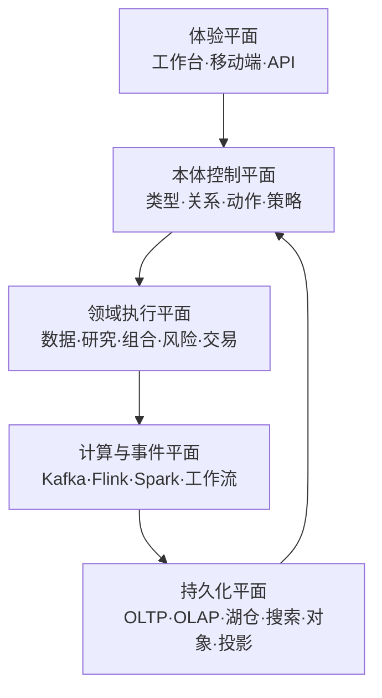

# 金融数据、研究、交易与风险一体化平台：技术选型与落地研究

> 研究基线：2026-07-27  
> 适用目标：以“对象—关系—动作—函数—策略”为核心控制层，覆盖金融数据、研究、投研协作、组合、风险、程序化交易、知识图谱与智能体的境内部署平台。  
> 说明：本文是技术决策输入，不替代律师、等保测评机构、密码应用安全性评估机构、交易所或持牌机构合规意见。来源编号对应同目录 `platform_sources.csv`。

## 1. 结论先行

### 1.1 总体架构结论

平台不应被设计成“很多页面 + 很多数据库 + 一个聊天机器人”，而应被设计成五个相互约束的平面：

核心原则：

1. **PostgreSQL 是控制、账本和交易状态的事实源；图、搜索、向量、OLAP 都是可重建投影。**
2. **对象、关系、动作、函数、策略都必须版本化。** 本体不是标签库，而是能够生成 API、表结构、校验规则、权限策略、事件契约和前端表单的控制模型。
3. **同步链路保证决策，异步链路传播事实。** 下单、记账、限额扣减等强一致步骤不依赖“最终一致”；通知、索引、特征和分析投影通过事件异步完成。
4. **业务流程与数据任务分开。** Temporal 承担可补偿、长事务和人工审批；Airflow 承担批数据编排；Flink 承担事件时间实时计算；Spark 承担大规模批处理。
5. **LLM/智能体永远不直接拥有交易权限。** 它只能调用受策略约束的 Action API；高风险动作必须经过确定性校验、幂等、审批和独立停机开关。
6. **低时延交易链路与通用云原生平台分层。** 研究、控制、数据和 AI 适合 Kubernetes；有确定性抖动要求的行情接入、报单网关和盘中风控应使用专用节点或裸金属。

### 1.2 推荐技术栈

| 层 | 主选 | 使用边界 | 暂不首选 / 原因 |
|---|---|---|---|
| Web 工作台 | React 19.2、TypeScript 5.9、Vite 8、Ant Design 6、TanStack Query、AG Grid Enterprise、Apache ECharts | 高密度金融桌面、对象工作台、研究与风控界面 | Next.js 仅用于需要 SEO/SSR 的公开门户；核心内网工作台采用 RSC/SSR 会增加攻击面和运行复杂度。[S01–S13] |
| 外部/前端 API | REST + OpenAPI 3.1.1；SSE/WebSocket | CRUD、动作提交、审计明确；SSE 单向状态流，WebSocket 行情和双向交互 | 不以 GraphQL 统一所有写操作；复杂授权、成本控制和审计会变得困难。[S14–S16] |
| 内部通信 | gRPC + Protobuf；Kafka 4.2 + Schema Registry + CloudEvents 包装 | gRPC 用于低时延内部 RPC；Kafka 用于事实事件、CDC 和异步投影 | 不宣传“全链路恰好一次”；连接器和外部副作用仍必须幂等。[S15,S17–S25] |
| 核心后端 | JDK 25 LTS；Spring Boot 4.0.x 起步，4.1 经浸泡后升级 | 账户、组合、账本、订单、风险、策略、审计等核心领域 | Python 不承担订单状态机和账本；避免微服务化一切。[S26–S29] |
| 接入/低时延 | Go 1.26；必要时 C++/厂商原生 SDK | 行情网关、协议适配、高并发边缘服务 | 不把低抖动路径放入通用 JVM/Python 任务池或共享 K8s 节点 |
| 量化与 AI | Python 3.13、JupyterHub、Arrow | 研究、特征、模型、回测、智能体 | 不追随最新 Python 小版本直到关键数值/GPU 包完成兼容验证。[S29,S45,S51] |
| 事务数据库 | PostgreSQL 18 | 身份映射、对象控制、动作状态、组合主数据、双重记账、订单事实 | 不用分布式 NoSQL 保存余额和最终订单状态。[S30,S31] |
| 实时分析 | ClickHouse | Tick、盘口、日志、风险切片、P&L 明细和高并发聚合 | 不作为账本或订单事实源；异步复制不能等价于 RPO=0。[S32] |
| 湖仓 | 境内对象存储/Ceph RGW + Parquet + Iceberg v2 + Spark 4.2 + Trino | 历史行情、原始/标准/特征/研究数据、可重放与时点快照 | 不采用 Trino 仍标注实验性的 Iceberg v3；Delta/Hudi 仅在明确需求下评估。[S37–S45] |
| 搜索 | OpenSearch 3 | 全文、字段过滤、混合检索、日志检索 | DLS 不能阻止写入，不能替代应用策略与数据库 RLS。[S35] |
| 图 | PostgreSQL 事实 + Neo4j Enterprise 投影（有门槛） | 多跳查询/GDS 达到明确基准后购买 | 不把 Neo4j Community 用于生产 HA；不让图数据库成为唯一事实源。[S36] |
| 向量 | pgvector 起步；Milvus 通过容量基准后引入 | 单域中等规模、强元数据过滤先用 pgvector；超大规模/高 QPS 再拆 | 不在第一天部署独立向量集群；HNSW 有内存、召回和过滤代价。[S33,S34] |
| 缓存 | Valkey | 缓存、会话、速率限制、短期计算状态 | 不保存余额/订单真相；不默认选 Redis 8，需评估 AGPL 与采购策略。[S40,S41] |
| 流/批 | Kafka、Flink、Spark | Flink 事件时间实时风控；Spark 批重算 | Spark continuous 模式是低时延 at-least-once，不冒充金融副作用的 exactly-once。[S17–S21,S44] |
| 编排 | Airflow 3.3、Temporal | 数据资产 DAG / 可恢复业务流程分别治理 | 不用 Airflow 实现人机审批和长事务；不用 Temporal 替代大规模 SQL/ETL。[S22,S23] |
| IAM/策略 | 企业 IdP 或 Keycloak 26.7；OPA + OpenFGA；OIDC/FAPI 2.0 | OPA 做上下文 ABAC，OpenFGA 做共享/归属关系，数据库 RLS 作纵深防御 | 不把角色表扩展成不可审计的万能权限系统。[S58–S61] |
| 元数据治理 | OpenMetadata 1.12 + OpenLineage | 中小团队一体化目录、质量、血缘；业务本体与目录映射但不混同 | 大型元数据图组织可选 DataHub；不要同时运行两套主目录。[S67–S69] |
| MLOps/LLMOps | MLflow + KServe + vLLM 0.14 | 模型/提示词/评测/追踪、推理服务 | Feast 仅在多个线上模型确有共享低时延特征需求时引入。[S70–S73] |
| 平台/SRE | Kubernetes 1.35 起步、containerd 2、Argo CD、OpenTelemetry | 1.36 已 GA，但首批生产采用 N-1，待兼容性浸泡 | 不在交易低时延路径强制 service mesh/sidecar；不追逐刚发布版本。[S62–S66] |

## 2. 体验层与前端模块设计

### 2.1 技术与工程组织

- **单一前端平台壳 + 领域包**：`shell / design-system / ontology-sdk / data-grid / charts / research / portfolio / risk / trading / admin`。只有当多个自治团队具有独立发布周期时才采用 Module Federation；团队规模不足时，微前端只会制造版本、路由、权限和性能问题。
- **React 19.2 + TS 5.9 + Vite 8**：TS 6.0 是迁移性较强的过渡版本，先在工具包试点；Vite 8 要求合适的 Node 版本，构建镜像应固定运行时，不允许开发机漂移。[S01,S02,S05–S07]
- **Ant Design 6 作为组件基线，自建金融语义层**：禁止业务直接引用任意颜色和间距；全部经过 `color.market.up/down`、`color.risk.*`、`density.*`、`typography.number.*` 等 token。[S09]
- **AG Grid Enterprise 购买而非重复造表格**：百万级/千万级视图采用 Server-Side Row Model，排序、分组、过滤、透视在服务端执行；前端只保留窗口数据。[S10]
- **ECharts 用于时间序列、因子、风险、关系和地图可视化**；必须启用增量/渐进渲染、采样与数据降级，不能因为文档声称可渲染千万点就把全部 Tick 推给浏览器。[S11]
- **TanStack Query 管服务器状态**，本地 UI 状态采用小型 store；禁止把 API 缓存复制到全局 Redux。

### 2.2 视觉规范

- 中文正文：本机优先 `"Noto Sans SC", "Source Han Sans SC", "Microsoft YaHei", system-ui`；数字与代码：`"Roboto Mono", "JetBrains Mono", monospace`。字体随应用包或境内 CDN 分发，不依赖境外字体服务。
- 颜色不绑定市场语义：A 股默认红涨绿跌，但租户/市场可配置；任何涨跌、风险、审批状态同时使用文字、图标或形状，禁止只靠颜色。
- 深色与浅色均由同一套语义 token 生成；风险红、警示橙、正常绿、信息蓝至少满足 WCAG 2.2 AA 对比度。
- 8px 基础栅格，桌面密度提供舒适/紧凑两档；关键按钮目标至少 24×24 CSS px，键盘焦点清晰可见。[S12]
- 表格数字右对齐、等宽、固定小数规则；价格、数量、币种、时区必须显式，禁止靠列名隐含单位。

### 2.3 交互与状态

| 模块 | 核心交互 | 必须具备的安全/一致性细节 |
|---|---|---|
| 全局对象搜索 | 按对象类型、时间、来源、权限、置信度筛选；支持键盘命令面板 | 先做权限过滤再排序；搜索结果显示数据时点和来源 |
| 对象页 | Summary、关系、时间线、数据、文档、动作、审计统一布局 | 每个字段显示来源、有效时间/系统时间和敏感级别 |
| 研究工作台 | Notebook、查询、图表、文档、模型、数据快照组合 | 研究结果固定到数据快照、代码提交、环境镜像 |
| 组合/风险 | 仓位树、因子分解、情景、限额、P&L 归因 | “as of” 时间显式；盘中估值和账簿终值严格区分 |
| 交易工作台 | 行情、订单票、预交易校验、审批、执行回报、异常处置 | 先预览影响再确认；高风险动作二次验证；独立 kill switch |
| 数据质量台 | 规则、异常、血缘影响、隔离/回补、责任人队列 | 修复操作保留前后差异、审批、事件和回放证据 |
| 策略/本体台 | 类型、关系、动作、函数、策略 diff 和影响分析 | 版本不可原地覆盖；发布前运行兼容性与权限回归 |

交互型数据网格遵循 WAI-ARIA Grid 键盘模式，虚拟行必须正确提供总行数、行索引、排序状态；普通只读信息优先使用语义化 `table`，不要滥用 `role=grid`。[S13]

## 3. API、通信与一致性

### 3.1 协议边界

| 场景 | 协议 | 设计要求 |
|---|---|---|
| 浏览器查询/动作 | HTTPS REST，OpenAPI 3.1.1 | 动作采用命令资源；`Idempotency-Key`、版本前置条件、追踪 ID、策略决策 ID |
| 对象探索 | 受控 GraphQL 只读端点 | persisted query、深度/复杂度/超时限制、DataLoader、防 N+1；禁止通用写入 |
| 服务间同步 | gRPC + Protobuf | deadline、取消、重试预算、mTLS；只有幂等方法可自动重试 |
| UI 实时更新 | SSE 为默认；WebSocket 用于高频双向 | 背压、序列号、断线续传、快照+增量、慢消费者剔除 |
| 领域事件 | Kafka + Protobuf/Avro + Schema Registry | 事件 envelope 包含对象 ID、租户、分类、有效/系统时间、schema 版本、trace、因果链 |
| 数据库到事件 | Transactional Outbox + Debezium | 与事务同提交，消费者幂等；禁止“先写库再随手发消息” |
| 互操作事件 | CloudEvents 元数据 | 仅统一 envelope；业务 payload 仍由受治理的 schema 定义 |

OpenAPI 3.2 已发布，但首期采用 3.1.1 以获得更好的网关、代码生成与审计工具兼容性。[S14] gRPC 在高并发下需监控 HTTP/2 并发流限制和连接池，不应把默认参数视为性能保证。[S15]

### 3.2 语义与可靠性规则

- 事件命名过去式：`OrderAccepted`、`PositionAdjusted`；命令是祈使式：`SubmitOrder`。
- 每个消息含 `event_id`、`aggregate_id`、`aggregate_version`；消费者建立 inbox/去重表。
- 跨服务不使用 XA；采用 **本地事务 + outbox + saga/补偿**。不可补偿的外部交易动作必须先做预检查、审批和持久化意图。
- Kafka 的 exactly-once 能力只覆盖受支持的 Kafka 事务边界；Flink 端到端保证取决于 source/sink。写券商、邮件、对象存储等外部副作用仍按 at-least-once 设计。[S18–S21]
- Schema 兼容规则：事件默认 backward；删除字段先废弃两个版本；金额禁止二进制浮点；时间统一 UTC 纳秒/微秒，另存交易所时区与交易日。

### 3.3 API 安全

- 公网或高价值金融 API 按 FAPI 2.0：授权码 + PKCE、sender-constrained token、短生命周期、严格重定向和 audience。[S61]
- 资源授权在服务端执行；前端隐藏按钮不是授权。
- 大批量导出作为异步 Action：预算评估 → 审批 → 生成 → WORM 审计 → 短期签名下载；不在同步 API 返回海量敏感数据。
- 每个动作输出 `decision_receipt`：输入摘要、策略版本、主体、理由、批准链、结果与副作用引用。

## 4. 后端领域与模块边界

先构建**模块化单体控制平面 + 独立高吞吐数据/行情服务**；当某模块出现独立扩缩容、故障域或团队所有权要求时再拆服务。领域边界如下：

| 领域 | 主要对象/能力 | 事实源 | 关键约束 |
|---|---|---|---|
| 组织与身份 | Tenant、LegalEntity、Person、Group、Role、ServiceIdentity | PostgreSQL / IdP | 用户身份与交易账户分离；SCIM/JIT 入离职 |
| 客户与账户 | Client、Broker、Custodian、TradingAccount、SubAccount、Entitlement | PostgreSQL | 若面向客户，KYC/AML/适当性采用合格供应商并保留证据 |
| 本体控制 | ObjectType、LinkType、ActionType、FunctionType、Policy、Interface | PostgreSQL + Git | 版本、审批、兼容性、生成物、影响分析 |
| 主数据 | Instrument、Issuer、Venue、Currency、Calendar、Identifier | PostgreSQL + Iceberg | 全球/境内标识映射；黄金记录和来源优先级 |
| 数据接入 | Source、Feed、Dataset、Contract、IngestionRun | Kafka/Iceberg | 原始不可变区、许可/用途/时效标签、质量隔离 |
| 市场数据 | Quote、Trade、OrderBook、CorporateAction、Curve | Kafka/ClickHouse/Iceberg | 序列缺口、快照重建、交易日历、点时数据 |
| 研究知识 | Thesis、Claim、Evidence、Document、Notebook、Experiment | PostgreSQL/Object/Iceberg | 引用、来源、有效期、反方证据、权限继承 |
| 组合与账本 | Portfolio、Holding、Lot、Cash、LedgerEntry、NAV | PostgreSQL | 双重记账、不可变分录、冲销而非修改 |
| 风险 | Exposure、Factor、Limit、Scenario、Alert、Breach | PostgreSQL/ClickHouse/Iceberg | 盘中/批量口径统一；限额版本和豁免审批 |
| 订单与执行 | OrderIntent、Order、Execution、Allocation、Settlement | PostgreSQL + append-only journal | 确定性状态机、预交易检查、幂等、顺序号 |
| 工作流与动作 | ActionRun、Approval、Task、Compensation | Temporal/PostgreSQL | 人工任务、超时、重试、补偿、证据包 |
| AI 与智能体 | Model、Prompt、EvalSet、AgentRun、ToolCall、Citation | MLflow/PostgreSQL/Object | 预算、工具白名单、数据边界、人审、可回放 |
| 治理与审计 | Asset、Lineage、QualityRule、PolicyDecision、AuditEvent | OpenMetadata/OpenLineage/WORM | 责任人、分级、血缘、用途、保存/删除策略 |

### 4.1 账户、组合和账本

- 交易账户、托管账户、投资组合、策略账簿是不同对象；通过关系连接，不能合并成一个 `account` 大表。
- 金额使用 `numeric/decimal` 或整型最小货币单位，并携带币种；数量、价格和比率各有精度策略。
- 账本采用双重记账；已过账分录只允许冲销/更正事件，不允许直接 UPDATE。
- `available / reserved / settled / pending` 分开；提交订单时在同一强一致边界完成额度/资金预占。
- 多租户第一阶段采用独立 schema 或数据库 + RLS；监管隔离要求高的租户采用物理实例/集群隔离，不依赖一个 `tenant_id`。

## 5. 完整存储矩阵与数据生命周期

### 5.1 存储职责

| 数据类型 | 主存储 | 投影/缓存 | 一致性与恢复 | 生命周期 |
|---|---|---|---|---|
| 对象、本体、策略、审批 | PostgreSQL 18 | OpenSearch/Neo4j | Serializable 或显式版本锁；同步同城副本 | 版本永久，删除为逻辑失效 |
| 订单、成交、账本、限额 | PostgreSQL + 只追加 journal | Kafka/ClickHouse | 核心提交 CP，网络分区时拒绝写；全事务重试 | 依监管/业务保存，WORM 证据 |
| Tick/盘口/盘中风险 | Kafka + ClickHouse | 热缓存 | 顺序号、快照+增量、可从 Iceberg 重放 | 热数周/月，冷数据进湖 |
| 原始/标准/特征/快照 | 对象存储 + Parquet + Iceberg v2 | Trino/Spark | 乐观串行化表提交、快照回滚 | bronze/silver/gold，策略化分层 |
| 文档全文 | 对象存储 | OpenSearch | hash 校验、版本、来源和 ACL 同步 | 原文不可变，衍生文本可重建 |
| 图关系 | PostgreSQL/事件事实 | Neo4j Enterprise | 投影有 lag，显示 `as-of` | 可重建 |
| 向量 | pgvector → Milvus | 无 | embedding 版本和 ACL 标签；可重建 | 模型变更后并行重嵌入 |
| 会话/速率/短期状态 | Valkey | 无 | 可丢、可重建；异步复制不承诺强一致 | TTL |
| 日志/指标/追踪 | OTel 后端 + SIEM/WORM | OpenSearch/列存 | 安全日志独立账户、不可篡改 | 热/冷分层、法定保留 |
| 备份 | 加密对象存储/离线副本 | 异地库 | 3-2-1、不可变、定期恢复演练 | RPO/RTO 分级 |

### 5.2 PostgreSQL

- 账本、订单状态和额度使用 Serializable 或显式悲观锁；出现 serialization/deadlock 错误时重试**整个事务**，不能只重试最后一条 SQL。[S30]
- 同城同步复制用于要求 RPO=0 的核心库；跨区域异步 DR 接受明确数据损失窗口。同步副本增加提交时延，必须按领域分级，而不是所有表一刀切。[S31]
- 分片仅在单集群容量/写入/隔离基准触发后进行；分片键优先 `legal_entity/account/portfolio`，跨分片账本操作必须重新设计，不能透明假设。

### 5.3 湖仓和分析

- 原始区只追加，保存供应商文件、接收时间、许可、校验和；标准区做统一 schema/时区/标识；产品区输出策略和 BI 可用资产。
- Iceberg v2 提供 schema/partition evolution、时间旅行和隔离；Trino 当前对 v3 支持仍标注实验性，故不首发 v3。[S42,S43]
- Spark Structured Streaming 的默认 micro-batch 可提供 exactly-once 状态语义；continuous processing 的极低时延换成 at-least-once，不能用于不可重复的交易副作用。[S44]
- Arrow 用作 Python/JVM/引擎间列式内存交换；它适合扫描和分析，不适合频繁单行修改。[S45]

### 5.4 搜索、图与向量

- OpenSearch 索引仅保存授权过滤所需的最小字段，文档包含 `tenant/classification/purpose/region/valid_to`。DLS 只限制读取、不限制写入，因此写路径仍要策略校验。[S35]
- Neo4j 是图投影：通过 Kafka/批任务从事实重建。只有满足“多跳查询 p95、图算法、并发”基准且接受 Enterprise 采购时启用集群；Community 不适合生产 HA。[S36]
- pgvector 起步阈值由实测决定，参考触发条件：单语料数千万向量、HNSW 内存不可接受、独立扩缩容或高并发 ANN。HNSW 速度/召回/内存互换，带过滤条件的 ANN 可能先扫描后过滤，必须用真实 ACL 过滤基准验证。[S33]
- Milvus 提供 strong/bounded/session/eventual 等一致性级别；若引入，知识检索默认 bounded/session，涉及刚更新的合规证据使用 strong 或回退事实库。[S34]

### 5.5 图片、视频、音频和任意文件

多媒体不是“数据库 BLOB 字段”，而是一条受治理的内容供应链：

1. 分片/断点上传到隔离桶，服务端重新识别 MIME，不信任扩展名。
2. 计算 SHA-256、病毒/恶意内容扫描、版权/许可/来源登记；通过后原子晋级到正式桶。
3. PostgreSQL 保存内容对象、版本、hash、大小、编码、时长、分辨率、ACL、保存期和 legal hold；二进制进对象存储。
4. 独立沙箱 worker 生成缩略图、PDF 预览、HLS/DASH、OCR/ASR、关键帧和 embedding；衍生物记录父子关系和工具/模型版本。
5. 下载采用短时签名 URL 或授权代理；敏感水印、下载次数和导出审批按策略执行。
6. 开启对象版本、WORM/Object Lock、校验修复、生命周期和跨故障域复制。Ceph 多站点适合异地 RGW；官方文档明确不建议在高延迟 WAN 上拉伸单一 Ceph 集群。[S37–S39]
7. 对外发布 AI 生成文本/图片/音频/视频时实现显式与隐式标识、元数据保留和传播侧校验。[S91]

## 6. 市场数据、程序化交易和风险

### 6.1 分平面

| 平面 | 组件 | 设计目标 |
|---|---|---|
| 行情接入 | 厂商/交易所认证网关、序列恢复、归一化器 | 不丢序列、快照+增量一致、权限 entitlement |
| 行情分发 | Kafka/专用总线、ClickHouse、WebSocket/SSE | 热路径和历史查询分离；慢消费者隔离 |
| 订单管理 | Intent → pre-trade → approval → route → ack/fill → allocation | 确定性状态机、顺序、幂等、拒单原因 |
| 报单网关 | FIX/原生协议适配、会话恢复、drop copy | 专用节点、独立证书、限速、熔断 |
| 风险 | 资金/持仓/限额、异常检测、kill switch | 同步硬限制 + 异步丰富分析 |
| 监控取证 | 原始报文、时钟、配置、策略版本、变更记录 | 可重演、不可篡改、监管导出 |

FIX 标准与机器可读 repository 适合作为跨券商规范，但境内交易所/券商原生接口、认证、行情许可和 SLA 应购买或采用合格供应商；平台自研统一 Canonical Model、风控、路由编排和审计。[S46]

### 6.2 强制控制

- **同步预交易**：账户/策略许可、市场状态、价格笼子、单笔/累计数量、资金/持仓、申报速率、集中度、禁限售、异常交易规则。
- **独立紧急控制**：按用户、策略、账户、通道、市场暂停；取消挂单；权限与普通交易应用分离；操作需双人/强认证并留证。
- **回放能力**：固定代码、参数、行情、日历、公司行动和时钟序列，可解释某条订单为何通过/拒绝。
- **时钟**：所有服务 NTP/PTP 分级同步；报文记录源时间、接收时间、处理时间、发送时间。
- **测试到生产**：仿真、历史回放、压力、故障注入、容量和异常场景；报告与软件版本绑定。

证监会程序化交易规定要求报告账户、资金、策略、频率、软件版本等信息，并要求系统验证、权限、阈值、异常监控、错误处理和应急能力。[S47] 沪深交易所实施细则进一步覆盖高频系统服务器所在地、测试报告和故障应急方案；相关报告和材料应进入治理对象和长期证据库，而非散落文档。[S48] 期货程序化交易另有自 2025-10-09 实施的全过程规则，应建立市场/品种规则包。[S49]

### 6.3 回测、组合与风险算法

- 数据必须 point-in-time/bitemporal：成分股、评级、财务、公司行动和可交易状态不能使用事后修订值。
- 事件驱动回测与纸交易共用订单类型、成交、费率、滑点、涨跌停、停牌、交易日历和公司行动逻辑。
- 实验登记：策略假设、数据快照、代码提交、镜像、随机种子、参数搜索空间、试验总次数。
- 验证：walk-forward、purged/embargo CV、样本外、压力和容量；报告多重试验及回测过拟合概率，禁止只展示最优 Sharpe。[S52]
- 组合：约束优化、税费/换手/流动性、基准、现金、整数手和交易成本；优化器失败必须回退安全组合。
- 风险：历史/参数 VaR 与 ES、因子暴露、情景/压力、集中度、流动性、对手方、限额、P&L 归因；模型版本、批准、适用范围和例外均为本体对象。
- JupyterHub 每用户/项目隔离 namespace，网络与数据按策略授权；研究环境不可持有生产报单凭据。[S51]

## 7. 本体、知识图谱、GraphRAG 与智能体

### 7.1 本体元模型

| 元类型 | 必备字段 | 运行时生成物 |
|---|---|---|
| ObjectType | ID、字段、键、时间语义、分类、来源、owner、SLA | SQL/JSON Schema、表单、检索映射、SDK |
| LinkType | 起点/终点、基数、方向、有效时间、证据、约束 | FK/边投影、GraphQL 只读关系、SHACL |
| ActionType | 输入、前置条件、策略、审批、幂等、补偿、审计 | OpenAPI/gRPC 命令、Temporal workflow、UI |
| FunctionType | 输入/输出类型、纯度、资源预算、版本、测试 | 批/流/在线函数包装 |
| Policy | 主体、资源、动作、上下文、目的、效果、理由 | OPA bundle、OpenFGA tuple、RLS 条件 |
| Interface | 页面/视图/字段、动作、布局、可见条件 | React schema-driven view |

本体规范使用 OWL 2 表达可共享语义、SHACL 表达可执行约束、PROV 表达来源与派生、DCAT 表达数据产品目录；FIBO 只选择性映射证券、主体、合同等概念，不整库导入。[S53–S57]

### 7.2 身份解析与双时态

- 每个现实实体有稳定内部 ID；外部代码、名称、证件号是带来源和有效期的 Identifier。
- 合并采用候选 → 评分 → 人工/规则裁决 → 可逆 merge；不直接删除被合并实体。
- 所有关键事实至少记录 `valid_time`（现实何时成立）和 `system_time`（系统何时得知）；修订不能抹去旧知识。
- 每条 Claim 指向 Evidence、来源许可、抽取/人工方式、置信度、反方证据和复核状态。

### 7.3 GraphRAG

检索流水线应为：

`主体/目的/时间授权 → 查询理解 → 词法 + 向量 + 图邻域候选 → 证据级重排 → 时间/置信度/许可过滤 → 带引用生成 → 事实核验`

关键点：

- ACL、目的和数据地域过滤必须在候选召回阶段执行，不能生成后再遮盖。
- 检索的是证据片段和可追溯关系，不只是“实体摘要”。
- 索引带 `embedding_model_version`、chunker、源 hash、有效时间和权限标签；模型升级双写、离线评测、切换后再回收旧索引。
- 评测集覆盖事实准确、引用支持率、时间正确、权限泄露、拒答、中文金融术语、对抗提示和成本/时延。

### 7.4 Agent Action Gate

每次智能体工具调用必须经过以下状态机：

`Plan → Policy check → Dry-run/impact → Approval (if required) → Idempotent execute → Verify → Receipt`

控制项：

- 工具白名单、参数 JSON Schema、行/金额/账户/时间预算；
- 读取和动作使用独立 token，短时、最小权限、绑定 agent run；
- 高风险动作强制人审，任何模型不能关闭 kill switch 或修改自身策略；
- tool result、prompt、模型、检索证据、策略版本、审批、网络副作用完整追踪；
- 内容中的指令默认视为不可信数据，防止 prompt injection；
- 交易、账本、权限、数据删除永远由确定性服务最终校验。

## 8. 数据治理、质量、血缘与 MDM

### 8.1 治理闭环

- OpenMetadata 作为首期目录/术语/owner/质量/血缘/域和数据产品平台，OpenLineage 作为运行时血缘事件标准。[S67,S68]
- 大组织若强依赖可扩展 metadata graph 和流式变更可选 DataHub；二者二选一，避免 catalog 对账工程。[S69]
- 业务本体回答“现实世界有哪些对象和动作”；数据目录回答“哪些物理数据资产承载它们”。两者通过映射连接，不合并成一套表。
- 每个数据产品必须有 owner、contract、分类、许可、SLO、质量规则、血缘、成本和弃用计划。

### 8.2 数据契约与质量

| 阶段 | 校验 | 失败处理 |
|---|---|---|
| 接入 | 文件/hash/schema/序列/时效/许可 | quarantine，不污染标准层 |
| 标准化 | 类型、单位、时区、标识、枚举、参照完整性 | 生成 issue，按严重度阻断 |
| 业务 | 价格/数量边界、资金平衡、持仓对账、公司行动 | 双源对账、人工裁决 |
| 发布 | 合同兼容、血缘、分类、质量 SLO | 阻断数据产品版本发布 |
| 运行 | 漂移、迟到、缺口、分布、异常 | 告警、回补、影响分析 |

MDM 建议自研高价值差异层：统一证券/发行人/机构/人员/账户 ID，配置来源可信度、字段级 survivorship、人工 steward 队列、可逆合并和双时态历史。通用目录、血缘采集和质量执行器采用成熟开源/商用组件。

## 9. IAM、安全、审计和软件供应链

### 9.1 授权模型

- 企业已有 IdP 时优先联邦；否则可部署 Keycloak 26.7，但升级、密钥、集群、LDAP/AD 和应急账号需专门团队。[S58]
- OPA 处理 `主体属性 + 资源分类 + 动作 + 目的 + 地域 + 时间 + 风险`；OpenFGA 处理 owner/member/delegate/share 等关系授权。[S59,S60]
- 策略决策和执行点分离；服务、数据库 RLS、OpenSearch、对象下载代理形成纵深防御。
- 衍生数据继承最严格的分类、许可、地域和用途；未经可证明脱敏/聚合不得自动降级。
- 运维采用 PAM/JIT/JEA、双人审批、会话录屏；break-glass 账号离线保管并实时告警。

### 9.2 密钥、秘密和加密

- KMS/HSM 与符合境内要求的密码产品采用采购方案；应用使用 envelope encryption，租户/级别/用途分层密钥，轮换与销毁可审计。
- Kubernetes Secret 不是秘密管理终点；运行时从外部 secrets manager 获取，短期凭据优先。
- TLS/mTLS 覆盖外部、服务间、数据库和消息；高敏字段做列/字段加密与 tokenization。
- 若被认定为关键信息基础设施或相关系统，应依据密码法、GB/T 39786-2021 和 2025 年商用密码规定设计并开展密评，不能在上线末期“补国密”。[S85–S87]

### 9.3 审计

审计事件至少包含：谁/代表谁、何时、设备/会话、目的、读取/动作对象、输入摘要、策略与理由、审批、前后值 hash、外部副作用、结果和 trace。安全审计流写入独立权限域和 WORM 存储；业务管理员不能删除。日志本身也属于敏感数据，需最小化和脱敏。

### 9.4 DevSecOps / 供应链

- GitOps：Argo CD 从受保护分支同步，生产禁止手工漂移；紧急变更事后自动回写和复核。[S66]
- 构建产出 SBOM（SPDX/CycloneDX）、SLSA provenance，容器和制品用 Cosign 签名；境内/离线环境部署私有信任根和透明日志。[S64,S65]
- CI：SAST、依赖/许可证、secret scan、IaC、镜像、DAST、模糊测试；高风险依赖设允许清单。
- Admission：只运行已签名、已扫描、非 root、只读根文件系统、资源限额、受控 capability 的镜像。
- 依赖镜像和软件包进入境内私有仓，锁定 digest；每月漏洞窗口和紧急 SLA，不让“最新版”在生产自动漂移。

## 10. Kubernetes、可观测性、SRE 与灾备

### 10.1 部署拓扑

- 至少分为生产交易/核心、数据分析、研究、AI 四个安全域；早期可共享物理集群但使用独立节点池、namespace、网络、身份和配额。
- Kubernetes 1.36 于 2026-04 GA；首批生产采用供应商支持的 1.35 + containerd 2，完成 CNI/CSI/Operator/安全工具兼容后滚动升 1.36。[S62]
- 低延时报单网关使用专用裸金属或隔离实时节点；不注入非必要 sidecar，不与 Spark/LLM GPU 工作负载争抢。
- 多活只用于可安全多写的无状态服务和投影；账本/订单不做未经证明的跨城双主。

### 10.2 可观测性

OpenTelemetry 统一 traces/metrics/logs，上下文贯通浏览器、网关、服务、Kafka、Flink、数据库和 agent tool call。[S63] 关键 SLI：

| 域 | SLI 示例 |
|---|---|
| API | 成功率、p50/p95/p99、超时、策略拒绝、重试放大 |
| 行情 | 源到达延迟、序列缺口、重建时间、慢消费者 |
| 订单 | intent→ack、拒单、状态不一致、drop-copy 对账 |
| 数据 | 新鲜度、完整性、质量失败、血缘覆盖、回补时长 |
| AI | 首 token/总时延、引用支持率、拒答、工具失败、成本、权限拦截 |
| 平台 | 饱和、队列 lag、checkpoint、复制 lag、备份恢复、证书/密钥到期 |

SLO 与错误预算驱动发布冻结；每季度做恢复演练，每半年做跨故障域 DR，证据进入审计系统。备份成功不等于可恢复，必须验证到业务级对象和账本平衡。

## 11. 中国境内部署与监管边界

### 11.1 必须进入架构的要求

| 规范/要求 | 架构落点 |
|---|---|
| 2025 修订《网络安全法》、数据安全法、PIPL | 数据地图、最小必要、处理依据/同意、个人权利、分类分级、事件与责任制。[S74–S76] |
| 《网络数据安全管理条例》自 2025-01-01 实施 | 委托处理、重要数据、风险管理、事件、跨境、平台责任固化为控制项。[S77] |
| 2024 跨境规定与安全评估办法 | 境内落地为默认；“境外远程访问”也按跨境风险设计；建立出境台账、阈值和审批。[S78,S79] |
| 2026《金融信息服务数据分类分级指南》 | 业务/用户/企业三级分类体系映射；核心、重要、敏感一般、常规一般四级标签进入本体与策略。[S80] |
| JR/T 0197、JR/T 0171 | 金融数据分级和个人金融信息全生命周期控制。[S81,S82] |
| 等保 2.0 GB/T 22239-2019 | 定级、备案、建设整改、测评和持续运营；云/移动/大数据扩展按实际形态纳入。[S83] |
| 关保条例与商用密码 | 金融可能属于 CII 重点行业，但是否被认定以主管机关为准；按可能性预留高标准安全域和密评能力。[S84–S87] |
| 网络数据风险评估办法 | 2026-08-20 生效；重要数据处理者每年评估，重大变化及时评估；当前即按 GB/T 45577-2025 建证据链。[S88] |
| 个人信息保护合规审计办法 | 建处理活动台账、影响评估、委托/共享、权利响应和可导出的审计包。[S89] |
| 生成式 AI、算法推荐、AI 内容标识 | 若向境内公众提供相应服务，评估备案/登记、安全评估、内容治理和显隐标识；内部研发场景与公众服务分域。[S90–S92] |
| 证券期货网络与信息安全规则 | 重要系统全生命周期、供应商、变更、监控、应急、投资者信息和监管报告进入平台治理。[S50] |
| 网络安全事件报告办法 | 预置事件分级、自动取证、监管联络与报告时钟，避免发生后人工拼材料。[S93] |

### 11.2 数据地域设计

- **境内单元优先**：境内对象、日志、备份、密钥、模型输入输出和运维遥测均在境内闭环。
- 跨境采用显式 `DataTransfer` 对象：数据集、字段、主体数量、敏感数量、目的、接收方、保存期、法律路径、评估/合同/认证、到期和再评估条件。
- 外资 SaaS/境外可观测性/代码助手不得默认接触生产数据、日志、提示、交易策略和个人信息；若需使用，先做分类、脱敏、合同和出境路径判断。
- 采购境内云服务时核验等保、密评支持、数据地域、供应链、审计导出、退出/迁移、监管检查配合；避免只凭“国产化”标签。

## 12. Build vs Buy

| 能力 | 建议 | 原因 |
|---|---|---|
| 本体控制层、Action/Policy 集成、领域语义 | **自研** | 构成平台差异化和跨模块统一性 |
| 数据库、流、湖仓、搜索、容器平台 | **采用成熟开源/商业支持** | 自研基础设施风险和人才成本过高 |
| 交易所/券商/行情适配、权限数据 | **购买/认证合作** | 接口认证、许可、变更和 SLA 不是普通开发问题 |
| Canonical Market/Order Model、预交易风控、回放 | **自研核心 + 供应商适配** | 形成统一控制与可解释性 |
| AG Grid、专业金融桌面/报表 | **购买，经价值验证** | 复杂表格、导出、无障碍和支持成本高 |
| KYC/AML、制裁名单、交易监测规则库 | **持牌/合格供应商 + 自研编排** | 数据、模型验证和持续监管维护成本高 |
| 复杂衍生品定价/法规风险库 | **购买优先** | 模型覆盖、验证、认证和支持重要 |
| 通用回测事件引擎、组合约束、研究复现 | **自研** | 必须与内部数据、订单和成本模型一致 |
| IdP | **复用企业现有或购买；Keycloak 作为可运营备选** | 身份不是适合轻率自建的差异化能力 |
| KMS/HSM、PAM、SIEM | **购买/托管** | 密钥根、安全运营和合规证据需要专业保障 |
| Neo4j Enterprise / Milvus | **达到基准门槛后购买/引入** | 避免过早形成额外集群与许可成本 |
| LLM 基座 | **境内已备案 API + 自托管双路线** | 机密数据、成本、弹性和备案要求需按场景平衡 |
| Agent orchestration | **薄自研层 + Temporal** | 避免绑定快速变化的 Agent 框架；控制权留在动作网关 |

## 13. 明确不采用的方案

1. **微服务化一切**：首期采用模块化单体控制层；数据/行情/AI 等扩缩容差异明显的能力独立。
2. **一个数据库解决全部问题**：OLTP、OLAP、湖仓、搜索、对象、图/向量投影职责分开。
3. **图数据库/向量库做唯一事实源**：授权、时间、审计和恢复复杂；二者均可重建。
4. **全平台 GraphQL 写入**：动作语义、审批、幂等和审计难以标准化；仅做受控只读组合。
5. **事件溯源一切**：订单/账本保留不可变 journal；普通配置与主数据不为时髦而承担重放复杂度。
6. **“端到端 exactly-once”承诺**：外部券商、文件、通知和人工动作无法由 Kafka/Flink 事务神奇覆盖。
7. **Kubernetes 承载全部低时延交易**：调度、sidecar、共享资源会增加抖动；热路径专用化。
8. **MinIO 作为无条件默认对象存储**：当前产品/许可/支持路径需要专项采购评估；境内云对象存储或 Ceph RGW 更易形成明确责任边界。
9. **Redis 8 无评估直接采用**：AGPL 变化可能影响法务和分发策略；缓存优先 Valkey。[S41]
10. **LLM 直接下单、改权限或删数据**：模型输出不具确定性；所有动作经过策略、审批和确定性服务。

## 14. CAP、时延、成本和一致性取舍

| 组件/域 | 分区时选择 | 典型时延目标 | 主要成本 | 设计结论 |
|---|---|---|---|---|
| 账本/订单 PostgreSQL | C：拒绝不安全写 | 单区毫秒级 | 同步副本、锁竞争 | 强一致、单写主域；跨城 DR 异步 |
| Kafka | 按 `acks=all/min.insync.replicas` 偏 C/耐久 | 毫秒到秒 | broker、磁盘、跨 AZ 流量 | 事实传播；消费者幂等 |
| Flink 状态 | checkpoint 恢复期间牺牲可用性 | 数十毫秒至秒 | 状态后端、checkpoint IO | 事件时间计算，不承诺外部副作用 exactly-once |
| ClickHouse | 可用/性能优先，复制最终收敛 | 交互百毫秒至秒 | SSD、重复副本 | 分析投影，不作事实源 |
| Iceberg 湖仓 | 一致元数据提交，非低时延 | 秒至分钟 | 对象存储、扫描计算 | 历史、重算、审计和数据产品 |
| OpenSearch | 搜索可用优先，刷新后可见 | 数百毫秒 | 内存、索引膨胀 | 显示索引时点；不能用于余额判断 |
| Neo4j 投影 | 可短暂陈旧 | 多跳毫秒至秒 | Enterprise 许可、内存 | 图算法/遍历价值超过成本才引入 |
| pgvector/Milvus | 按语料允许 bounded | 百毫秒级 | HNSW 内存、重嵌入 | 召回候选；最终事实回源 |
| Valkey | 可丢、可失效 | 亚毫秒至毫秒 | 内存 | 只做加速 |
| 对象/Ceph | 耐久优先，异地复制有 lag | 数十毫秒以上 | 容量、纠删码 CPU/网络 | 大对象、WORM、湖仓；不作小事务库 |

## 15. 版本与成熟度风险

| 风险 | 当前判断 | 控制 |
|---|---|---|
| React Server Components 2025 年严重漏洞 | RSC/SSR 扩大工作台攻击面 | 核心 SPA；Next 仅公开门户；安全补丁 SLA。[S03,S04] |
| TypeScript 6.0 迁移变化 | 生态和生成代码可能破坏 | 5.9 起步，6.0 兼容矩阵通过后升级。[S06,S07] |
| Spring Boot 4.1 2026-06 新发布 | 生产浸泡时间较短 | 4.0.x 起步，60–90 天兼容/压测后升 4.1。[S27] |
| Kubernetes 1.36 新 GA | CNI/CSI/Operator 兼容滞后 | 1.35 起步，季度升版。[S62] |
| Iceberg v3 连接器实验性 | 误用会锁死兼容性 | v2；为 v3 留能力测试，不写生产 v3 表。[S43] |
| Neo4j HA 为 Enterprise | 社区版不能满足生产集群 | 明确采购 TCO 或保持 Postgres/批图计算 |
| 独立向量数据库过早 | 运维/一致性/ACL 成本高 | pgvector 基线；用真实语料和 ACL 基准触发 |
| Redis 许可证改变 | 分发和合规不确定 | Valkey；法务审查后再选 Redis。[S41] |
| AI/Agent 框架快速变化 | 深度绑定造成重写 | 内部 Tool/Action 协议、OpenAPI/JSON Schema、Temporal |
| 中国规则持续更新 | 规则变更影响部署与数据路径 | 法规/标准作为版本化 Policy Pack；季度复核 |

所有版本通过 BOM/镜像 digest 锁定；“当前最新”只用于评估，不自动成为生产版本。每个组件需要 owner、EOL、升级窗口、回退方案和数据格式兼容测试。

## 16. 分阶段交付

### Phase 0：治理与架构跑道（0–3 个月）

- 完成业务/数据/安全/监管域边界、RTO/RPO/时延和容量基准；
- 建立本体元模型 v1、数据分类分级、Action/Policy 模型；
- GitOps、身份联邦、KMS/HSM 方案、审计/WORM、开发供应链；
- 选取一个纵向样板：`证券主数据 → 对象页 → 研究结论 → 组合影响 → 审批动作`。

**退出门槛**：对象/关系/动作从 schema 生成 API 和 UI；权限负例测试通过；所有数据有来源与时间。

### Phase 1：数据与研究底座（4–8 个月）

- PostgreSQL、Kafka、对象存储/Iceberg、Trino/Spark、OpenSearch；
- 数据契约、质量隔离、OpenMetadata/OpenLineage；
- 证券/发行人/机构 MDM，文档与多媒体管线；
- 研究工作台、JupyterHub、可复现实验和第一版 GraphRAG。

**退出门槛**：可从原始数据重建对象/搜索投影；数据快照可复现研究结果；ACL 无泄露。

### Phase 2：组合与风险（9–15 个月）

- 双重账本、仓位/现金/批次、估值和公司行动；
- 因子、情景、限额、P&L 归因；ClickHouse/Flink 实时链路；
- Action/Temporal 审批与补偿；MLflow/KServe/vLLM 治理。

**退出门槛**：日终对账平衡；盘中风险时延和准确率达 SLO；模型/提示/证据全可追踪。

### Phase 3：受控交易（16–24 个月）

- 购买认证接口，建设 OMS、FIX/原生网关、预交易风控、drop copy；
- 历史回放、仿真、容量、异常和灾备；程序化交易报告对象化；
- 先纸交易/影子，再小账户/小额度/少市场灰度。

**退出门槛**：订单全生命周期对账；kill switch 独立有效；监管报告、测试和应急证据可一键导出。

### Phase 4：规模化与产品化（25–36 个月）

- 多租户/多法人隔离、跨区域 DR、成本回收；
- 以基准决定 Neo4j/Milvus/专业风险库；
- 智能体扩展到低风险自动化，高风险保持人审；
- 合规审计、等保/密评、数据风险评估形成持续控制。

## 17. 验收指标

- 核心账本：任何时点借贷平衡；RPO/RTO 演练通过；状态不可静默修改。
- 订单：每条 intent、检查、审批、路由、回报、分配可串联；drop copy 零未解释差异。
- 数据：关键产品血缘覆盖 100%，分类/owner/contract 覆盖 100%，严重质量失败不得进入 gold。
- 权限：跨租户、跨目的、过期授权、派生数据、导出等负例全部自动化测试。
- 本体：破坏性变更有影响分析和迁移；对象/动作生成物与运行版本一致。
- AI：引用支持率、权限泄露率、工具误执行率、拒答率、成本和延迟均有门槛；高风险动作 100% 人审。
- 供应链：生产制品 100% 有 SBOM、provenance、签名和准入验证。
- 灾备：按季度恢复到业务对象并验证账本/订单/数据产品，而非只看基础设施“绿色”。

## 18. 待业务确认的决策点

以下问题会实质改变架构和采购，不能由技术团队自行假设：

1. 平台是内部投研工具、持牌机构生产系统，还是同时面向公众？
2. 覆盖证券、期货、基金、银行、保险、数字资产中的哪些市场与司法辖区？
3. 是否真实下单、管理客户资产、处理支付/清算，还是仅做研究和模拟？
4. 目标峰值：证券数量、Tick/秒、订单/秒、账户/组合、文档/向量规模、并发用户？
5. 对订单、账本、行情、研究和 AI 的 RTO/RPO/p99 分别是多少？
6. 是否被认定或预期认定为关键信息基础设施、重要数据处理者、金融信息服务提供者？
7. 数据许可是否允许衍生、向量化、模型训练、跨主体共享和跨境？
8. 现有 IdP、云、机房、券商/交易所接口、行情商、KMS/HSM、SIEM 与运维团队能力？

在这些答案确认前，本文推荐栈可作为 PoC 与基础平台基线，但不得据此承诺生产交易容量、监管资格或跨境可行性。
