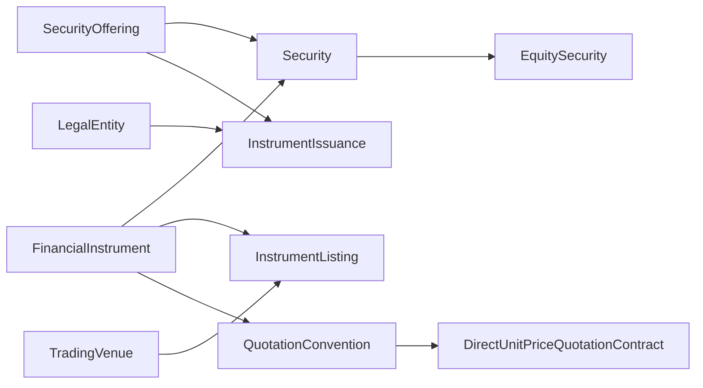

# fin-instruments — Practitioner Guide (Phase B)

**Module**: Financial Instruments v2.0.0  
**Status**: Wave W0 pilot — envelope split + definition rewrite  
**Source core**: `ontology/domain/finance/instruments/module.core.yaml`  
**Binding overlay**: `ontology/domain/finance/instruments/module.binding.yaml` (platform engineers)

## 这个模块回答什么业务问题

- 某 ISIN / 内部代码指的是哪一只**金融工具**？
- 这只工具在**哪个交易所挂牌**、用什么本地代码？
- 谁**发行**了这只证券？与 IPO **要约**、正式**发行**如何区分？
- 市价按**单位报价**还是其他方式表达？

本模块**不**覆盖：订单、成交、持仓、行情时点、风控限额。

## 核心概念（从业者速查）

| 业务说法 | 本体类型 | 一句话 |
|---------|---------|--------|
| 金融工具 / 合约 | `FinancialInstrument` | 可独立识别的可交易合约（ISIN 级） |
| 证券 | `Security` | 走发行/监管流程的工具（股、债、基金等） |
| 股票 | `EquitySecurity` | 所有权类证券 |
| IPO / 招股 | `SecurityOffering` | 正式发行前的发售计划 |
| 挂牌 / 上市 | `InstrumentListing` | 工具在某场所的交易代码与有效期 |
| 发行完成 | `InstrumentIssuance` | 证券与发行人的法定发行关系 |
| CFI / 分类 | `InstrumentClassificationAssertion` | 按标准方案对工具分类的时段断言 |
| 每股报价 | `DirectUnitPriceQuotationContract` | 「货币/股」类报价规则 |
| 报价方式（抽象） | `QuotationConvention` | 单位价、收益率等报价族 |

## 典型链路（读 YAML 前先看故事）



1. **识别**：foundation 层 ISIN → `FinancialInstrument`  
2. **挂牌**：`InstrumentListing` 连到 `TradingVenue`（market-structure）  
3. **报价**：listing 绑定 `DirectUnitPriceQuotationContract` → market-data 取价  
4. **发行**：`SecurityOffering` → `InstrumentIssuance` → 发行人 `LegalEntity`

## 从哪里读

| 读者 | 读什么 |
|------|--------|
| 投资/风控/研究 | 本指南 + `module.core.yaml` 的 `definition` / `cnNote` |
| 数据工程 | `module.binding.yaml`（来源工件、contract digest） |
| 编译/验证 | 合并后的 `module.yaml`（自动生成，勿手改） |

## 相关 CQ

- CQ-I1：ISIN → 工具 + 发行人  
- CQ-I2：listing 与 venue 查找  
- CQ-I3：工具类型层级  

## Phase B 状态

- [x] 信封拆分（core / binding）  
- [x] 核心类型定义重写（M2-DEFINITION-STYLE-GUIDE）  
- [ ] RFC-001 轴 6 SME 盲测 paraphrase（**未验证**）  
- [ ] 术语卡 sync 与 FIBO 溯源重富化  

Regenerate merged module:

```bash
node scripts/domain/merge-module-envelope.cjs instruments --write
```
